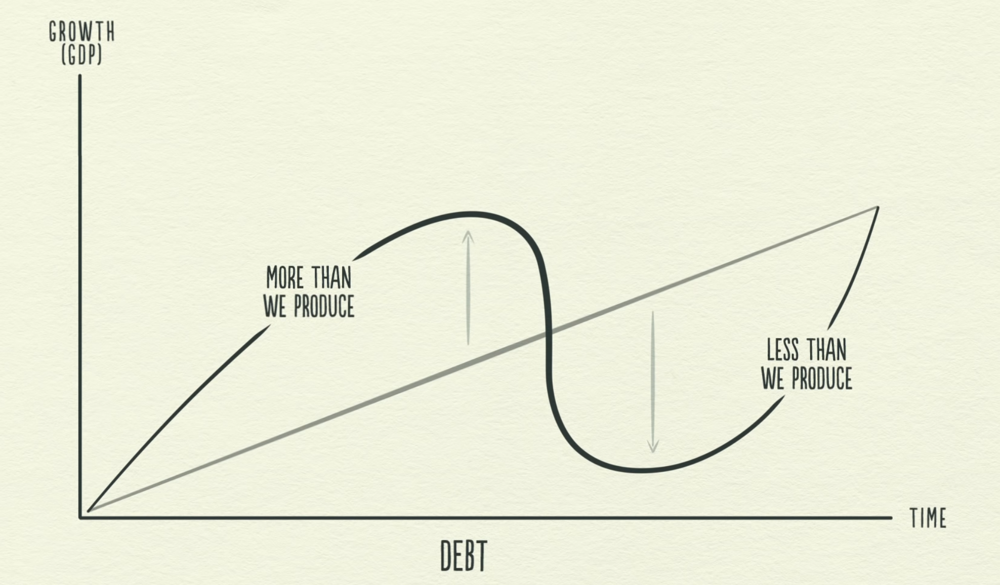
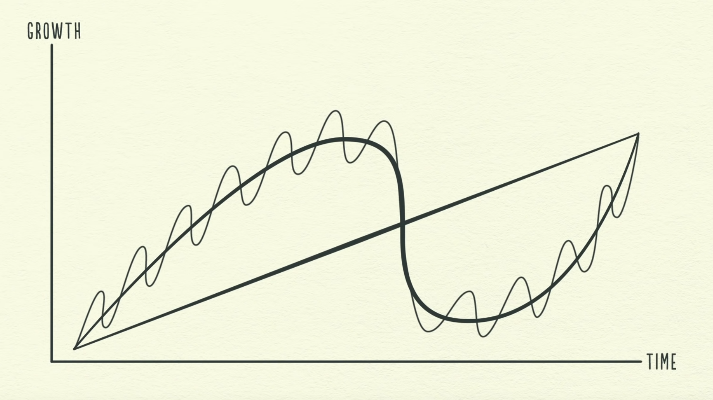
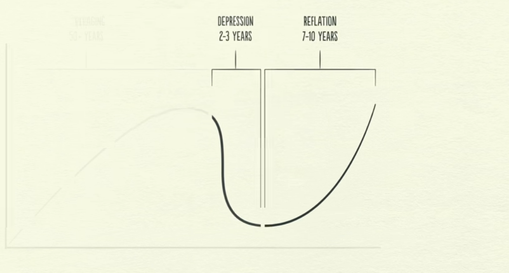

# 经济

## 三大驱动

- Productivity growth
- Short term debt cycle
- Long term debt cycle

## Transaction

- Buyer <----> Seller  
- Money + Credit = Total Spending
- Total spending drives the economy
- Total spending / Total quantity = price

## Market

- a market consists all the buy and all the seller
- all markets consists economy

## Government

- Central government
  - collect taxes
  - spend money
- Central Bank
  - Control credit -- interest rate
  - Control money -- Printing money

## Credit

- The most important part of the economy
- Lender <--Principal + Interest--> Borrower
- As soon as credit created, it turns into **debt**
  - asset to the lender
  - liability to the borrower

## Why Credit is important

- Credit increased spending
  - Total spending drives the economy
  - someone earns more, income rises, more worthy of credit
  - Creditworthy borrow
    - The ability to pay (income)
    - collateral if he can't (valuable asset)
  - increased income -> increased borrowing -> increased -> another increased income (economics growth) !!!!

## Cycle
- Producity matters in the long run (基本上是直线)
- Credit matters in the short run （波动曲线）

- 5-8 years small cycles
- 75-100 years big cycles

Economy without credit
- The only way to increase spending is to increase income (increase productivity)
- Every economy growth is because of someone increase productivity

Because we Borrow, we have cycles
- Borrow from your future self
- Time in the future, you need to spend less than you make
- you create a cycle
  

In Economy with credit
- you can increase spending by borrowing
- borrowing create cycles
  - credit is bad when it finances over-consumption that can't be paid back
  - credit is good when it efficiently allocates the resources to produce income

## Short term Debt cycle

- short term cycles 
- during expansion, spending continues to increase and prices start to rise
- when the amount of spending and incomes grow faster than the production of goods, prices raise
  -  because the spending is created by credit
  -  spending grows faster than quantity, price rise -> **inflation**
-  Inflation --> Central bank raises interest rate
   -  less borrowing + higher debt repayment --> less spending --> less income --> --> spend less --> **deflation** --> recession
-  Deflation --> Central bank lowers interest rate
-  credit available --> expansion
-  credit unavailable --> recession
-  Mainly controller by central bank
-  last 5-8 year
-  each cycle with more debt than previous cycle --> creating Long Term Debt Cycle

## Long term Debt Cycle

- Debt growing and Income growing -> Debt-to-Income ration **Debt burden**
- More Income -> More Valuable assets ->  More Borrowing -> Debt burden increase -> Bubble
- At some point, debt repayments start growing faster than incomes -> cut spending -> less income -> borrowing down
- Ex: USA 2008, Japan 1989, USA 1929
- Start **deleveraging**
  - People cut spending, income fall, credit disappears, asset prices drop, bank get squeezed, stock market crashes, social tension rise
- interest rates can't be lowered to save the day, already 0

deleveraging vs recession
- In the deleveraging, borrower's debt burden is too big, can't be relieved by lowering interest rates
 
What to do about a deleveraging
- The problem is debt burden are too high and they must come down

### 4 ways

1. cut spending  
   - Deflationary 
   - may cause income decrease even faster
2. debt reduced through defaults and restructuring
   - Deflationary 
   - bank may get squeezed --> depression --> cause income and asset value to disappear faster
3. redistribute wealth
   - Deflationary  
   - deleveraging makes government collects fewer taxes, and increase spending **budget deficit**
   - To fund the deficit, government raise taxes on the wealth -> social tension raise up, in worse case war
4. printing money
   - inflationary
   - Problem is most people thought was money is credit when credit disappears, people don't have enough money
   - Central Bank can print money
     - buy financial asset 
       - drive up asset price makes people more creditworthy
     - buy government bonds -> buy goods & services and unemployment benefits 
   - increase people income
   - increase government debt
   - lower the economy's total debt burden
  
### Policy maker need to
- balance the four ways that debt burden comes down
- the deflationary ways need to balance the inflationary ways in order to maintain stability
  
### beautiful deleveraging
- if balance correctly, it can be beautiful deleveraging
  - debts decline relative to income
  - real economic growth is positive
  - inflation isn't a problem

### may not cause inflation 
when it offsets falling credit
  - credit decrease , income increase -> total spending not change -> price not change
  - income must increase faster than debt grows
  - don't print too much money
      - causing unacceptably high inflation
  - takes roughly decade or more for debt burdens to fall and economic get back to normal (lost decade)
  - 

## In closing

3 Rules of Thumb
1. Don't have debt rise faster than income
2. Don't have income rise faster than productivity
   - you will eventually become uncompetitive  
3. Do all that you can to raise your productivity