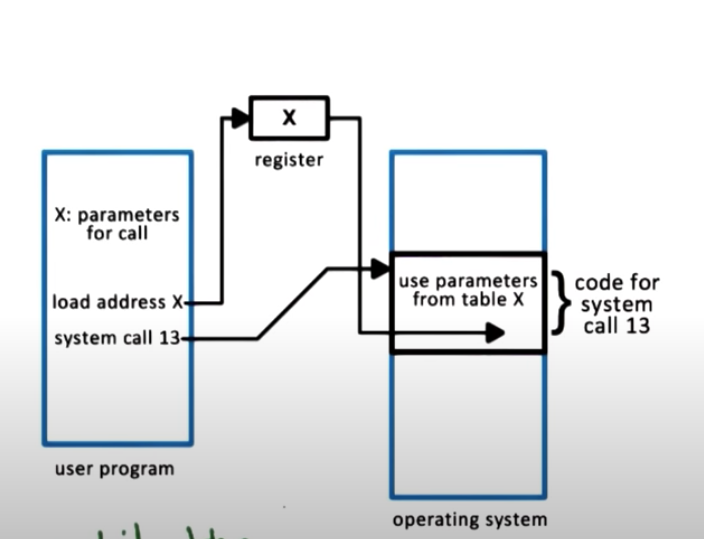

# P1L2 Introduction to Operating Systems

## 1. Lesson Preview:
- What is an operating system
- What are key components of an operating system
- Design and implementation considerations of operating systems

## 2. Visual Metaphor
An Operating system is like a toy shop manager

a toy shop manager
- Direct operational resources
    - control use of employee time, parts, tools
- enforce working policies
    - fairness, safety, clean-up
- mitigates difficulty of complex task
    - simplifies operation & optimized performance
------
Operating system
- Direct operational resources
    - control use of CPU, memory,  peripheral devices
- enforce working policies
    - fairness resources access, limits to resources usage ...
- mitigate difficulty of complex task
    - abstract hardware details (system calls)

## 3. What is an Operating System
OS sit between applications and hardwares
- hide hardware complexity
    - read/write file (storage)
    - send/recv socket (network)
- resources management
    - CPU scheduling
    - memory management
- provide isolation & protection

## 4. Operating System Definition
An Operating system is a layer of systems softwares that:

- directly has privileges access to the underlying hardware;
- hides the hardware complexity
- manages hardware o nbehalf of one of more applications according to some predefined polices
- In addition, it ensures that applications are isolated and protected from one another.

## 5. Operating System Components Quiz
Which of the following are likely components of an operating system ? Check all that apply.
- [ ] file editor
- [x] file system
- [x] device driver
- [ ] cache memory
- [ ] web browser
- [X] scheduler

## 6. Abstraction or Arbitration Quiz
For the following options, indicate if they are examples of abstraction (B) or arbitration (R)
- distributing memory between multiple processes [R]
- supporting different types of speakers [B]
- interchangeable access of hard disk or SSD [B]

## 7. Operatring System Examples
- Desktop
    - Unix-based
        - Linux
        - mac OSX (BSD)
    - Microsoft Windows
- Embedded
    - Android
    - iOS
    - Symbian

## 8. OS Elements
- Abstractions
    - process, thread,
    - file, socket, memory page
- Mechanisms
    - create, schedule
    - open, write, allocate
- policies
    - maximum number of sockets
    - (least-recently used) LRU or earliest deadline first (EDF) memory control

## 9. OS Elements: memory management Example

- Abstractions
    - memory page
- mechanism
    - allocate, map to a process
- Policies
    - Least recently used-LRU

## 10. Design Principles
- Separation of mechanism & policy
    - implement flexible mechanisms to support may policies
    - e.g, LRU, LFU, random
 - Optimize for common case
    - Where will the OS be used?
    - what will the user want to execute on that machine?
    - What are the workload requirements

## 11. User/Kernel Protection Boundary
- User-level / unprivileged mode
    - applications
- kernel-level / Privileged mode
    - os kernel
    - privileged direct hardware access
- **user-kernel switch** is supported by hardware
    - trap instruction
    - system call
        - open (file)
        - send (sockets)
        - malloc(memory)
    - signals (OS pass notification to application)

## 12. System call flowchart

To make a system call an application must
    - write argument
    - save relevant data at well-defined location
    - make system call

- synchronous mode : wait until the syscall completes
- asynchronous mode:

## 13. Crossing the OS Boundary

User/ Kernel Transitions
- hardware supported
    - eg. traps on illegal instructions or memory accesses requiring special privilege
- involves a number of instructions
    - 50 — 100 ns on a 2Ghz machine running linux
- switches locality
    - affects hardware cache!!

==> NOT CHEAP!

## 14. Basic OS Services
- process management
- file management
- device management
- memory management
- storage management
- security

Windows vs. Linux System System calls

## 15. System Calls Quiz
On a 64 bit linux-based os, which system call is used to...
- send a signal to a process?               [kill]
- set the group identity of a process?      [SETGID]
- mount a file system?                      [mount]
- read/write system parameters?             [sysctl]

## 16. Monolithic OS

- Pro
    - everything included
    - inlining, compile-time optimizations
- Cons
    - customization, portability, manageability
    - memory footprint
    - performance

## 17. Modular OS
As Linux

- Pro
    - manageability
    - smaller footprint
    - less resource needs
- Cons
- indirection can impact performance
- maintenace can still be an issue

## 18. Microkernel

- Pro
    - size
    - verifiability
- Cons
    - portability
    - complexity of software development
    - cost of user/kernel crossing

## 19. Linux OS Architecture
Linux Architectures

Mac OS Architectures (Microkernel)

## 20. Lesson Summary
Introduction to Operating Systems
- OS elements
    - **abstractions**, **mechanisms**, and **policies**
- Communication between applications and Os via **system calls**
- OS organizations
    - Linux and Mac OS