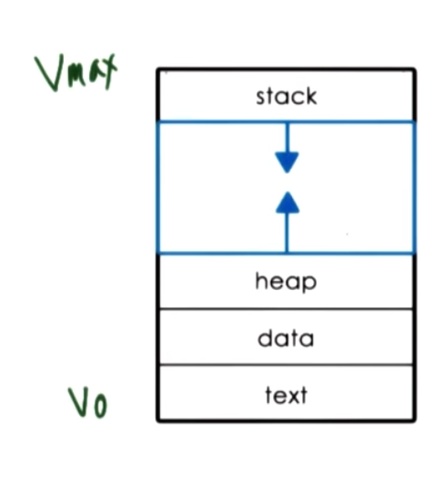
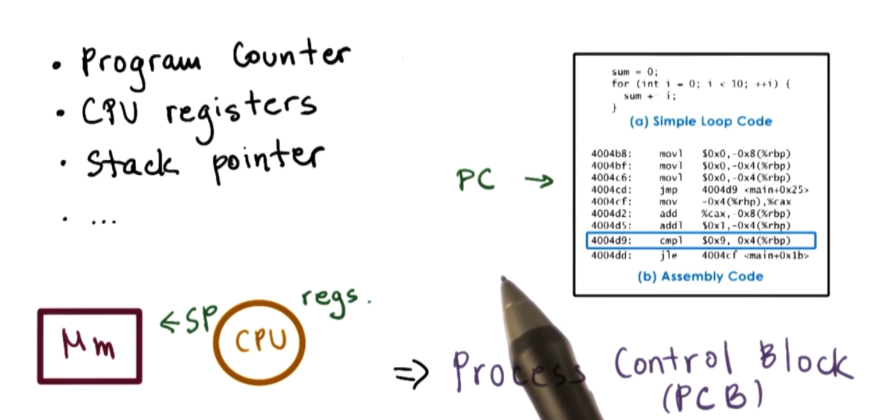
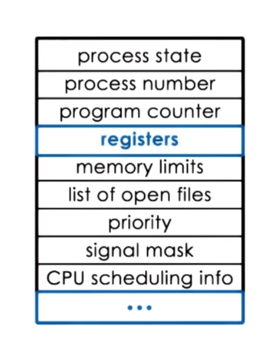
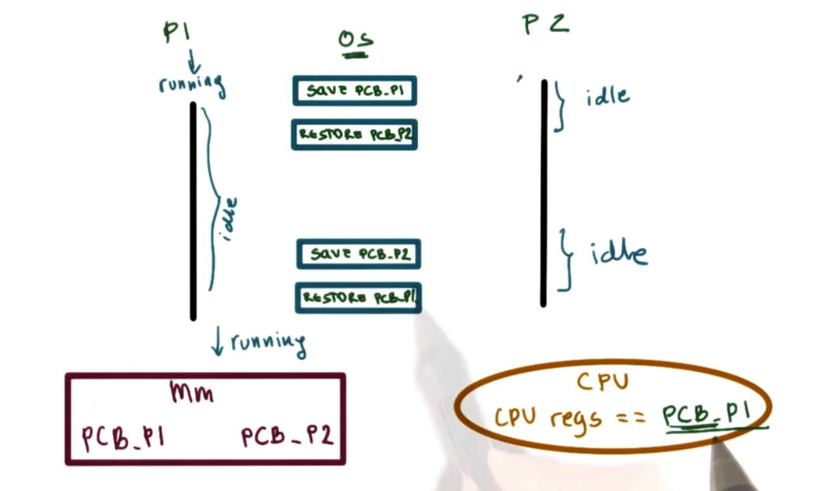
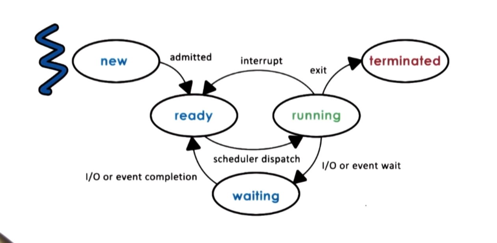
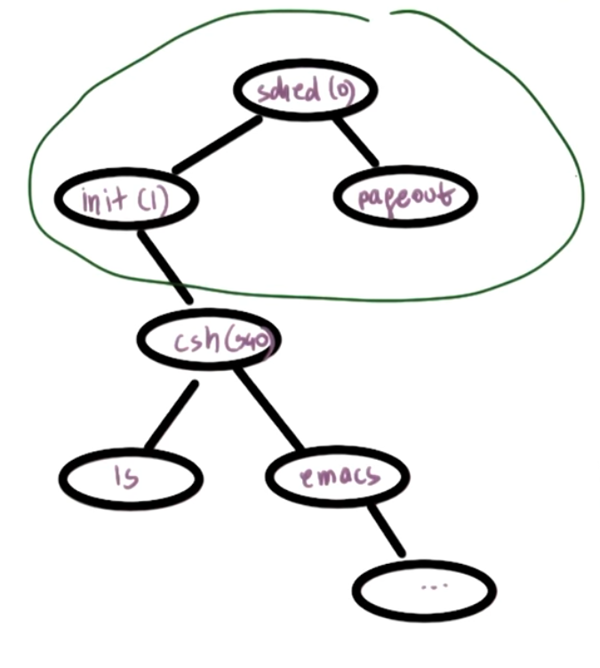
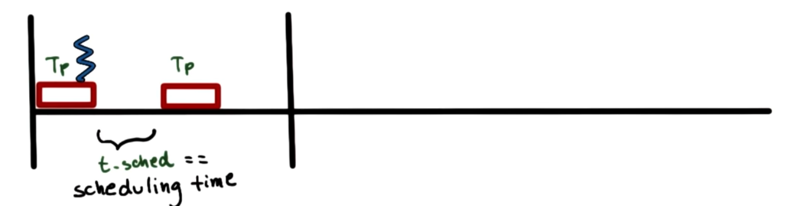
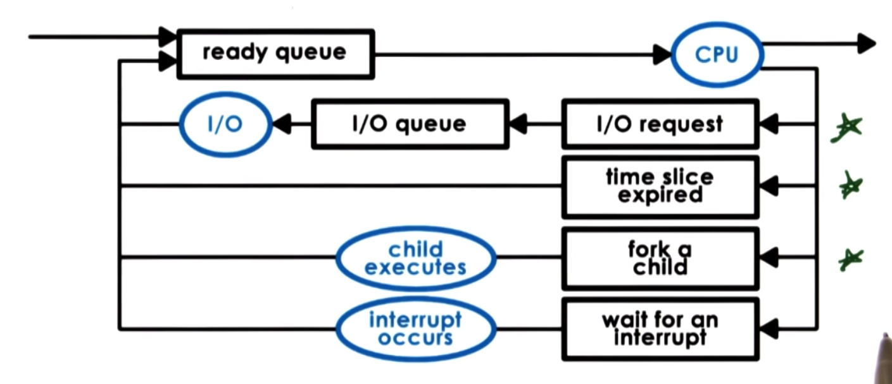

# P2L1 Processes and Process Management

## 1. Lesson Preview
Processes and Process Management
- What is a **process**?
- How are **processes** represented by OS's?
- How are **multiple concurrent processes managed** by OS's?

Simple Process Definition
- Instance of an executing program
- Synonymous with "**task**" or "**job**"

## 2. Visual Metaphor
- A Process is like an order of toys
- Toy Shop
    - state of execution
        - completed toys, waiting to be built
    - Parts & temporary holding are
        - plastic pieces, containers
    - may require special hardware
        - sewing machine, glue gun
- Operating system
    - state of execution
        - Program counter, stack
    - Parts & temporary holding are
        - data, register state occupies state in memory
    - may require special hardware
        - I/O devices

## 3 What is a Process?
- OS manages hardware on behalf of applications
- application == program on disk, flash memory ... (static entity)
- process == state of a program when executing loaded in  memory ( active entity)

## 4 What does a process look like?
Type of state
- text and data
    - static state when process first loads
- heap
    - dynamically created during execution
- stack
    - grows and shrinks (LIFO queue)

## 5. Process Address space
- address space == "in memory" representation of a process
- physical addresses locations in physical memory
- page tables == mapping of virtual to physical address

## 6. Address Space and Memory Management
- parts of virtual address space may not be allocated
- may not be enough physical memory for all state
- swap in and out

## 7. Virtual Addresses Quiz
If two process, P1 and P2 and running at the same time, what are the virtual address space ranges will have ?
- [ ] P1: 0-32,000, P2: 32,000-64,000
- [x] P1: 0-64,000, P2: 0-64,000
- [ ] P1: 32,001-64,000, P2: 0-64,000

## 8. Process Execution State
How does the OS know what a process is doing?
- Program Counter
- CPU registers
- Stack pointer

## 9. Process Control Block

- PCB created and initialized when process is created
- Certain fields are updated when process state changes
    - 比如process需要更多内存
- Other fields change very frequently (Like program counter)
    - CPU把这些指写入特定的register，OS负责这些值，并在process不在运行时，把这些写入PCB
## 10. How is a PCB used

## 11. Context Switch
- context switch = switching the CPU from the context of one process to the context of another
- they are expensive!
    - direct costs: number of cycles for load & store instrcutions
    - indirect costs: COLD cache! cache misses!

⇒ Limit How frequently context switching is DONE!

## 12. Hot Cache Quiz
When a cache is hot ...
- [ ] it can malfunction so we must context switch to anther process
- [X] most process data is in the cache so the process performance will be at its best
- [X] somtimes we must context switch

## 13. Process Life cycle

## 14. Process State Quiz
The CPU is able to execute a process when the prcess is in which state (s)?
- [X] Running
- [X] Ready
- [ ] Waiting
- [ ] New

## 15. Process Life cycle Creation
a process can create child process
    - 一些是root processes
    - 当用户登录，一个user shell 的process 被创建
    - 然后用户可以输入命令创建新的process

mechanisms for process creation
- fork
    - copies the parent PCB into new child PCB
    - child continues execution at instruction after fork
- exec
    - replace child image
    - load new program and start from first instruction

先call `fork` 再call `exec`

## 17. Parent Process Quiz
- on Unix-based OSs, `init` is often regarded as "the parent of all process"
- on Android OSs, `zygote` is often regarded as "the parent of all process"

## 18. Role of the CPU Schedule
A **CPU scheduler** determines which one of the currently ready processes will be dispatched to the CPU to start running, and how long it should run for

OS must... be efficeint
- **preempt** == interrupt and save current context
- **schedule** == run scheduler to choose next process
- **dispatch** == dispatch process & switch into its context

## 18. Length of Process
How long should a process run for? How frequently should we run the scheduler?

Useful CPU work: = Total processing time/ Total time = $(2 * T_P) / (2 * T_P + 2 * t_{sched})$
- if $T_P == t_{sched}$ => only 50% of CPU time spent on useful work!
- if $T_P == 10* t_{sched}$ => ~ 91% of CPU time spent on useful work!

timeslice == time $T_p$ allocated to a process on the CPU

Scheduling Design Decision:
- what are appropriate timeslice values?
- metrics to choose next process to run?

## 19. What about I/O

## 20. Scheduler Responsibility Quiz
Which of the following **ARE NOT** a responsibility of the cpu scheduler?
- [X] maintaining the I/O queue
- [ ] maintaining the ready queue
- [ ] decision on when to context switch
- [X] decision on when to generate an event that a process is waiting on

## 21. Inter Process Communication
Can Processes Interact?

Inter-Process Communication(**IPC**) mechanisms
- transfer data/ info between address spaces
- maintain protection and isolation
- provide flexibility and performance

Inter-Process Communication(IPC) mechanisms
- Message-passing IPC
    - OS provides communication channel, like shared buffer
    - processes write(send) / read (recv) messages to/from channel
    - Pros:
        - OS manages
    - Cons:
        - overheads
- Shared memory IPC
    - OS establishes a shared channel and maps it into each process address space
    - Processes directly read/write from this memory
    - Pros:
        - OS is out of the way
    - Cons:
        - (re-)implement code
        - mapping shared channel本身是个昂贵的操作

## 22. Shared Memory Quiz
**Shared memory-based communication** performs better than message passing communication:
- [ ] True
- [ ] False
- [X] It depends

## 23. Lesson Summary
Processes and Process Management
- Process and process related abstraction
    - **address space** and **PCB**
    - Basic mechanisms for managing process resources
        - **context switching**, **process creation**, **scheduling**, **inter-process communication**
