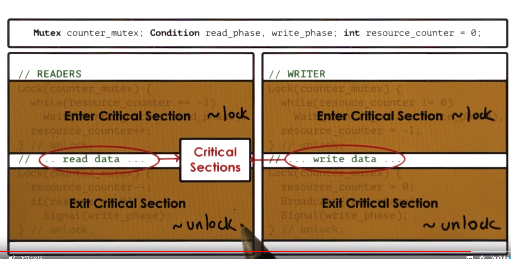

# P2L2: Threads and Concurrency
## 1. Lesson Preview
single process, sing execution contexts

single process, many execution contexts


- What are **threads**?
- How **threads** different from **processes**?
- What **data structures** are used to implement and manage **threads**?

[An Introduction to Programming with Threads](https://s3.amazonaws.com/content.udacity-data.com/courses/ud923/references/ud923-birrell-paper.pdf)


## 2. Visual Metaphor
A thread is like a worker in a toy shop
- worker
    - is an active entity
        - executing unit of toy order
    - works simultaneously with others
        - many workers completing toy orders
    - requires coordination
        - sharing of I/O devices, CPUs, memory
- Threads
    - is an active entity
        - executing unit of a process
    - works simultaneously with others
        - many threads executing
    - requires coordination
        - sharing of tools, parts, workstations

## 3. Process vs Thread


## 4.Benefits of Multithreading
Why are threads useful?
- parallelization ⇒ speed up
- specialization ⇒ hot cache! （因为只是run很小一段代码，内存使用量更小）
- efficiency ⇒ low memory requirement & cheaper IPC

## 5. Benefits of Multithreading: Single CPU
- Are threads on a single CPU?
- or when (# of threads) > (# of CPUs)?

Hide latency
- if $(t_{idle} > 2* t_{context \space switch})$, then context switch to hide idling time
- $t_{context \space switch} threads < t_{context \space switch}$ processes

## 6. Benefits to applications or OS code


multithread os kernel
- threads working on behalf of apps
- os-level services like demons or drives

## 7. Process vs. Threads Quiz
Do the following statements apply to processes(P), threads(T), or both(B)?
make your answer in the text boxes
- can Share a Virtual address space [**T**]
- take longer to context switch [**P**]
- have an execution context [**B**]
- usually result in hotter caches when multiple exist [**T**]
- make use of some communication mechanisms [**B**]

## 8. Basic Thread Mechanisms
What do we need to support threads？
- **thread data structure**
    - identify threads, keep track of resource usage
- mechanisms to **create** and **manage** threads
- mechanisms to safely **coordinate** among threads running **concurrently** in the same address space

Threads and Concurrency
- Data race condition

Concurrency control & coordination
- **mutual exclusion**
    - exclusive access to only one thread at a time
    - **mutex**
- **Waiting** on other threads
    - specific condition before proceeding
    - **condition variable**
- walking up other threads from wait state

## 9. Threads and Thread Creation
我们现在讨论是基于Burrell的论文

- Thread type
    - thread data structure
- Fork(proc, args)
    - create a thread
    - not Unix fork
- Join (thread)
    - terminate a thread


## 10. Thread Creation Example
```c
Thread thread1;
Shared_list list;
thread1 = fork(safe_insert, 4);
safe_insert(6)
join(thread1); //Optional
```
可能的结果是 4→ 6 → Nil 或者 6 → 4 → Nil

## 11. Mutexes
How is the list updated?
```c
create new list element e
set e.value = X
read list and list.p_next
set e.p_next = list.p_next
set list.p_next = e
```
可能乱序，也可能丢失

## 12. Mutual Exclusion

- Burrell's lock API
    ```c
    lock(mutex) {
	    //critical section
    }// unlock; 自动释放
    ```
- Common thread API
    ```c
    lock(mutex);
    //critical section
    unlock(mutex);
    ```

mutex的属性
- locked?
- owner
- blocked_threads

## 13. Mutex example
```c
List<int> my_list;
Mutex m;
void safe_insert(int i) {
	Lock(m) {
		my_list.insert(i);
	}
}
```

## 14. Mutex Quiz
Threads TI-T5 are contending for a mutex m. TI is the first to obtain the mutex. Which thread will get access to m after TI releases it? mark all that apply.


- [X] T2
- [ ] T3
- [X] T4
- [X] T5


## 15. Producer and Consumer Example
What if the processing you wish to perform with **mutual exclusion** needs to occur only under certain **conditions**?

```c
//main
for i = 0... 10
	producers[i] = fork(safe_insert, NULL)
consumer = fork(print_and_clear, my_list)

//producers: safe_insert
Lock(m) {
	list->insert(my_thread_id)
}

//consumer: print_and_clear
Lock(m) {       //太浪费
	if (my_list.full) -> print; clear up to limit of elements of list
	else -> release lock and try again (later)
}
```

## 16. Condition Variables
```c

//consumer: print_and_clear
Lock(m) {
	while (my_list.not_full())
        Wait(m, list_full):
    my_list.print_and_remove_all();
}

//producers: safe_insert
Lock(m) {
    list->insert(my_thread_id);
    if (my_list.full())
		Signal(list_full);
}

```
## Condition Variable API
- **Condition** type
    ``` c
    Condition Variable
        mutex ref
        waiting threads
        ....
    ```
- **Wait(mutex,  cond)**
    - mutex is automatically released & re-acquired on wait
- **Signal(cond)**
    - notify only on thread waiting on condition
- **Bodardcast(cond)**
    - notify all waiting threads
    ```c
    Wait(mutex,cond) {
        // automatically release mutex and go on wait queue

        //...wait ...wait ...wait

        //remove from queue
        //re-acquire mutex
        //exit the wait operation
    }
    ```

## 18. Condition Variable Quiz
Recall the consumer code from the previous example for condition variables.
Instead of `while,` why did we not simply use `if`?
- [ ] `while` can support multiple consumer threads?
- [ ] cannot guarantee access to m once the condition is signaled?
- [ ] the list can change before the consumer gets acesss again?
- [X] all of the above?


## 19. Readers/Writer Problem
多线程要访问一个resource，有些读，要些写
- Readers
    - 0 or more
    - `if ((read_counter == 0) and (write_counter == 0))` => R ok, W ok
    - `if (read_counter > 0` => R ok
    - `if (write_counter == 1` => R no, W no
- Writer
    - 0 or 1

state of a shared file /resource
- free: resource.counter = 0
- reading: resource.counter > 0
- waiting: resource.counter = -1

## 21～22. Readers and Writer Example

```c
Mutex counter_mutex;
int resource_counter = 0; // <=== resource变量
Condition read_phase, write_phase;
```

reader

```c
//READER
Lock(counter_mutex) {
	while(resource_counter == -1)
		Wait(counter_mutex, read_phase);
	resource_counter++;
} // unlock
// ... read data ...
Lock(counter_mutex) {
	resource_counter--;
  if (resource_counter == 0) {
		Signal(write_phase):
	}
} // unlock
```

writer

```c
//WRITE
Lock(counter_mutex) {
	while(resource_counter != 0)
		Wait(counter_mutex, write_phase);
	resource_counter = -1;
} // unlock
// ... write data ...
Lock(counter_mutex) {
	resource_counter == 0;
	Broadcast(read_phase);
	Signal(write_phase):
} // unlock
```

- 只锁counter不锁数据，所以多个reader可以同时读
- Broadcast(read_phase) 之后，reader是一个个取得counter_mutex的
- 在writer的代码中，我们同时使用了broadcast 和 signal

## 23. Critical Section Structure
简化成
```c
Lock(mutex) {
	while (!predicate_indicating_access_ok) {
		wait(mutex, cond_var)
	}
	update_state => update_predicate
	signal and/or broadcast(cond_var_with_correct_waiting_threads)
} // unlock
```

## 24. Critical Section Structure with Proxy
通过代理，我们可以让超过一个thread 访问同一段代码，并且提供控制


## 25. Common Pitfalls
Avoid Common mistakes
- Keep track of mutex/ condition variables used with a resource
    -   e.g `mutex_type m1; // mutex for file 1`
- Check that you are always (and correctly) using lock & lock
    - Did you forget to lock/unlock?
    - what about compilers
- Use a single mutex to access a single resource!
- Check that you are signaling correct condition
- Check that you are not using signal when board-cast is needed
    - signal: only 1 thread will proceed ... remaining threads will continue to wait ...
    - possibly indefinitely
- Ask yourself : do you need priority guarantees?
    - thread execution order not controlled by signal to condition variables!
    - Dead lock
    - Spurious wake ups

## 26. Spurious Wake ups
spurious wake-ups == Unnecessary Wake ups
```c
// WRITTER
Lock(counter_mutex) {
	resource_counter == 0;
	Broadcast(read_phase);
	Signal(write_phase):
} // unlock
```
```c
// READERS
Wait(Counter_mutex, write/read_phase):
```
- 因为`Broadcast`之后，writer依旧持有锁，reader只是从conditional wait queue移到mutex queue
- spurious wake-ups == when we wake threads up knowing they may not able to proceed.
- if (unlock after broadcast/signal) => no other thread can get lock!

##### Can we unlock the mutex before broadcast/signal
```c
// New Writer
Lock(counter_mutex) {
	resource_counter == 0;
} // unlock
Broadcast(read_phase);
Signal(write_phase):
```
但是reader的代码就不行, 因为resource_counter是counter_mutex保护的对象
```c
Lock(counter_mutex) {
	resource_counter--;
  if (counter_resource == 0) {
		Signal(write_phase):
	}
} // unlock
```

## 27 - 28. Deadlocks
Definition:
- two or more competing threads are waiting on each other to complete, but none of them never do


How to avoid this?
- Unlock A before locking B
    - fine-grained locking
    - Cons
        - but threads need both A & B!
- get all locks upfront, then release at the end
    - use one mega lock (mutex_a&b)
    - Cons
        - too restrictive  ⇒ limits parallelism
    - Pros
        - For some applications - OK?
- Maintain lock order
    - first m_a
    - then m_b
    - Pros
        - will prevent cycles in wait graph

## 29. Dead Summary
In summary:
- A cycle in the wait graph is **necessary** and **sufficient** for a deadlock to occur
    - edges from thread waiting on a resource to thread owning a resource
- What can do about it?
    - Deadlock prevention  *EXPENSIVE*
    - Deadlock detection & recovery *ROLLBACK* *EXPENSIVE*
    - Apply the Ostrich algorithm（鸵鸟战术） ... Do Nothing!
        - if all else fails ... just REBOOT

## 30. Critical Section Quiz
A toy shop has the following policy.
At any point in time:
- max 3 new orders can be processed
- if only 1 new order being processed then any number of old orders can be processed

```C
    lock(orders_mutex) {
        [INSERT CHECK HERE]
            wait(orders_mutex, new_cond)
        new_order++
    }
```
- [X] while ((new_order == 3) OR (new_order == 1 AND old_oder > 0))
- [ ] if ((new_order == 3) OR (new_order == 1 AND old_oder > 0))
- [ ] while ((new_order >= 3) OR (new_order == 1 AND old_oder >= 0))
- [X] while ((new_order >= 3) OR (new_order == 1 AND old_oder >= 1))


## 31. Kernel vs User-level Threads
- user level thread
    - must be associate with a kernel level thread
- kernel level thread
    - some of them support user level threads
    - some of them running os level services


What's the relationship between the user and kernel level threads?

## 32. Multithreading Models
- One-to-one model
    - Pros:
        - OS see / understands threads, synchronization, blocking...
    - Cons:
        - must go to OS for all operations (may be expensive)
        - OS may have limits on policies, thread #
        - portability
- Many-to-one Model:
    - In user level，there is a thread manage library
    - Pros:
        - totally portable, doesn't depend on OS limits and policies
    - Cons:
        - OS has no insights into application needs
        - Os may block entire process if one user-level thread blocks on I/O
- Many-to-Many Model:
    - Pros:
        - can be best of both worlds
        - can have bound（user level thread 永久地map到一个kernel level thread） or unbound threads
    - Cons：requires coordination between user-level and kernel-level thread managers

## 33. Scope of Multithreading
- Process Scope:
    - user-level library manages threads within a single process
- System Scope:
    - system-wide thread management by OS-level thread managers (e.g. CPU scheduler)


## 34. Multithreading Patterns
- Boss/worker
- pipeline
- layered

##### Example: Toy Shop Application
For each wooden toy order, we ...
1. accept the order
2. parse the order
3. cut wooden parts
4. paint and add decorations
5. assemble the wooden toys
6. ship the order

## 35. Boss/worker Pattern
Boss-Workers:
- boss: assigns work to workers
- worksL performs entires work

Throughput of the system is limited by boss thread ⇒ must keep boss efficient
- Throughput = 1 / boss_time_per_order

Boss assigns works by:
- directly signalling specific worker
    - Pros：workers don't need to synchronize
    - Cons：boss must track what each worker is doing
- placing work in producer/consumer queue (推荐)
    - Pros：boss doesn't need to know details about workers
    - Cons：queue synchronization

## 36. How many workers?
- on demand
- pool of workers (推荐)
    - static vs dynamic

## Boss-Works Pattern:
Boss-workers:
- boss: assigns works to workers
- worker: performs entire task
- boss-workers communicate via producer/consumer queue
- worker poll: static or dynamic
- Pro：
    - simplicity
- Cons：
    - thread pool management （overhead）
    - locality（如果一个work做完a类工作，他往往继续做a类工作更有效）

## 37. Boss/Workers Variants
- all workers created equal
vs.
- workers specialized for certain tasks
    - Pros:
        - better locality; QoS(quality of service) management
    - Cons:
        - load balancing


## 38.Pipeline Pattern
Pipeline:
- threads assigned are subtask in the system
- entire task == pipline of threads
- multiple tasks concurrently in the system, in different pipeline stages
- throughput == weakest link
    - pipeline stage == thread pool
- shared-buffer based communication between stages

## Pipelime:
- sequence of stages
- stage == substask
- each stage == thread pool
- shared-buffer based communication

- Pros：
    specification and locality
- Cons：
    - balancing overhead（随着系统运行，很难平衡）
    - synchronization overhead（很多地方要同步）

## 39. Layered Pattern

Layered
- each layer group of related subtasks
- end-to-end task must pass up and down through all layers
- 优点：
    - specification and locality
    - less fine-grained than pipeline
- 缺点：
    - not suitable for all applications
    - synchronization

## 40. Multithreading Patterns Quiz
For the 6-step toy order application, we have designed 2 solutions:
1) a boss-works solution and 2) a pipeline solution
Both solutions have 6 threads
- In the boss-workers solution, a worker processes a toy order in 120 ms
- In the pipeline solution, each of the stage(=step) takes 20 ms
How long will it take for these solutions to computer 10 toy orders?
What about if there were 11 toy orders?

Boss-Workers(10): `240ms`
Boss-Workers(11): `360ms`
Pipeline(10): `300ms`
Pipeline(10): `320ms`


## 41. Lesson Summary
Threads and Concurrency
- What are **threads**?
    - How and why do we use them?
- Thread mechanisms
    - **mutexes**, **condition variables**
- Using threads
    - problems, solutions, and design approaches

