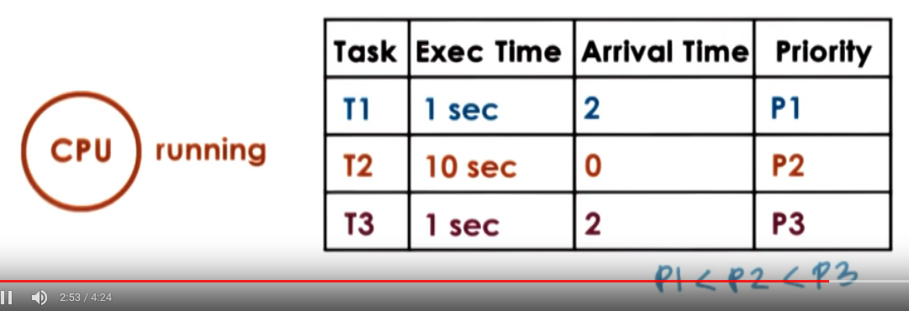
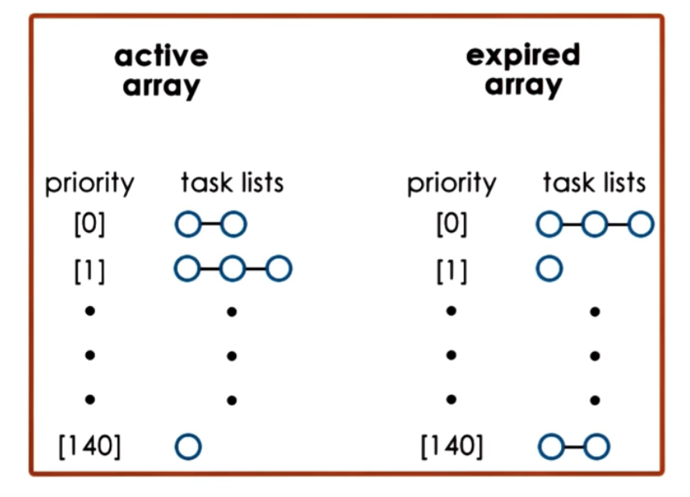
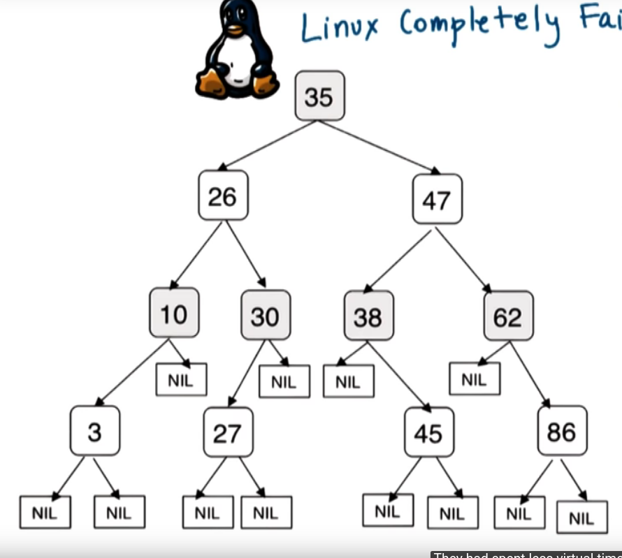

# P3L1: Scheduling
[Chip Multithreading Systems Need a New Operating System Scheduler](https://s3.amazonaws.com/content.udacity-data.com/courses/ud923/references/ud923-fedorova-paper.pdf)

## 1. Lesson Preview
Scheduling
- Scheduling mechanism, algorithm and datastructures
- Linux O(1) and CFS schedulers
- Scheduling on multi-CPU platforms

## 2. Visual metaphor
"Like an OS scheduler, a toy shop manager schedules work"

Manager
- Dispatch orders immediately
 - scheduling is simple (FIFO)
- Dispatch simple orders first
 - maximize # of orders processed over time
- Dispatch complex order first
 - keep workbenches busy

OS
- Assign tasks immediately
 - scheduling is simple (FCFS)
- Assign simple tasks first
 - maximize throughput(SJF)
- Assign complex order first
 - maximize utilization of CPU, devices, memory ...

 ## 3. Scheduling Overview
### CPU scheduler
- decides how and hwn processes (and their threads) access shared CPUs
- schedulers tasks running user-level processes/threads as well as kernel-level threads
- chooses one of ready tasks to run on CPU
- run when
    - CPU becomes idles
    - new task becomes ready
    - timeslice expired timeout
- When thread is dispatched on CPU
    - context switch
    - enter user mode
    - set PC and go


### Summary
- scheduling == choose task from ready queue
- which task should be selected?
    - scheduling policy/algorithm
- How is this done?
    - depends on runqueue data structure
    - runqueue<==> scheduling algorithm

## 4. Run To Completion Scheduling
Initial Assumptions
- group of tasks/jobs
- known execution times
- no preemption
- single CPU

metrics 
- throughput
- average job completion time
- average job wait time
- CPU utilization

## First-Come First-Server (FCFS)
- schedules tasks in order of arrival
- runqueue == queue (FIFO)

##### Examples
T1(1s) <-- T2 (10s)  <-- T3 (1s)
Throughput : 3 / 12s = 0.25 tasks/s
Average completion time: (1+11+12) /3 = 8 sec
Average wait time: (0+1+11) /3 = 4 sec

### Shortest Job First (SJF)
- schedules tasks in order of their execution time
- runqueue = ordered queue or Tree

##### Examples
T1(1s) <-- T3 (1s)  <-- T2 (10s)
Throughput : 3 / 12s = 0.25 tasks/s
Average completion time: (1+11+12) /3 = 8 sec
Average wait time: (0+1+11) /3 = 4 sec

## 5. SJF Performance Quiz
Throughput : 3 / 12s = 0.25 tasks/s
Average completion time: (1+2+12) /3 = 5 sec
Average wait time: (0+1+2) /3 = 1 sec

## 6. Preemptive Scheduling: SJF + Preempt
### SJF + Preemption
- T2 arrives first
- T2 should be preempted


### heuristics based on history => job running time
- how long did a task run last time?
- how long did a task run last n times? (windowed average)

## 7. Preemptive Scheduling: Priority
### Priority Scheduling
- tasks have different priority levels
- run highest priority task next (preemption)
- runqueue == per priority queues, tree ordered based on priority ...
- low priority task stuck in a runqueue => starvation !
- "priority aging"
    - `priority = f(actual priority, time spent in run queue)`
    - eventually task will run => prevents starvation




## 8. Preemptive Scheduling Quiz
An OS scheduler uses a priority-based algorithm with preemption to schedule tasks. Given values shown in the table.
P3 < P2 < P1
Task|Arrival Time | Exec Time| Priority
--|---|--|---
T1 |5| 3 sec | P1
T2 |3| 4 sec | P2
T3 |0| 4 sec | P3

Answer:
T1 finishes at 8
T2 finishes at 10
T3 finishes at 11


## 9. Priority Inversion
... assume SJF here


- Priority: 
    - We want T1,T2, T3
- But Order of execution: 
    - T2, T3, T1 => priorities "inverted"
- Solution:
    - temp boost priority of mutex owner
    - lower again on release

## 10. Round Robin Scheduling
- pick up first task from queue(like FCFS)
- task may yield, to wait on I/O (unlike fCFS), put the task back to the tail of the runqueue
- Round Robin with Priorities 
    - include preemption
- Round Robin with interleaving
    - timeslicing   

## 11. Timesharing and Timeslices
- timeslice == maximum amount of uninterrupted time given to a task => also called time quantum
- task may run less than timeslice time
    - has to wait on I/O, synchronization .. => will be placed on queue
    - higher priority task becomes runnable
- using timeslices tasks are interleaved => timesharing the CPU
    - CPU bound tasks -> preempted after timeslices

##### Example


Avg. completion to SJF, but much simpler

- Pros:
    - short tasks finish sooner
    - more responsive
    - lengthy I/O ops initiated sooner
- Cons:
    - overheads: interrupt, schedule, context switch
    => keep timeslice >> context_switch_time

## 12. How Long Should a Timeslice Be
balance benefits and overheads
- ... for I/O-bound task
- ... for CPU-bound task

## 13. CPU Bound Timeslice Length
##### Example
CPU bound tasks:
- 2 tasks, exec. time = 10s
- context switch time = 0.1s

Alg.|Throughput| Avg. Wait| Avg. Comp.
--- |---|----|--
RR(ts = 1)| 0.091 | 0.55 s| 21.35 s
RR(ts = 5)| 0.098 | 3.05 s| 17.75 s
RR(ts = ∞)| 0.1 | 5 s| 15 s


- Timeslice = 1 second
    - throughput = 2 / (10 + 10 + 19*0.1) = 0.091 tasks/second
    - avg. wait time = (0 + (1+0.1)) / 2 = 0.55 seconds
    - avg. comp. time = 21.35 seconds
- Timeslice = 5 seconds
    - throughput = 2 / (10 + 10 + 3*0.1) = 0.098 tasks/second
    - avg. wait time = (0 + (5+0.1)) / 2 = 3.05 seconds
    - avg. comp. time = 17.75 seconds
- Timeslice = ∞
    - throughput = 2 / (10 + 10) = 0.1 tasks/second
    - avg. wait time = (0 + (10)) / 2 = 5 seconds
    - avg. comp. time = (10 + 20)/2 = 15 seconds

For CPU bound task => large timeslice is preferred !
-  users more care when the task completes


## 14. I/O Bound Timeslice Length
- 2 tasks, exec. time = 10s
- context switch time = 0.1s
- I/O operations issued every 1s
- I/O completes in 0.5s


Alg.|Throughput| Avg. Wait| Avg. Comp.
--- |---|----|--
RR(ts = 1)| 0.091 | 0.55 s| 20.85 s
RR(ts = 5)| 0.091 | 0.55 s|20.85 s

if only T2 is I/O bound


Alg.|Throughput| Avg. Wait| Avg. Comp.
--- |---|----|--
RR(ts = 1)| 0.091 | 0.55 s| 20.85 s
RR(ts = 5)| 0.091 | 0.55 s|20.85 s
RR(ts = 5)*| 0.082 | 2.55 s|17.75 s


- Timeslice = 5 seconds*
    - throughput = 2 / (10 + 10 + 3*0.1 + 8*0.5) = 0.082 tasks/second
    - avg. wait time = 5.1 / 2 = 2.55 seconds
    - avg. comp. time = (11.2 + 24.3) / 2 = 17.75 seconds


For I/O bound task => large timeslice is preferred !

## 15. Summarizing Timeslice Length

- CPU bound tasks prefer long timeslices
    - limits context switching overheads
    - keeps CPU utilization and throughput
- I/O bound tasks prefer shorter timeslice
    - I/O bound tasks can issue I/O operations earlier
    - keeps CPU and device utilization high
    - better user-perceived performance

## 16. Timeslice Quiz

On a single CPU system, consider the following workload and conditions...
- `10 I/O bound` tasks and `1 CPU bound` task
- I/O bound task issue an I/O operations every `1ms` of CPU computing
- I/O operations always take `10 ms` to complete
- context switching overhead is `0.1ms`
- all tasks are long running

What is the CPU utilization (%) for a round robin scheduler where the timeslice is 1ms? and 10 ms?

Answer:
1ms => 1 ms / 1ms + 0.1 = 0.91
10 ms => (10*1+1*10) / (10*1 + 1*10 + 0.1*10 + 1*0.1) = 0.95

## 17 Runqueue Data Structure
if we want I/O and CPU bound tasks to have different timeslice values, then two options
- same runqueue, check type
- two different structures

### Dealing with different timeslice values


Pros:
- timeslicing benefits provided for I/O bound tasks
- timeslicing overheads avoided for CPU bound tasks

How do we know if a task is CPU or I/O intensive ?
How do we know how I/O intensive a task is? => history based heuristics
What about new tasks?
What about tasks that dynamically change phases in their behavior?


### Multi-level Feedback Queue (MLFQ)
- Fernando Corbato Turing Award Winner
- MLFQ != Priority Queues
    - different treatment of threads at each level
    - feedback


1. tasks enter topmost queue
2. 
    - if task yields voluntarily 
        - good choice! keep task at this level
    - if task uses up entire timeslice
        - push down to lower level    
3. task in lower queue gets priority boost when releasing CPU due to I/O waits


## 18. Linux O(1) Scheduler
Linux O(1)
- O(1) == constant time to select/add task, regardless of task count
- Preemptive, priority-based
    - realtime(0 - 99)
    - timesharing (100 - 139)
- User processes
    - default (120)
    - nice value (-20 to 19)
- Timeslice value
    - depends on priority
    - smallest for low priority
    - highest for high priority
    -     
- Feedback
    - sleep time: waiting/idling
    - longer sleep => interactive 
        => priority -5 (boost)
    - smaller sleep => computer-intensive 
        => priority +5 (lowered)     
- Runqueue == 2 arrays of tasks queues
    - Active
        - used to pick next task to run
        - constant time to add / select
            - 根据priority找到对于的array,加进去
            - 在一组bits中,找到第一个set bit,每个bit对应一个array
        - task remain in queue in active array until timeslice expires
    - Expired
        - inactive list
        - when no more tasks in active array => swap active and expired 
    - 
- Introduced in 2.5 by Ingo Molnor
... but, workloads changes
- Replaced by CFS in 2.6.23 also by Ingo Molnor


## 19. Linux CFS Scheduler
### Problems with O(1)
Cons
- performance of interactive tasks
- fairness

### Linux Completely Fair Scheduler (CFS)
- CFS == default since 2.6.23 (Ingo Molnar)
- Runqueue == Red-Black Tree
    - 
    - ordered by `vruntime`
    - `vruntime` == time spent on CPU
- CFS scheduling
    - always pick leftmost node
    - periodically adjust `vruntime`
    - After that, compare to leftmost vruntime
        - if smaller, continue running
        - if larger, preempt and place appropriately in the tree
- `vruntime` progress rate depends on priority and niceness
    - rate faster for low-priority
    - rate slower for high-priority
    - same tree for all priorities
- Performance
    - select task => O(1)
    - add task => O(logN)

## 20. Linux Schedulers Quiz
What was the main reason the Linux O(1) scheduler was replaced by CFS scheduler?
- Scheduling a task under high loads took unpredictable amount of time
- Low priority task could wait indefinitely and starve
- Interactive tasks could wait unpredictable amounts of time to be scheduled <=== Correct

## 21. Scheduling on Multiprocessors

##### shared memory multiprocessor(SMP)

- CPUS and their private/on-chip caches(L1, L2 ...)
- Last level cache (LLC)
- memory (DRAM)
##### multicore

- CPU with multiple cores
- cores have private L1
- shared LLC
- memory (DRAM)

cache-affinity important!
- keep tasks on the same CPU as much as possible (hot cache)
- hierarchical scheduler architecture

### Per-CPU runqueue and scheduler
- load balancer across CPUs
    - based on queue length
    - or when CPU is idle
### Non-Uniform memory Access (NUMA)
- multiple memory nodes
- memory node closer to a "socket" of multiple processor
    - access to local memory node faster than access to remote memory node
    - keep tasks on CPU closer to memory node where their state is 
    - NUMA-aware scheduling


## 22. Hyperthreading (SMT)

- multiple hardware-supported execution contexts
- still 1 CPU but 
- with very fast context switch
- Lots of names
    - hardware multithreading
    - hyperthreading
    - chip multithreading(CMT)
    - simultaneous multithreading(SMT)
```
if (t_idle > 2 * t_ctx_switch)
    then context switch to hide latency 
```
- SMT ctx_switch - 0 cycles
- memory load - 100 cycles
- hyperthreading can hide memory access latency

What kinds of threads should be co-schedule on hardware threads?
[Chip Multithreading Systems Need a New Operating System Scheduler](https://s3.amazonaws.com/content.udacity-data.com/courses/ud923/references/ud923-fedorova-paper.pdf)

## 23. Scheduling for Hyperthreading Platforms
Assumptions:
1. thread issues instructions on each cycle 
    max instruction-per-cycle <==> 1PC = 1
2. memory access = 4 cycles
3. Hardware switching instantaneous
4. SMT with 2 hardware threads

##### Case 1.

- threads "interfere"
- "contend" for CPU pipeline resource
- performance degrades by 2*
- memory idle

##### Case2

- CPU idle
- waste CPU cycles

##### Case3


BINGO!
- mix of CPU and memory intensive threads
- avoid/limit contention on processor pipeline
- all components (CPU and memory) well utilized
(still leads to interference and degradation, but minimal)

## 24. CPU Bound or Memory Bound
Use historic information

"sleep time" won't work
- the thread is not sleeping when waiting on memory
- software takes too much time to compute
- need hardware-level information


### hardware-level information

- Hardware counters
    - L1, L2, ... LLC misses
    - IPC
    - power and energy data

- Software interface and tools
    - e.g., oprofile, Linux perf tool ...
    - [oprofile website](https://oprofile.sourceforge.io/about/) list available hardware counters on different architectures
- From hardware counters ...
    - guess / estimate what kind of resource a thread needs
- scheduler can make informed decision
    - typically multiple counters
    - models with per architecture thresholds
    - based on well-understood workloads

## 25. Scheduling with Hardware Counters
Is Cycle-per-Instruction (CPI) Useful?
- memory bound => high CPI
- CPU-bound => 1 (or lower) CPI

=> CPI good metrics?
    - simulation based evaluation

论文实验
Testbed:
- 4 cores * 4-ways SMT
- total of 16 hardware contexts

Workload
- CPI of 1,6, 11, 16
- 4 threads of each kind

metric == IPC
 - max IPC = 4 (4 instruction per cycle is the best case)

## 26-27 CPI Experiment Results
- with mixed CPI 
    - processor pipeline well utilized
    - high IPC
- with same CPI
    - contention on some cores
    - wasted cycles on other cores
- mixed CPI is good!


=> CPI is a great metrics!
- Let's build a scheduler that use it, and 
- Let's build a hardware that tracks it!

Not So FAST!!!!

### Realistic workload


实际上的软件CPI都差不多,所以CPI metrics没什么乱用

### Post mortem
Takeaways
- resource contention in SMT for processor pipeline
- hardware counters can be used to characterize workload
- schedulers should be aware of resource contention, not just load balancing

P.S. LLC usage would be a better choice

## 28. Lesson Summary
- How does CPU scheduling worK (simple to complex considerations)
- Scheduling algorithms, Linux O(1), and CFS schedulers
- SMPs and hyperthreading (SMT)