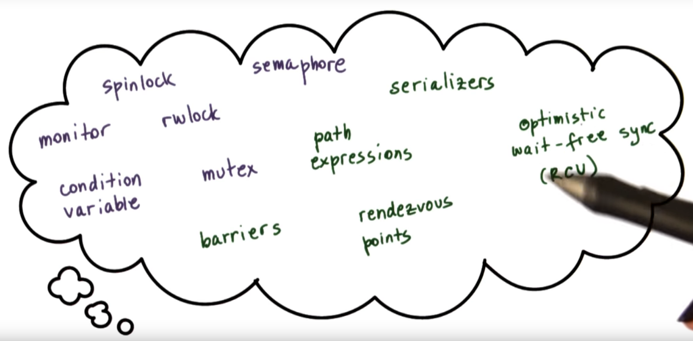
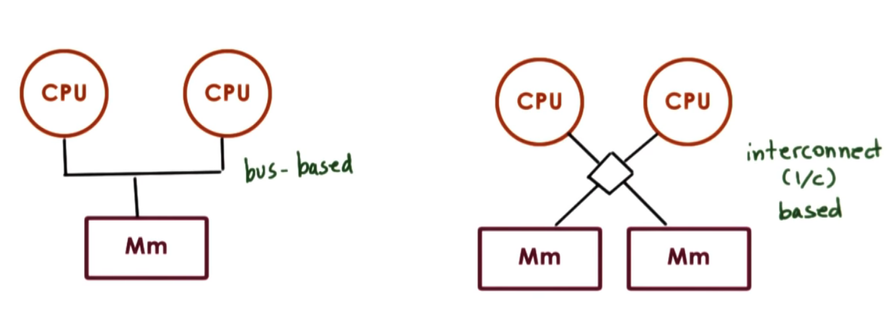
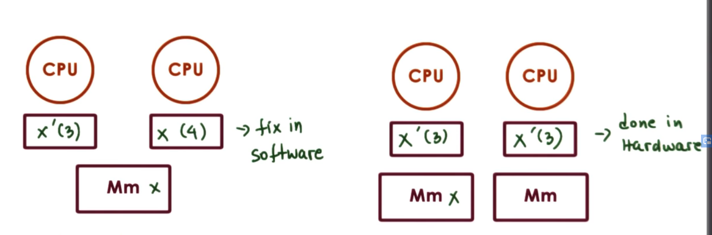
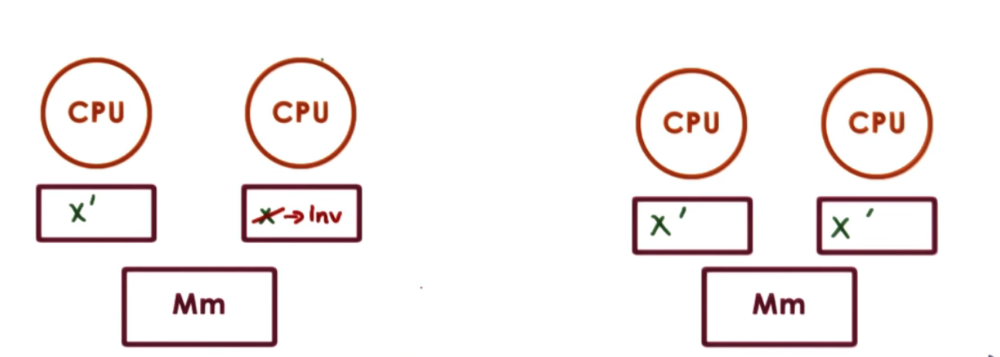
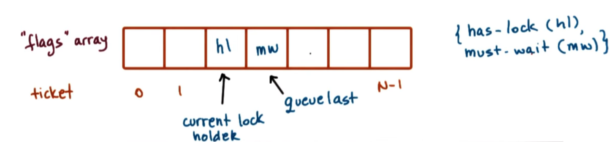
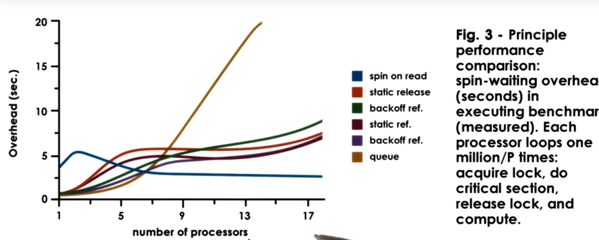

# P3L4 Synchronization
## 1. Preview
- more synchronization constructs
- hardware supported synchronization

 [The Performance of Spin Lock Alternatives for Shared-Memory Multiprocessors](https://s3.amazonaws.com/content.udacity-data.com/courses/ud923/references/ud923-anderson-paper.pdf)

 ## 2. Visual Metaphor
 "Synchronization is like ... waiting for a coworker to finish so you can continue working"

toy shop
- may repeatedly check to continue
  - Are you done? Still working?
- may wait for a signal to continue
  - Hey, I'm done
- waiting hurts performance
  - workers waster productive time while waiting

OS
- may repeatedly check to continue
  - sync using `spinlocks`
- may wait for a signal to continue
  - sync using `mutexes` and `condition variable`
- waiting hurts performance
  - CPU waste cycles for checking; cache effects

## 3. More about Synchronization
- Limitation of mutexes and condition variables
  - error prone/correctness/ease-of-use
    - unlock wrong mutex, signal wrong condition variable
  - lack of expressive power
    - helper variables for access or propriety control
- Low level support
- hardware atomic instructions

## 4. Spinlocks (basic sync construct)
Spinlock is like a mutex
- mutual exclusion
- lock and unlock(free)

But
- lock == busy
  -  spinning!!!

``` c
spinlock_lock(s);
  // critical section;
spinlock_unlock(s);
```

## 5. Semaphores
- common sync construct in OS kernels
- like a traffic light: STOP and GO
- similar to a mutex ... but more general

semaphore == integer value => count-based sync
- on init
  - assigned a max value (positive int) => maximum count
- on try (wait)
  - if non-zero => decrement and proceed => counting semaphore
- if initialized with 1
  - semaphore == mutex (binary semaphore)
- on exit(post)
  - increment

Semaphores designed by E.W.Dijkstra
- P(proberen) == on try(wait)
- V(verhogen)== on exit(post)


## 6. POSIX Semaphores
``` c
#inlcude <semaphore.h>
sem_t sem;
sem_init(sem_t *sem, int pshared, int count)
sem_wait(sem_t *sem)
sem_post(sem_t *sem)
```

## 7. Mutex Via Semaphore Quiz
``` c
sem_t sem;
sem_init(sem_t *sem, 0, 1);

sem_wait(sem_t *sem)
//critical section
sem_post(sem_t *sem)
```


## 8. Reader Writer Locks
Syncing different types of accesses
- read(never modify)
  - shared access
- write(always modify)
  - exclusive access

RWlocks
- specify the type of access, then lock behaves accordingly

## 9. Using Reader Writer Locks
``` c
#include <linux/spinlock.h>
rwlock_t m;
read_lock(m);
  //critical section
read_unlock(m);

write_lock(m);
  //critical section
write_unlock(m);

```

- `rwlock` support in Windows(.NET), Java, POSIX
- read/write == shared / exclusive

semantic differences in different implementation
- recursive read-lock... -> what happens on read- unlock?
- upgrade/downgrade priority?
  - update read lock to write lock
- interaction with scheduling policy
  - e.g., newly coming reading-lock block if higher priority write waiting


If you would like to explore more about the rwlock_t, then check out `/include/linux/rwlock.h`.


## 10. Monitor
- Monitors specify...
  - shared resource
  - entry procedure
  - possible condition variables
- on entry
  - lock, check
- on exit
  - unlock, check, signal
- High level synchronization construct
  - MESA by XEROX PARC
  - Java
    - synchronized methods generate monitor code
    - notify() explicitly
- monitor == programming style
    - `enter_/exit_critical` section in threads and concurrency lessons

## 11. More Synchronization Constructs

ALL need hardware support!


## 12.Spinlocks revisited

spinlock => basic sync construct

 [The Performance of Spin Lock Alternatives for Shared-Memory Multiprocessors](https://s3.amazonaws.com/content.udacity-data.com/courses/ud923/references/ud923-anderson-paper.pdf)
- alternative implementation of spinlock
- generalize techniques of other constructs

## 13. Spinlock Quiz 1
```c
spinlock_init(lock):
  lock = free;  // 0 = free; 1 = busy

spinlock_lock(lock):
  spin:
    if (lock == free) {
      lock =  busy;
    } else {
      goto spin;
    }


spinlock_unlock(lock):
  lock = free;  // 0 = free; 1 = busy

```
incorrect (查看和设置lock不是原子操作)
inefficient

## 14. Spinlock Quiz 2

``` c
spinlock_init(lock):
  lock = free;  // 0 = free; 1 = busy

spinlock_lock(lock):
  while (lock == busy);
  lock = busy;


spinlock_unlock(lock):
  lock = free;  // 0 = free; 1 = busy

```
incorrect (查看和设置lock不是原子操作)
inefficient

## 15.Need for Hardware Support
``` c
spinlock_lock(lock):
  while (lock == busy);
  lock = busy;
```
Problem:
- concurrent check/update on different CPUs can overlap


 hardware-supported atomic instructions

## 16. Atomic instructions
Hardware-specific
- test_and_set
- read_and_increment
- compare_and_swap

Guarantees
- atomicity
- mutual exclusion
- queue all concurrent instructions but one

atomic instructions == critical section with hardware-supported synchronization

``` c
spinlock_lock(lock):
  while (test_and_set(lock) == busy);
```

test_and_set(lock)
- atomically returns(tests) original value and sets new value = 1 (busy)
- first thread: test_and_set(lock) => 0 : free
- next ones: test_and_set(lock) => 1: busy
  - reset lock to 1(busy), but that's ok

## 17. Shared Memory Multi Processors

bus和interconnect唯一的区别是
- bus- == only one memory reference at a time
- interconnect == one memory reference for one memory module

shared memory multiprocessor also called symmetric multiprocessor (SMPs)


Caches
- hide memory latency;
- memory is "further away" from the CPU due to memory contention
- when write
  - no-write allowed in cache
  - write-through
  - write-back


## 18. Cache Coherence
Cache-Coherence
- non-cache coherent (NCC) 硬件不保证cache一致,责任在software
- cache coherent(CC)



Write-invalidate(WI)
- lower bandwidth
- amortize cost (改很多次,只需要invalidate一次)

Write-update(WV)
- update available immediately

determined by hardware


## 19. Cache Coherence and Atomics
Atomic always issued to the memory controller
- Pros:
  - can be ordered & synchronized
- Cons:
  - take MUCH LONGER!!!
  - generate coherence traffic (either update or invalidate) regardless of change
- Atomics & SMP
  - expensive because of bus/interconnect contention
  - expensive because of cache bypass & coherence traffic

## 20. Spinlock Performance Metrics
1. Reduce **latency**
    - "time to acquire a free lock"
    - ideally immediately execute atomic
2. Reduce **waiting time(delay)**
    - "time to stop spinning and acquire a lock that been freed"
    - ideally immediately
3. Reduce **contention**
    - "bus/network interconnect traffic"
    - ideally zero

## 21. Conflicting Metrics Quiz

Among the described metrics
- 1 conflicts with 3
- 2 conflicts with 3

## 22. Test-and-set Spinlock

``` c
spinlock_init(lock):
  lock = free;  // 0 = free; 1 = busy

spinlock_lock(lock):
  while (test_and_set(lock) == busy);


spinlock_unlock(lock):
  lock = free;  // 0 = free; 1 = busy

```

- Pros:
  - Latency minimal (just atomic)
  - Delay
    - potentially min (spinning continuously on the atomic)
- Cons:
  - Contention
    - processors go to memory on each spin

## 23. Test and test and set Spinlock
``` c
// test (cache), test_and_test (Mm)
// spins on cache (lock == busy)
// atomic if freed (test_and_set)

spinlock_lock(lock)
  while((lock == busy) or
    (test_and_set(lock) == busy))
```
named as `test_and_test_and_set` spinlock or `spin on read`, `spin on cached value`

- Pros
  - Latency ... ok
  - Delay ... ok
- Cons
  - Contention ... better but ...
    - if no cache coherence, then no difference
    - cache-coherence-write-update, then ok
    - cache-write-invalidation - horrible!
      - contention due to atomics + caches Invalidated
      - Problems
        - everyone sees lock is free at the same time
        - everyone tries to acquire the lock at the same time

## 24. Test and Test and Set Spinlock Quiz
In a  SMP system with N processors, what is the complexity of the memory contention(accesses), relative to N, that will result from releasing a test and test and test spinlock

- contention with write_update O(N)
- contention with write invalidate O(N^2)

## 25. Spinlock "Delay" Alternatives
delay after lock release
  - everyone sees lock is free
  - not everyone attempts to acquire it
  - Pros:
    - Contention ... improved
    - latency ... ok
  - Cons:
    - Delay ... much worse
```c
spinlock_lock(lock)
  while((lock == busy) or //第二次检查的时候，lock很可能已经被别人获
    (test_and_set(lock) == busy)) // 所以不会执行test_and_set
  {
    // failed to get lock
    while (lock == busy) //第一次检查
    delay();
}
```


delay after each lock reference
  - does't spin constantly
  - works on Non cache coherence architectures
  - but can hurt delay even more

``` c
  spinlock_lock(lock)
    while((lock == busy) or
      (test_and_set(lock) == busy))
    {
      delay();
    }
```


## 26.Picking a Delay (for a "delay" spinlock)
Static Delay (based on fixed value, e.g., CPU ID)
- simple approach
- unnecessary delay under low contention

Dynamic Delay(backoff-based)
- random delay in a range that increases with "perceived" contention
- perceived == `failed test_and_set()`
- 问题
  - delay after each reference will keep growing based on contention or length of critical section (我们并不想仅仅因为运行一个长的critical section就增加delay时间)

## 27. Queuing Lock
Common problem in spinlock implementations
- Everyone sees the lock is free at the same time
  - Anderson Queueing lock (解决第一个问题，自然解决第二个问题)
- Everyone tries to acquire the lock at the same time
  - delay alternatives

### Queuing Lock

- set unique `ticket` for arriving thread
- assigned `queue[ticket]` is private lock
- enter critical section when you have lock:
  - `queue[ticket] == must_wait` = > spin
  - `queue[ticket] == has_lock` = > enter critical section
- signal/set next lock holder on exit
  - `queue[ticket+1] = has_lock`

Downside:
- assumes `read_and_increment` atomic
- need O(N) size for a lock instead of O(1)

## 28. Queuing Lock Implementation
```c
init:
  flags[0] = has-lock
  flags[1...p-1] = must-wait
  queuelast = 0; // global variable

lock:
  myplace = r&inc(queuelast); // get ticket
  //spin
  while(flags[myplace mod p] == must-wait)
  //now in C.S
  flags[myplace mod p] = must-wait;

unlock:
  flags[myplace+1 mod p] = has-lock;
```
- Cons:
  - Latency: more costly r&inc
- Pros:
  - Delay: directly signal next CPU / thread to run
  - Contention: better ! but requires cache coherence and cacheline aligned elements

Only 1 CPU/thread sees the lock is free and tries to acquire lock

## 29 Queueing Lock Array Quiz
Q: if a system has 32 CPU, then how large is the array data structure for anderson's queueing spinlock

A: 32 * size of cache-line


## 30.Spinlock Performance Comparisons



Setup
- N processes running critical section 1M times
- cache invalidate
- N varied based on system

metrics
- overhead compared to ideal perf:
- theoretical limit based on # of critical section to be run

Under high loads:
- queue best (most scalable)
- test_and_test_and_set worst
- static better than dynamic
- delay after every memory reference better than release (avoids extra invalidation)

Under light loads:
- test_and_test_and_set good (low latency)
- dynamic better than static (lower delay)
- queueing lock worst(high latency due to r & inc)

## 31. Lesson Summary
Synchronization
- Semaphores, monitors, and other sync constructs
- Compared different spinlock alternatives and atomic instructions.