#Memory Management

## 1. Preview
- Physical and virtual memory management
- Review of memory management mechanisms
- Illustration of advanced services

## 2. Visual metaphor
"OS and toy shops each have memory(part) management systems" 

### Toy shop
- Uses intelligently sized containers
  - crates of toy parts
- Not all parts are needed at once
  - toy orders completed in stages
- Optimized for performance
  - reduce wait time for parts => make more toys

### Operating systems
- Uses intelligently sized containers
  - memory pages or segments
- Not all parts are needed at once
  - tasks operate on subset of memory
- Optimized for performance
  - reduce wait time to access state in memory => better performance

## 3. Memory Management
Virtual ==> Physical

- Allocate
  - allocation
  - replacement...
- Arbitrate
  - address translation and validation

- Page-based memory management (大多数)
  - Allocate  => pages -> page frames
  - Arbitrate => page tables
- Segment-based memory management
  - Allocate => segments
  - Arbitrate => segment registers

## 4. Hardware Support
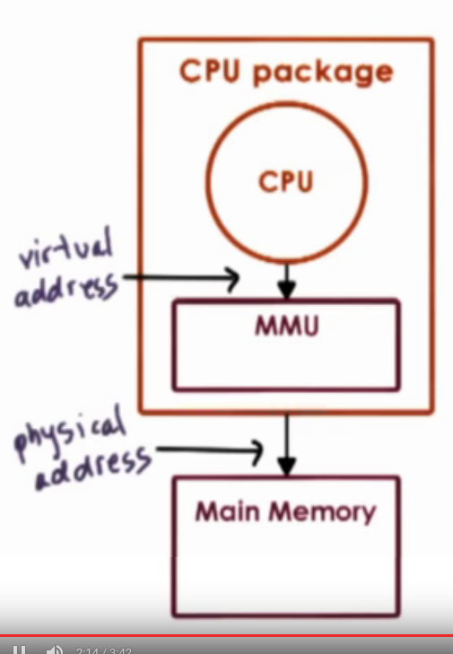

MMU (memory management unit) (in CPU package)
- translate virtual to physical addresses
- reports faults: illegal access(not allocated), permission, not  present in memory (in disk)
- 
Registers
- pointers to page table (page based)
- base and limit size, number of segments... (segment based)

TLB Cache - Translation look aside buffer
- valid Virtual address - Physical Address translations

Translation
- actual Physical generate done in hardware
- OS maintain the required information for translation such as page table

## 5. Page Tables
Virtual memory pages and physical memory page frames are the same size

Virtual page number - VPN
Physical frame number - PFN
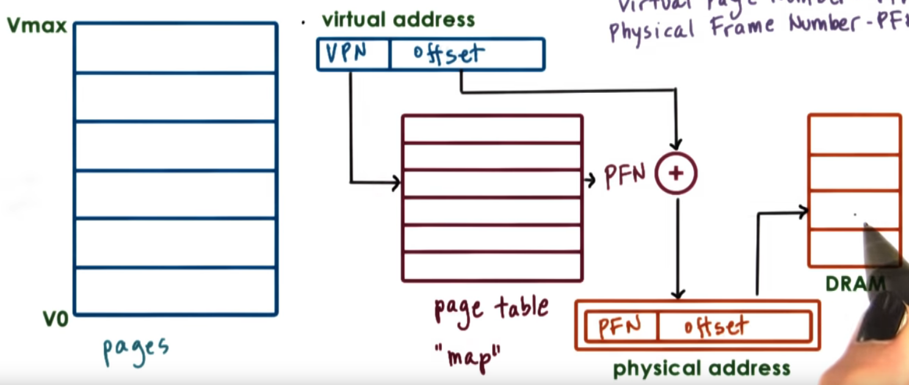

allocation on first touch!
- Physical memory is allocated only it is really needed

Pages unused for long time == reclaimed, put on the disk
  - valid bit been set to 0
  - MMU see 0, it will raise fault
  - OS reestablish on reaaccess (may be on different physical address)

Page Table
- per process
- on context switch, switch to valid page table
  - update register
    - e.g. CR3 on x86

## 6. Page Table Entry

Flags:
- P - Present(valid/invalid)
- D - Dirty(written to)
- A - Accessed(for read or write)
- (R W X) - protection bits

Page fault
MMU
- generate Physical address and access
- generate error code on kernel stack => trap into kernel
  - page fault handler == determines action based on error code and faulting address
    - bring page from disk to memory
    - protection error (SIGSEGV)
  - on x86
    - error code from page table entry flags
    - faulting address in CR2

## 7. Page Table Size
### 32 - bit architecture
- Page table entry (PTE)
  - 4bytes, including PFN + flags

- Virtual page Number(VPN)
  - 2^32 / Page Size

- Page Size
  - based on system architecture
  - 4KB (...8kb, 2Mb,4Mb,1Gb)

- 2^32 / 2^12 * 4B  = 4MB per process

### 64 - bit architecture
- Page table entry (PTE)
  - 8bytes, including PFN + flags

- Virtual page Number(VPN)
  - 2^64 / Page Size

- Page Size
  - based on system architecture
  - 4KB (...8kb, 2Mb,4Mb,1Gb)

- 2^64 / 2^12 * 8B  = 32PB per process

### Problem
- process doesn't use entire address space
- even on 32-bit arch, will not always use all of 4GB
- but page table assumes an entry per VPN, regardless of whether corresponding virtual memory is needed or not

## 8. MultiLevel Page Tables
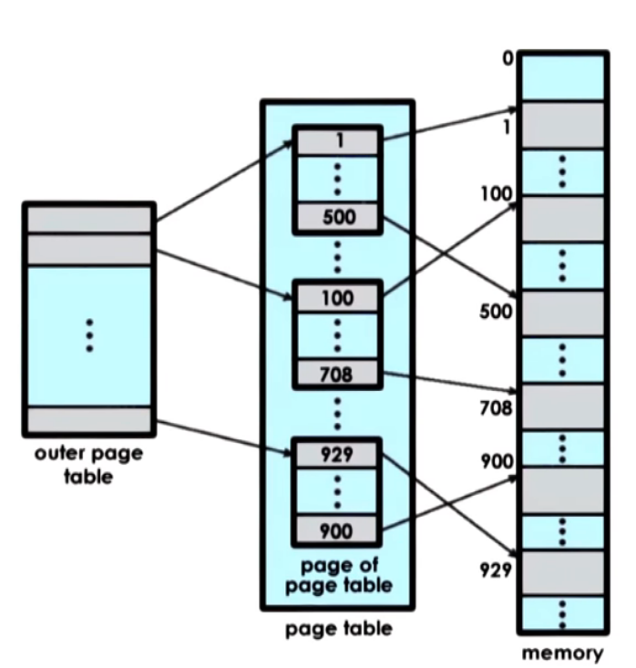
Hierarchical Page Table
- outer page table or top page table
  - page table directory
- internal page table == only for valid memory regions
- on `malloc` a new internal page table may be allocated

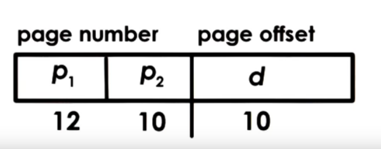
- inner table address => 2^10 * page size = 2^ 10 * 2^ 10 = 1MB (每个inner table可以表示1MB)
- don't need an inner table for each 1MB virtual memory gap

Additional Layer
- page table directory pointer (3rd level)
- page table directory pointer map (4th level)
- import on 64 bit architectures
- larger and more sparse
  - large gaps => could save more internal page table components

multi-level page table Tradeoffs
- Pros
  - smaller internal page tables/directories granularity of coverage
  - potential reduced page table size
- Cons 
  - more memory accesses required for translation
  - increased translation latency

## 9. Quiz
A process with 12 bit addresses has an address space where only the first 2 kb and last 1kb are allocated and used.

How many total entires are there in a single-level page table that uses the first address format? 64
How many total entires are needed in the inner page tables of the 2-level page table when the second format is uses?

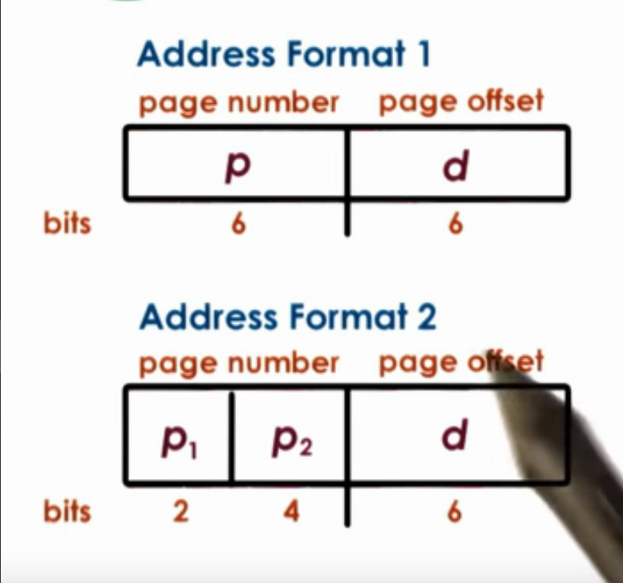

## 10. Speeding Up Translation TLB

For each memory reference...
Single-level page table
- x1 access to page table entry
- x1 access to memory

Four-level page table
- x4 accesses to page table entries
- x1 access to memory

=> slowdown!

### Page Table Cache (TLB)
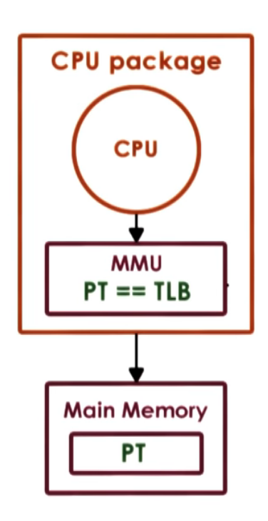
Translation Lookaside Buffer
- MMU-level address translation cache
- on TLB miss => Page table access from memory
- has protection/validity bit
- small number of cached addr => high TLB hit rate <=> temporal & spatial locality

x86 Core i7
- per core: 
  - 64-entry data TLB
  - 128-entry instruction TLB
-512-entry shared second-level TLB

## 11. Inverted Page Tables
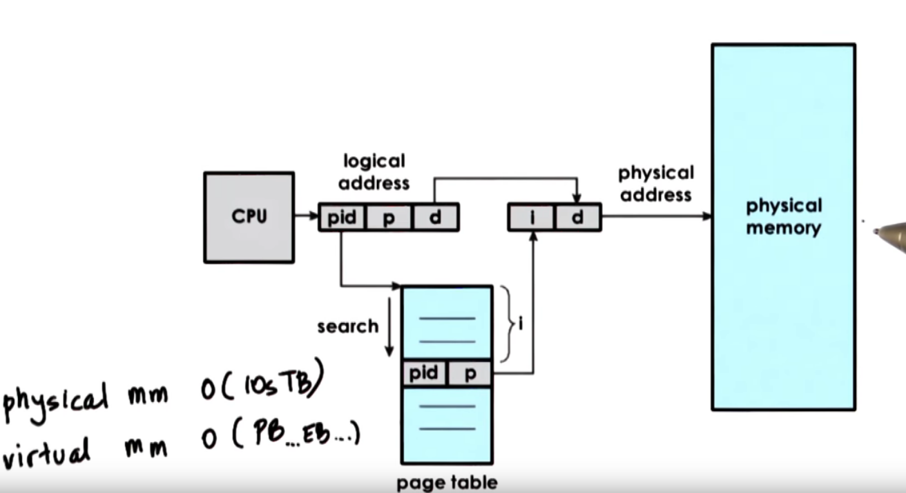
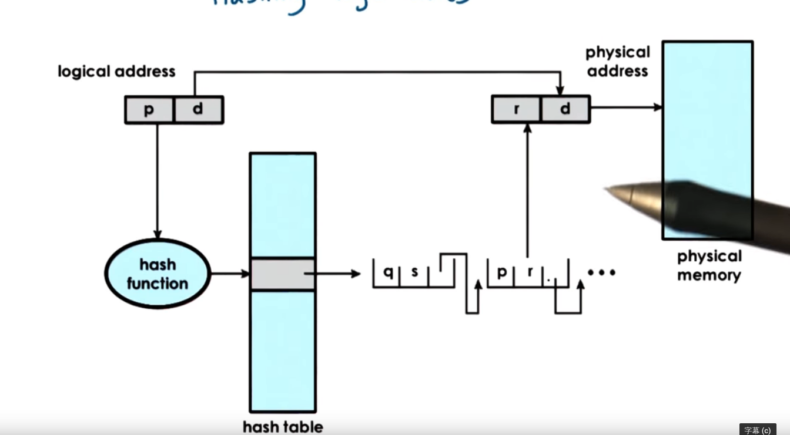
1. 根据pid算hash
2. 找到linked list
3. 再找对应的地址
   
## 12. Segmentation
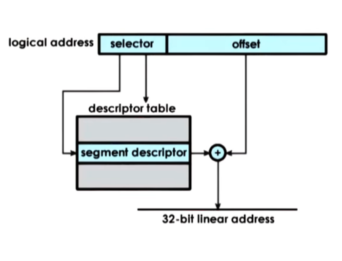
- segments == arbitrary granularity
  - e.g., code, heap, data, stack...
  - address == segment selector + offset
- segment == contiguous physical memory
  - segment size == segment base + limit registers
- segmentation + paging
  - Intel x86_32 => segmentation + paging 
    - Linux: up to 8k per process / 8k global segment
  - Intel x86_64 => default mode is just paging

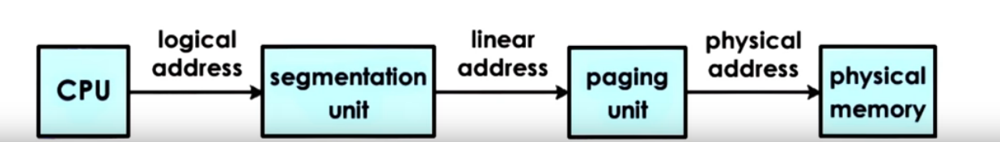

## 13. Page Size
How large is a page?
10-bit offset -> 1kb page size
12-bit offset -> 4kb page size

Linux/86: 4kb(default), 2MB, 1GB
Solaris/SPARC: 8kb, 4Mb, 2GB

&nbsp; | large | huge
--|--|--
page size| 2MB| 1GB
offer bit  | 21 bits | 30 bits
reduction factor(on page table size)  | *512 | * 1024

Larger pages:
Pros: fewer page table entries, smaller page tables, more tlb hits...
Cons: internal fragmentation => wastes memory

##14. Page Table Size QUIZ
on a 12-bit architecture what are the number if entries in the page table if the page size is 32 bytes? 
How about 512 bytes? 

32 byte page size: 128 entries
512 byte page size: 8 entries

## 15. Memory Allocation
memory allocator
- determines VA to PA mapping
- kernel-level allocators
  - kernel state, static process state
- User-level allocators
  - dynamic process state(heap); malloc/free
  - e.g. dlmalloc, jemalloc, horad, tcmalloc

## 16. Memory Allocation Challenges
Requests for page frames
可能会有holes => external fragmentation
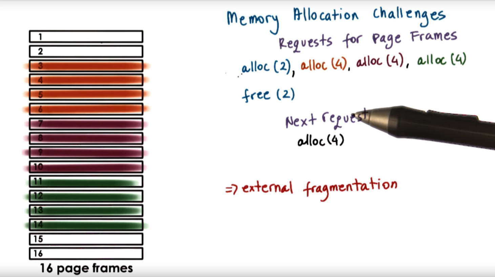

Allocation algorithm must concern with 
- to avoid fragmentation
- to permit quick coalescing/aggregation of free areas

## 17. Linux Kernel Allocators
- Buddy
  - 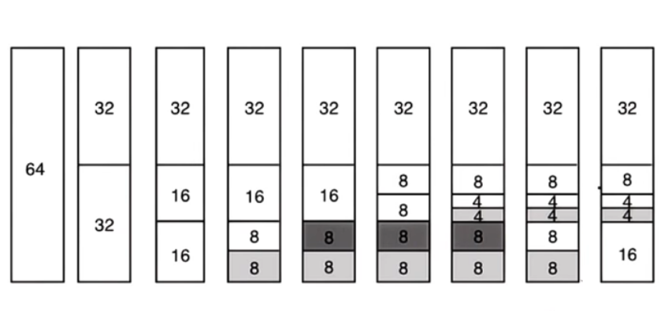
  - start with 2^x area
  - on request
    - subdivide into 2^x chunks and find smallest 2^x chunk that can satisfy request
  - fragmentation still there but we can aggregate them quickly
  - on free
    - check buddy(adjacent chunk) to see if you can aggregate into a large chunk 
    - aggregate more up the tree
- Slab
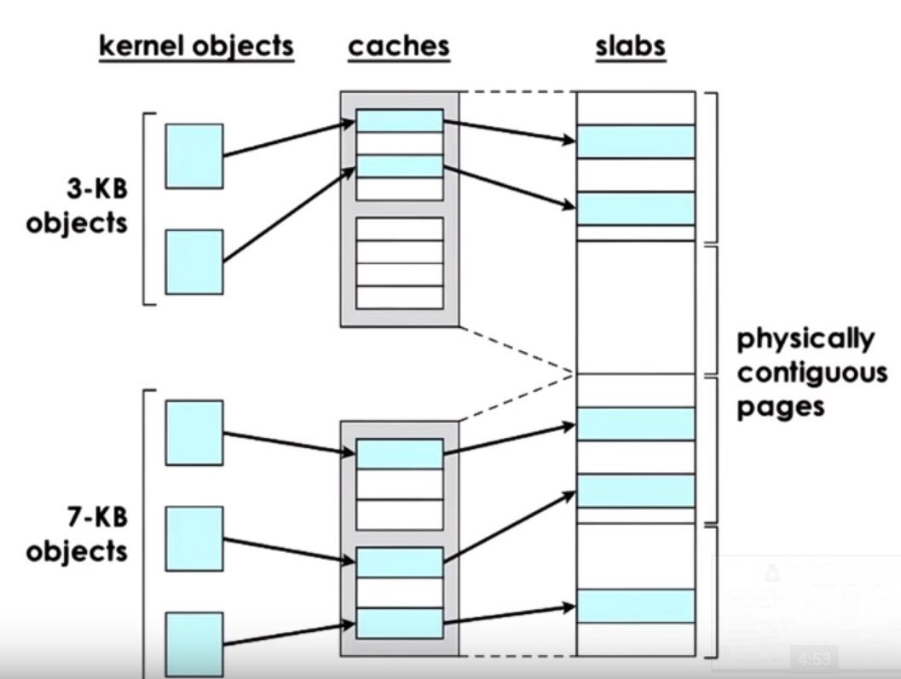
  - 2^x granularity in Buddy
    - internal fragmentation
    - a lot of Linux common data structures are not of a size that's close to a power of two 
    - Slab to rescue
  - caches for common object types/sizes, on top of contiguous memory
  - Pros: 
    - internal fragmentation avoided
    - external fragmentation is not an issue

## 18. Demand Paging
Virtual memory >> Physical memory
- virtual memory page not always in physical memory
- physical page frame saved and restored to/from secondary storage
  
demand paging
- pages swapped in/out of memory and a swap partition (e.g., on disk)
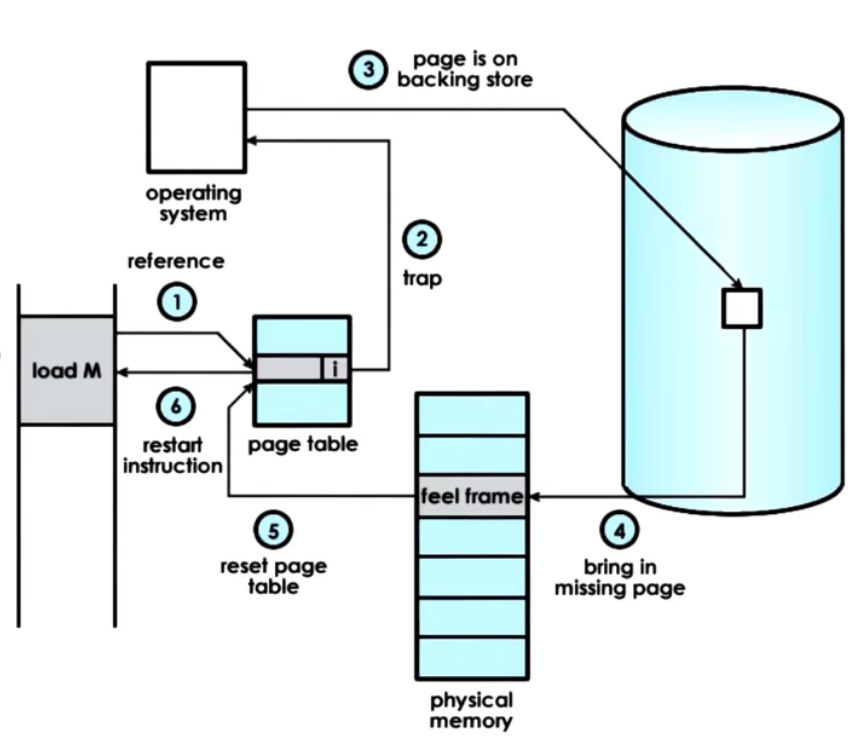
- original physical address may not equal to physical address after swap
- if page is "pinned", the swapping is disabled
  - is useful for instance, CPU is interacting with DMA devices

## 19. Page Replacement
When should pages be swapped out?
- page(out) daemon
- when memory usage is above threshold (high watermark)
- when cpu usage is below threshold (low watermark)

Which pages should be swapped out?
- pages that won't be used
- history-based prediction
  - Least-recently Used (LRU policy)
- pages that don't need to be written out
  - Dirty bit to track if modified
- avoid non-swappable pages

### Freeing up Physical memory
In Linux, 
- parameters to tune thresholds: target page count ...
- categorize pages into different types
  - e.g. claimable, swappable ...
- 'second chance' => a variation of LRU

## 20. LRU Quiz
Suppose you have an array with 11 page-sized entries that are accessed one-by-one in a loop
Also, suppose you have a system with 10 pages of physical memory.
What is the percentage of pages that will need to be demand pages using the LRU policy?

100% 

## 21 Copy on Write
MMU hardware
- perform translation, track access, enforce protection
- useful to build other services and optimizations
  - E.g. Copy-on-write
  - Check pointing

### Copy-on-write ("COW")
on process creation ...
- copy entire parent address space
- many pages are static, don't change! why keep multiple copies?

Cow
On create
- map new VA to original page
- write protect original page
- if only read
  - save memory and time to copy
On write
- page fault and copy
- pay copy cost only if necessary
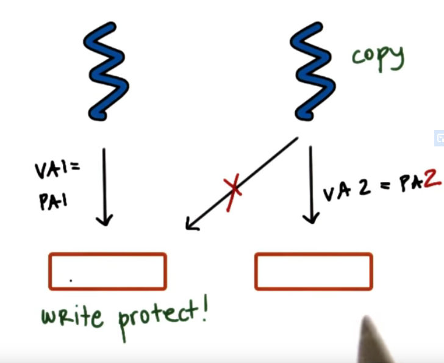

## 22. Fault Management Checkpoint
### Check pointing
checkpointing == failure & recovery  management technique
- periodically save process state
- failure may be unavoidable 
- but can restart from checkpoint, so recovery much faster

Simple Approach 
- pause and copy

Better Approach
- write-protect(dirty protect) and copy everything once
- copy diffs of "dirtied" pages for incremental checkpoints
  - rebuild from multiple diffs, or in background

From Checkpoints to ....
Debugging
- Rewind - Replay
- rewind == restart from checkpoint
- gradually go back to older checkpoints until error found
  
Migration
- checkpoint the process and continue on another machine
  -  disaster recovery
  -  consolidation (datacenter 减少机器,合并运行的进程)
  -  repeated checkpoints in a fast loop until pause-and-copy becomes acceptable (or unavoidable)

