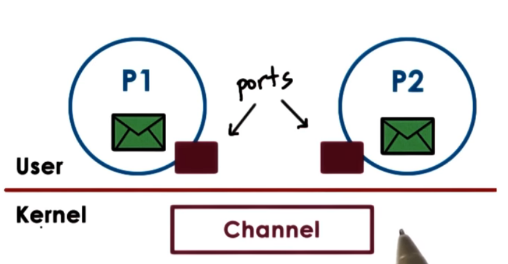
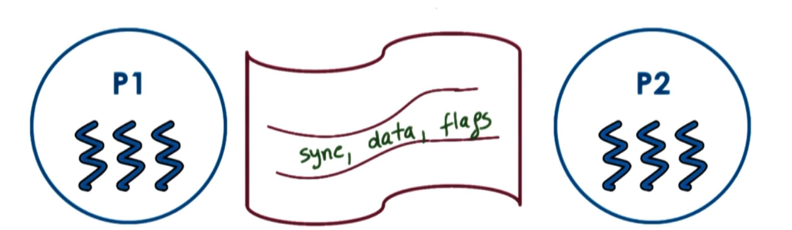

# P3L3  IPC

## 1. Lesson Preview
Inter-Process communications
- IPC
- Shared Memory IPC

## 2. Visual Metaphor
IPC is like...   working together in the toy shop


 IPC| toy shop 
----|---
Processes share memory| workers share work area
Process exchange message (via sockets...) | works call each other
Requires synchronization (mutexes, waiting)|Requires synchronization

## 3. Inter-Process Communications (IPC)
IPC == OS-supported mechanisms for interaction among processes (coordination &communication)
- message passing
  - e.g, sockets, pipes, message queues
- memory-based IPC
  - shared memory, mem.mapped files
- higher-level semantics
  - files, RPC
- synchronization primitives

## 4. message-passing

send/recv of messages
- os creates and maintains a channel
  - buffer, FIFO queue..
- os provides interface to processes - a port
  - processes send/write messages to a port
  - processes recv/read messages from a port

kernel required to 
- establish communication
- perform each IPC op
- send: system call + data copy
- recv: system call + data copy
- request-response: 4x user/kernel crossings + 4x data copies

cons:
- overheads
  - request-response: 4x user/kernel crossings + 4x data copies
pros:
- simplicity
  - kernel does channel management and synchronization

## 5. Forms of Message Passing
Pipes (POSIX stand)
- carry byte stream between 2 processes
- e.g. connect output from one process to input of another

Message Queues
- carry "messages" among processes
- OS management
  - includes priorities, scheduling of msg delivery...
- APIs: SysV and POSIX

Sockets (a kind of message passing API)
- send(), recv() == passing message buffers
- socket() -- create kernel-level socket buffer
- associate necessary kernel-level processing (TCP/IP, ...)
  - if different machines, channel between process and network device
  - if same machine, bypass full protocol stack.

## 6.Shared Memory IPC
read and write to shared memory region
- OS established shared channel between the processes
    1. physical pages mapped into virtual address space
    2. VA(P1) and VA(P2) map to the same physical address
    3. VA(P1) != VA(P2)
    4. physical memory doesn't need to be contiguous
- APIs: 
  - SysV API
  - POSIX API
  - memory mapped file
  - Andriod ashmem 

Pro:
- system calls only for setup data copies potentially reduced (but not eliminated)

Cons:
- explicit synchronization
- communication protocol, shared buffer management ... is programmer responsibility
## 7. IPC Comparison Quiz
Considering using IPC to communicate between processes. You can either use a message-passing or a memory-based API. Which do you think will perform better
- message-passing?
- Shared memory?
- neither, it depends <== correct

Answer

- message-passing? <== must perform multiple copies
- Shared memory?  <== must establish all mapping among processes' address spaces and shared memory pages
- neither, it depends <== correct


## 8. Copy(message) vs. Map (shared Memory)
Goal: transfer data from one into target address space
Copy:
  - CPU cycles to copy data to/from port

Map:
  - CPU cycles to map memory into address space
  - CPU to copy data to channel (no user/kernel switches)


large data: t(copy) >> t(map)
  - set up once use many times -> good payoff
  - Shared memory can perform well for 1-time use
    - e.g, tradeoff exercised in Windows "Local" Procedural Call (LPC)

## 9. SysV Shared Memory
- "segments" of shared memory 
  - not necessarily contiguous physical pages
- shared memory is system-wide 
  - system limits on number of segments and total size

### SysV Shared Memory Overview
1. Create 
   - OS assigns unique key
2. Attach 
   - map virtual => physical addresses
3. Detach
   - invalidate address mappings
4. destroy
   - only remove when explicitly deleted (or reboot)

## 10. SysV shared Memory API
1. Create
    - `shmget(shmid, size, flag)`
      - create or open
    - `ftok(pathname, prg_id)`
      - same args => same key
2. Attach
   - `shmat(shmid, addr, flags)`
      - address = null => arbitrary
      - cast return addr to arbitrary type
3. Detach 
  - `shmdt(shmid)`
4. Destroy 
  - `shmctl(shmid, cmd, buf)`
      - destroy with replace `cmd` with `IPC_RMID` 

## 11. POSIX shared Memory API
use file instead of segment, file descriptor instead of key 
1. `shm_open()`
   -  returns file descriptor
   -  in "tmpfs"
2. `mmap(`) and `ummap()`
   - mapping virtual => physical addresses
3. `shm_close()`
4. `shm_unlink()`

[POSIX Shared Memory API](http://man7.org/linux/man-pages/man7/shm_overview.7.html)

## 12. Shared memory and Synchronization
"like threads shared stat in a single address space ... but for processes"

Synchronization method
1. mechanisms supported by process threading library (pthreads)
2. OS-supported IPC for synchronization
   
Either method must coordinate...
- number of concurrent accesses to shared segment <= mutex
- when data is available and ready for consumption <= condition

## 13. Pthreads Sync for IPC

- assign `phtread_mutexattr_t`, `pthread_condattr_t` to `PTHREAD_PROCESS_SHARED`
-  synchronization data structures self must be shared

```
typedef struct {
    pthread_mutex_t mutex;
    char *data;
} shm_data_struct, *shm_data_struct_t;

//...create shm segment
seg = shmget(ftok(arg[0],120), 1024, IPC_CREATE|IPC_EXCL);
shm_address = shmat(seg, (void *) 0, 0);
shm_ptr = (shm_data_struct_t) shm_address;

//... create and init mutex
pthread_mutexattr_t (&m_attr);
pthread_mutexattr_set_pshared(&m_attr, PTHREAD_PROCESS_SHARED);
pthread_mutex_init(&shm_prt.mutex, &m_attr);

```

## 14. Other IPC Sync
message Queues
- implement "mutual exclusion" via send/recv
- example protocol:
    - P1 writes data to shmem, sends "ready" to queue
    - P2 receives msg, reads data & sends "OK" msg back

Semaphores
- binary semaphore <=> mutex
- if value == 0 => stop/blocked
- if value == 1 => decrement(lock) and gor/proceed
  
IPC Resources
- [SysV IPC Tutorials](http://www.tldp.org/LDP/lpg/node21.html) has example source for SysV IPC
- [mq_notify() man page](http://man7.org/linux/man-pages/man3/mq_notify.3.html) registers for notification when a message is available
- [sem_wait() man page](http://man7.org/linux/man-pages/man3/sem_wait.3.html) locks a semaphore
- [shm_overview man page](http://man7.org/linux/man-pages/man7/shm_overview.7.html) overview of POSIX shared memory


## 15. Message Queue Quiz
for message queues what are the linux system calls that are used for ...
- `msgsnd` send message to a message queue
- `msgrcv` receive message to a message queue
- `msgctl` perform a message control operation
- `msgget` get a message identifier

## 16. IPC command line tools
- `ipcs` == list all IPC facilities (including all kinds of IPC, message queues, semaphores)
  - `-m` displays info on shared memory only
- `ipcrm` == delete IPC facilities
  - `-m [shmid]` deletes shm segment with given id

## 17. Shared Memory Design Consideration
- different APIs/ mechanism for synchronization
- os provides shared memory, and is out of the way
- data passing /sync protocols are up to the programmer 

## 18. Shared Mem Design Considerations

How many segments?
- 1 large segment 
  - manager for allocating/freeing mem form shared segment
- many small segments  
  - use pool of segments, queue of segment ids
  - communication segment IDS among processes

## 19. Design Consideration
what size segments? what if data doesn't fit?

- segment size == data size 
  -  works for well-know static sizes limits max data size
- segment size < message size
  - transfer data in rounds;
  - include protocol to track progress

## 20. Lesson Summary
Inter-Process Communications
- IPC using pipes, messages(ports), and shared memory
- Memory-based vs. message-based IPC