# P3L5 IO

## 1. Lesson Preview

I/O Management

- OS support for I/O devices
- Block device stack
- File system architecture

## 2. Visual Metaphor

"I/O is like ... a toy shop shipping department"
Toy Shop

- Have protocols
  - how/what parts comes in
  - how/what toys go out
- Have dedicated handlers
  - dedicated staff
- Decoupled I/O details from core processing
  - abstracts shipping details from making toys

I/O

- Have protocols
  - interfaces for device I/O
  - how/what toys go out
- Have dedicated handlers
  - device drivers, interrupt handlers...
- Decoupled I/O details from core processing
  - abstract I/O device detail from application

## 3. I/O Devices

## 5. I/O Device Features
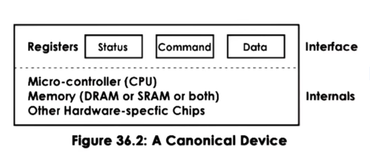
- control registers
  - command
  - data transfers
  - status
- microcontroller == device's CPU
- on device memory
- other logic
  - e.g., analog to digital converters

## 6. CPU Device Interconnect
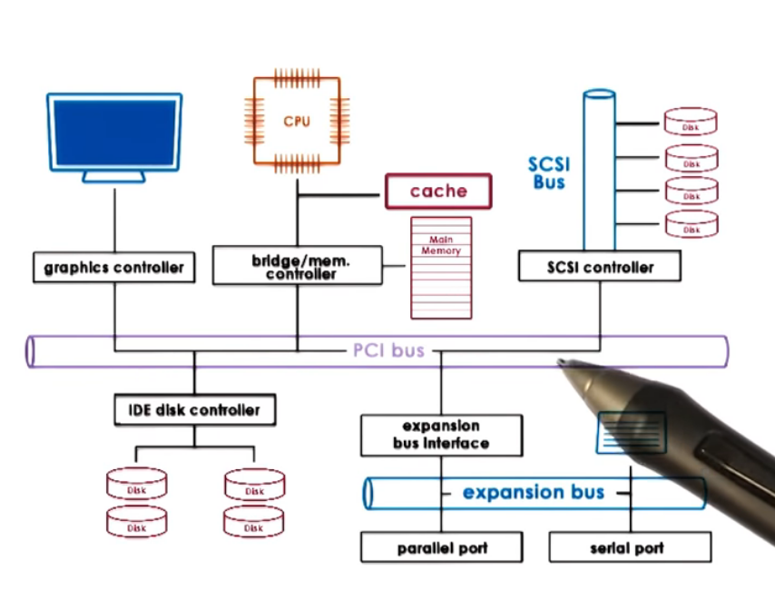
Peripheral Component Interconnect (PCI)
- PCI Express (PCIe) (> PCI-X > PCI)
Other types of interconnects
- SCSI bus
- peripheral bus
- bridges handle differences

## 7.Device Drivers
Device Drivers
- per each device type
- responsible for device access, management and control
- provided by device manufacturers per OS/version
- each OS standardized interfaces
  - device independence
  - device diversity

## 8. Types of Devices
- Block: disk
  - read/write blocks of data
  - direct access to arbitrary block
- Character : keyboard
  - get/put character
- Network devices
  - stream

OS representation of a device == special device file

UNIX-like systems
- /dev
- tmpfs
- devfs

## 9. I/O Devices as Files Quiz
The following Linux commands all perform the same operation on an I/O device(represented as a file).
What operation do they perform?
- `cp file > /dev/lp0`
- `cat file > /dev/lp0`
- `echo "Hello, world" > /dev/lp0`

print something to lp0 printer device

## 10. Pseudo devices Quiz
Linux supports a number of pseudo ("virtual") devices that provide special functionality to a system. Given the following functions name the pseudo device that provides that functionality.

- accept and discard all output (produces no output)     `/dev/null`
- produces a variable-length string of pseudo-random numbers `/dev/random`


## 11. Looking at /dev Quiz
Run the command `ls -la /dev` in a linux environment. What are the some of the device names you see?
Enter at least five device names
 
- hda
- sda
- tty
- null
- zero
- ppp
- lp
- mem
- console
- autoconf

## 12.CPU-Device Interactions
### CPU-Device CPU to Device
### Path from Device to CPU

access device register == memory load/store
- memory-mapped I/O
  - Part of 'host' physical memory dedicated for device interactions
  - Base Address Register(BAR)
- I/O port model
  - dedicated in/out instructions for device access
  - target device (I/O port) and value in register

### Path from Device to CPU
- Interrupt
Cons: interrupt handling steps
Pros: can be generated as soon as possible
- Polling
Pros: when convenient for OS
Cons: delay or CPU overhead

## 13.Device Access PIO
### Programmed I/O(PIO)

no additional hardware support

CPU "programs" the device
- via command registers
- data movement

### Example: NIC, data == network packet

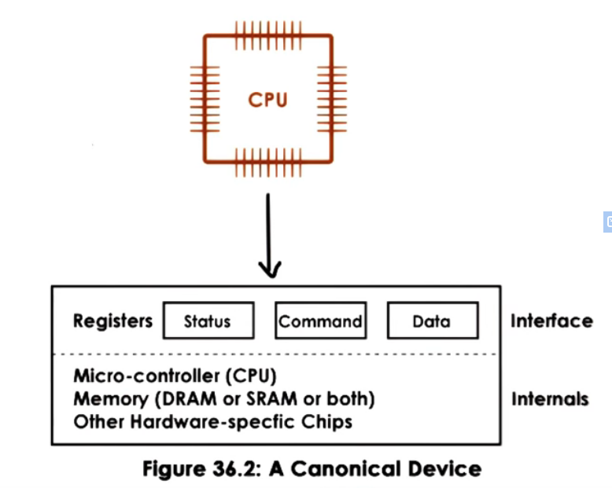

- write command to request packet transmission
- copy packet to data registers
- repeat until packet sent

e.g., 1500 B packet; 8 byte regs or bus
- 1 (for bus command) + 188 (for data) == 189 cpu store instructions


## 14. Device Access DMA
### Direct Memory Access
relies on DMA controller

CPU "programs" the device
- via command register
- via DMA controls
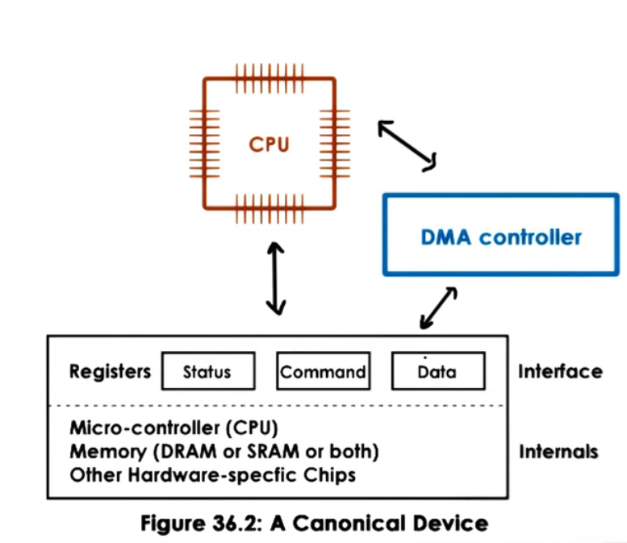

Example: NIC, data == network packet
- write command to request packet transmission
- configure DMA controller with in-memory address and size of packet buffer

e.g., 1500 B packet; 8 byte regs or bus
- 1 store instruction + 1 DMA configure
- less steps, but DMA config is more complex

For DMAs:
- data buffer must be in physical memory until transfer completes
- pinning regions (non-swappable)


## 15. DMA vs. PIO Quiz
For a hypothetical system, assume the following:
- it costs 1 cycle to run a store instruction to a device register
- it costs5 cycle to configure a DMA controller
- te PCI-bus i 8 bytes wide
- all devices support both DMA and PIO access

which device access method is best for the following devices?
- keyboard <== PIO
- NIC <== Depends

## 16. Typical Device Access
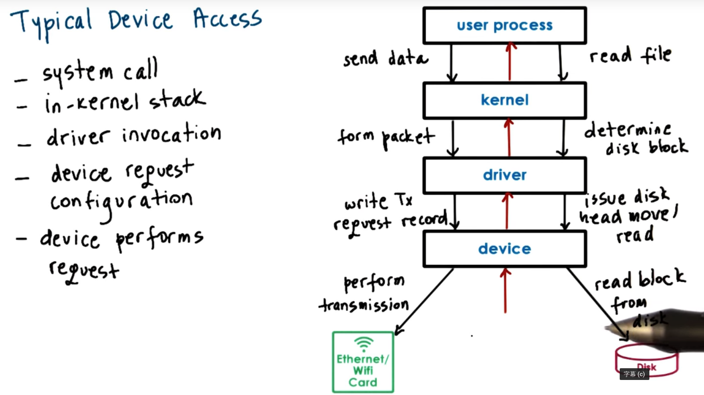

## 17. OS Bypass

Do you Have to Go Through the OS ?

OS Bypass
- device regs/data directly accessible
- OS configures the memory mapping then out-of-the-way
- "user-level driver" (~ library)
- OS retains coarse-grain control
- relies on device features
  - sufficient registers
  - demux capability


## 18. Sync vs. Async Access
### what happens to a calling thread?
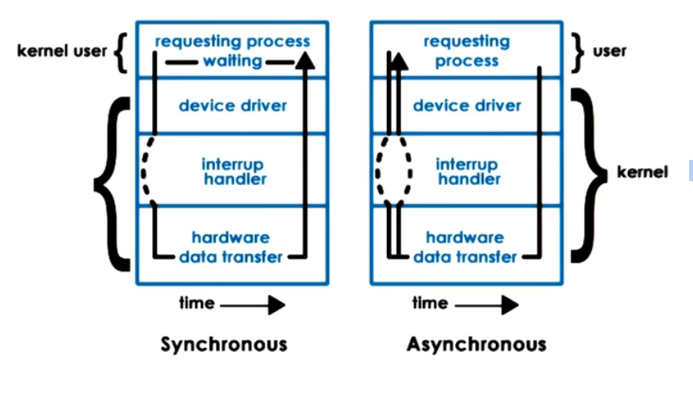

- Synchronous I/O operations
  - process blocks in the wait queue
- Asynchronous I/O operations
  - process continues
  - Later... 
    - process checks and retrieves result
    - Or process is notified that the operation completed and results are ready


## 19. Block Device Stack

Block Device Stack
- processes use files
  - logical storage unit
- kernel file system(FS)
  - where, how to find and access file
  - OS specifies interface 
- generic block layer
  - OS standardized block interface
- device driver
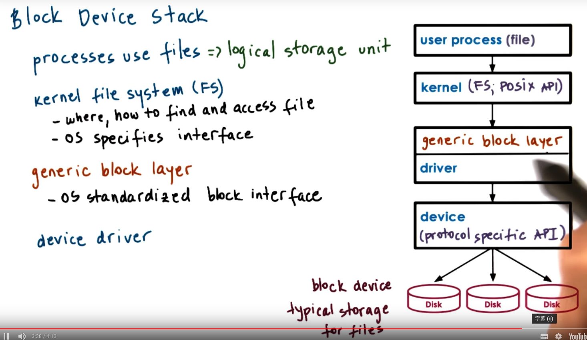

## 20. Block Device Quiz
in linux, the `ioctl()` command can be used to manipulate devices. Complete the code snippet, using `ioctl` to determine the size of a blockdevice

```C
int fd;
unsigned long numblocks = 0;

fd = open(argv[1], O_RDONLY);
ioctl(fd, BLKGETSIZE, &numblocks);
close(fd);

```

## 21. Virtual File System
- What if flies are on more than one device?
- What if devices work better with different FS implementations?
- What if files are not on a local device(accessed via network)?

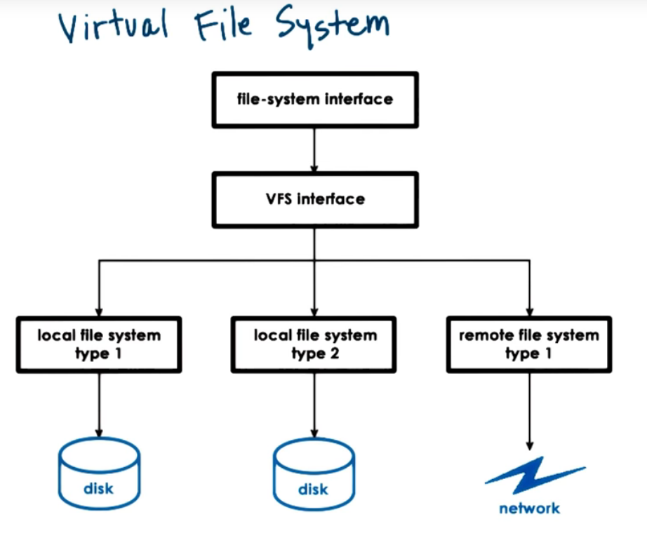

## 22. Virtual File System Abstractions
- file == elements on which the VFS operates
- file descriptor == OS representation of file
  - open, read, write, sendfile, lock, close....
- inode == persistent representation of file "index"
  - list of all data blocks
  - device, permissions, size, ...
- dentry == directory entry, corresponds to single path component
  - `/users/ada` => `/`, `/user`, `/users/ada` 遍历路径上的每一个目录
  - dentry cache
- superblock == filesystem-specific information regarding the FS layout

## 23. VFS on disk
- file => data blocks on disk
- inode => track files' blocks
  - also resides on disk in some block
- superblock => overall map of disk blocks
  - inode blocks
  - data blocks
  - free blocks

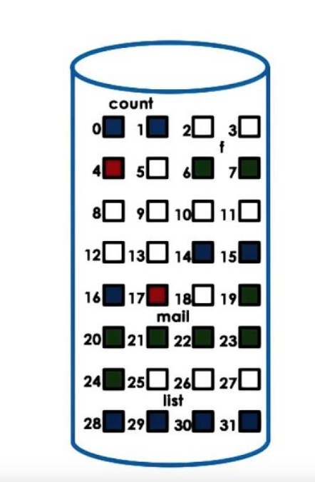

## 24. ext2 Second Extended Filesystem
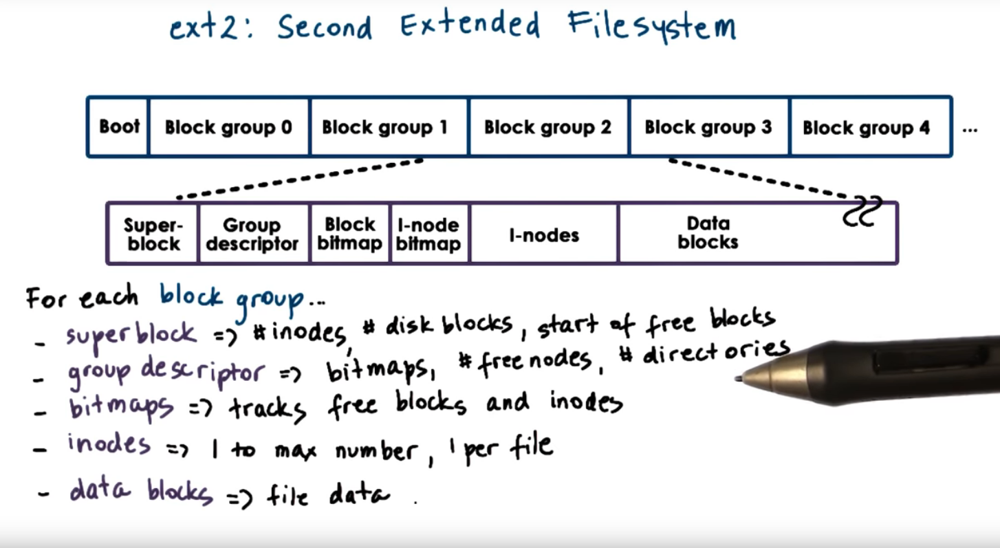
目录只是特殊的文件, 上层会解析它成为dentry

## 25. inodes
inodes == index of all disk blocks corresponding to a file
- file => identified by inode
- inode => list of all blocks + other metadata
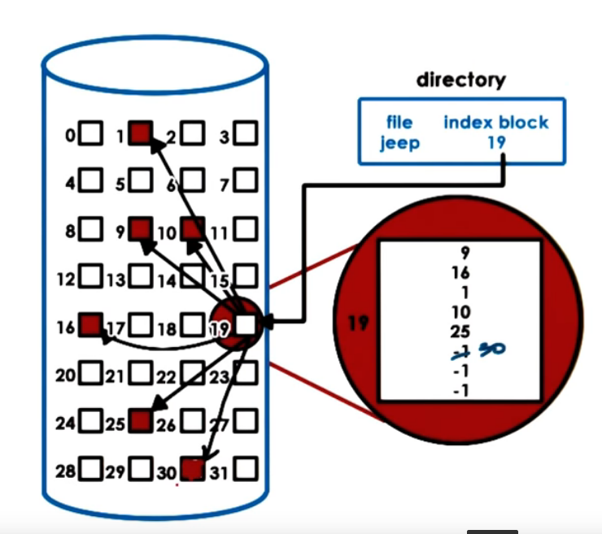

- Pro:
  - easy to perform sequential and random access
- Cons:
  - limited on file size

e.g. 128 byte inode,4 byte block pointer
  - 32 addressable blocks, * 1kb block
  - 32 kb file size

## 26. inodes with Indirect Pointers
- 128 byte inode,4 byte block pointer
- Direct pointer "pointers to data block"
  - 1kb per entry
- Indirect pointer "a block of pointers"
  - 256kb per entry
- Double Indirect point "a block of block of pointers"
  - 64mb
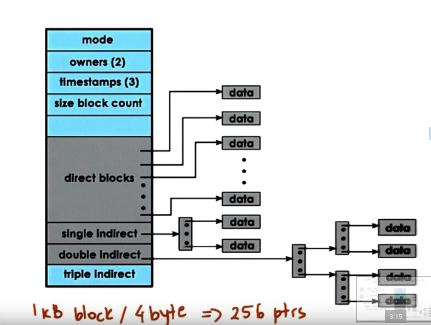
- Pro: 
  - small inode =>  large file size
- Cons:
  - file access slowdown

e.g.    
  - direct ptr => 2 disk accesses
  - double indirect ptr => up to 4 disk accesses 

## 27. inode Quiz:
An inode has the following structure:
Each block ptr is 4B
If a block on disk is 1kB, what is the maximum file size that can be supported by this inode structure(nearest GB)?
`16Gb` 
1kb -> 256 ptrs
(12 + 256 + 256^2 + 256 ^3 ) * 1kb = 16GB

What is the maximum file size if a block on disk is 8kb
8kb / 4b = 2k ptrs
64TB (12 + 2k^1 + 2k^2 + 2k^3 ) * 1kb = 64TB

## 28. Reducing File Access Overheads
- caching/buffering => reduce number of disk accesses
  - buffer cache in main memory
  - read / write from cache
  - periodically flush to disk - `fsyc()`
- I/O scheduling => reduce disk head movement
  - maximize sequential vs random access
  - e.g., write block 25, write block 17 => write 17, 25
- prefetching => increases cache hits
  - leverages locality
  - e.g., read block 17 => read also 18,19
- journaling / logging => reduce random access(ext3, ext4)
  - "describe" write in log: block, offer, value...
  - periodically apply updates to proper disk location

## 29. Lesson Summary
I/O Management
- Supporting I/O devices
- Analyzed stack of block-based storage devices
- Architecture of file systems