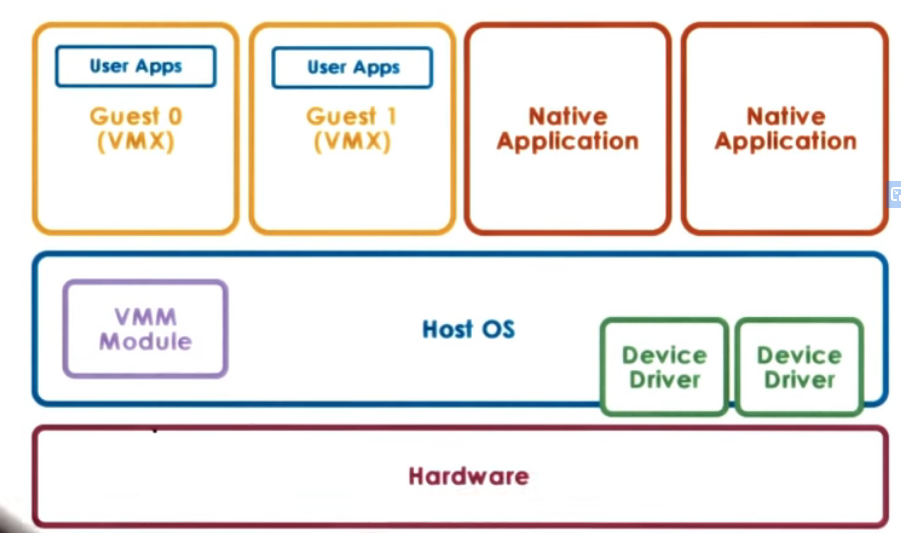
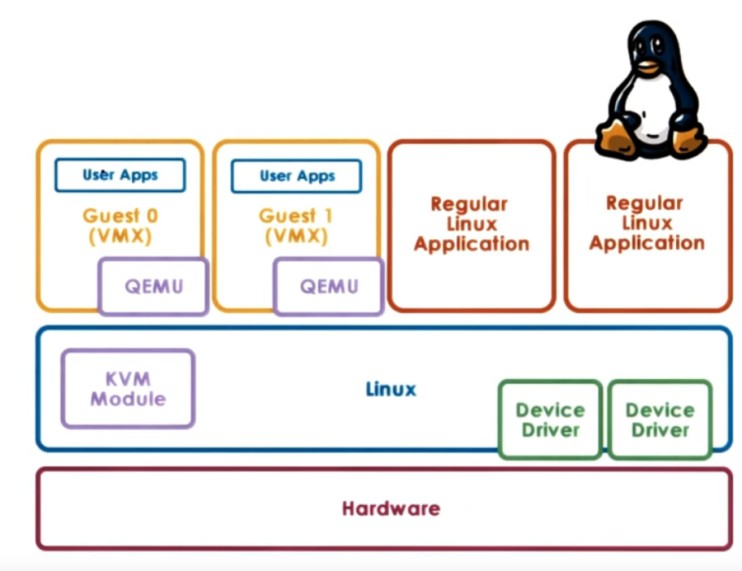
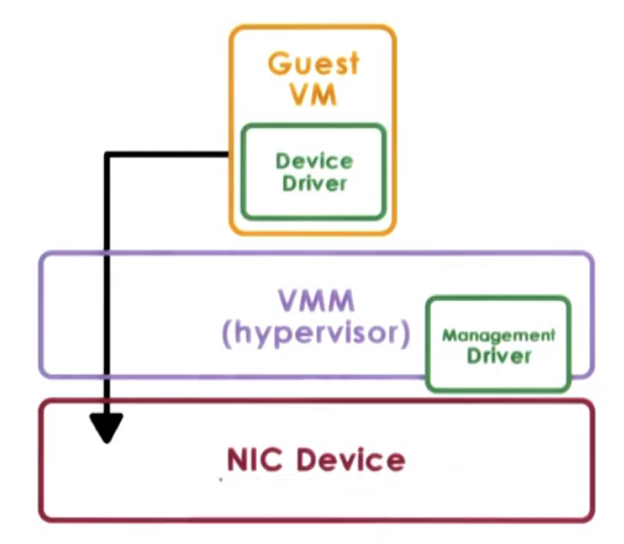
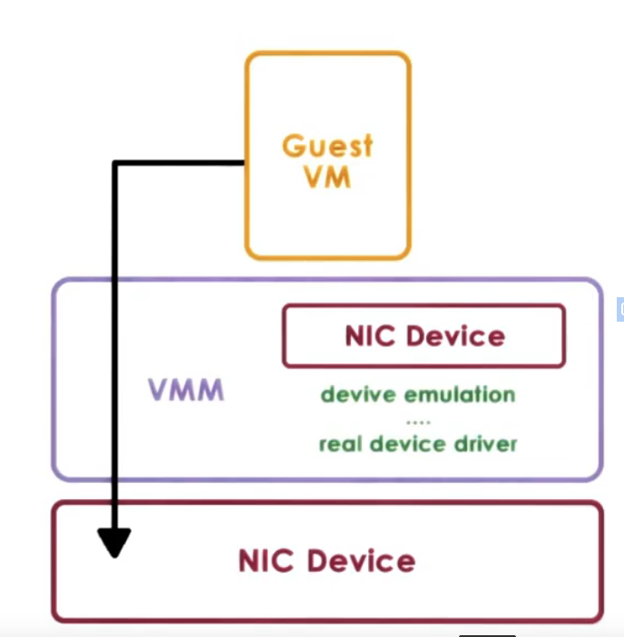
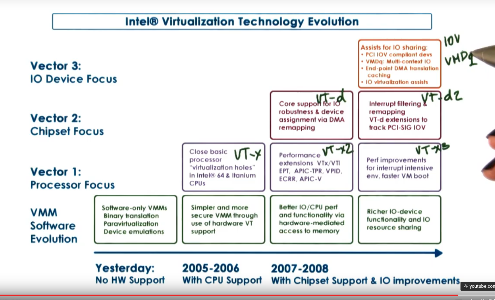

# P3L6 Virtualization

## 1. Lesson Preview

Virtualization

- Overview of virtualization
- Main technical approaches in popular virtualization solutions
- virtualization-related hardware advances

## 2. What is Virtualization

- virtualization allows concurrent execution of multiple OSs (and their application) on the same physical machine
- virtual resources == each OS thinks that it "owns" hardware resources
- virtual machine (VM) == OS + applications + virtual resources (guest domain)
- virtualization layer == management of physical hardware(virtual machine monitor, hypervisor)

## 3. Defining Virtualization

A virtual machine ... is an efficient, isolated duplicate of the real machine
supported by a virtual machine monitor(VMM):

1. fidelity == provides environment essentially identical with the original machine
2. performance == programs show at worst only minor decrease in speed
3. safety & isolation == VMM is complete control of system resource

## 4. Virtualization Technologies Quiz

Based on the classical definition of virtualization by Popek & Goldberg, which of the following do you think are virtualization technologies? check all that apply.

- Virtual box <==== only this
- JVM
- Virtual GameBoy

## 5. Benefits of Virtualization

Why do care about Virtualization?

- Consolidation
  - decrease cost, improve manageability
- Migration
  - availability, reliability
- security
- debugging
- support for legacy OSs

## 6. Benefits of Virtualization Quiz 1

If virtualization has been around since the 60's, why has it not been used ubiquitously since that time?

- virtualization was not efficient
- everyone used microsoft windows
- mainframes were not ubiquitous <==
- other hardware was cheap <==

## 7. Benefits of Virtualization Quiz 2

If virtualization was not widely adopted in the past, what changed? Why did we start to care about virtualization?

- servers were underutilized <==
- datacenters were becoming too large <==
- companies had to hire more system admins <==
- companies were paying high utility bills to run & cool servers <==

## 8. Virtualization Models Bare Meta

### Two Main Virtualization Bare Models

1. Bare-metal or Hypervisor-based (type2)
2. Hosted (type1)

### Bare-metal Virtualization

Bare-metal==hypervisor-based

- VMM(hypervisor) manages all hardware resources and supports execution of VMs
- privileged, service VM to deal with devices (and other configuration and management task)
- Xen(opensource or Citrix Xen Server)
  - dom0 (privileged VM) and domUS (Guest VM)
  - drivers in dom0
- ESX(VMware)
  - many open APIs
  - drivers in VMM
  - used to have Linux control core, now remote APIs

## 9. Hosted Virtualization

### Hosted

- host OS owns all hardware
- special VMM module provides hardware interface to VMs and deals with VM context switching
  

### Example: KVM (kernel-based VM)
- based on Linux
- KVM kernel module + QEMU for hardware virtualization
- leverages Linux open-source community

## 10. Bare Metal Or Hosted Quiz

Bare Metal

- VMware ESX
- Citrix XenServer
- microsoft Hpyer-V

Hosted
- KVM
- Fusion
- Virtual Box
- VMware Player

## 11. Virtualization Requirements Quiz

Which of the following do you think are virtualization requirements
全选
- present virtual platform interface to VMs <== virtualize CPU, memory, devices
- provide isolation access VMs <== preemption, MMU for addr translation & validation
- protect guest OS from apps <== cannot run guest OS & apps at same protection level
- Protect VMM from guest OS <== cannot run guest OS & apps at same protection level

## 12. Hardware Protection Levels

### commodity hardware has more than 2 protection levels

e.g., x86 has 4 protection levels(rings)

- ring 3: lowest privilege (apps)
- ring 0: highest privilege (OS)

A way to run virtualization is

- ring 3: apps
- ring 1: OS
- ring 0: hypervisor

### more recent
x86 has 4 protection levels(rings) and 2 protection modes(root & non-root)

- non- root: VMs
  - ring3: apps
  - ring 0: OS
- root:
  - ring 0: hypervisor

## 13. Processor Virtualization (Trap-and-Emulate)

Guest instructions ...

- executed directly by hardware
- for non-privileged operations: hardware speeds => efficiency
- for privileged operations: trap to hypervisor
- hypervisor determines what needs to be done:
  - if illegal op: terminate VM...
  - if legal op: emulate the behavior the guest OS was expecting from the hardware

## 14. Problems with Trap-and-Emulate

x86 Pre 2005

- 4 rings, no root/non-root modes yet
- hypervisor in ring0, guest OS in ring1
  - But: 17 privileged instructions do not trap! fail silently!
    - e.g, interrupt enable/disable bit in privileged register; `POPF`/`PUSHF` instructions that access it from ring1 fail silently
  - hypervisor doesn't know, so it doesn't try to change settings
  - OS doesn't know, so assume change was successful
    - guest VM could not request interrupts enabled
    - guest VM could not request interrupts disabled
    - guest VM could not find out what is the state of the interrupts enabled/disabled bit

## 16. Binary Translation
### Binary Translation

A solution is binary translation
- main idea: rewrite the VM binary to never issue thos 17 instructions
- Pioneered by Mendel Rosenblum's group at Stanford, commercialized as VMWare
  - Rosenblum awarded ACM Fellow for "reinventing virtualization"

Binary Translation: 
- goal: full virtualization == guest OS not modified
- approach: dynamic binary translation 
   - 动态而非静态转换, 是因为实际运行的时候可能依赖一些机器特定的变量
- Steps
  1. Inspect code blocks to be executed
  2. If needed, translate to alternate instruction sequence
      - e.g. to emulate desired behavior, possibly even avoiding trap
  3. Otherwise, run at hardware speeds

To speed up

- cache translated blocks to amortize translation cost
- only analysis kernel instructions and skip user instructions

## 17. Paravirtualization

goal: performance; give up on unmodified guests
approach: paravirtualization == modify guest OS
so that...

- it knows it's running virtualized
- it makes explicit calls to the hypervisor (hypercalls)
- hypercall (is similar to system calls)
  - package context info
  - specify desired hypercall
  - trap to VMM
- e.g., Xen == open source hypervisor (XenSource -> Citrix)

## 18. Binary Translation & Paravirtualization Quiz

which of the following do you think will cause a trap and exit to the hypervisor for both binary translation and paravirtualized VMs?

- access a page that's swapped <=
- update to page table entry

## 19. Memory Virtualization

Full virtualization

- all guests expect contiguous physical memory, starting at 0
- virtual vs physical vs machine addresses and page frame numbers
- still leverages hardware MMU,TLB

option1:

- guest page table: VA => PA
- hypervisor: PA => MA
- too expensive

option 2:

- guest page tables: VA => PA
- hypervisor shadow Page Table: VA => MA
- hypervisor maintain consistence
  - e.g. invalidate on context switch
  - write-protect guest Page table to track new mappings...

## 20. Memory Virtualization Paravirtualized

Paravirtualizaed

- guest aware of virtualization
- no longer strict requirement on contiguous physical memory starting at 0
- explicitly registers page tables with hypervisor
- can "batch" page table updates to reduce VM exits
- ... other optimization

Both Binary and Paravirtualized
=> overheads eliminated or reduced on new platforms

## 21. Device Virtualization

- For CPus and memory...
  - less diversity, ISA-level 'standardization' of interface
- For devices...
  - high diversity
  - lack of standard specification of device interface and behavior
- 3 key models for device virtualization

## 22. Passthrough Model

Approach: VMM-level driver configures device access permissions
- Pros:
  - VM provided with exclusive access to the device
  - VM can directly access the device (VMM- bypass)
- Cons:
  - device sharing difficult
  - VMM must have exact type of device as what VM expects
  - VM migration tricky
  

## 23. Hypervisor Direct Model

Approach: VMM intercepts all device access

- emulate device operation:
  - translate to generic I/O operation
  - traverse VMM-resident I/O stack
  - invoke VMM-resident driver
- Pros:
  - VM decoupled from physical
  - sharing, migration, dealing with device specifics
- Cons:
  - latency of device operations
  - device driver ecosystem complexities in hypervisor
  

## 24. Split Direct Model

Approach: device access control split between
- front-end driver in guest VM(device API)
- back-end driver in service VM(or host)
- modified guest driver
  - i.e., limited to paravirtualization guests

-Pros:
  - eliminate emulation overhead
  - allow for better management of shared devices

## 25. Hardware Virtualization

### Key Virtualization-Related Hardware Feature

-x86-

- AMD pacifica & Intel Vanderpool Technology (Intel-VT), ~ 2005
- 'close holes' in x86 ISA (17 instructions)
- modes: root/non-root (or 'host' and 'guest' mode)
- VM control structure
  - per VCPU; 'walked' by hardware
- extended page tables and tagged TLB with VM ids
- multiqueue devices and interrupt routing
- security and management support
- also: additional instructions to exercise the above features

## 26.Hardware Virtualization Quiz

With hardware support for virtualization, guest VMs can run unmodified and can have access to the underlying devices. Given this do you think the split-device driver model is still relevant?

A: Yes.
可以自己定义 how to share device, 而不是 depend on特定的硬件来share device

## 27. x86 VT Revolution

## 28. Lesson Summary

Virtualization

- Defined `virtualization` and explained main `virtualization` approaches
- Explained `mechanisms` for `processor`, `memory`, and `I/O` `virtualization` used in popular `virtualization`
- Explained evolution of `hardware-support` for `virtualization` in x86
