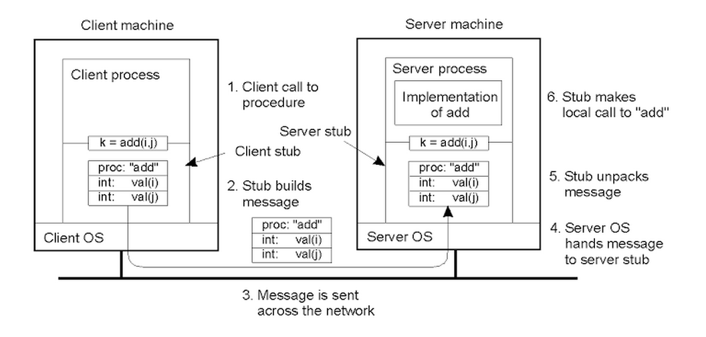
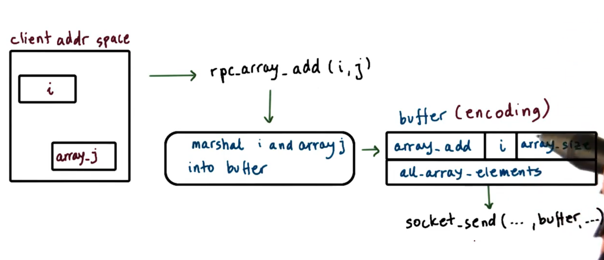
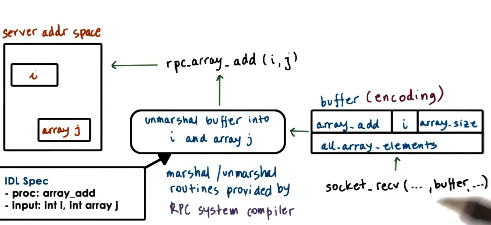
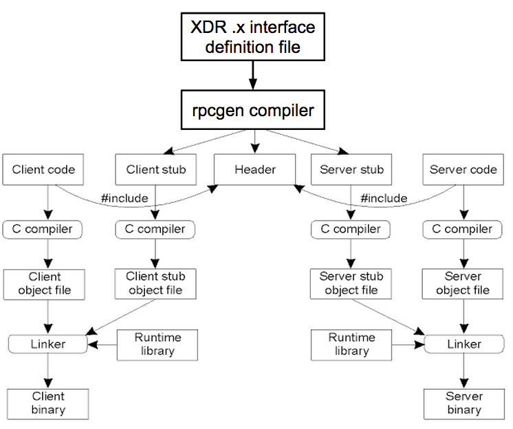

# P4L1: Remote Procedure Calls
## 1. Preview
- Remote Procedure calls
- "Implementing Remote Procedure Calls" by Birrell and Nelson

## 2. Why RPC?
Example 1: GetFile App
- client-server
- create and init sockets
- allocate and populate buffers
- include 'protocol' info 
  - GetFile, size, ...
- copy data into buffers
  - filename, file ...

Example 2: modifyImage App
- client-server
- create and init sockets
- allocate and populate buffers
- include 'protocol' info
  - algorithm, parameters
- copy data into buffers
  - image data

common steps related to remote IPC => Remote Procedure Calls(RPC)
## 3. Benefits of RPC
RPC == intended to simplify the development of cross-address space & cross-machine interactions
Benefits of RPC
- higher-level interface of data movement & communication
- error handling
- hiding complexities of cross-machine interactions

## 4. RPC Requirements
1. Client/Server Interactions
2. Procedure Call Interface => RPC
  - sync. call semantics
3. Type Checking
  - error handling
  - packet bytes interpretation
4. Cross-machine conversion
  - e.g., big/little endian
5. High-level Protocol
  - access control, fault tolerance...
  - different transport protocols


## 5. Structure of RPC



## 6. Steps in RPC
0. bind: client finds and "binds" to desired server
1. call: client makes RPC call; control passed to stub, client code blocks
2. marshal: client stub "marshals" arguments(serialize args into buffer)
3. send: client sends message to server
4. receive: server receives message; passed msg to server-stub; access control
5. unmarshal:server stub "unmarshals" args(extract args& creates data structs)
6. actual call: server stub calls local procedure implementions
7. result: server performs operation and computers result of RPC operation 
8. ... similar steps on return

## 7.Interface Definition Language
- What can the server do?
- What arguments are required for the various operations?
  - We need an agreement
- Why
  - client-side bind decision
  - runtime to automate stub generation

==> Interface Definition Language(IDL)


## 8. Specifying an IDL
An IDL used to describe the interface the server exports:
- procedure name, arg & result types
- version #

RPC can use IDL that is:
- language-agnostic
  - XDR in SunRPC
- language-specific
  - Java in Java RMI

JEST INTERFACE! NOT IMPLEMENTATION!

## 9. Marshalling
array


## 10. Unmarshalling


## 11. Binding and Registry
client determines...
- which server should it connect to? 
  - service name, version number ...
- How will it connect to server?  
  - IP address, network protocol, ...

### Binding and Registry
Registry == database of available services
- search for service name to find service (which) and contact details(how)
- distributed
  - any RPC service can register
- machine-specific
  - for services running on same machine
  - clients must know machine address
    - registry provides port number needed for connection
- needs naming protocol
  - exact match for `add`
  - or consider `sum`, `summation`, `addition`


## 12. Visual metaphor
Applications use binding & Registries
Toy shops use directories of outsourcing services
- who can provide a service?
  - e.g., shops to outsource assembly
- what services do they provide?
  - that will create train carts
- How will they ship/package?
  - that will ship via ups

Operating System
- who can provide a service?
  - look up registry for image processing
- what services do they provide?
  - compress, filter... version# ... -> IDL
- How will they ship/package?
  - TCP / UDP -> registry

## 13. Pointers in RPCs
### what about Pointers?
``` 
procedure interface: foo(int, int*) 
in local calls: foo(x,y) => ok
in remote calls: foo(x,y) => ??? y points to location in caller address space
```
Solutions:
- no pointers!
- serialize pointers
  - copy referenced("pointed to") data structure to send buffer

## 14. Handling Partial Failures
when a client hangs .... what's the problem?
- server down? service down? network down? message lost?
- timeout and retry => no guarantees the problem will be solved

=> special RPC error notification (signal, exception...)
catch all possible ways in which the RPC call can fail or partially fail

## 15. RPC Failures QUIZ
Assume an RPC call fails and return a timeout message. Given this timeout message, what is the reason for the RPC failure?

client packet lost
server packet lost
network link down
server machine down
server process failed
server process overloaded
all of the above
any of the above <==

## 16. RPC Design Choice Summary
- Binding 
  - how to find the server
- IDL 
  - how to talk to the server
  - how to package the data
- Pointers as arguments
  -  disallow or serialize pointed data or serialize pointed data
- Partial failure
  - special error notifications

design decisions for RPC systems
e.g., Sun RPC, Java RMI

## 17. What is Sun RPC?
- developed in 80s by Sun for UNIX;
- now widely available on other platforms

Design Choices
- Binding => per-machine registry daemon
- IDL => XDR (for interface specification and for encoding)
- Pointers => allowed and serialized
- Failures => retries; return as much information as possible

## 18. SunRPC Overview
- client-server via procedure calls
- interface specified via XDR (.x file)
- rpcgen compiler => converts x to language-specific stubs
- registry(per-machine)
  - name of service, version, protocols, port number...
- binding creates handle
  - client uses handler in calss
  - RPC runtime uses handle to track per-client RPC state
- client and server on same or different machines

### Documentation, tutorials and examples now maintained by Oracle
- TI-RPC == Transport-independent SunRPC
- provides SunRPC/XDR documentation and code examples
- older online reference still relevant
- Linux man pages for "rpc"

[Sun RPC Documents (maintained by Oracle)](https://docs.oracle.com/cd/E19683-01/816-1435/index.html)

## 19.SunRPC XDR Example
client => send x
server => return x^2

XDR (.x file) describes:
- datatypes
- procedures(name, version, ...)
- service ID

### Service ID = Conventions
- 0x0000 0000 - 0x1fff ffff == defined by Sun
- 0x2000 0000 - 0x3fff ffff == range to use
- 0x3000 0000 - 0x5fff ffff == transient
- 0x4000 0000 - 0xffff ffff == reserved

```
struct square_in {
  int arg1;
}

struct square_out {
  int res;
}

program SQUARE_PROG { /* RPC service name */
  version SQUARE_VERS {
    square_out SQUARE_PROC(square_in) = 1; /* proc1*/
  } = 1; /* version1 */
} = 0x31230000; /* service id*/
```

## 20. Compiling XDR
rpcgen compiler
``` shell
rpcgen -c square.x
```
- `square.h` => data types and function definitions
- `square_svc.c` => server stub and skeleton(main)
  - `main` => registration/housekeeping
  - `square_prog_1`
    - internal code, request parsing, arg marshalling
    - _1 == version 1
  - `square_prog_1_svc` => actual procedure must be implemented by developer
- `square_clnt.c` => client stub
  - `squareproc_1` wrapper for RPC call to `square_proc_1_svc`
  - call this function `y = squareproc_1(&x..)`
- `square_xdr.c` => common marshalling routines


## 21. Summarizing XDR Compilation


from `.x` => header, stubs...
- Developer
  - sever code
    - implementation of `square_proc_1_svc`
  - client side
    - call `square_proc_1_svc`
  - both side `#include square.h`
  - link with stub objects
- RPC runtime -- the rest
  - OS interactions, communication management

`rpcgen -c square.x`  => not thread safe!
y = squareproc_1(&x, client_handle)

`rpcgen -c -m square.x`  => multi-threading safe!
status = squareproc_1(&x, &y, client_handle) 签名改变动态分配内存给y

- `-m` doesn't make a multi-threaded "_svc.c" server
  - on solaris `-a` => multi-threaded server
  - on Linux has to be done manually

## 22. Square.x Return Type QUIZ


```
struct square_in {
 int arg1;
};
struct square_out {
 int res1;
};

program SQUARE_PROG { /* RPC service name */
  version SQUARE_VERS {
    square_out SQUARE_PROC(square_in) = 1; /* proc1 */
  } = 1; /* version1 */
} = 0x31230000; /* service id */
```

What is the return type of squareproc_1 if this square.x file is compiled with:


rpcgen square.x -C          ==> square_out*
rpcgen square.x -C -M       ==> enum clnt_stat

## 23. SunRPC Registry
- RPC daemon == portmapper (server and client)
  - `/sbin/portmap` (need sudo privileges)
- Query
  - `/usr/sbin/rpcinfo -p`
  - program id, version, protocol(tcp,udp), socket port number, service name...
  - portmapper runs with tcp and udp on port 111

## 24. SunRPC Binding
```
CLIENT* clnt_handle;
clnt_handle = clnt_create(rpc_host_name, SQUARE_PROG, SQUARE_
VERS, "tcp")
```

return type is `CLIENT` type
- client handle
- status, error, authentication ...

## XDR Data Types
Default Types
- char, byte, int, float ...
Additional XDR types
- const (#define)
- hyper(64-bit integer)
- quadruple (128-bit integer)
- opaque(similar to c byte type)
  - uninterpreted binary data


Fixed-length array
- e.g., int data[80]


Variable-length variable
- e.g., int data<80> 
- translates into a data structure with "len" and "val" fields
- except for string
  - string line <80> => c pointer to char
  - stored in memory as a normal null-terminated string
  - encoded (for transmission) as a pair of length and data


## 26. XDR Data Types Quiz
`int data<5>;` 
Assume the array is full, How many bytes are needed to represent this 5 element array in a c client on a 32-bit machine

Answer: 28 bytes
int len -> 4B 
int * val -> 4B
int * 5 elem -> 4B * 5

## 27. XDR Routines
- marshalling/unmarshalling
  - found in `square_xdr.c`
- clean-up
  - `xdr_free()`
  - user_defined `_freeresult_procedure`
  - e.g., `square_prog_1_freeresult`
  - called after result returned

## 28. Encoding
### What goes on the Wire?

- RPC header
  - service procedure ID, Version number, request ID ...
- Actual data
  - arguments or results
  - encoded into a bytestream depending on data type
- Transport header
  - e.g. TCP, UDP

## 29. XDR Encoding
XDR == IDL + the encoding
  - i.e., the binary representation of data "on-the-wire"

XDR Encoding Rules
  - all data types are encoded in multiples of 4 bytes
  - big endian is the transmission standard
  - two's complement is used for integers
  - IEEE format is used for floating point

An Example
```
string data<10> 
data = "Hello"
```
in a c client/server this takes 6 bytes
'H,e,l,l,o,\'

in transmission buffer this takes 12 bytes
- 4 bytes for the length 
- 5 bytes for the characters (will not transmitting the terminate character)
- 3 bytes for the padding


## 30. XDR Encoding Quiz
`int data<5>;` 
Assume the array is full, How many bytes are needed to encode this 5 element array to be sent from client to server(32-bit)?
(Do not include bytes for headers/protocol!)

A: 24 bytes
4 for leng + 5*4 for data

## 31. Java RMI
### Java Remote Method Invocations - RMI
- among address spaces in JVM(s)
- matches Java OO semantics
- IDL == Java(language-specific)
- RMI Runtime
  - Remote Reference Layer
    - unicast, broadcast, return-first response, return-if-all-match
  - Transport
    - TCP, UDP, shared memory ...

[Java RMI Tutorials](https://docs.oracle.com/javase/tutorial/rmi/)

## 32. Lesson Summary
RPC
- Remote Procedure Calls
- Mechanisms: IDL, service registration, binding, data marshalling, ...