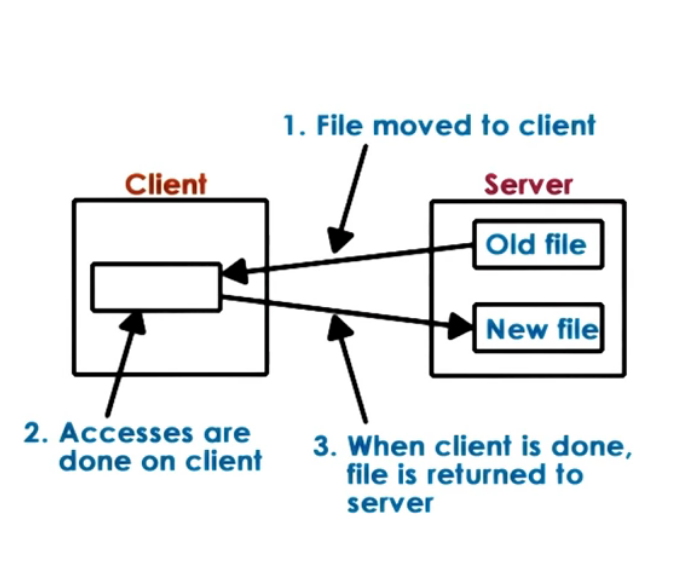
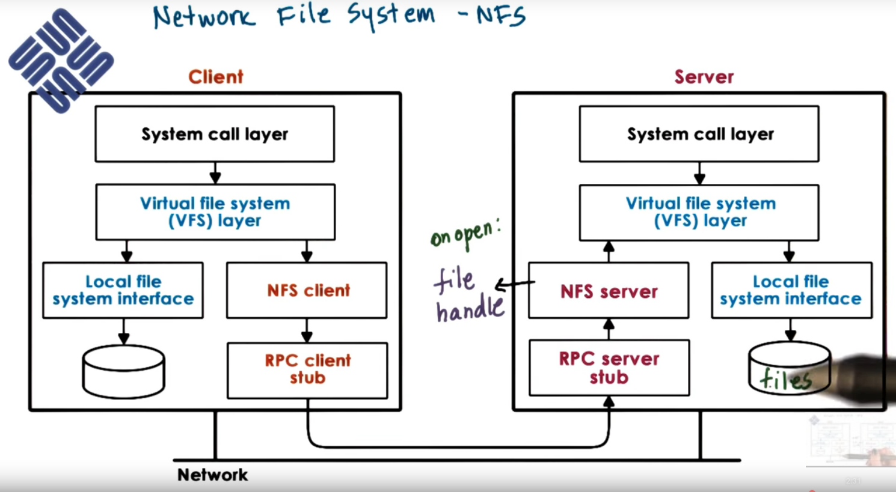
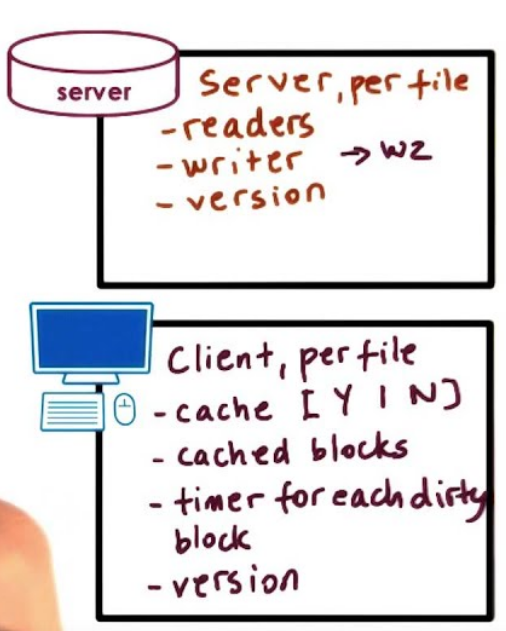

# P4L2: Distributed File Systems
## 1. Lesson Preview
Distributed File System
- DFS design and implementation
- Networked File System (NFS)
- "Caching in the Sprite Network File System" by Nelson et al.

[Caching in the Sprite Network File System](https://s3.amazonaws.com/content.udacity-data.com/courses/ud923/references/ud923-nelson-paper.pdf)

## 2. Visual Metaphor
Distributed file systems are like distributed storage facilities

Toy Shop
- Accessed via well-defined interface
  - boss looks at storage reports
- Focus on consistent state
  - correctly determine inventory
- Mixed distribution models possible
  - storage-only, storage and processing, toy-specific

Distributed File System
- Accessed via well-defined interface
  - access via VFS
- Focus on consistent state
  - tracking state, file updates, cache coherence ...
- Mixed distribution models possible
  - replicated vs partitioned, peer-like system ...

## 3. Distributed File System

## 4. DFS Models
- client/server on different machines <== this chapter focus
- file server distributed on multiple machines
  - replicated (each server: all files)
  - partitioned (each server: part of files)
  - both (files partitioned, each partition replicated)
- files stored on and served from all machines(peers) 
  - blurred distinction between clients and servers

## 5. Remote File Service: Extremes
- Extreme 1 : Upload/Download
  - like FTP, SVN
  - 
  - Pros:
    - local reads/writes at client
  - Cons: 
    - entire file download/upload even for small access
    - server gives up control (makes some operations related to sharing filing difficult)
- Extreme 2: True Remote File Access
  - 
  - every access to remote file, nothing done locally
  - Pros:
    - file accesses centralized, easy to reason about consistency
  - Cons: 
    - every file operation pays network cost
    - limits server scalability

## 6. Remote File Service A Compromise
A more Practical Remote File Access (with Caching)
1. Allow clients to store parts of files locally (blocks)
   - Pros
     - low latency on file operations 
     - server load reduced => is more scalable
2. Force clients to interact with server(frequently)
  - Pros
     - server has insights into what clients are doing
     - server has control into which accesses can be permitted => easier to maintain consistency
  - Cons
    - server more complex, requires different file sharing semantics

## 7. Stateless vs. Stateful File Server
Stateless == keeps no state
OK with extreme models; but cannot support 'practical' model
- Cons:
  - cannot support caching and consistency management
  - every request self-contained => more bits transferred
- Pros:
  - no resources are used on server side (CPU/Memory)
  - no failure, just restart

Stateful == keeps client state
needed for 'practical' model to track what is cached/accessed

- Pros:
  - can support locking, caching, incremental operations
- Cons:
  - on failure ... need checkpointing and recovery mechanisms
  - overheads to maintain state and consistency
    - depends on caching mechanism and consistency protocol 

## 8. Caching State in a DFS (optimization) 
- locally clients maintain portion of state (e.g. file blocks)
- locally clients perform operations on cached state (e.g. open/read/write ...)
- requires coherence mechanisms
- Like cache coherence in SMP

- SMP:
  - HOW: write-update/write-invalidate
  - WHEN: on write
- DFS:
  - HOW: client/server-driven
  - WHEN: on demand, periodically, on open...

details depend on file sharing semantics

## 9. File Sharing Quiz
Where do you think files or files blocks can be cached in a DFS with a single file server and many clients?
- in client memory
- on client storage device(HDD/SSD)
- in buffer cache in memory on server
  - (usefulness will depend on load, request interleaving) 

## 10. File Sharing Semantic on a DFS
- UNIX semantics => every write visible immediately
- Session semantics
  - between open-close => session
  - write-back on `close()`, update on `open()`
  - easy to reason, but may be insufficient
- Periodic Updates
  - client writes-back periodically => clients have a "lease" on cached data (not exclusive necessarily)
  - server invalidates periodically => provides bounds on "inconsistency"
  - augment with `flush()`/`sync()` API
- Immutable files => never modify, instead new files created (like Photo sharing)
- Transactions => all changes atomic

## 11. DFS Data Structure QUIZ
Image a DFS where file sharing implemented via a server-driven mechanism and with session-semantics. Given this design, which of the following items should be part of the per file data structures maintained by the server?
- readers <==
- current writer
- current writers <==
- version number <==

## 12. File vs Directory Service
### Knowing the Access Patterns
Too many options?
- sharing frequency
- write frequency
- importance of consistent view
  
=> optimize for common case

### File vs Directories
Two types of files:
- regular files vs directories
=> choose different policies for each

eg1. session-semantics for files,
  UNIX for directories

eg2. less frequent write-back for files than directories

## 13. Replication vs Partitioning
Replication 
- each machine hold all files
- Pros:
  - loading balancing, availability, fault tolerance
- Cons:  
  - writes become more complex
    - synchronously to all
    - or, write to one, then propagated to others
  - replicas must be reconciled
    - e.g. voting

Partitioning
- each machine has subset of files
- Pros:
  - availability vs single server DFS
  - scalability with file system size
  - single file writes simpler
- Cons:
  - on failure, lost portion of data
  - load balancing harder; if not balanced, then hot-spots possible

Can combine both techniques - replicate each partition!

## 14. Replication vs Partitioning Quiz
Consider server machines that hold 100 files each. Using three such machines, a DFS can be configured using replication or partitioning. 
1. How many total files can be stored in replicated vs the partitioned DFS?  
Replicated DFS: 100 files   
Partitioned DFS: 300 files  
2. What percentage of the total files will be lost if one machine fails in the replicated vs partitioned DFS?   
Replicated DFS: 0%
Partitioned DFS: 33%

## 15. Network file system - NFS

## 16. NFS File Handle Quiz:

In the previous morsel, we mentioned that a file handle can become "stale". What does it means?
- the file is outdated
- the remote server is not responding?
- the file on the remote server has been removed? <=
- the file has been open for too long?

## 17. NFS Versions
- since 80s ... currently NFSv3 and NFSv4
- NFSv3 == stateless , NFSv4 == stateful

caching
- session-based (non-concurrent)
- periodic updates
  - default: 3 sec for files; 30 sec for dir
- NFSv4 => delegation to client for a period time (avoids 'update checks')

locking
- lease-based
- NFSv4 => also "share reservation" - reader/writer lock

## 18. NFS Cache Consistency Quiz
Which of the following sharing semantics are supported by NFS and its cache consistency mechanisms?
- UNIX
- Session
- periodic
- immutable
- neither <= Session & Periodic

## 19. Sprite Distributed File System
"Caching in the Sprite Network File System", by Nelson et al.
- research DFS
- great value in the explanation of the design process

=> used trace data on usage/file access patterns to analyze DFS design requirements and justify decisions

## 20. Sprite DFS Access Pattern Analysis
- 33% of files accessed are writes
- 75% of files are open less than 0.5 sec
- 90% of files are open less than 10 sec
- 20-30% of new data deleted within 30 sec
- 50% of new data deleted within 5 minutes
- file sharing is rare!

Therefore
- caching OK; but write-through not sufficient
- session semantics still too high overhead
- write-back on close not really necessary
- no need to optimize for concurrent access, but most support it

## 21. Sprite DFS From Analysis to Design
Design
- Cache with write-back
  - every 30 second write-back blocks that have not been modified for the last 30 sec
  - when another client opens file => get dirty blocks
- open goes to server; directories not cached
- on "concurrent write" => disable caching

Sprite sharing semantics
- sequential write sharing == caching and sequential semantics
- concurrent write sharing == no caching

## 22. File Access Operations in Sprite
R1 .... Rn readers, W1 writer
- all `open()` go through server
- all clients cache blocks
- writer keeps timestamps for each modified block

... W2 sequential write (Sequential sharing)
- server contacts last writer for dirty blocks
- if W1 has closed update version
- W2 can now cache file

... W3 concurrent write (concurrent sharing)
- server contacts last writer for dirty blocks
- since W2 hasn't closed => disable caching!

## 23. Lesson Summary
- DFS
  - caching, optimizing performance, and managing sharing semantics

- DFS Examples
  - NFS
  - Sprite (design rationale)