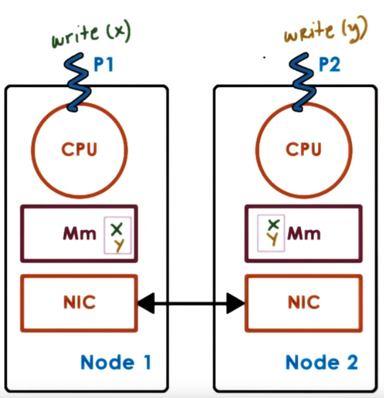
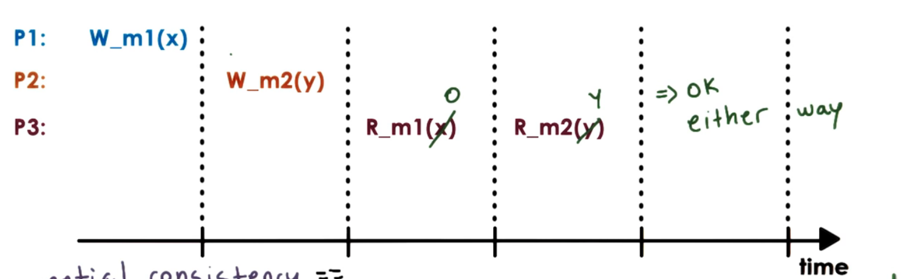
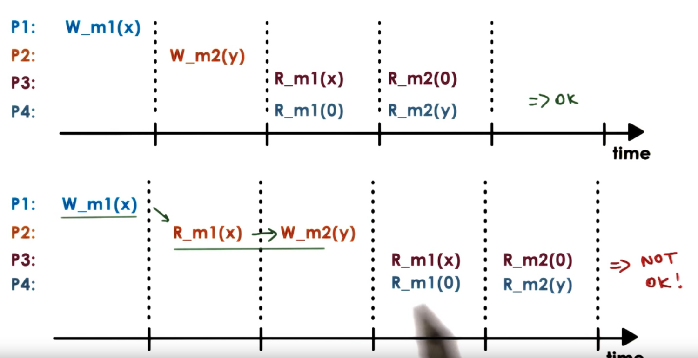
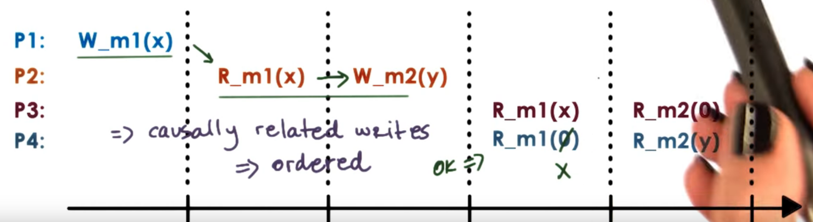
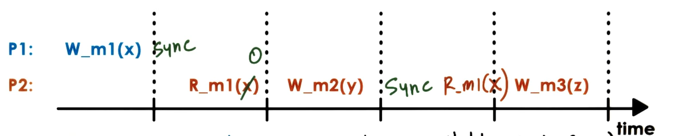
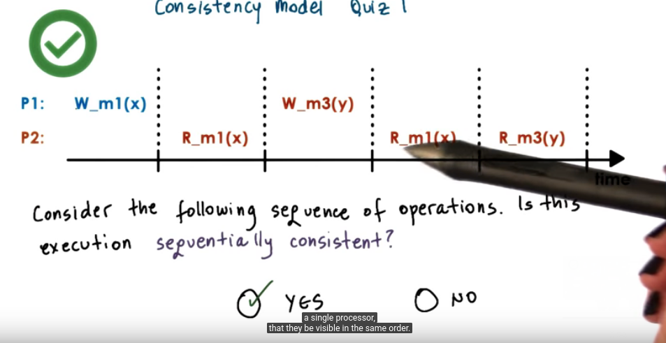
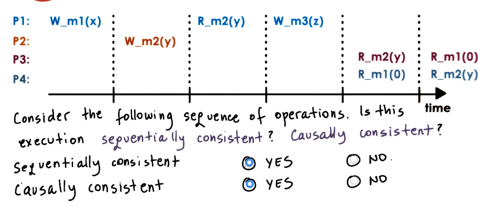

# P4L3: Distributed Shared Memory
虽然讨论的是内存,也适用于其他分布式共享state的系统
## 1. Preview
Distributed Shared Memory
- DSM
- Distributed state management and design alternatives
- consistency model

## 2. Visual Metaphor
"Managing distributed shared memory is like managing tools/parts across all workspaces in a toy shop"

Toy Shop
- must decide placement
  - place resources close to relevant workers
- must decide migration
  - move resources as soon as possible to relevant works
- must decide sharing rule
  - how long can resources be kept? when are they ready? how to store?

Distributed Memory
- must decide placement
  - place memory (pages) close to relevant processes
- must decide migration
  - when to copy memory(pages) from remote to local
- must decide sharing rule
  - how long can resources be kept? when are they ready? how to store?
  - ensure memory operations are properly order

## 3. Reviewing DFS
Clients
- send requests to files service

Caching
- improve performance (seen by clients) and scalability (supported by servers)

Servers
- own and manage state (files)
- provide service (file access)

## 4. "Peer" Distributed Applications
Each node
- "owns" state
- provides service

### all nodes are "peers"

Examples: bit data analytics, web searches, content sharing, or distributed shared memory(DSM)

这里 "Peer" 打引号是因为
- May have some control & management nodes
- in a real "peer-to-peer" system even overall control & management done by all)

## 5. Distributed Shared Memory(DSM)
Each node
- "owns" state => memory
- provides service
  - memory reads/writes from any node
  - consistency protocols
- permits scaling beyond single machine memory limits
  - more "shared" memory at lower cost
  - slower overall memory access
  - commodity interconnect technologies support this([RDMA](https://en.wikipedia.org/wiki/Remote_direct_memory_access))

## 6. Hardware vs Software DSM
- Hardware-supported
  - relies on interconnect
  - OS manages large physical memory
  - NICs translate remote memory accesses to message
  - NICs involved in all aspects of memory management, support atomics
- Software-supported
  - everything done by software
  - OS, or language runtime

## 7. Implementing DSM Quiz
According to the paper [Distributed Shared Memory: Concepts and Systems](https://s3.amazonaws.com/content.udacity-data.com/courses/ud923/references/ud923-protic-paper.pdf)
, what is a common task that's implemented in software in hybrid (hardware + software) DSM Implementations
- prefetch pages
- address translation <=
- triggering invalidation

Hint: Start reading at heading (page 76 of paper)

## 8 DSM Design: Sharing Granularity
- ~~cache line granularity?~~ <= overheads too high for DSM 
- ~~variable granularity~~  <= still hight overheads
- page granularity  <= (OS-level)
- object granularity <= (language runtime)

=> beware of false sharing
e.g, x and y are on same page (一个只访问x,一个只访问y,但在一个page上,需要不停同步)

## 9. DSM Design Access Algorithm
What types of Applications use DSM?
Application access algorithm
- single reader/ single writer (SRSW)
- multiple readers/ single writer (MRSW)
- multiple readers/multiple writers (MRMW)

## 10. Performance Consideration
DSM performance metric == access latency
Achieving low latency through ...

- Migration
  - make sense for SRSW
  - requires data movement
- Replication (Cache)
  - more general
  - requires consistency management

## 11. DSM performance Quiz
If access latency (performance) is a primary concern, which of the following techniques would be best to use in your DSM design?

- migration  不对 ==> OK for SRSW, but not in all cases
- caching     对      <---+  
- replication 对      <---+ for many "concurrent" writes overheads may be too high! 

## 12. DSM Design: Consistency management
DSM is similar to shared memory in SMPs

in SMP
- write-invalidate
- write-update

in DSM
- coherence operations triggered on each write => overhead too high

- Push invalidation when data is written to
  - proactive
  - eager
  - pessimistic
- Pull modification info periodically
  - on-demand(reactive)
  - lazy
  - optimistic
- when these methods get triggered depends on the consistency model for the shared state!

## 13. DSM Architecture (page-based, OS-supported)

page-based DSM architecture
- each node contributes of memory pages to DSM
  - distributed nodes, each with own local memory contribution
  - pool of pages from all nodes
  - each page has ID, page frame number 
  - The node where the page is located referred to as "home node" of the page
- need local caches for performance (latency)
- all nodes responsible for part of distributed memory 
  - if MRMW
    - need local caches for performance (latency)
    - home (or manager) node drives coherence operations
    - all nodes responsible for part of distributed memory (state) management
- home node manages accesses and tracks page ownership
  - keeps state: pages accessed, modificiations, caching enabled/disabled, locked
  - current "owner" (owner may not equal home node)
  - owner负责维护状态,home负责track 谁是owner
- Explicit replicas
    - for load balancing performance, or reliability
    - "home"/manager node controls management

## 14. Summarizing DSM Architecture
- each node contributes part of mm pages of DSM
- need local caches for performance (latency)
- all nodes responsible for part of distributed memory
- home node manages accesses and tracks page ownership
- explicit replication possible for load balancing, performance or reliability

## 15. Indexing Distributed State
### DSM metadata
  - Each page(object) has ...
    - address == node ID + page frame number
    - node ID == "home" node
  - Global map (replicated)
    - object (page) id => manager node id
    - manager map available on each node!
  - metadata for local pages (partitioned)
    - per-page metadata is distributed across manager

基本上就是通过node ID找到manager在读取page的metadata

上面是 fixed manager的办法, 如果要dynamic
- Global managing table 
  - object id => index into mapping table => manager node

## 16. Implementing DSM
Problem: DSM must "intercept" accesses to DSM state
- to send remote message requesting access
- to trigger coherence messages

=> overheads should be avoided for local, non-shared state (pages)

=> dynamically "engage" and "disengage" DSM when necessary

Solution: Use Hardware MMU support!
- trap in OS if mapping invalid or access not permitted
- remote address mapping => trap and pass to DSM to send msg
- cached content => trap and pass to DSM to perform necessary coherence operations (修改被别人cache的值,会出trap)
- Other MMU information useful (e.g, dirty page) 

## 17. What is a Consistency Model?
Consistency Model 
- agreement between memory(state) and upper software layers
- "memory behaves correctly if and only if software follows specific rules"
  - memory(state) guarantees to behave correctly
    - access ordering
    - propagation/ visibility of updates

## 18. Strict Consistency
Strict consistency == updates visible everywhere immediately, and the order is guaranteed

in practice
- even on single SMP no guarantees on order without extra locking and synchronization
- in distributed systems, latency & message reorder/loss make this even harder... => impossible to guarantee

## 19. Sequential Consistency
- memory updates from different processors may be arbitrarily interleaved
- All processes will see the same interleaving
- operations fro same process always appear in order they were issued

多线程可能出现的任意顺序都ok,但是大家必须保持一致
## 20. Causal Consistency

P2 上x y有前后顺序,所以其他Process 也要看到这个顺序

Causal Consistency
- "concurrent" writes 
  - no guarantees
- causally related writes
  - ordered

## 21. Weak Consistency

引入sync, P1, P2 都要sync
第一个R_m1(x),P2因为没有sync,所以可能读到0

Synchronization point == operations that available(R,W,Sync)
- all updates prior to a sync point will be visible
- no guarantee what happens in between

variation
- single sync operation(sync)
- separate sync per subset of state(page)
- separate "entry/acquire" vs "exit/release" operations

Pros:
- limit data movement & coherence operations
- maintain extra state for additional operations

## 22 - 26 Quiz

## 27. Lesson Summary
Distributed Shared Memory
- DSM systems
- DSM design tradeoffs
  - coherence mechanisms
- Consistency models
