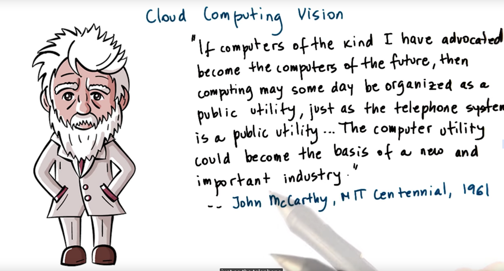
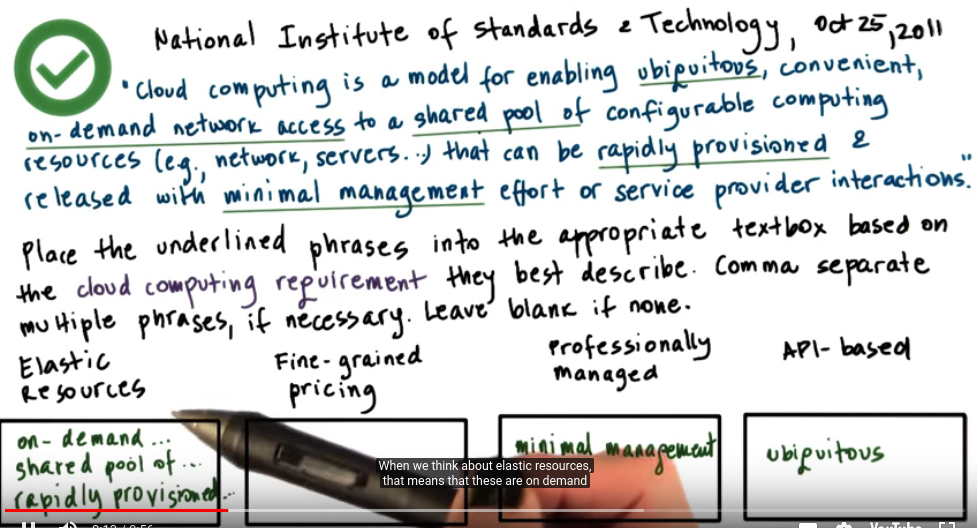
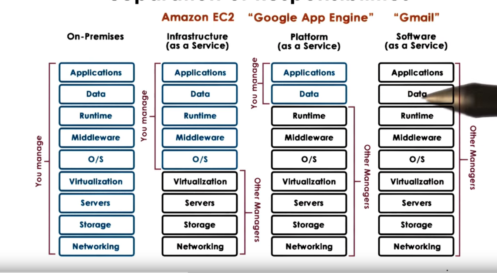
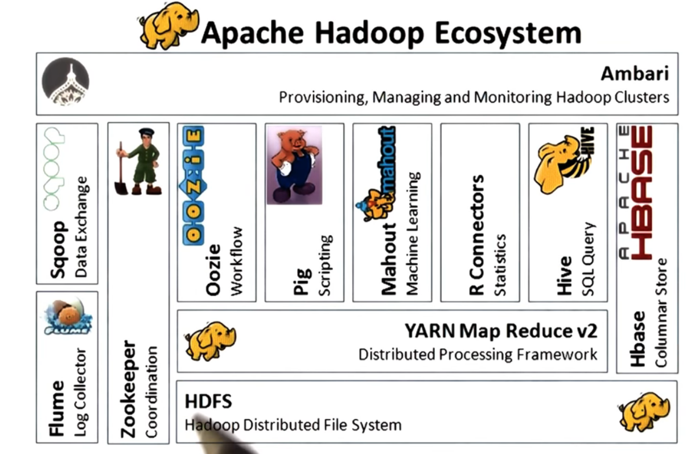
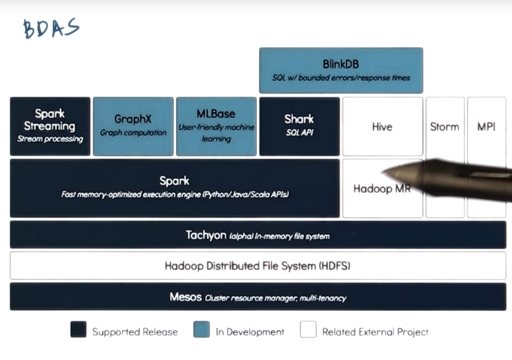

# P4L4: Datacenter Technologies

## 1. Lesson Preview
- Brief and high-level overview of challenges and technologies facing data centers
- Goal: Provide context for mechanism from previous lessons
- Multi-tier architectures for Internet services
- Cloud Computing
- Cloud and "big-data" technologies

## 2. Data Center Quiz
~ 510,000 datacenter in 2011
~285.5 million square feet is required to house all of the world's dataceneters in 2011

## 3. Internet Services
Internet Services == any type of service provided via web interface
- multi-tier architecture
    - ties
        - presentation == static content
        - business logic == dynamic content
        - database tier == data store
    - not necessarily separate processes on separate machines
    - many available open source and proprietary technologies
    - middleware == supporting, integrative or value-added software technologies
- in multi process configurations
 - some form of IPC used, including, RPC/RMI, shared memory

 ## 4. Internet Services Architecture

 For scale: multi-process, multi-node => "scale out" architecture
    1. "Boss-worker": front-end distributes request to nodes
    2. "All Equal": all nodes executes any possible step in request processing for any request (functionally homogeneous)
    3. "Specialized Nodes": nodes executes some specific steps in request processing for some requests (functionally heterogeneous)

## 5. “Homogeneous” Architectures

Functionally homogeneous, each node
- can do any process step
- Pro
    - keeps front-end simple
    - doesn't mean that each node has all data; just each node can get to all data
- Cons:
    - how to benefit from caching?

## 6. functionally heterogeneous

Functionally heterogeneous, 
- different nodes, different tasks/requests
- data doesn't have to be uniformly accessible everywhere
- Pro
    - benefit from locality and caching
- Cons:
    - more complex front-end
    - more complex management

## 7. Homogeneous Design Quiz

Consider a toy shop where every work knows how to build any toy (homogeneous architectures), if higher order rates start arriving, you can keep the homogeneous architectures balanced by 
- add more workers(processes)
- add more workbenches(servers)
- add more tool,parts...(storage)

bottom line => simple management(still takes time to do this)

## 8. Homogeneous Design Quiz

Consider a toy shop where every work knows how to build some specifies toys (heterogeneous architectures), if higher order rates start arriving, you can keep the heterogeneous architectures balanced by 
- profile what kinds of toys are in demand
- profile what kinds of resources & expertise those require
- add more of the appropriate type of workers, workbenches, and parts

bottom line => much more complex management

## 9. Scale Out Limitations Quiz
Consider a toy shop where every work knows how to build any toy (homogeneous architectures), if higher order rates start arriving, so the manager keeps "scaling out": add workers, workbenches, and parts...
This works until...
- can no longer manage all of the resources
- can no longer fit more stuff, and staff, in the toy shop
- cannot find shops to outsource to (only trusts own workers)

## 10. Cloud Computing Poster Child: Animoto
Amazon:
- provisioned hardware resources for holiday sale season
- resources idle the rest of the year
- "opened" access to its resources via web-based APIs
- third party workloads on Amazon hardware, for a fee.

Animoto rented "compute instances" in EC2
- In April 2008 became available to Facebook Users:
- Monday 50 -> Friday 3400 machines!
- 150,000 new users in 3 days
- Cannot achieve this with traditional in-house machine deployment and provisioning tools

## 11. Cloud Computing Requirements
- Tradition Approach:
    - buy and configure resources
        - determine capacity based on expected demand (peak)
    - when demands exceeds capacity
        - Cons:
            - dropped requests
            - lost opportunity
- Ideal Cloud:
    - Pros:
        - capacity scales elastically with demands
        - scaling in instantaneous, both up and down
        - cost is proportional to demand to revenue opportunity
        - all of this happens automatically, no need for hacking wizardry
        - can access anytime, anywhere
    - Cons:
        - Don't "own" resources

Summarized
- on-demand, elastic resources and services
- Fine-grained pricing based on usage
- Professionally managed and hosted
- API-based access

## 12. Cloud Computing Overview
- Shared resources
    - infrastructure and software/services
- APIs for access & configuration
    - web-based, libraries, command line ...
- billing/accounting services
    - many models: spot, reservation, ... entire marketplace
    - typically discrete quantities: tiny, medium, x-large
- managed by (cloud) provider

## 13. Why Does Cloud Computing Work 
- Law of Large Numbers
    - per customer there is large variation in resource needs
    - average across many customers is roughly constant
- Economies of Scale
    - unit cost of providing resources or service drops at "bulk"

## 14. Cloud Computing Vision

- computing == fungible utility!
- limitations exist: API lock-in, hardware dependence, latency, privacy, security

## 15. Cloud Computing Definitions Quiz

## 16. Cloud Deployment Models
- Public
    - third party customers/tenants
- Privates
    - leverage technology internally
- Hybrid (public + private)
    - failover, dealing with spikes, testing 
- Community
    - used by certain type of users

## 17. Cloud Service Models

## 18. Requirements for the Cloud
1. "fungible" resources
2. elastic, dynamic resource allocation methods.
3. scale: management at scale, scalable resource allocations
4. dealing with failures
5. multi-tenancy: performance & isolation
6. security

## 19. Cloud Failure Probability Quiz
A hypothetical cloud has N = 10 components(CPUs). Each has failure probability of p = 0.03, What is the probability that there will be a failure somewhere in the system?

N = 10 => 26%
N = 100 => 95%

## 20. Cloud Enabling Technologies
- Virtualization 
- Resource provisioning(scheduling)
    - mesos, yarn ...
- Big Data processing 
    - Hadoop mapReduce, Spark...
    - storage 
        - Distributed FS ("append only")
        - NoSQL, distributed in-memory caches
- Software-defined ... networking, storage, datacenters 
- monitoring => realtime log processing(Flume,  cloudWatch, Log Insight)

## 21. The Cloud as a Big Data Engine
- data storage layer
- data processing layer
- caching layer
- language front-ends (e.g. querying)
- analytics libraries (e.g. ml)
- continuously streaming data

## 22. Example Big Data Stacks
- Hadoop

- Berkeley data Analytics Stack (BDAS)

## 23. Lesson Summary
- Challenges for supporting large-scale services and applications
- Traditional multi-tier models and tradeoffs
- Cloud Computing: definitions, challenges and technologies