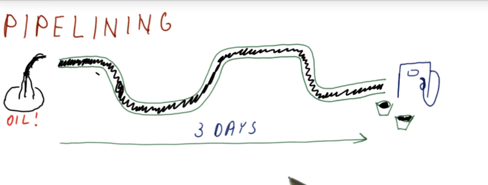

# Pipelining
## 1. Review
Pipelining is crucial to improving performance in processors; 
Pro:
- it increases throughput and reduces cycle time.
Cons:
- increase in hazards, both control and data.

## 2. Pipelining

不是每次都走三天,而是第一个走3天,之后就快了

## 3. Pipelining in a Processor
Five stages in a basic pipeline:
Fetch, Read/Decode, ALU, Memory Access, Write the Registers

Pipelining the instructions takes the same amount of time, but throughput is improved.

## 6. Pipeline CPI

Pipeline CPI is 1 ?
It is not because:
- Initial fill (CPI -> 1 when number of instruction -> ∞)
- Pipeline stalls

## 7. Processor Pipeline Stalls

