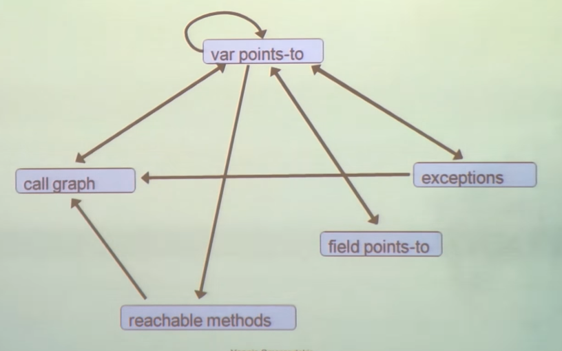

# Declarative Static Program Analysis with Doop
## Overview
- What do we do?
    - static program analysis
        - "discover program properties that hold for all executions"
    - declarative (logic-based specification)
- Why do you care?
    - simple, very powerful
    - fast!
    - different, major lessons learned
        - several new algorithms, optimization techniques, implementation insights (no BDDS)
## Why static Analysis
- Run Faster (e.g, compiler optimization)
- Software Understanding (e.g. slicing, refactoring, program, queries)
- Find Bugs

## Our Work
- In the past 6 years:
    - Doop: a very powerful framework for Java pointer analysis
        - the mother of all sophisticated static analysis
    - declarative, using the Datalog language
    - Some work on client analysis 
- In the future:
    - analyses for other languages
    - lots of other low- and high-level analyses

## Pointer Analysis
- What objects can a variable point to?
``` java
void foo() {
    Object a = new A1();
    Object b = id(a);
}

void bar() {
    Object a = new A2();
    Object b = id(a);
}

Object id(Object a) {
    return a;
}
```

object represented by allocation sites
``` java
points-to
---------------
foo: a | new A1()
bar: a | new A2()
id: a | new A1(), new A2()
foo: b | new A1(), new A2()
bar: b | new A1(), new A2()
```
remember for later: conext-sensitivity is what makes an analysis precise
``` java
context-sensitive points-to
---------------
foo: a | new A1()
bar: a | new A2()
id: a (foo) | new A1()
id: b (bar) | new A2()
foo: b | new A1()
bar: b | new A2()
```

## Pointer Analysis: A Complex Domain
- flow-sensitive
- field-sensitive
- heap cloning
- context-sensitive
- binary decision diagrams
- inclusion-based
- unification-based
- on-the-fly  call graph
- k-cfa
- object sensitvie
- field-based
- domand-driven

## Problem 
- variation points unclear
- every variant a new algorithm
- correctness unclear
- incomparable in precision


## A domian of Mutual Recursion


## Datalog: Declarative Mutual Recursion
``` java
a = new A();
b = new B();
c = new C();
a = b;
b = a;
c = b;
```
database
``` java
Alloc
---
a | new A()
b | new B()
c | new C()

Move
---
a | b
b | a
c | b
```
rules
``` java
VarPointsTo (var, obj) <- //Head, 
    Alloc(var, obj).       //body
VarPointsTo (var, obj) <- //Head, 
    Move(to, from), VarPointsTo(from, obj).

```
- `VarPointsTo` is head relation or predicative
- `Alloc`, `Move` is body relations and `from`
-  `from` are join variables

```
VarPointsTo
---
a | new A()
b | new B()
c | new C()
a | new B()
b | new A()
c | new B()
c | new A()

## Datalog: Properties
- Limited logic programming
    - SQL with recursion
    - Prolog  without complex terms (constructors)
- Captures PTIME complexity class
- Strictly declarative
    - as opposed to Prolog
        - conjunction commutative
        - rules commutative
    - increases algorithm space
        - enables different execution strategies, aggressive optimizations
Less programming, more specification

## Our Framework
- Datalog-based pointer analysis framework for Java
- Declararive: what, not how
- Sophisticated, very rich set of analyses
    - subset-based analysis, fully on-the-fly call graph discovery, field-sensitivity, context-sensitivity, call-site, object sensitive, thread sensitive, context-sensitivity heap, abstraction, type filtering, precise exception analysis
- Spport for full semantic complexity of Java
    - jvm initialization, reflection analysis, threads, reference queues, native methods, class initialization, finalization, cast checking, assignment compatibility


## Previous Approaches
Context-sensitive pointer analysis for java
- paddle
    - Java + relational algebra + binary decision diagrams (BDD)
- wala
    - Java, conventional approach
- bddbddb (pioneered Datalog for realistic points to analysis)
    - Datalog + Java + BDD

## Some Doop Contributions
- Expressed complete, complex pointer analyses in Datalog
    - core specification: ~ 15-- logic rules
    - parameterized by a handful of rules per analysis flavor
- Synthesized efficient algorithms from specification
    - order of magnitude performance improvement
    - allowed to explore more analyses than past literature
- Approach: heuristics for searching algorithm space
    - targerted at recursive problem domains
- Demonstrated scalability with explicit representation 
    - no BDDs

## Not Expected
- Expressed complete, complex analyses in Datalog
- Scalability and Efficiency

## Grand Tour of Interesting Results
- What have we done with this


