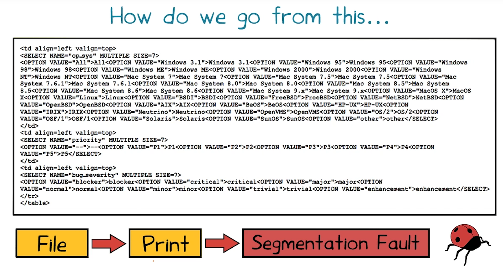
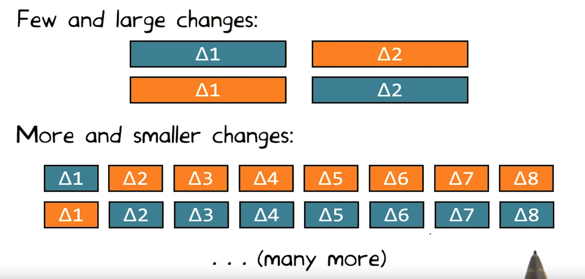
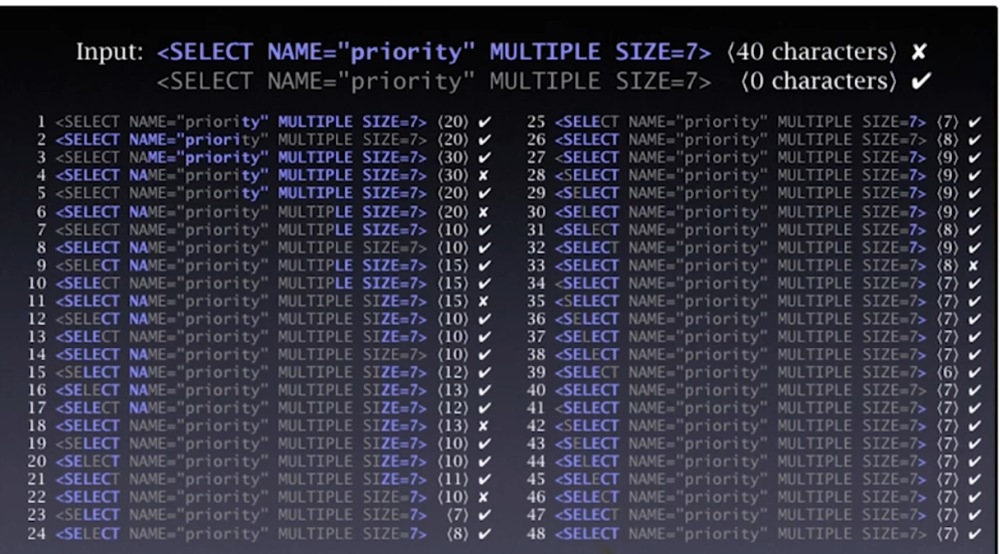
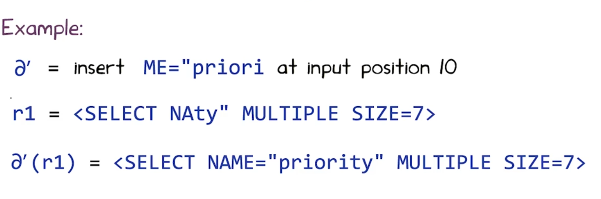
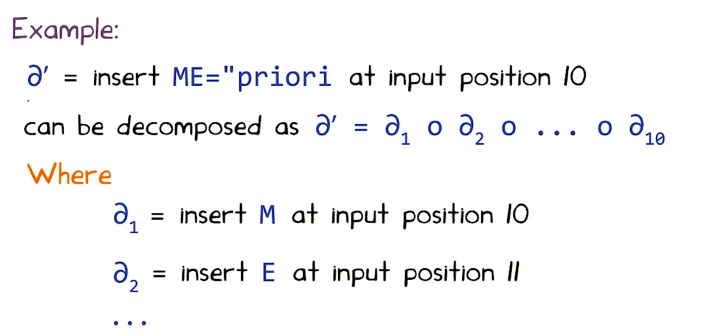
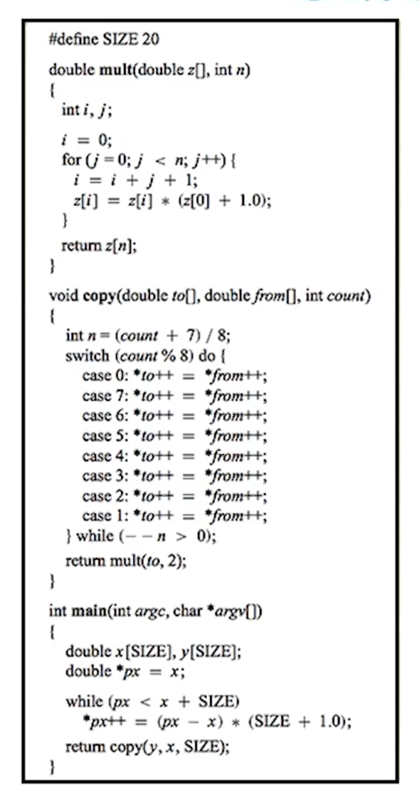
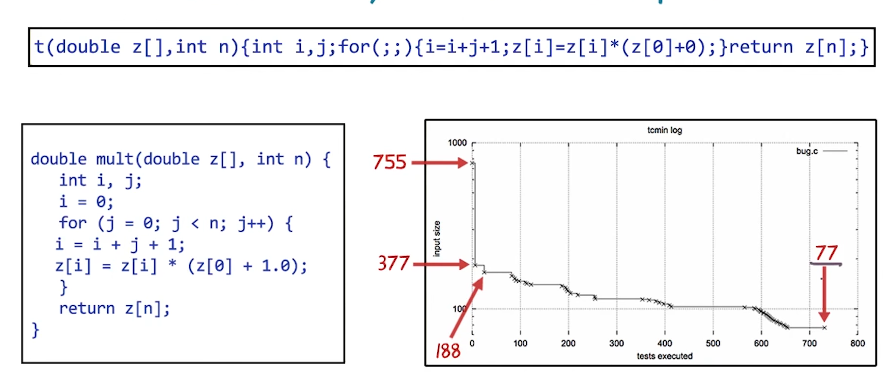
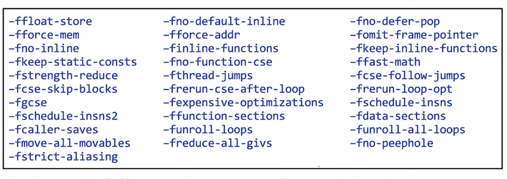

# L10 Introduction to Delta Debugging
## Scientific Method
- Hypothesize
- Experiment
- Refine


## Simplification
Once we have reproduced a program failure, we must find out what's relevant:
- Does failure really depend on 10,000 lines of code?
- Does failure really require this exact schedule of events?
- Does failure really need this sequence of function calls

## Why Simplify?
- Ease of communication: a simplified test cast is easier to communicator
- Easier debugging: smaller test cases result in smaller states and shorter executions
- Identify duplicates: simplified test cases subsume several duplicates

## Real World Scenario
In July 1999, Bugzilla listed more than 370 open bug reports for Mozilla's web browser
- These were not even simplied
- Mozilla engineers were overwhelmed with the work
- They created the Mozilla BugAThon: a call for volunteers to simplify bug reports
"when you've cut away as much HTML, CSS, and JavaScript as you can, and cutting away any more causes the bug to disappear, you're done" -- Mozilla BugAThon call

## How Do We Go from This... to This?

to this
```HTML
<SELECT>
```

## Your Solution
- How do you solve these problems?
- Binary Search
    - Cut the test-case in half
    - Iterate
- Brilliant idea: why not automate this?

## Binary Search
- Proceeded by binary search. Throw away half the input and see if the output is still wrong
- If not, go back to the previous state and discard the other half of the input.

## Line granularity
Simplified from 896 lines to one single line in only 57 test!
`<SELECT NAME="priority" MULTIPLE SIZE=7>`


## Binary Search 2
``` html
<SELECT NAME="priority" MULTIPLE SIZE=7> <= crash
<SELECT NAME="prioi <= no crash
ty" MULTIPLE SIZE=7> <= no crash
```
如何二分

## Two Conflicting Solutions


## Impact of Input Granularity
Input granularity | Finer | Coarser
---|---|--
Chance of finding a failing input subset | Higher  | Lower
Progress of the search  | Slower | Faster


## General Delta Debugging Algorithm

先从粗粒度开始，如果两边都不能找到failure， 那么使用更细的粒度



## Inputs and Failures
- Let $R$ be the set of possible inputs
- $r_{p} \in R$ corresponds to an input that passes （跑得过的case）
- $r_{f} \in R$ corresponds to an input that fails  （跑不过的case）

## Changes
- Let $R$ be the set of possible inputs
- We can go from one input $r1$ to another input $r2$ by a series of changes
- A change $\partial$ a mapping $R \rightarrow R$ which takes one input and changes it to another input

Example:


## Decomposing Changes
- A change $\partial$  can be decomposed to a number of elementary changes $\partial_1,\partial_2, ..., \partial_n $ where $ \partial= \partial_1 \cdot \partial_2 \cdot ...\cdot \partial_n $ and  $ (\partial_i \cdot \partial_j) (r) =\partial_i ( \partial_j(r))$
- For example, deleting a part of the input file can be decomposed to deleting characters one by one from the file
- In other words: by composing the deletion of single characters, we can get a change that deletes part of the input file


## Summary
- We have an input **without** failure $r_P$ (往往是很小的，trivial的过的case)
- We have an input **with** failure $r_F$ (往往是较大，很多步组成的不过的case)
- We have a set of **changes** $c_F=  \{ \partial_1,\partial_2, ..., \partial_n \} $, such that:
$$ r_F = (\partial_1 \cdot \partial_2 \cdot ... \cdot \partial_n) (r_p) $$
- Each subset $c$ of $c_F$ is a **test case**


## Testing Test Cases
- Given a test case $c$, we would like to know if the input generated by apply changes in $c$ to $r_P$ causes the same failure $r_F$
- We define the function $\text{test:Powerset} \left(c_{F}\right) \longrightarrow\{P, F, ?\}$
    - given $c = \{\partial_1,\partial_2, ..., \partial_n \} \subseteq c_F$
    - $ \text {test(c)} = F iff  (\partial_1 \cdot \partial_2 \cdot ... \cdot \partial_n) (r_p) \text{ is a failing input}$


## Minimizing Test Cases
Goal: find the smallest test case c such that $test(c) = F$

- A failing test case $c \subseteq c_F$ is called the **global minimum** of $c_F$ if:
    - for all $c' \subseteq c_F, \text{|c'| < |c|} => test(c') \neq F$
- The global minimum is the **smallest** set of changes which will make the program fail
- Finding the global minimum may require performing an **exponential** number of tests

## Search for 1-Minimal Input
- Different problem formulation:
    - Find a set of changes that cause the failure, but removing any change causes the failure to go away
- This is **1-minimality**

## Minimizing Test Cases
- A failing test case $c \subseteq c_F$ is called the **local minimum** of $c_F$ if:
    - for all $c' \subset c, \text{test(c')} \neq F$
- A failing test case $c' \subseteq c_F$ **is n-minimal** if:
    for all $c' \subseteq c, \text{|c| - |c'|} \leq n => test(c') \neq F$
- A failing test case $c' \subseteq c_F$ **is 1-minimal** if:
    for all $\partial_{i} \in c, \operatorname{test}\left(c-\left\{\partial_{i}\right\}\right) \neq F$
## Minimizing Test Cases 2 QUIZ
A program takes a string of a's and b's as input.
It crashes on inputs with an odd number of b's AND an even number of a's.
Write a crashing test case (or **NONE** if none exists) that is a sub-sequence of input *babab* and is:

- smallest: **b**
- 1-minimal of size 3: **baa**, **aba**, **aab**。 **bbb**
- Local minimal but <u>not smallest</u>: **None**
- 2-minimal of size 3:

## Naive Algorithm
- To find a 1-minimal subset of c:
if for all $\partial_{i} \in c, test\left(c-\left\{\partial_{i}\right\}\right) \neq F,$ then $c$ is 1-minimal
else recurse on $c-\{\partial\}$ for some $\partial \in c, test (c-\{\partial\})=F$

## Running-Time Analysis
- In the worst case:
    - We remove one element from the set per iteration
    - After trying every other element
- Work is potentially N + (N-1) + (N-2) + ....
- This is $O(n^2)$

## Work Smarter Not Harder
- We can often do better
- It is silly to start removing one element at a time
    - Try dividing the change set in two initially
    - Increase the number of subsets if we can't make progess
    - If we get lucky search will converge quickly

## Minimization Algorithm
- The delta debugging algorithm finds a 1-minimal test case
- It partitions the set $c_{F}$ to $\Delta_{1}, \Delta_{2}\ldots, \Delta_{n}$
    - $\Delta_{1}, \Delta_{2}, \ldots, \Delta_{n}$ are pairwise disjoint, and $c_{F}=\Delta_{1} \cup \Delta_{2} \cup \ldots . U \Delta_{n}$
- Define the complement of $\Delta_{i}$ as $\nabla_{i}=c_{F}-\Delta_{i}$
- Start with $n=2$
- Tests each test case defined by each partition and its complement
- Reduces the test case if a smaller failure inducing set is found, otherwise it refines the partition (i.e. n = n * 2)

## Steps of the Minimization Algorithm
1. Start with $n = 2$ and $\Delta$ as test set
2. Test each $\Delta_1,\Delta_2,\ldots,\Delta_n$ and each $\nabla_1,\nabla_2,\ldots,\nabla_n$
3. There are three possible outcomes:
    - a. Some $\Delta_i$ causes failure: Go to step(1) with $\Delta = \Delta_i$ and $n = 2$
    - b. Some $\nabla_i$ causes failure: Go to step(1) with $\Delta = \nabla_i$ and $n = n - 1$
    - c. No test causes failure
        - if granularity can be redefined: Go to step (1) with $\Delta = \Delta$ and $n = 2 * n$
        - Otherwise: Done, found the 1-minimal subset

## Asymptotic Analysis
- Worst case is staill quadratic
- Subdivide until each set is of size 1
    - Reduced to the naive algorithm
- Good news:
    - For single failure, coverages in $ log N$
    - Binary search again

## Minimization Algorithm 2
A program crashes when its input contains 42. Fill in the data in each iteration of the minimization algorithm assuming character granularity


| Iteration        | n           | $\Delta$  | $\Delta_1,\Delta_2,\ldots,\Delta_n, \nabla_1,\nabla_2,\ldots,\nabla_n$
| :-------------: | :-------------: | :-----: | :-----: |
| 1   | **2** | 2424 |**4**
| 2  | **4** | **2424** |**2,4,424, 224, 244, 242**
| 3  | **3** | **242** (424) | **2,4,42, 22, 24**
| 4 | **2** | **42** | **4,2**


## Case Study: GNU C Compiler

- This program (bug.c) crashes GCC 2.95.2 when optimization is enabled
- Goal: minimize this program to file a bug report
- For GCC, a passing run is the empty input
- For simplicity, model each change as insertion if a single character
    - test $r_P $ = running GCC on an empty input
    - test $r_F $ = running GCC on bug.c
    - change $\partial_i$ = insert i_th character of bug.c

----
The test procedure:
    - create the appropriate subset of bug.c
    - feed it to GCC
    - return `Failed` if GCC crashes, `Passed` otherwise


This test case is 1-minimal
- No single character can be removed while still causing the crash
- Even every superfluous whitespace has been removed
- The function name has shrunk from `mult` to a single`t`
- Has infinite loop, but GCC still isn't supposed to crash
So where could the bug be?
- We already know it is related to optimization
- Crash disappears if we remove `- 0` option to turn off optimization

The Gcc  documents lists 31 options to control optimization:

Applying all of these options causes the crash to disappear
- Some options(s) prevent the crash

- Use test cases minimization to find the rash-preventing option(s)
    - test $r_P$ = run GCC with all options
    - test $r_F$ = run GCC with no option
    - change $\partial_i$ - remove i_th option
- After 7 tests, option `-ffast-math` is found to prevent the crash
    - Not good candidate for workaround as it may alter program's semantics
    - Thus, remove `-ffast-math` from the list of options and repeat
- After 7 tests, option `-fforce-addr` is also found to prevent the crash
    - Further tests show that no other option prevent the crash

----
This is what we can send to the GCC maintainers:
- The minimal test case
- "The crash only occurs with optimization"
- "-ffastmath and -fforce-addr prevent the crash"

## Case Study: Minimizing Fuzz Input
- Random Testing (a.k.a. Fuzzing): feed program with randomly generated input and check if it crashes
- Typically generates large inputs that cause program failure
- Use **delta debugging** to minimize such inputs
- Successfully applied to subset of UNIX utility programs from Bart Miller's original fuzzing experiment

Example: reduced 10^6 character input crashing CRTPLOT to single character in only 24 test!

[more about these case studies as well as the delta debugging technique](https://www.st.cs.uni-saarland.de/publications/files/zeller-tse-2002.pdf)

## Another Application
Yesterday, my program worked. Today, it does not. Why?
- The new release 4.17 of GDB changed 178,000 lines
- No longer integrated properly with DDD (a graphical front-end)
- How do we isolate the change that caused the failure?

[Further reading on this topic can be found at this link](https://www.st.cs.uni-saarland.de/publications/files/zeller-esec-1999.pdf)

## Delta Debugging Wrap-Up
Check the statement that are true about delta debugging:
- [ ] is fully automic
- [ ] Finds the smallest subset of a failing input in polynomial time.
- [X] Finds 1-minimal instead of local minimum test case due to performance
- [X] May find a different sized subset of failing input depending upon the order in  which it tests different input partitions
- [ ] is also effective at reducing non-deterministically failling inputs.

## What Have We Learned?
- Delta Debugging is a technique, not a tool
- Bad news:
    - Probably must be re-implemented for each significant system to exploit knowledge changes
- Good news:
    - Relatively simple algorithm, big payoff
    - It is worth re-implementing
