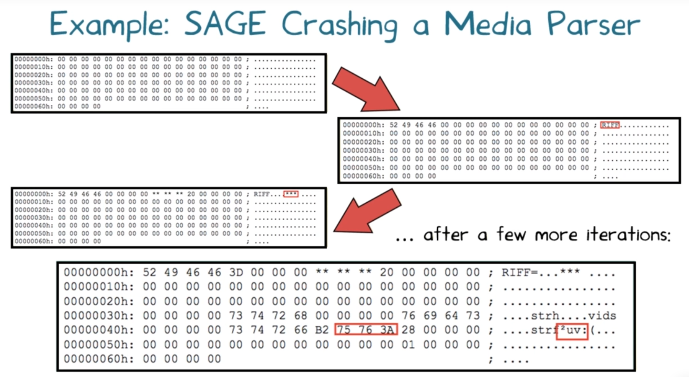

# L11 Dynamic Symbolic Execution
## Intro to Dynamic Symbolic Execution
- Hybrid, combined static and dynamic
- It may result in false negatives
    - miss bugs
- It does not produce false positives
    - every assertion violation it discovers is indeed real

## Motivation
- Writing and maintaining tests is tedious and error-prone
- Idea: Automated Test Generation
    - Generate regression test suite
    - Execute all reachable statements
    - Catch any assertion statements

## Approach
- Dynamic Symbolic Execution
    - Stores program state concretely and symbolically
    - Solves constraints to guide execution at branch points
    - Explores all execution paths of the unit tested
- Example of Hybrid Analysis
    - Collaboratively combines dynamic and static analysis

## Execution Path of a Program
- Program can be seen as **binary tree** with possibly infinite depth
    - Called Computation Tree
- Each node represents the execution of a conditional statement
- Each edge represents the execution of a sequence of non-conditional statements
- Each pathin the tree represents an equivalence class of inputs

## Computation Tree Example
``` java
void test_me(int x, int y) {
    if (2*y == x) {
        if (x <= y +10)
            print("OK")
        else {
            print("something bad")
            ERROR;
        }
    } else
        print("OK")
}
```

assert(b) => if (!b) ERROR

## Existing Approach I
Random testing
    - Generate random inputs
    - Execute the program on those (concrete) inputs

Problem:
    - Probability of reaching error could be astronomically small
```java
void test_me(int x) {
    if (x == 94389) {
            ERROR;
    }
}
```
Probability of ERROR: $1 / 2^{32} \approx 0.000000023 \%$

## Existing Approach II
Symbolic Execution
- Use symbolic values for inputs
- Execute program symbolically on symbolic input values
- Collect symbolic path constraints
- Use **theorem prover** to check if a branch can be taken
```java
void test_me(int x) {
    if (x*3 == 15) {
        if (x % 5 == 0)
            print("OK")
        else {
            print("something bad")
            ERROR;
        }
    } else
        print("OK")
}
```
Problem:
    - Does not scale for large program
    - and complicated program
```java
void test_me(int x) {
    // c = product of two
    // large primes

    if (pow(2,x) % c == 17) {
            print("something bad")
            ERROR;
        }
    } else
        print("OK")
}
```
Symbolic execution will say both branches are reachable: False positive

##  Combined Approach
Dynamic Symbolic Execution (DSE)
- start with ramdom input values
- Keep tracks of both concreate values and symbolic constraints
- Use concreate values to simplify symbolic constraints
- Incomplete theorem-prover
    - never declare an unsatisfiable constraint to be satisfiable
    - may fail to satisfy some satisfiable constraint

## An Illustrative Example


## A More Complex Example


## A Third Example


Dynamic symbolic Execution
- will never model a run of the code that could not actually occur. (No false positive) (Complete)
- can miss actual runs of the code that lead to errors (false negative) (Not Sound)

Symbolic Execution
- may model a run of the code that could not actually occur. => spurious errors   (false positive) (Incomplete)
- never incorrectly declare a program to be error free (no false negative) (Sound)


## Properties of DSE
Assume that programs can have infinite computation trees, which statements are true of DSE applied to such program?
- [ ] DSE is guranteed to terminate
- [x] DSE is complete: if it ever reaches an error, the program can reach that error in some execution.
- [ ] DSE is sound: if it terminates and did not reach an error, the program reach an error in any execution.


## Testing Data Structures
``` c
typedef struct cell {
    int data;
    struct cell *next;
} cell;

int foo(int v) { return 2 * v + 1; }

int test_me(int x, cell *p) {
    if (x > 0)
        if (p != NULL)
            if (foo(x) == p->data)
                if (p->next == p)
                    ERROR;
    return 0;
}
```

Random Test Driver:
- random value for x
- random memory graph reachable from p

------
probability of reaching ERROR is extremely low

## Data Structure Example


## Approach in a Nutshell
- Generate concrete inputs, each taking different program path
- On each input, execute program both **concretely** & **symbolically**

Both **cooperate** with each other:
- Conrete execution guides symbolic execution
    - Enables it to overcome incompleteness of theorem prover
- Symbolic executions guides generation of concrete inputs
    - Increase program code coverage

## Characteristics of DSE
The testing approach of DES is
- [ ] Automated, black-box
- [X] Automated, white-box
- [ ] Manual, black-box
- [ ] Manual, white-box

The input search of DSE is
- [ ] Randomized
- [X] Systemic

The static analysis of DSE is
- [ ] Flow-insensitive
- [ ] Flow-sensitive
- [X] Path-sensitive

The instrumentation of DSE is
- [ ] Sampled
- [X] Non-Sampled

## Case Study: SGLIB C Library
- Found two bugs in sglib 1.0.1
    - reported to authors, fixed in sglib 1.0.2
- Bug 1: doubly-linked list
    - segmentation fault occurs when a non-zero length list is concatentation with zero-length list
    - discovered in 140 iterations (< 1 second)
- Bug 2: hash-table
    - an infinite loop in hash-table is_member function
    - 193 iterations (1 second)


Further reading on the SGLIB C Library: http://mir.cs.illinois.edu/marinov/publications/SenETAL05CUTE.pdf

## Case Study: Needham-Schroeder Protocol
- Tested a C implementation of a security protocol (Needham-Schroeder) with a known (man-in-the-middle) attack
    - 600 lines of code
    - Took fewer than 13 seconds on a machine with 1.8 GHz processor and 2GB RAM to discover the attack
- In contract, a software model-checker (VeriSoft) took 8 hours

## Realistic Implementations
- **KLEE: LLVM ( C family of language)
- **PEX**: .NET Framework
- **jCUTE**: java
- **Jalangi**: Javascript
- **SAGE** and **S2E**: binaries (x86, ARM, ...)


## Case Study: SAGE Tool at Microsoft
- SAGE = Scalable Automated Guided Execution
- Found may new expensive security bugs in many Mircosoft applications (Windows, Office, etc.)
- Used daily in various Microsoft groups
- What makes it so useful?
    - Works on large applications => finds bugs across componets
    - Focus on input file fuzzing => fully automated
    - Works on x86 binaries => easy to deploy (not dependent on language or build process)

Further reading on the SAGE tool:
- http://research.microsoft.com/en-us/um/people/pg/public_psfiles/ndss2008.pdf
- http://research.microsoft.com/en-us/um/people/pg/public_psfiles/talk-spin2009.pdf

## SAGE Crashing a Media Parser



## What Have We Learned?
- What is **(dynamic) symbolic execution**
- Systematically generate (numeric and pointer) inputs
- **Computation tree** and error reachability
- Tracking **concrete state, symbolic state, path condition**
- Combined static and dynamic analysis => **hybrid analysis**
- Complete, but no soundness or termination guarantees

