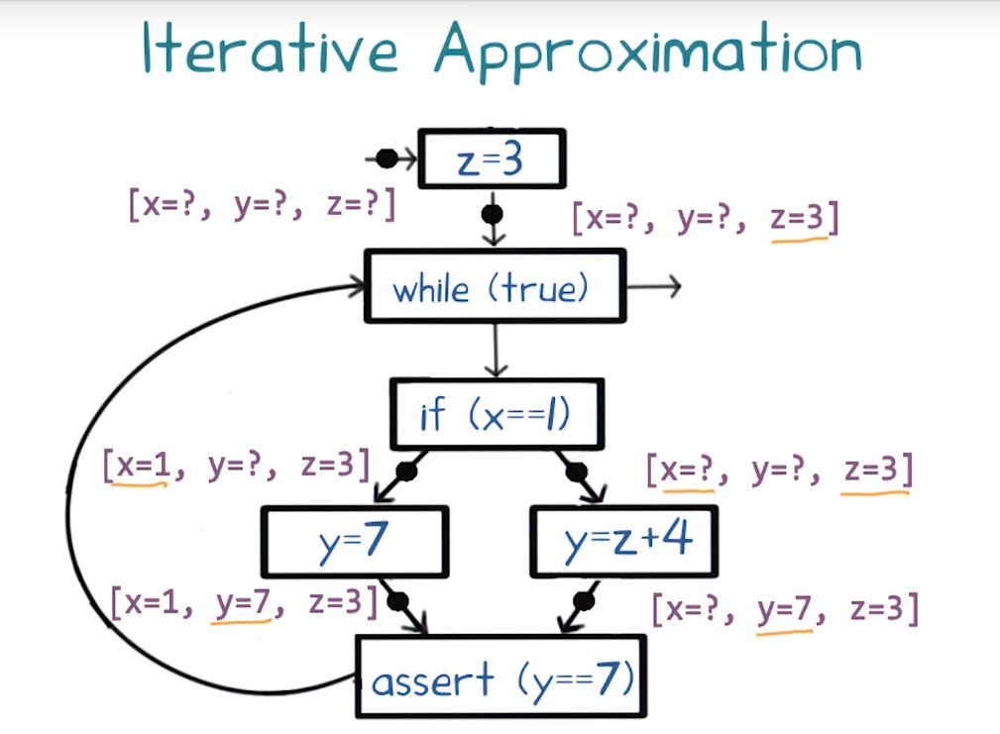

# L1. Introduction to Software Analysis

## Intro to Software Analysis and Testing
- Diagnosing bugs
- Testing 
- Debugging
## Why Take This Course?
- Learn methods to improve software quality
    - reliability, security, performance, etc.
- Become a better software developer/tester
- Build specialized tools for software diagnosis and testing

## Ariane Rocket Disaster
Caused due to a numeric overflow error
- Attempt to fit a 64-bit format data in 16 bit space
1
Cost:
- $100M's for loss of mission
- Multi-year setback to Ariane program

## Security Vulnerabilities1
- Exploits of errors in programs
- Widespread Problem
- Getting Worse

## What Is Program Analysis?
- Body of work to automaticcally discover useful facts about programs
- Broadly classified into three kinds:
    - Dynamic (run-time)
    - Static (compile-time)
    - Hybrid (combines dynamic + static)

## Dynamic Program Analysis
Infers facts of program by monitoring its runs
- Array bound checking 
    - Purify
- Memory leak detection
    - Valgrind
- Data race detection
    - Eraser
- Finding likely invariants
    - Daikon

## Dynamic Program Analysis
Infers facts of program by inspecting its code
- Suspicious error patterns
    - Purify
- Memory leak detection
    - Facebook Infer
- Checking API usage rules
    - Microsoft SLAM
- Verifying invariants
    - ESC/Java

## Program Invariants
``` c
    int p(int x ) {
        return x * x;
    }

    void main() {
        int z;
        if (getc() == 'a') 
            z = p(6) + 6
        else 
            z = p(-7) - 7
    }
```

z == 42

## Discovering Invariants 
- Dynamic analysis tool like Daikon can guess `z == 42` might be an invariant
- Static analysis can use `z == 42`

## Terminology
Static analysis typically operates on a suitable intermediate representation of the program
- control-flow graph
- operates over abstract states
    - abstract(summarize a set of concrete states) vs. concrete states(实际run的states)
- static analysis may fail to accurately represent the value of a variable in an abstract state (用问号表示)
- Termination
- Sacrifices completeness for Soundmess

## Iterative Approximation


## Dynamic vs. Static Analysis
<br>|Dynamic|Static|
--|--|--
Cost|Proportional to program's e
Execution time|Proportional to program's size
Effectiveness| Unsound (may miss errors) | Incomplete (may report spurious errors)
 
[Fishing Analogy for Soundness and Completeness](https://medium.com/@ramazanpolat/an-analogy-to-make-you-understand-concept-of-soundness-and-completeness-6aefcebbc8d7)

## Undecidability of Program Properties
- Can program analysis be sound and complete
    - Not if we want it to terminate
- Questions like "Is a program point reachable on some input?" are undecidable
- Designing a program analysis is an art
    - Tradeoffs dictated by consumer

[Undecidable_problem](https://en.wikipedia.org/wiki/Undecidable_problem)

## Who Needs Program Analysis?
- Compilers
    - Bridge between high-level language and architectures
    - Use program analysis to generate efficient code
    - 
- Software Quality Tools
    - Tools for testing, debugging and verification
    - Primary focus of this course
    - Use program analysis for:
        - Finding programing errors
        - Proving program invariants
        - Generating test cases
        - Localizing causes of errors
- Integrated Development Environments (IDEs)
    - Examples: Eclipse and Microssoft Visual Studio
    - Use program analysis to help programmers:
        - Understand programs
        - Refactor programs
            - Restructuring a program without changing its external behavior
    - Useful in dealing with large, complex programs

## What Have We Learned?
- What is program analysis
- Dynamic vs static analysis: pros and cons
- Program invariants
- Iterative approximation method for static analysis
- Undecidability => program analysis cannot ensure termination + soundness + completeness
- Who needs program analysis?

