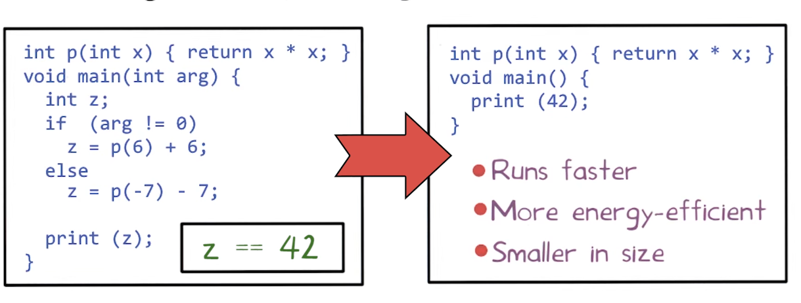
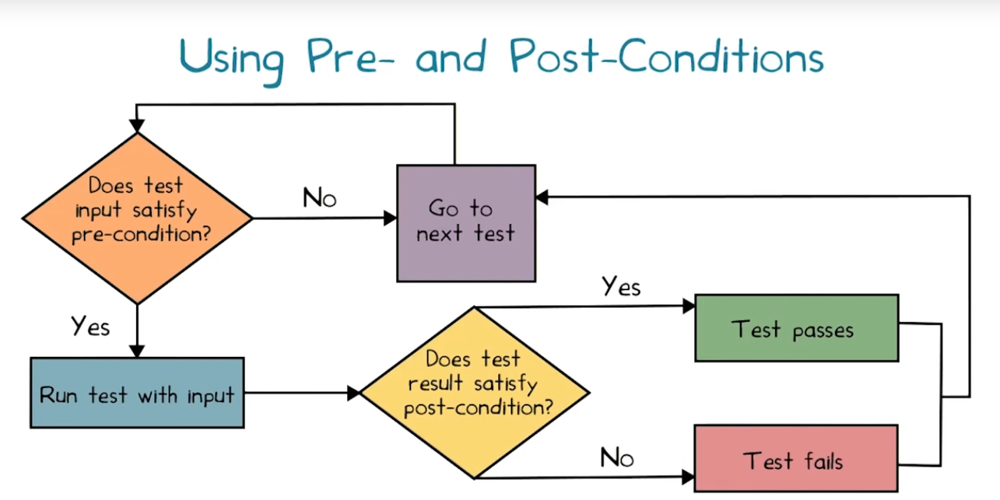

# L2. Introduction to Software Testing

## Introduction to Software Testing
By the end of this lession, you will be able to 
- Describe the relationship of software testing to development
- Classify different testing methods  
- Identify the specifications
- Measure the quality of testing


## Key Observations
- Specifications must be explicit
    - Testing checks whether program implementation agrees with program specification
    - Without a specification, there is nothing to test
    - Testing a form of consistency checking between implementation and specification
        - recurring theme for software quality checking approcaches
        - Cannot find bugs if both implementation and specification are wrong
- Independent development and testing
    - Developer writers implementation, tester writes specification
    - Unlikely that both will independently make the same mistake
    - Specifications useful even if written by developer itself
        - Much simpler than implementation
        - specification unlikely to have same mistake as implementation
- Resources are finite
    - Limit how many tests are written
- Specifications evolve over time
    - Tests must be updated over time
- An Idea: **Automated Testing**
    - No need for testers!?


## Ariane Rocket Disaster
Caused due to a numeric overflow error
- Attempt to fit a 64-bit format data in 16 bit space
1
Cost:
- $100M's for loss of mission
- Multi-year setback to Ariane program

## Security Vulnerabilities1
- Exploits of errors in programs
- Widespread Problem
- Getting Worse

## What Is Program Analysis?
- Body of work to automaticcally discover useful facts about programs
- Broadly classified into three kinds:
    - Dynamic (run-time)
    - Static (compile-time)
    - Hybrid (combines dynamic + static)

## Dynamic Program Analysis
Infers facts of program by monitoring its runs
- Array bound checking 
    - Purify
- Memory leak detection
    - Valgrind
- Data race detection
    - Eraser
- Finding likely invariants
    - Daikon

## Dynamic Program Analysis
Infers facts of program by inspecting its code
- Suspicious error patterns
    - Purify
- Memory leak detection
    - Facebook Infer
- Checking API usage rules
    - Microsoft SLAM
- Verifying invariants
    - ESC/Java

## Program Invariants
``` c
    int p(int x ) {
        return x * x;
    }

    void main() {
        int z;
        if (getc() == 'a') 
            z = p(6) + 6
        else 
            z = p(-7) - 7
    }
```

z == 42

## Discovering Invariants 
- Dynamic analysis tool like Daikon can guess `z == 42` might be an invariant
- Static analysis can use `z == 42`

## Terminology
Static analysis typically operates on a suitable intermediate representation of the program
- control-flow graph
- operates over abstract states
    - abstract(summarize a set of concrete states) vs. concrete states(实际run的states)
- static analysis may fail to accurately represent the value of a variable in an abstract state (用问号表示)
- Termination
- Sacrifices completeness for Soundmess

## Iterative Approximation


## Dynamic vs. Static Analysis
<br>|Dynamic|Static|
--|--|--
Cost|Proportional to program's e
Execution time|Proportional to program's size
Effectiveness| Unsound (may miss errors) | Incomplete (may report spurious errors)
 
[Fishing Analogy for Soundness and Completeness](https://medium.com/@ramazanpolat/an-analogy-to-make-you-understand-concept-of-soundness-and-completeness-6aefcebbc8d7)

## Undecidability of Program Properties
- Can program analysis be sound and complete
    - Not if we want it to terminate
- Questions like "Is a program point reachable on some input?" are undecidable
- Designing a program analysis is an art
    - Tradeoffs dictated by consumer

[Undecidable_problem](https://en.wikipedia.org/wiki/Undecidable_problem)

## Who Needs Program Analysis?
- Compilers
    - Bridge between high-level language and architectures
    - Use program analysis to generate efficient code
    - 
- Software Quality Tools
    - Tools for testing, debugging and verification
    - Primary focus of this course
    - Use program analysis for:
        - Finding programing errors
        - Proving program invariants
        - Generating test cases
        - Localizing causes of errors
- Integrated Development Environments (IDEs)
    - Examples: Eclipse and Microssoft Visual Studio
    - Use program analysis to help programmers:
        - Understand programs
        - Refactor programs
            - Restructuring a program without changing its external behavior
    - Useful in dealing with large, complex programs

## What Have We Learned?
- What is program analysis
- Dynamic vs static analysis: pros and cons
- Program invariants
- Iterative approximation method for static analysis
- Undecidability => program analysis cannot ensure termination + soundness + completeness
- Who needs program analysis?

## Outline of This Lesson
- Landscape of Testing
- Specification
    - Pre- and Post-Conditions
- Measuring Test Suite Quality
    - Coverage Metrics
    - Mutation Analysis

## Classification of Testing Approaches

往往分类是连续的，而不是非黑即白的
- White-Box and Automated test
    - Needs Program Analysis

## Automated vs. Manual Testing
Automated Testing:
- Find bugs more quickly
- No need to write tests
- If software changes, no need to maintain tests
Manual Testing:
- Efficient test suite
- Potentially better coverage

## Black-Box vs. White-Box Testing
- Black-Box Testing
    - Can work with code that cannot be modified
    - Does not need to analyze or study code
    - Code can be in any format(managed, binary, obfuscated)
- White-Box Testing
    - Efficient test suite
    - Potentially better coverage


## The Automated Testing Problem
- Automated testing is hard to do
- Probably impossible for entire systems
- Certainly impossible without specifications

## Pre- and Post-Conditions
- A pre-condition is a predicate
    - Assumed to hold before a function executes
- A post-condition is a predicate
    - Expected to hold after a function executes, whenever the pre-condition also holds
- Most useful if they are executable
    - Written in the programming language itself
    - A special case of assertions
- Need no be precise
    - May become more complex than the code!
    - But useful even if they do not cover every situation

## Conditions Example
``` java
class Stack<T> {
    T[] array;
    int size;

    Pre: s.size() > 0 
    T pop() {return array[--size];}
    Post: s'.size() == s.size() - 1

    int size() { return size;}
}
```
这里没有提到的Post-condition，比如在pop()以后stack里面的元素顺序，都是假设不变的，称为frame conditions

## Post-Conditions Quiz
Consider a sorting function in Java which takes a non-null integer array A and returns an integer array B. Check all items the specify the strongest possible post-condition

- [x] B is non-null => 
- [ ] The element of B do not contain any duplicates
- [ ] The element of A do not contain any duplicates
- [x] The element of B are sorted in order
- [ ] The element of A are sorted in order
- [X] The element of B a permutation of the elements of A

## Executable Post-Condition
- B is non-null
    ```java
    B != null
    ```
- B has the same length as A
    ```java
    B.length == A.length
    ```
- The elements of B are in sorted order
    ```java
    for (int i = 0; o < B.length - 1; i++) {
        B[i] <= B[i+1]
    }
    ```
- The element of B a permutation of the elements of A
    ``` java
    // count number of occurrences of 
    // each number in each array and 
    // then compare these counts
    ```
## How Good Is Your Test Suite?
- How do we know that our test suite is good
    - Too few tests: may miss bugs
    - Too many tests: costly to run, bloat and redundancy harder to maintain 
- Two approaches:
    - Code coverage metrics
    - Mutation analysis (or mutation testing)

## Code Coverage
- Metric to quantify extent to which a program's code is tested  by a given test suite
- Given as percentage of some aspect of the program executed in the tests
- 100% coverage rare in practice: e.g., inaccessible code
    - often required for safety-critical applications
## Code Coverage Metrics Quiz
``` java
int foo(int x, int y) {
    int z = 0;
    if (x <= y) {
        z = x;
    } else {
        z = y;
    }
    return z;
}
```
Test Suite (1, 0)
Statement Coverage: **80%**
Branch Coverage: **50%**
Given arguments for another call to `foo(x,y)` to add to the test suite to increase both coverage to 100% **foo(1,1)**


## Types of Code Coverage
- Function coverage: which functions were called?
- Statement coverage: which statements were executed
- Branch coverae: which branches were taken?
- Many others: line coverage, condition coverage, basic block coverage, path coverage, ...

## Mutation Analysis
Some initial reading on mutation analysis: https://en.wikipedia.org/wiki/Mutation_testing
- Found on the "competent programmer assumption"
    - The program is close to right to begin with
- Key idea: Test variant (mutations)  of the program
    - Replace `x > 0` by `x < 0` 
    - Replace `w` by `w + 1`, `w - 1`
- If test suite is good, should report failed 

``` java
int foo(int x, int y) {
    int z = 0;
    if (x <= y) {
        z = x;
    } else {
        z = y;
    }
    return z;
}
```

Pass?|Test1<br> assert:  foo(0,1) == 0|Test2<br> assert:  foo(0,0) == 0
---|---|---
**mutation 1** <br> x <= y  --> x > y||X
**mutation 2** <br> x <= y  --> x != y|X|X


Is the test suite adequate with respect to both mutation
**No**

Given a test case which mutation 2 fails but the original code passes
**foo(1, 0) == 0**

## A Problem
- What if a mutant is equivalent to the original?
- Then no test will kill it
- Hard to tell 
    - a lack of robustness in our testing
    - or it is an equivalent mutant
- In practice, this is a real problem
    - No easily solved
    - Try to prove program equivalence automatically
        - Undecidable
    - Often Required manual intervention

## What Have We Learned?
- Landscaping of Testing
    - Automated vs Manual
    - Black-box vs White-box
- Specification: Pre- and Post- Conditions
- Measuring Test Suite Quality
    - Coverage Metrics
    - Mutation Analysis

## Reality
- Many proposals for improving software quality
- But the world tests
    -  \> 50% of the cost of software development
- Conclusion: Testing is important

