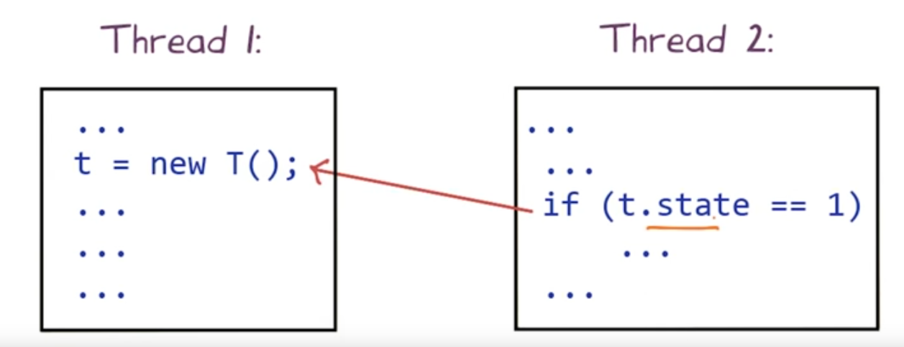
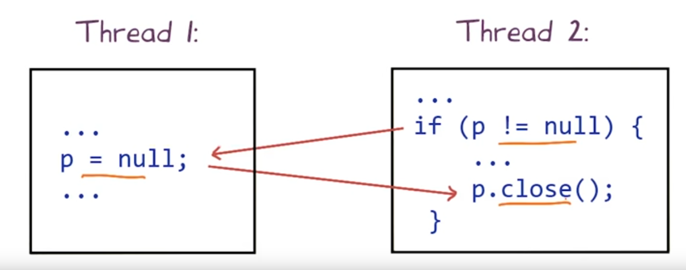
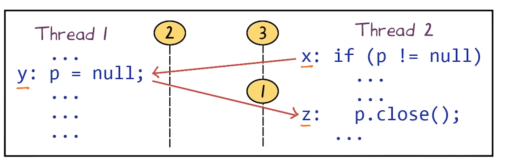
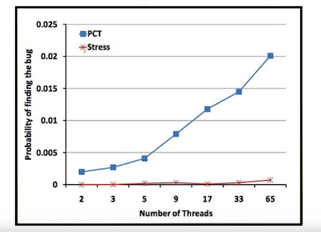
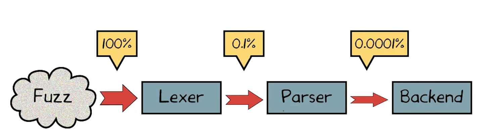

# L3. Introduction to Random Testing

## Random Testing (Fuzzing)
- Feed random inputs to a program
- Observe whether it behaves "correctly"
    - Execution satisfies given specification
    - Or just doesn't crash
        - A simple specification
    - Special case of mutation analysis

## The Infinite Monkey Theorem
> "A money hitting keys at random on a typewriter keyboard will produce any given text, such as the complete works of Shakespeare, with probability approaching 1 as time increases."

## Random Testing: Case Studies
- Unix utilities: University of Wisconsin's Fuzz study
- Mobile apps: Google's Monkey tool for Android
- Concurrent programs: Cuzz tool from Microsoft

## A Popular Fuzzing Study
- Conducted by Barton Miller @ University of Wisconsin
    - Main webpage: http://pages.cs.wisc.edu/~bart/fuzz/fuzz.html
- 1990: Command-line fuzzer, testing reliability of UNIX programs 
    - Bombards utilities with random data
    - "An Empirical Study of the Reliability of UNIX Utilities", ftp://ftp.cs.wisc.edu/par-distr-sys/technical_papers/fuzz.pdf
- 1995: Expanded to GUI-based programs (X Windows), network protocols, and system library APIs
    - "Fuzz revisited: A re-examination of the reliability of UNIX utilities and services", ftp://ftp.cs.wisc.edu/paradyn/technical_papers/fuzz-revisited.pdf
- Later: Command-line and GUI-based Windows and OS X apps

## Fuzzing UNIX Utilities: Aftermath
- 1990: Caused 25-33% of UNIX utility programs to crash (dump state) or hang (loop indefinitely)
- 1995: System got better... but not by much!
"Even worse is that many of the same bugs that we reported in 1990 are still present in the code releases of 1995"

## A Silver Lining: Security Bugs
- `gets()` functions in C has no parameter limiting input length
    - programmer must make assumptions about structure of input
- Causes reliability issues and security breaches
    - Second most common cause of errors in 1995 study
- Solution: Use `fgets()`, which includes an argument limiting the maximum length of input data

## Fuzz Testing for Mobile Apps
Monkey tools
- generates `TOUCH(x,y)` where x, y are randomly generatedL x in [0...480] y in [0...800]
- is capable of generating many kinds of input events
    - key presses on the device's keyboard
    - input from the device's track ball
    - incoming phone call
    - a change in the user's GPS location

Follow this link to see a tutorial for the Monkey tool on Android apps: http://adventuresinqa.com/2014/04/01/how-to-stress-test-your-android-app-with-monkey.


## Generating Multiple Input Events
generate a sequence of events

## Generating Gestures
`Down(x1,y1) MOVE(x2,y2) UP(x2,y2)`


## Grammar of Monkey Events
``` sh
test_case := event*
event := action(x,y)
action := DOWN | MOVE | UP
x := 0 | 1 | ... | x_limit
y := 0 | 1 | ... | y_limit
```
Follow this link to learn more about the Monkey tool, such as the other kinds of events it can generate: http://developer.android.com/tools/help/monkey.html.


## Testing Concurrent Programs
Thread 1: 
``` java
p = null
```
Thread 2: 
``` java
if ( p != null) {
    p.close();
}
```
Input:
```
p = new File()
```
may or may not crash 

uncovering bugs in concurrent programs requires 
- not only discovering specific program inputs
- but also specific thread schedules
    - predominant approach to testing concurrent programs today it to introduce random delays 
Random 

    Thread 1: 
    ``` java
    Sleep();
    p = null;
    ```
    Thread 2: 
    ``` java
    Sleep();
    if ( p != null) {
        Sleep();
        p.close();
    }
    ```

## Cuzz: Fuzzing Thread Schedules
- Introdcues `Sleep()` calls
    - Automatically (instead of manually)
    - Systematically before each statement (instead of those chosen by tester) 
        -  Less tedious, less error-prone
- Gives worst-case probabilistic guarantee on finding bugs

Follow this link to find more details about Cuzz: http://research.microsoft.com/en-us/projects/cuzz


## Depth of a Concurrency Bug 
- Bug Depth = the number of ordering constraints a schedule has to satisfy to find the bug
Depth = 1

Depth = 2

- Observation exploited by Cuzz: many typical bugs have small depth

## Quiz Concurrency Bug Depth
Thread 1 
``` java
lock(a)
lock(b)
g = g + 1
unlock(b)
unlock(a)
```

Thread 2
``` java
lock(b)
lock(a)
g = 0
unlock(a)
unlock(b)
```
the depth of the concurrency bug in  `2`


## Cuzz Algorithm
``` c
Input:
    int n; // # of threads
    int k; // no. of steps - guessed from previous runs
    int d; // target bug depth - randomly chosen
State:
    int pri[] = new int[n];         //thread priorities
    int change[] = new int[d-1];    //when to change priorities
    int stepCnt;                    //current step count

Initialize() {
    stepCnt= 0;
    a = random_permutation(1,n); 
    for (int tid = 0; tid < n; tid++) {
        pri[tid] = a[tid] + d;
    for (int i = 0; i < d - 1; i++)
        change[i] = rand(1,k);
}

Sleep(tid) {
    stepCnt++;
    if stepCnt == change[i] for some i
        pri[tid] = i; //到达变化点的时候把priority下降到以下
    while (tid is not highest priority enabled thread)
        spin; 
}


}
```

## Probabilistic Guarantee
Given a program with:
- n thread (~tens)
- k steps (~millions)
- bug of depth d (1 or 2)

Cuzz will find the bug with a probability of at least $\frac{1}{n k^{d-1}}$ in each run

## Proof of Guarantee (Sketch)

- Probability(choose correct initial thread priorities) $>=1 / n$
- Probability(choose correct step to switch thread priorities) $>=1 / k$
- Probability(triggering bug)  $>=1 / k$
- for d depth  $>=1 / nk^{d-1}$

## Measured vs. Worst-Case Probability
- Worst-case guarantee is for hardest-to-find bug of given depth
- If bugs can be found in multiple ways, probabilites add up!
- Increasing number of threads helps
    - Leads to more ways of trigger a bug



## Cuzz: Case Study
- Measure bug-finding probability of stress testing vs. Cuzz
    - Without Cuzz: 1 Fail in 238,820 runs (ratio = 0.000004817)
    - With Cuzz: 12 Fail in 320 runs (ratio = 0.0375)

1 day of stress testing = 11 seconds of Cuzz testing!

## Cuzz: Key Takeaways
- Bug depth: useful metric for concurrency testing efforts
- Systematic randomization improves concurrency testing
- Whatever stress testing can do, Cuzz can do better
    - Effective in flushing out bugs with existing tests
    - Scales to large number of threads, long-running tests
    - Low adoption barrier

## Random Testing: Pros and Cons
Pros:
    - Easy to implement
    - Provably good coverage given enough tests
    - Can work with programs in any format
    - Appealing for finding security vulnerabilities
COns:
    - Inefficient test suite
    - Might find bugs that are unimportant
    - Poor coverage 

## Coverage of Random Testing

- The lexer is very heavily tested by random inputs
- But testing of later stages is much less efficient

## What Have We Learned?
Random testing:
-  Is effective for testing security, mobile apps, and concurrency
- Should complement not replace systematic, formal testing
- Must generate test inputs from a reasonable distribution to be effective
- May be less effective for systems with multiple layer(e.g. compilers)

