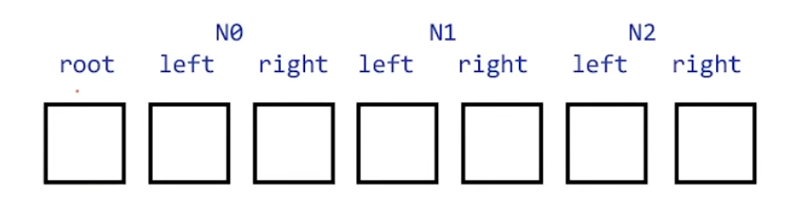
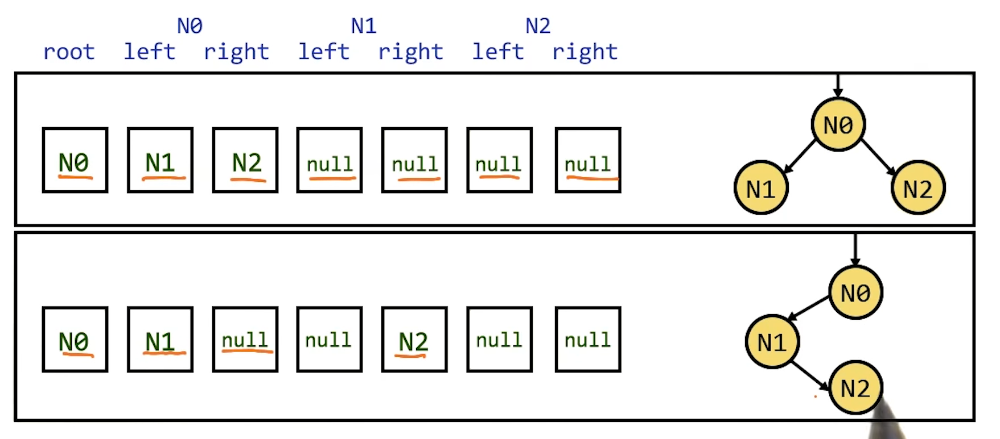
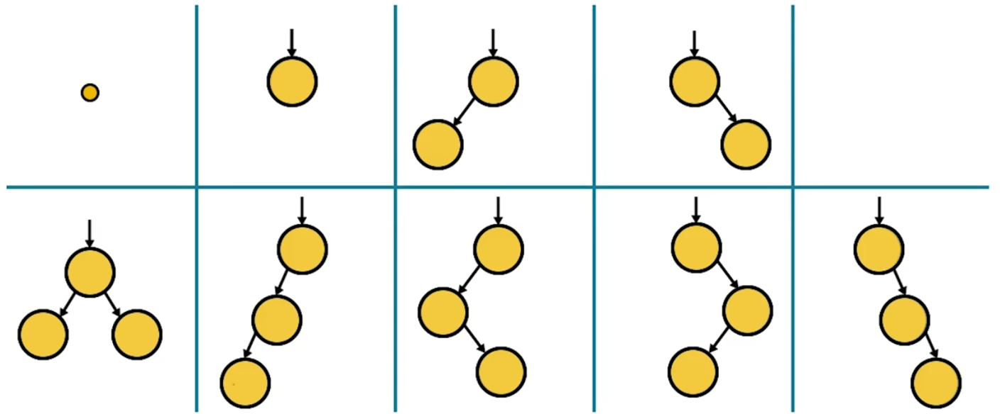
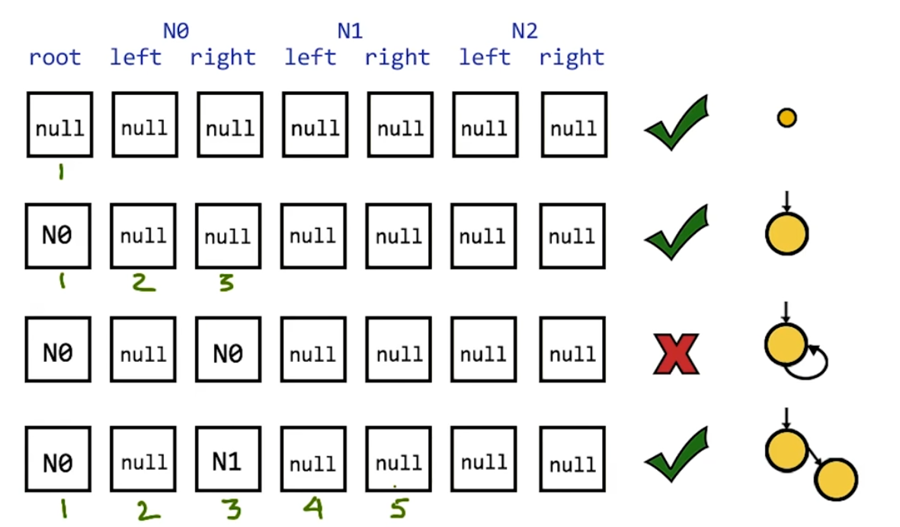
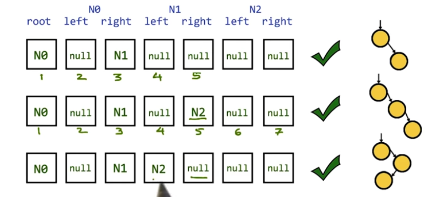
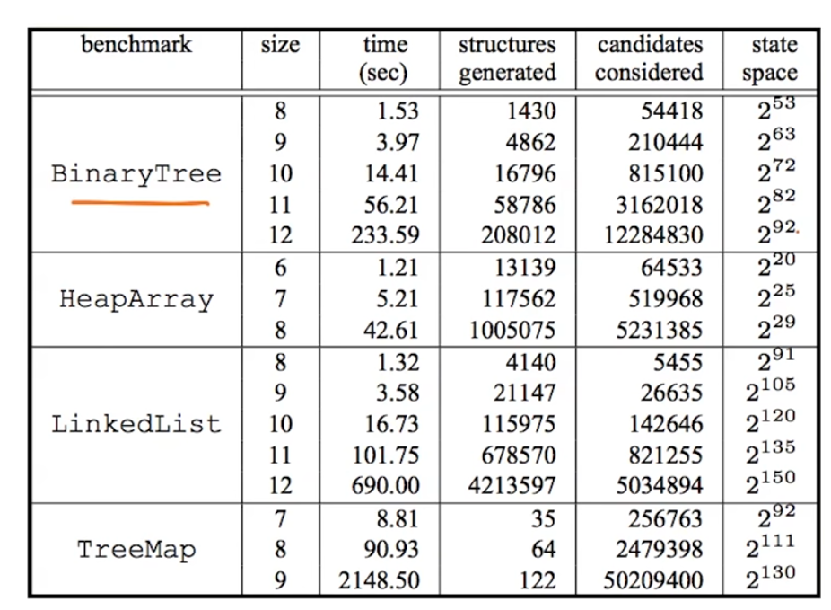
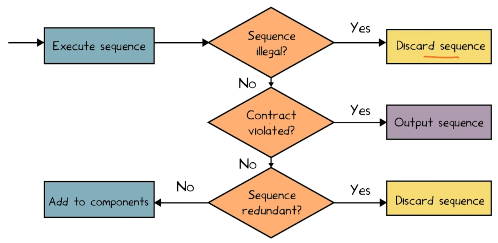

# L4 Automated Test
## Outline
- Previously: Random testing (Fuzzing)
    - Security, mobile app, concurrency
- Systematic testing: Korat
    - Linked data structures
- Feedback-directed random testing: Randoop
    - Classes, libraries

## Korat
- a deterministic Test-generationor 
-  originated as a research project
- Leverage pre-conditions and post-conditions to generate tests automatically

## The Problem
- There are infinitely many tests
    - which finite subset should we choose?
- And even finite subsets can be huge
- Need a subset which is:
    - Concise: avoid illegal and redundant tests
    - Diverse: gives good coverage

## An Insight
- Often can do a good job by systenatically testing all inputs up to a small size
- Small Test Case Hypothesis:
    - If there is any test that causes the program to fail, there is a small such test
- If a list functions works for lists of length 0 through 3, probably works for all lists
    -  E.g., because the functions is oblivious to the length


## How Do We Generate Test Inputs?
- Use the type
- The class declaration shows what values (or null) can fill each field
- Simply enumerate all possible shapes with a fixed set of `Nodes`.
``` java
class BinaryTree {
    Node root;
    class Node {
        Node left;
        Node right;
    }
}
```

## Scheme for Representing Shapes
- Order all possible values of each field
- Order all fields into a vector
- Each shape == vector of field values

e.g.: Binary Tree of up to 3 Nodes


## Representing Shapes Quiz



## A Simple Algorithm
- User selects maximum in put size k
- Generate all possible inputs up to size k
- Discard input where pre-condition is false
- Run program on remaining inputs
- Check results using post-condition

## Enumerating Shapes Quiz
What is the total number of vectors of the above form?
4^7=16384

## The General Case for Binary Trees
The General Case for Binary Trees
- How many binary tress are there of size <= k?
- Calculation:
    - A BinaryTree object, bt
    - K Node objects, n0, n1, n2, n3...
    - 2k+1 Node pointers
        - root (for bt)
        - left, right (for each Node object)
    - k+1 possible values (n0, n1, n2, ... or null) per pointer
- (k+1)^(2k+1) possible "binary tree"

## A Lot of Trees!
- The number of "trees" explodes rapidly
    - k = 3: over 16,000 "trees"
    - k = 4: over 1,900,000 "trees"
- Limits us to testing only very small input sizes
- Can we do better?


## An Overestimate
- (k+1)^(2k+1) trees is a gross overestimate!
- Many of shapes are not even trees
- And many are isomophic

## How Many Trees?
Only 9 distinct binary trees with at most 3 node


## Another Insight
- Avoid generating inputs that don't satisfy the pre-condition in the first place
- Use the pre-condition to guide the generation of tests

## The Technique
- Instrument the pre-condition
    - Add code to observe its actions
    - Record fields accessed by the pre-condition
- Observation:
    - if the pre-condition doesn't access a filed, then pre-condition doesn't depend on the field

## The Pre-Condition for Binary Trees 
- Root may be null
- If root is not null
    - No cycles
    - Each node (excpet root) has one parent
    - Root has no parent
``` java
public boolean repOK(BinaryTree bt) {
    if (bt.root == null) return true;
    Set visited = new HashSet();
    List workList = new LinkedList();
    visited.add(bt.root);
    workList.add(bt.root);
    while (!workList.isEmpty()) {
        Node current = workList.removeFirst();
        if (current.left != null) {
            if (!visited.add(current.left)) return false;
            workList.add(current.left);
        }
       ... // similarly for current.right 
    }
    return true;
}
```

## Example Using the Pre-Condition
Consider when root == null
- The pre-condition accesses only the root as it is null
    - every possible shape for the other nodes would yield the same result
    - This single input eliminates 25% of the test!

## Enumerating Tests
- Shapes are enumerated by their associated vectors
    - Initial candidate vector: all fields null
    - Next shape generated by:
        - Expanding last field accessed in pre-condition
        - Backtracking if all possibilities for a field are exhausted 
- Key idea: Never expand parts of input not examined by pre-condition
- Also: Cleverly checks for and discard shapes isomorphic to previously-generated shapes

    
Paper describing the Korat algorithm: http://mir.cs.illinois.edu/marinov/publications/BoyapatiETAL02Korat.pdf


## Example: Enumerating Binary Trees


What are the next two legal, non-isomorphic shapes Korat generates?

## Experimental Results


## Strengths and Weaknesses
- Strong when we can enumerate all possibilitie
    - E.g. Four nodes, two edges per node
- Good for:
    - Linked data structures
    - Small, easily specified procedures
    - Unit testing
- Weaker 
    -   when enumeration is weak:
        - Integers, Floating-point numbers, Strings
    - Only as good as the pre- and post-conditions


## Feedback-Directed Random Testing
RANDOOP 
- Random Tester for Object-Oriented Programs

bugs in JDK:
``` java
public static void test() {
    LinkedList l1 = new LinkedList();
    Object o1 = new Object();
    l1.addFirst(o1);
    TreeSet t1 = new TreeSet(l1);
    Set s1 = Collections.unmodifiableSet(t1);

    // This assertion fails
    assert(s1.equals(s1));
}

```
## Overview
- Problem with uniform random testing: Creates too many illegal or redundant tests
- Idea: Randomly create new test guided by feedback from previously created tests
    - we use `test`, and `method sequence` interchangably
- Recipe:
    - Build new sequences incrementally, extending past sequences
    - As soon as a sequence is created, executed it
    - Use execution results to guid test generation towards sequences that crate new object states


## Randoop
Input:
    - classes under test
    - time limit
    - set of contracts
        - e.g. "o.hashCode() throws no exception"
        - e.g. "o.equals(o) == true"
Output:
    - contract-violating test cases
``` java
public static void test() {
    LinkedList l1 = new LinkedList();
    Object o1 = new Object();
    l1.addFirst(o1);
    TreeSet t1 = new TreeSet(l1);
    Set s1 = Collections.unmodifiableSet(t1);
    // No contract violated up to here (no excpetion been throw)
    
    assert(s1.equals(s1));  <=  Fails when executed
}
```


## Randoop Algorithm
- components = { int i = 0; boolean b = false; ...} // seed components
- Repeat until time limit expires
    - Create a new sequence
        - Randomly pick a method call `T ret m(T1, ...., Tn)`
        - For each argument of type `Ti`, randomly pick sequence `Si` from components that constructs an object `vi` of that type
        - Create `S new = S1; ...; Sn; T ret v new = m(v1...vn);`
    - Classify new sequence S new: discard / output as test / add to components

## Classifying a Sequence


## Illegal Sequences
- Sequences that "crash" before contract is checked 
    - E.g throw an exception
``` java
int i = -1;
Data d = new Date(2006, 2, 14);
d.setMonth(i); // pre: argument >= 0
assert(d.equals(d));
```

## Redundant Sequences
- Maintain set of all objects created in execution of each sequence
- New sequence is redundant if object created during its execution belongs to above set (using equals to compare)
    ``` java
    Set s = new HashSet();
    s.add("h1"); 

    assertTrue(s.equals(s));
    ```
    equals
    ``` java
    Set s = new HashSet();
    s.add("h1"); 
    s.isEmpty();

    assertTrue(s.equals(s));
    ```
- Could also use more sophisticated state equivalence methods

## Some Errors Found by Randoop
- JDK containers have 4 methods that violate `o.equals(o)` contract
- `Javax.xml` creates objects that cause `hashCode` and `toString` to crash, even though objects are well-formed XML constructs
- Apache libraries have constructors that leave fields unset, leading to NPE on calls of `equals`, `hashCode`, and `toString`
- .Net framework has at least 175 methods that throw an exception forbidden by the library specification(NPE, out-of-bounds, or illegal state exception)
- .Net framework has 8 methods that violate `o.equals(o)` contract

## Randoop Test Generation Quiz 1
``` java
class BinayTree {
    Node root;
    public BinaryTree(Node r) {
        root = r;
        assert(repOk(this));
    }
    public Node removeRoot() {
        assert(root != null);
        ... 
    }
}
class Node {
    Node left;
    Node right;
    public Node(Node l, Node r) {
        left 
    }
}
```
Write the smallest sequence that Randoop can possibly generate to create a valid Binary Tree.
``` java
Node v = null;
BinaryTree bt = new BinaryTree(v);
```
Once generated, how does Randoop classify it?
- [ ] Discards it as illgal
- [ ] Outputs it as a bug
- [X] Adds to components for future extension

## Quiz 2
Write the smallest sequence that Randoop can possibly generate to that violates the assertion in `removeRoot()`
``` java
Node v = null;
BinaryTree bt = new BinaryTree(v);
bt.removeRoot();
```
Once generated, how does Randoop classify it?
- [X] Discards it as illgal
- [ ] Outputs it as a bug
- [ ] Adds to components for future extension

## Quiz 3
``` java
public boolean repOK(BinaryTree bt) {
    if (bt.root == null) return true;
    Set visited = new HashSet();
    List workList = new LinkedList();
    visited.add(bt.root);
    workList.add(bt.root);
    while (!workList.isEmpty()) {
        Node current = workList.removeFirst();
        if (current.left != null) {
            if (!visited.add(current.left)) return false;
            workList.add(current.left);
        }
    // similarly for current.right
    }
    return true;
}
```
Write the smallest sequence that Randoop can possibly generate to that violates the assertion in BinaryTree's constructor.

``` java
Node v1 = new Node(null, null);
Node v2 = new Node(v1, v1);
BinaryTree bt = new BinaryTree(v2);
```
Can Radoop create a BinaryTree object with cycles using the given API?
- [ ] Yes
- [X] No
## Korat and Randoop
identify which statements are true for each test generation technique:
<br> | Korat | Randoop
---|--|--
Use type information to guid test generation. | X | X
Each test is generated fully independently of past tests. |
Generates tests deterministically. | X | 
Suited to test method sequences. | |X
Avoids generating generting redundant tests | X | X

## What Have We Learned?
- Automatic test generation is a good idea
    - Key: avoid generating illegal and redundant tests
- Even better, it is possible to do 
    - At least for unit tests in strongly-typed languages
- Being adopted in industry
    - Likely to become widespread

