# 5. Dataflow Analysis

## Introduction to Dataflow Analysis
Many approaches with different strengths and limitations
- Soundness
- Completeness
- Applicability
- Scalability


## What Is Dataflow Analysis?
- Static analysis reasoning flow of data in program
- Different kinds of data: constants, variables, expressions
- Used by bug-finding tools and compilers

## The While Language

## Control-Flow Graphs
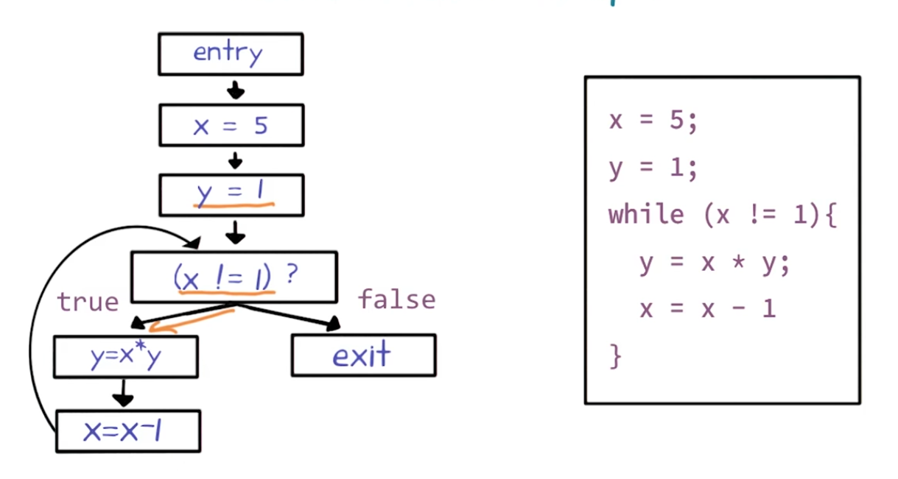
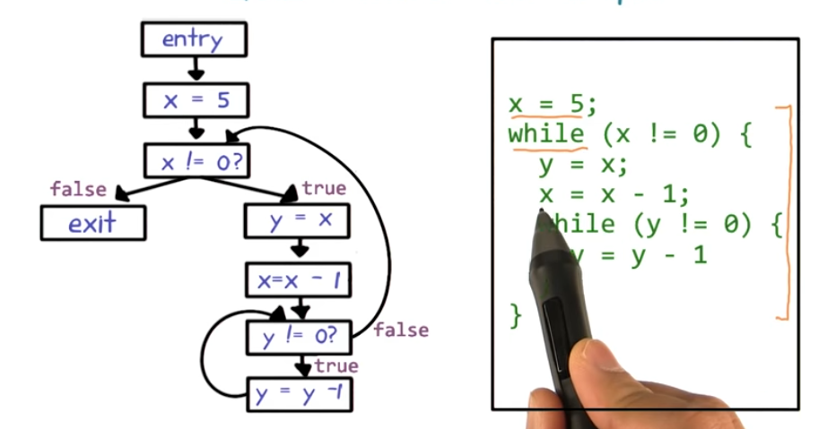

## Soundness, Completeness & Termination
- Impossible for analysis to achieve all three together 
- Dataflow analysis sacrifices completeness
- Sound: Will report all facts that could occur in actual runs
- Incomplete: May report additional facts that can't occur in actual runs 

## Abstracting Control-Flow Conditions
- Abstracts away control-flow conditions with non-deterministic choice(*)
- Non-deterministic choice => assume condition can evalute to true or false
- Considers all paths possible in actual runs(sound) and maybe paths that are never possible(incomplete).

## Applications of Dataflow Analysis
- Reaching Definitions Analysis
    - Find usage of uninitialized variables
- Very Busy Expression Analysis
    - Reduce code side
- Available Expression Analysis
    - Avoid recomputing expressions
- Live Variables Analysis
    - Allocate registers efficiently

## Reaching Definitions Analysis
Goal: Determine, for each program point, which assignments have been made and not overwrittern, when execution reaches that point along some path

"Assignment" == "Definition"


## Reaching Definitions Analysis Quiz
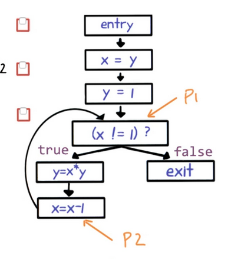

- [X] The assignment y = 1 reaches P1
- [ ] The assignment y = 1 reaches P2
- [X] The assignment y = 1 reaches P1

## Result of Dataflow Analysis (Informally)
- Set of facts at each program point
- Give distinct label n to each node
- For reaching definitions analysis, fact is a pair of the form: `<defined variable name, defining node lable>`
    - Examples: `<x,2>, <y,5>`
- IN(N) = set of facts at entry of node n
- OUT(N) = set of facts at exit of node n
- Dataflow analysis computes IN(n) and OUT(n) for each node
_ Repeat two operations until IN(n) and OUT(n) stop chaning
    - called "saturated" or "fixed point"

## RDA Operation 
- $IN[n]=\bigcup OUT[n^{\prime}] \space\space\space\space\space n^{\prime} \in \space predecessors(n)$
- $OUT[n] = (IN[n] - KILL[n]) \bigcup GEN[n]$
    - n: x = a
        - $GEN[n]=\{\langle x, n\rangle\}$
        - $KILL[n]=\{\langle x, m\rangle ： m \space != n\}$
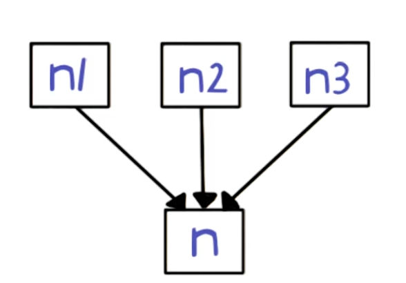


[Set-builder notation](https://en.wikipedia.org/wiki/Set-builder_notation)

## RDA Chaotic Iteration Algorithm
Overall Algorithm: Chaotic Iteration
``` C
For(each node n):
    IN[n] = OUT[n] = {}
OUT[entry] = { <v, ?> : v is a program variable} // each varible is undefined for the entry of the program

Repeat:
    For (each node n) :
        IN[n] = U OUT [n'] // n' is predecessors(n)
        OUT[n] = (IN[n] - KILL[n]) U GEN[n]
    until IN[n] and OUT[n] stop changing for all n
```
- Iterative: repeatedly updates the IN and OUT sets
- Chaotic: the order in which the nodes are visited does not matter

## Reaching Definitions Analysis Example
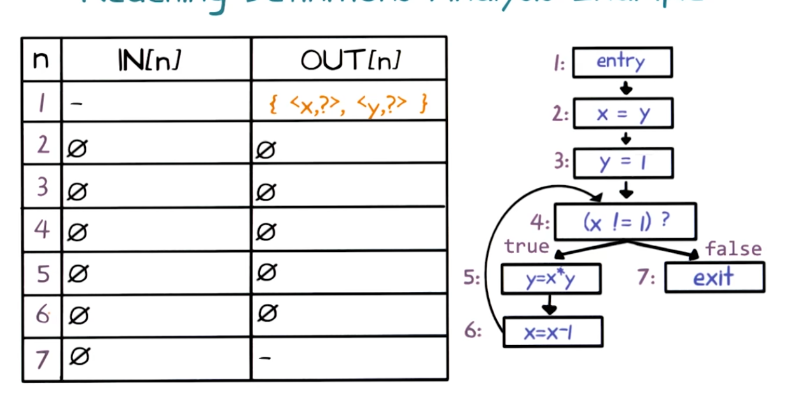
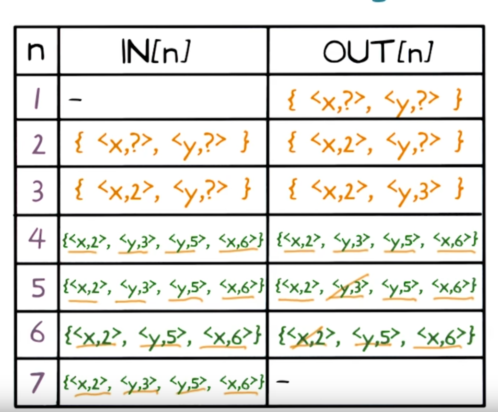

## Does It Always Terminate?
Chaotic Iteration algorithm always terminates
- The two operations of reaching definitions analysis are monotonic
    - IN and OUT sets are never shrink, only grow
- Largest they can be set of all definitions in program
    - IN and OUT sets cannot grow forever
- IN and OUT will stop changing after some iteration

## Very Busy Expressions Analysis
Goal: Determine very busy expressions at the exit from the point
An expression is very busy if, not matter what path is taken, the expression is used before any of the variables occurring in it are redefined

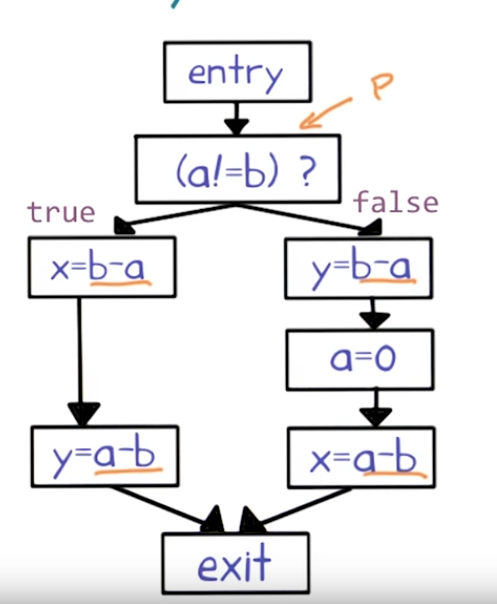
- `b-a` is very busy
- `a-b` is not


## VBEA Operations

- $OUT[n]=\bigcap IN[n^{\prime}] \space\space\space\space\space n^{\prime} \in \space successors(n)$
- $IN[n] = (OUT[n] - KILL[n]) \bigcup GEN[n]$
    - n: x = a
        - $GEN[n]=\{a\}$
        - $KILL[n]=\{\text{expr e : e contains x} \}$
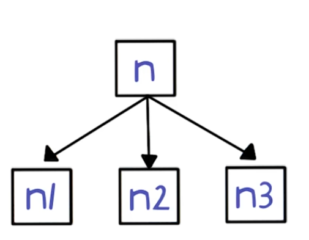


## VBEA Chaotic Iteration Algorithm
``` C
For(each node n):
    IN[n] = OUT[n] = set of all exprs in program
IN[entry] = {}


Repeat:
    For (each node n) :
        OUT[n] = ⋂ IN [n'] // n' is successors(n)
        IN[n] = (OUT[n] - KILL[n]) U GEN[n]
    until IN[n] and OUT[n] stop changing for all n
```

##Very Busy Expressions Analysis Example
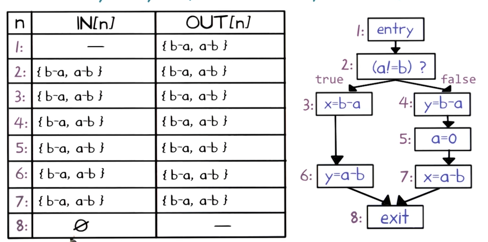

## Available Expressions Analysis
Goal: Determine, for each program point, which expressions must already have been computed, and not later modified, on all paths to the program point
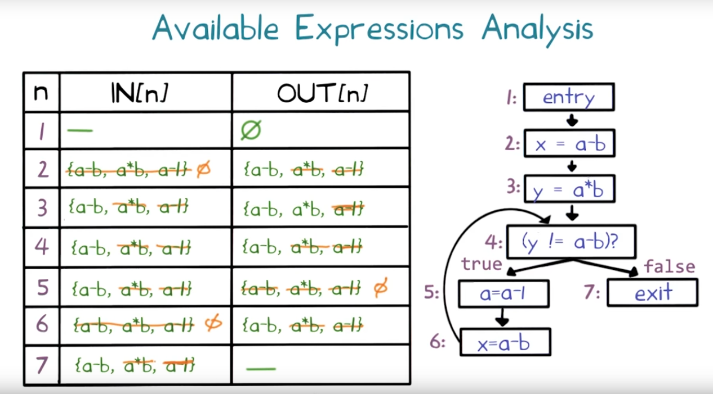

## Live Variables Analysis
Goal: Determine, for each program point, which variable could be live at the point's exit
A variable is live if there is a path to a use of variable that of the variable that doesn't redefine the variable
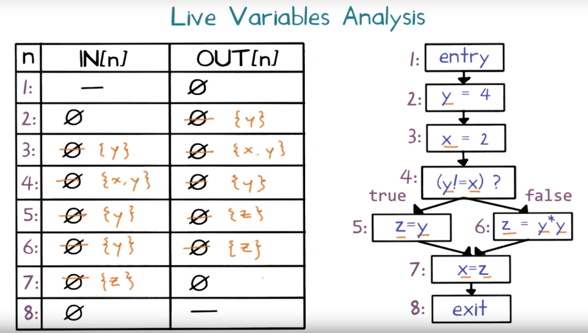


## Classifying Dataflow Analyses
</br>| May | Must
---|---|---
**Forward**| Reaching Definitions| Available Expressions
**Backward**|Live variables| Very Busy Expression


## What Have We Learned?
- What is dataflow analysis
- Reasoning about flow of data using control-flow graphs
- specifying dataflow analyes using local rules
- Chaotic iteration algorithm to compute global properties
- Four classical dataflow analysis
- Classification: forward vs. backward, may vs must

