# L6 Pointer Analysis
## Introducing Pointers
Example withot pointer
``` java
x = 1;
         <== [x == 1]
y = x;
         < == [y == 1]
assert(y==1)
```

Same example with pointers
``` java
Circle x = new Circle();
x.radius = 1
         <== [x.radius == 1]
y = x.radius
         <== [y == 1]
assert(y==1)
```

## Pointer Aliasing
Situation in which same address referred to in different ways
``` java
Circle x = new Circle();
Circle z = ?

x.radius = 1
         <== [x.radius == 1]
z.radius = 2;
         <== [x.radius == ?]

y = x.radius
assert(y==1)
```


## May-Alias Analysis
- Analysis tracks the fact that it is not true that x and z may alias
- May-Alias Analysis also called  Pointer Aliasing 

``` java
Circle x = new Circle();
Circle z = new Circle();
        <== [x != z]

x.radius = 1
        <== [x.radius == 1, x != z]
z.radius = 2;
        <== [x.radius == 1]
y = x.radius
assert(y==1)
```

## Must-Alias Analysis
``` java
Circle x = new Circle();
Circle z = x
        <== [x == z]

x.radius = 1
        <== [x.radius == 1, x == z]
z.radius = 2;
        <== [x.radius == 2, x == z]
y = x.radius
assert(y==1)
```
Analysis tracks the fact that x and z must-alias

- May-Alias and Must-Alias are dual problems
- Must-Alias more advanced, less useful in practice
- Focus of this lesson: May-Alias Analysis

## Why Is Pointer Analysis Hard?
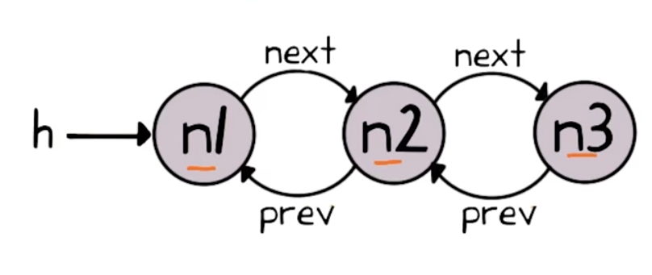
A precise data flow analysis of this program would need to keep track of all possible ways of accessing each nodes `data` field
- h.data
- h.next.pre.data
- h.next.prev.next.prev.data
- And many more ...

## Approximation to the Rescue
- Pointer analysis problem is undecidable
    - We must sacrifice some combination of Soundness, Completeness, Termination
- We are going to sacrifice completeness
    - False positives but no false negatives
- Many sound approximate algorithms for pointer analysis
- Generate false positive, but varying levels of precision
- Differ in two key aspects
    - How to abstract the heap (i.e. dynamically allocated data)
    - How to abstract control-flow 
        - Data flow analyse approximates all branch conditions in CFG using non-deterministic choice
        -  Pointer analyses typically go futher, in that they ignore control-flow entirely and instead look at the program as a set of unordered statements.

## What False Positives Mean
- x May-Alias Z?
    - Yes means may or may not be aliases (has false positvie)
    - No means must not be aliases
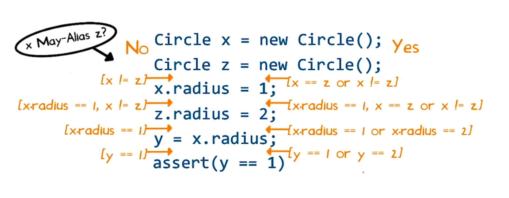

## Example Java Program
``` java 
void doit(int M, int N) {
    Elevator v = new Elevator();

    v.floors = new Object[M];
    v.events = new Object[N];

    for (int i = 0; i < M; i++) {
        Floor f = new Floor();
        v.floors[i] = f;
    }

    for (int i = 0; i < N; i++) {
        Event e = new Event();
        v.events[i] = e;
    }
}
```

``` java
doit(3,2);

```

## Abstracting the Heap
Result of Heap Abstraction: Points-to Graph
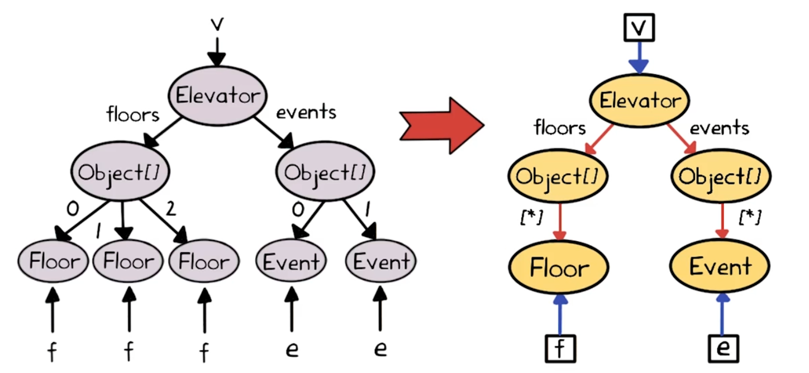
In a general points-to graph, there are 
- two kinds of nodes
    - Variables
        - denoted by boxes
    - Allocation sites
        - denoted by ovals
- directed graph
    - Allows from a variable node to an allocation site node <= Blue
    - Allows from an allocation site to another allocation site <= Read and labeled by a field name. 

## Abstracting Control Flow
- Too expensive to race a separate set of data flow facts at each program point

### Flow Insensitivity
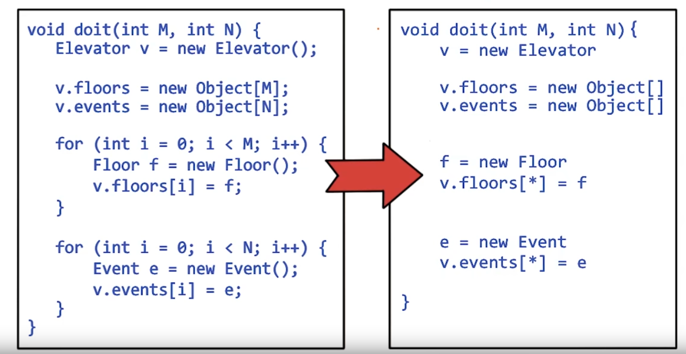


## Chaotic Iteration Algorithm
``` c
graph = empty
Repeat:
    for (each statement s in set) 
        apply rule corresponding to s on graph
until graph stop changing
```

## Kinds of Statements
``` c++
(statement)  s ::= v = new ... | v = 2
            | v2 = v.f | v.f = v2
            | v2 = v[*] | v[*] = v2
(pointer-type variable) v
(pointer-type field) f
```
## Is This Grammar Enough?
Yes
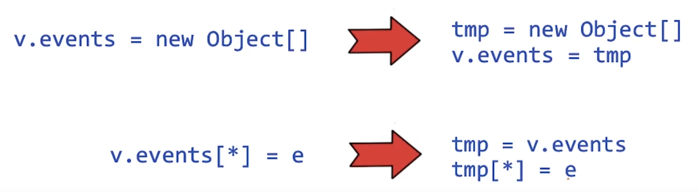

## Example Program in Normal Form
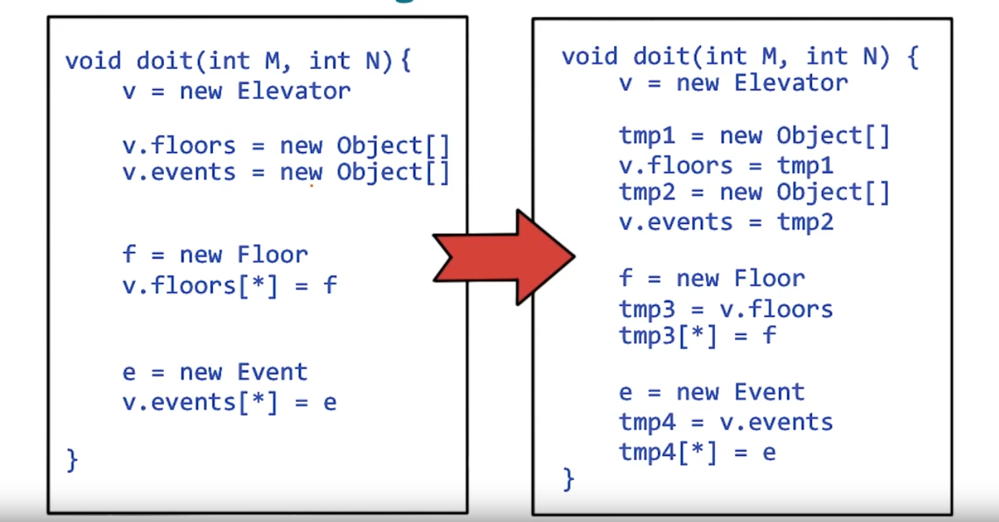


## Rule for Object Allocation Sites
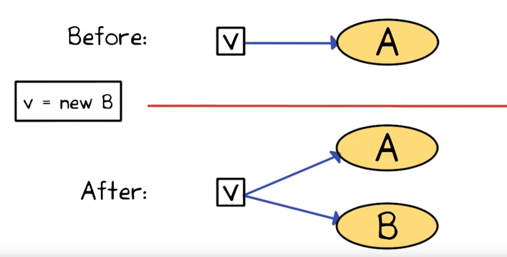

## Rule for Object Copy
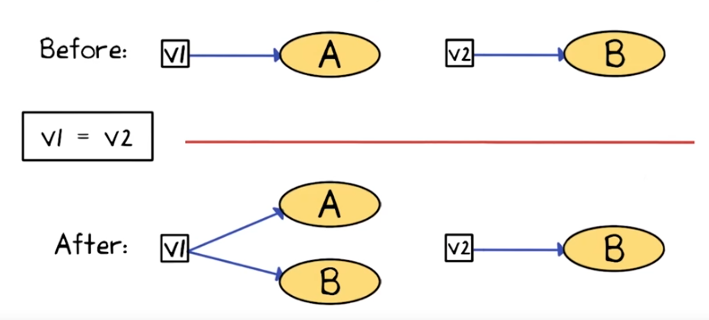

##  Rule for Field Writes
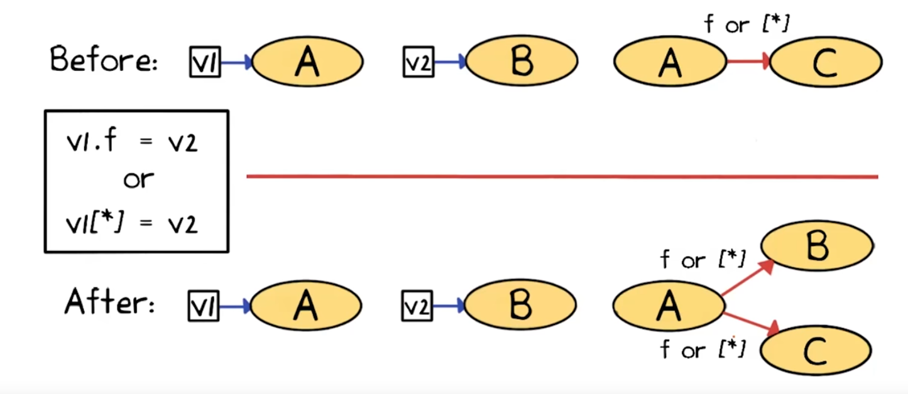
- if there isn't already a node for v1 or v2, then handle it in the next iteration
- if v1 and v2 point to the same node, then add arrow from the node to itself

## Rule for Field Reads
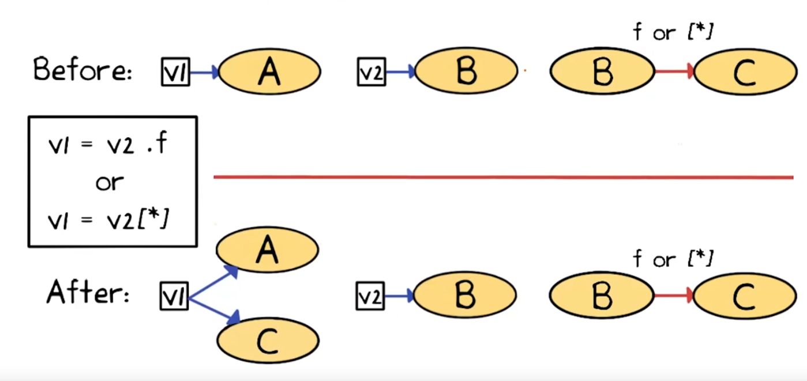

## Pointer Analysis Example
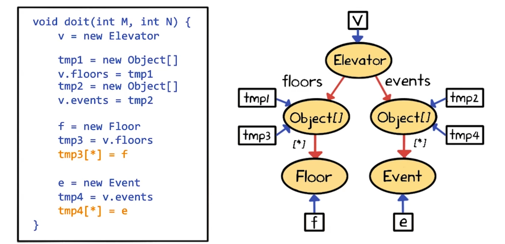


## Pointer Analysis Example 2
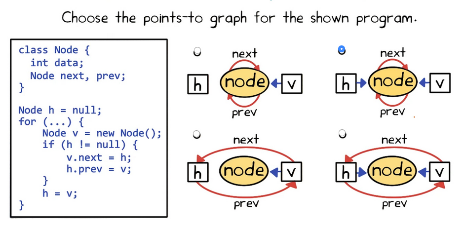

## Classifying Pointer Analysis Algorithms
- Is it flow-sensitive?
- Is it context-sensitive?
- What heap abstraction scheme is used?
- How are aggregate data type modeled?

## Flow Sensitivity
- How to model control-flow **within** a procedure(Intra-procedural Control-flow)
- Two kinds: flow-insensitive vs. flow-sensitive
- Flow-insensitive == weak updates
    - Suffices for may-alias analysis
- Flow-sensitive == strong updates
    - Required for must-alias analysis

## Context Sensitivity
- How to model control-flow **accross** a procedure(Inter-procedural Control-flow)
- Two kinds: context-insensitive vs. context-sensitive
- Context-insensitive: analyze each procedure once
- Context-sensitive: analyze each procedure possibly multiple tines, once per abstract calling context

## Heap Abstraction
- Scheme to partition unbounded set of concreate objects into finitely many abstract objects (oval nodes in points-to graph)
- Ensures that pointer analysis terminates
- Many sound schemes, varying in precision and efficiency
    - Too few abstract objects => efficient but imprecise
    - Too many abstract objects => inefficient but precise

## Scheme #1: Allocation Site-Based
- One abstact object per **allocation site**
- Allocation site identified by:
    - `new` keyword in Java/C++
    - `malloc()` call in C
- Finitely many allocation sites in programs
    - finitely many abstract objects
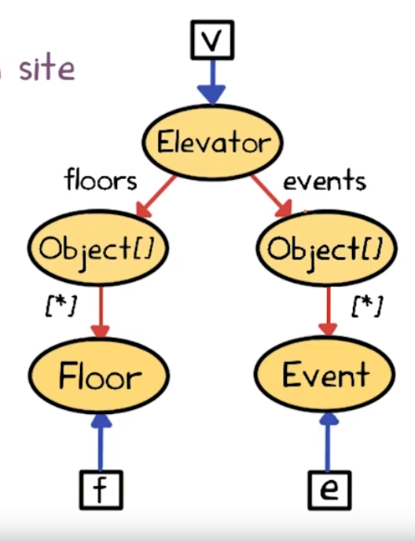

## Scheme #2: Type-Based
- Allocation-site based scheme can be costly
    - large programs
    - clients needing quick turnaround time
    - overly fine granularity of sites
- One abstract object per type
- Finitely many types in programs
    - finitely many abstract objects
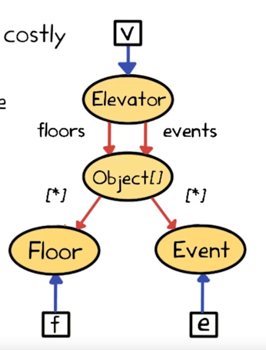


## Scheme #3: Heap-Insensitive
- Single abstrace object representing entire heap
- Popular for languages with primarily stack-directed pointers (e.g. C)
- Unsuitable for langueages with only heap-directed pointers (e.g. Java)
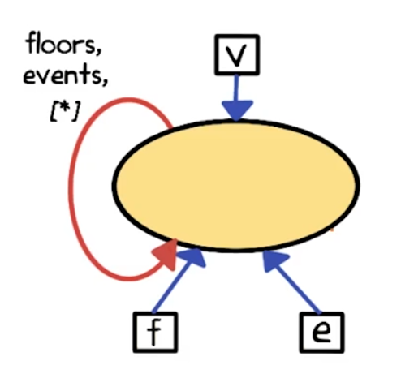

## Tradeoffs in Heap Abstraction Schemes
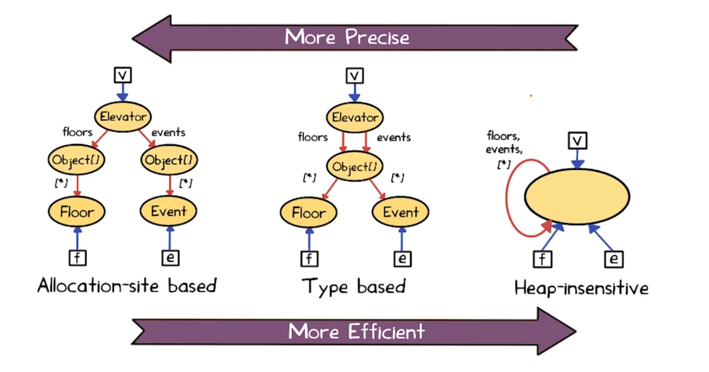

## Modeling Aggregate Data Types: Arrays
- Common choice: single filed [*] to represent all array elements
    - Cannot distinguish different elements of same array
- More sophisticated representations that make such distinctions are employed by array dependence analyses
    - Used to parallelize sequential loops by parallelizing compilers

## Modeling Aggregate Data Types: Records
- Recodes:
    - struct in C
    - class in java
- Three choices:
    1. Filed-insensitive: merge **all** fields of **each** record object
    2. Filed-based: merge **each** fields of **all** record object
    3. Filed-insensitive: keep **each** fields of **each** (abstract) record object separate <= the way we have learned previously


## May-Alias Analysis
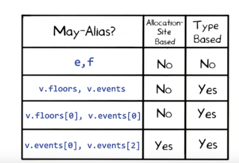
## What Have We Learned?
- What is pointer analysis?
- May-alias analysis vs. Must-alias analysis
- Points-to graphs
- Working of a pointer analysis algorithm
- Classifying pointer analyses
