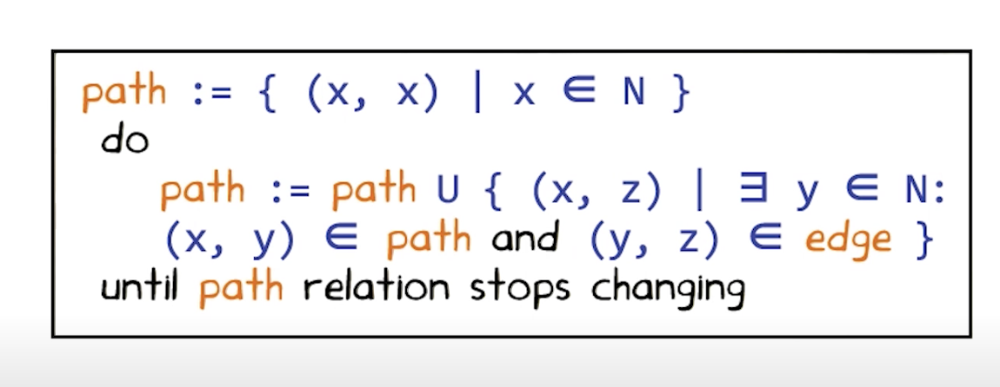
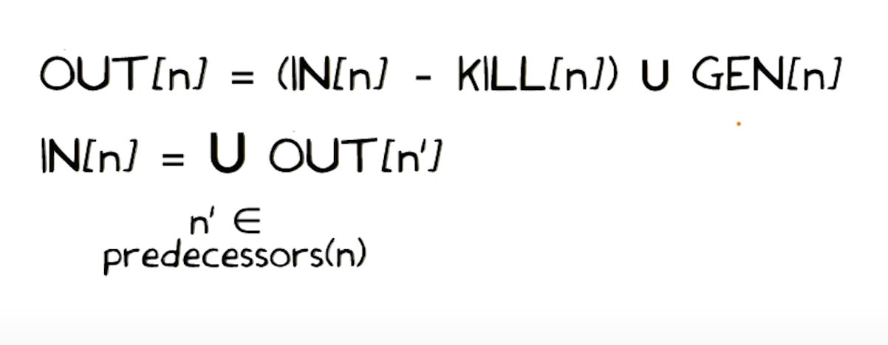
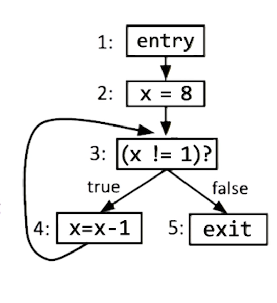
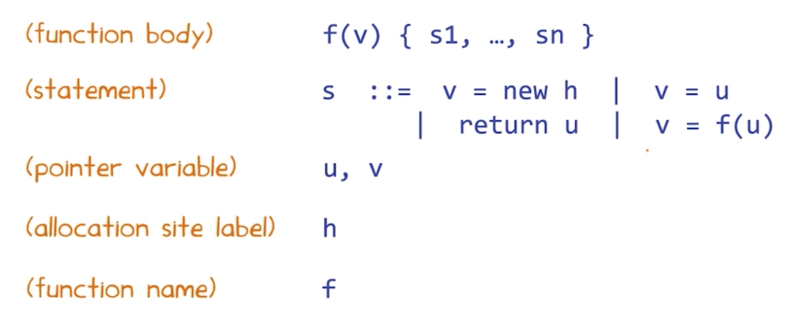
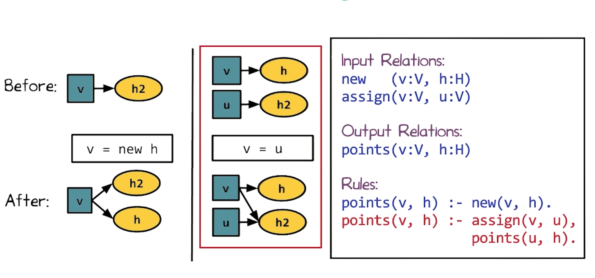
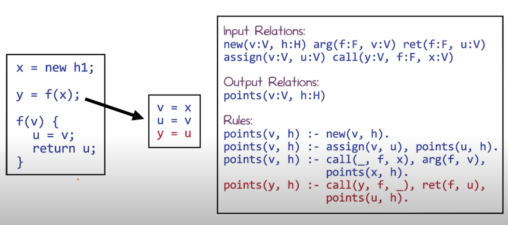
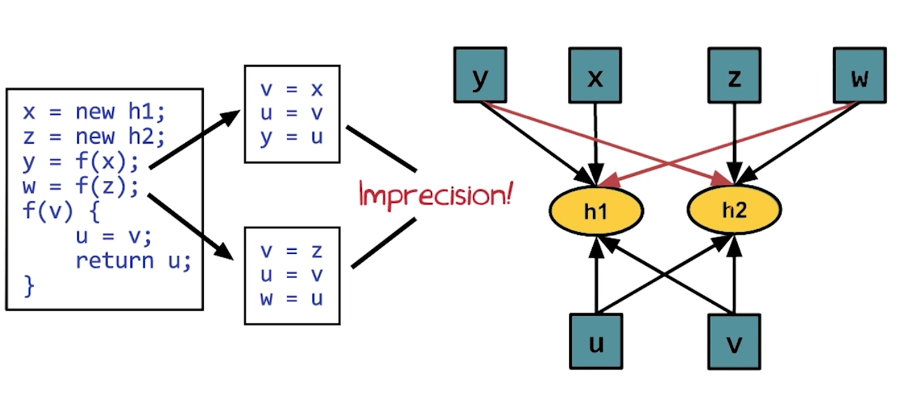
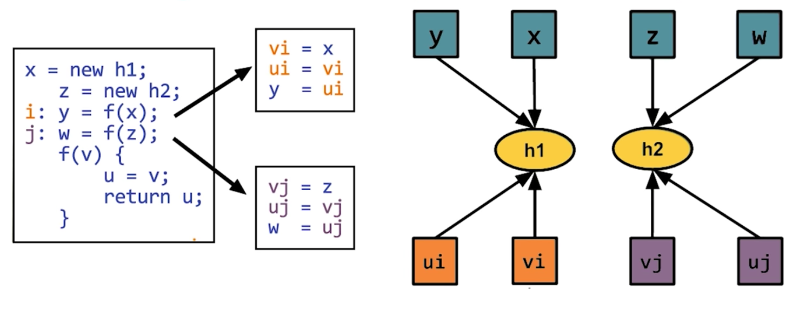
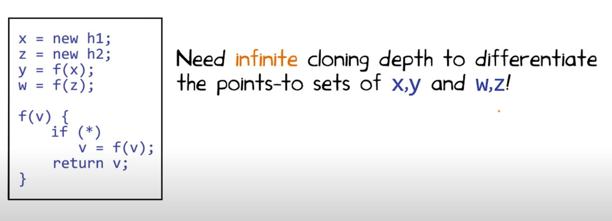

# L7 Pointer Analysis
## Intro to Constraint-based Analysis
- Constraint-based Analysis is concerned with the specification of the analysis (what), rather than the implementation (how)
- The analysis specification takes the form of constraints, while the analysis implementation involves solving these constraints.
- This separation of concerns
    - Simplifies Design and Understanding of Analysis
    - Allows Rapid Prototyping
    - Continuous Performance Improvement

## Motivation
Designing of efficient program analysis is challenging:
Program Analysis = Specification + Implementation
- What
    - e.g. No null pointer is dereferenced along any path in the program
- How
    - Many design choices:
        - forward vs. backward traversal 
        - symbolic vs. explicit representation
        - ...
    - Even forward vs backward choice is nontrivial
        - No null pointer assignments (v = null): forward is best
        - No pointer dereferences (v->next): backward is best
         
## What Is Constraint-based Analysis?
Program Analysis  = Specification + Implementation
- "What": Defined by the user in the constraint language
- "How": Automated by the constraint solver

## Benefits of Constraint-based Analysis
- Separates analysis specification from implementation
    - Analysis writer can focus on "what" rather then "how"
- Yields natural program specifications
    - Constraints are usually local, whose conjunctions capture global properties
- Enables sophisticated analysis implementations
    - Leverage powerful, off-the-shelf solvers


## Specification & Implementation Quiz
Consider a dataflow analysis such as live variables analysis, if one expresses it as a constraint-based analysis, one must still decide:
- [ ] The order which statements should be processed
- [X] What the gen and kill sets for each kind of statement are.
- [ ] In what language to implement the chaotic iteration algorithm
- [X] whether to take intersection or union at merge points


## Outline of the Lesson
- A constraint language: Datalog
- Two static analysis in Datalog:
    - Intra-procedural analysis: computing reaching definitions
    - Inter-procedural analysis: computing points-to information


## A Constraint Language: Datalog
- A declarative logic programming language.
- Not Turing-complete: subset of Prolog, or SQL with recursion
    - efficient algorithms to evaluate Datalog programs
- Originated as query language for deductive databases
- Later applied in many other domains: software analysis, data mining, networking, security, knowledge representation, cloud-computing...
- Many implementation: Logicblox, bddbddb, IRIS, Raddle,...


Learn more about Datalog from http://www.utdallas.edu/~gupta/courses/acl/papers/datalog-paper.pdf and from this online book: http://webdam.inria.fr/Alice/


## Syntax of Datalog: Example
``` Prolog
Input Relations:
edge(n:N, m:N)

Output Relations:
path(n:N, m:N)

Rules:
path(x,x). // (if TRUE,) there is a path from each node to itself
path(x,z) :- path(x,y), edge(y,z). // if there is a path from node x to y, and there is an edge from uy to z . then there is path from x to z.
```
Rules
- deductive rules that hold universally (i.e., variables like x,y,z can be replaced by any constant)
- Specify "if ... then ..." logic
- `.` 结束语句
- `,` AND
- 结论 :- 条件

## Semantics of Datalog: Example
1


## Computation Using Datalog Quiz
Check each of the below Datalog rules which correctly computes the relation strong connected componenet: scc(n1, n2) if and only if n2 is reachable from n1 and n1 is reachable from n2
- [ ] scc(n1, n2) :- edge(n1, n2), edge(n2, n1).
- [X] scc(n1, n2) :- path(n1, n2), path(n2, n1).
- [X] scc(n1, n2) :- edge(n1, n3), edge(n3, n2), edge(n2, n4), edge(n4, n1)
- [ ] scc(n1, n2) :- path(n1, n3), path(n2, n3).


##  Reaching Definitions Analysis

Input Relations:
- `kill (n:N, d:D)` //Definition d is killed by statement n.
- `gen(n:N, d:D)` // Definition d is generated by statement n.
- `next(n:N, m:N)` // Statement m is an immediate successor of statement n.

Output Relations:
- `in (n:D, d:D)`  // Definition d may reach the program point just before statement n.
- `out (n:N, d:D)` // Definition d may reach the program point just after statement n.

Rules:
- out(n,d) :- gen(n,d)
- out(n,d) :-  in(n,d) , !kill(n,d).
- in(m,d) :- out(n,d), next (n,m) 

### Examples

```
Input Tuples:
kill(4,2)
gen(2,2), gen(4,4)
next(1,2), next(2,3)
next(3,4), next(3,5)
next(4,3)

Output Tuples:
in(3,2), in(3,4), in(4,2)
in(4,4), in(5,2), in(5,4)
out(2,2), out(3,2), out(3,4)
out(4,2), out(4,4), out(5,2)
out(5,4)
```


## Live Variables Analysis
- in(n,v) :- gen(nvd)
- in(n,v) :-  out(n,v) , !kill(n,v).
- out(n,v) :- in(m,v), next(n,m).

## Pointer Analysis in Datalog
consider a flow-insensitive may-alias analysis for a simple language


## Intra-procedural Pointer Analysis
Pointer Analysis in Datalog: Intra-procedural
we can ignore `return u` and `v=f(u)`



## Inter-procedural Pointer Analysis
Parameter passing and return can be treated as assignments!


## Querying Pointer Analysis
Which Datalog programs correctly computes the relation mustNotAlias: mustNotAlias(u,v) if and only if u and v do not alias in any run of the program
- [ ] mustNotAlias(u, v) :- points(u, h1), points(v, h2), h1 != h2.
- [ ] mayAlias(u, v) :- points(u, h), points(v, h).
      mustNotAlias(u, v) :- !mayAlias(u,v).
- [ ] mayAlias(u, v) :- points(u, _), points(v, _).
      mustNotAlias(u, v) :- !mayAlias(u,v).
- [ ] common(u, v, h) :- points(u,h), points(v,h).
      mayAlias(u, v) :- common(u, v, _).
      mustNotAlias(u, v) :- !mayAlias(u,v).

## Context Sensitivity


## Cloning-based Inter-procedural Analysis

- Achieves context sensitivity by inlining procedure calls
- Cloning depth increase:
    - Pro: precision increase
    - Cons: scalability decrease
        - If each functions calls tow other functions, the resources needed become exponential in the depth of the stack. 

## What About Recursion?

A research paper on handling recursion through cloning: http://suif.stanford.edu/papers/pldi04.pdf

## Summary-based Inter-procedural Analysis
- Using the incoming program states to differentiate calls to the same procedure
    - Same incoming program states yield same outgoing program states for a given procedure.
    - input and output pairs of program states are called summaries of the procedures
- As precise as cloning-based analysis with infinite cloning depth
Reading on summary-based inter-procedural analysis: https://research.cs.wisc.edu/wpis/papers/popl95.pdf


## Other Constraint Languages
Constraint Language | Problem Expressed | Example Solvers
---|--|--
Datalog| Least solution of deductive inference rules | LogixBox, bddbddb
SAT| Boolean satisfiability problem | MiniSat, Glucose
MAXSAT| Boolean satisfiability problem extended with optimization| open-wbo, SAT4j
SMT | Satisfiability module theories problem | Z3, Yices
MaxSMT | Satisfiability module theories problem extends with optimization | Z3

## What Have We Learned?
- Constraint based analysis and its benefits
- The Datalog constraint language
- Howe to express static analysis in Datalog
    - Analysis logic == constrains in Datalog
    - Analysis inputs and outputs == relations of tuples
- Context-insensitive and context-sensitive inter-procedural analysis

