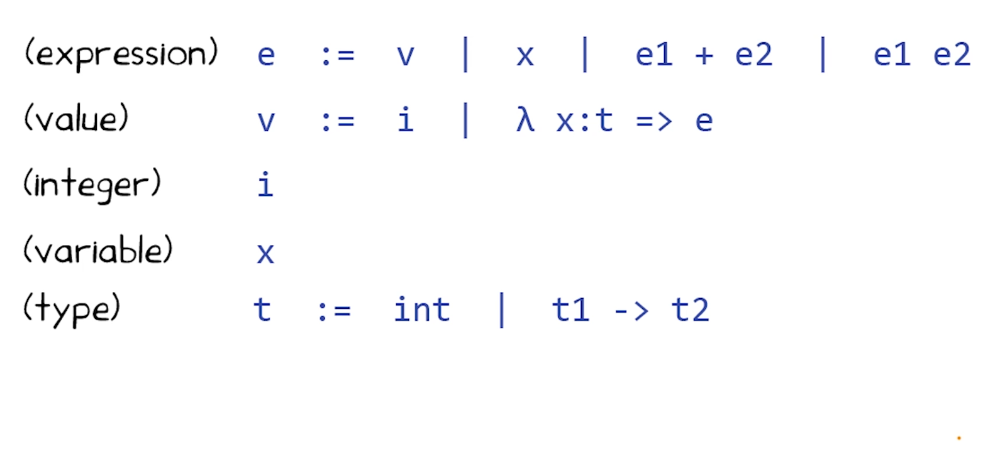
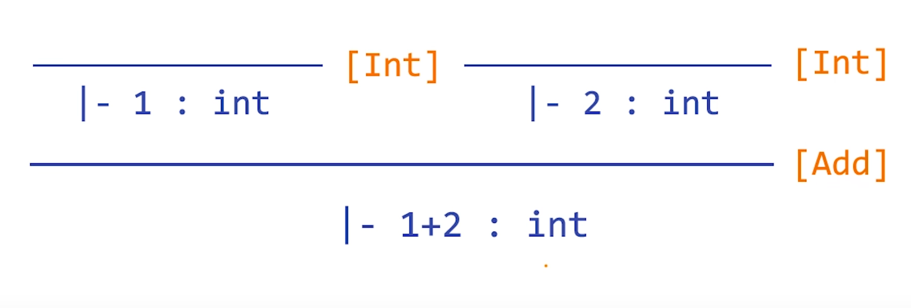
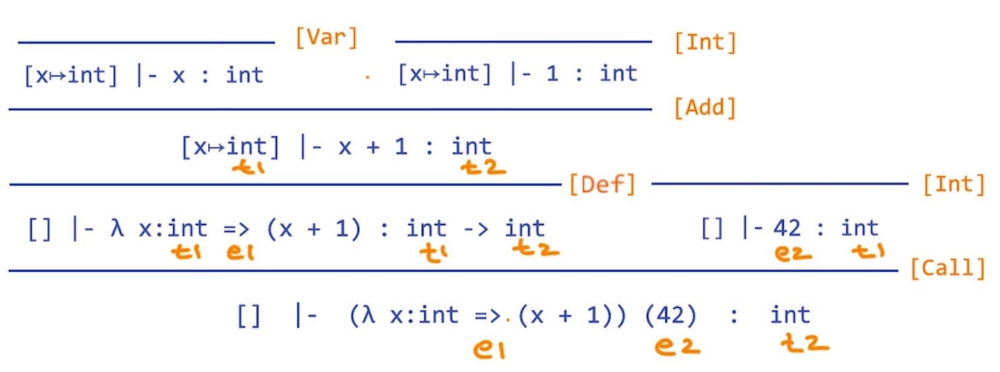
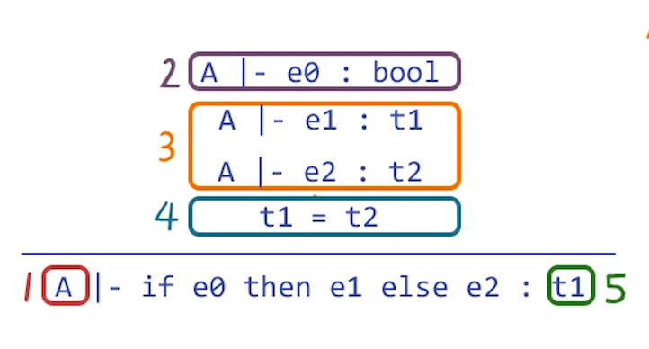
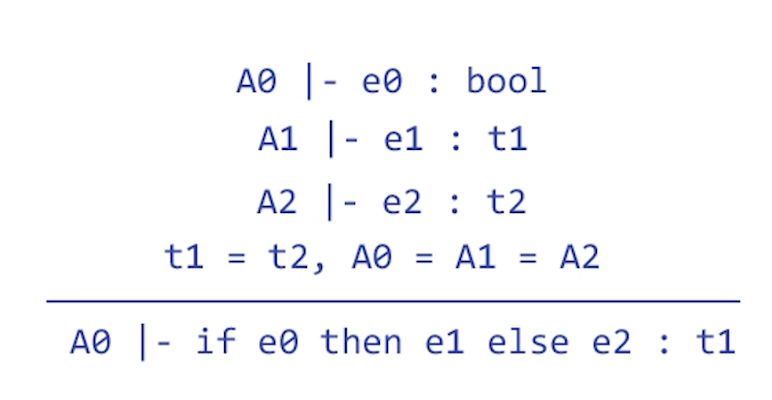

# L8 Type Systems
## Type Systems
- Most widely used form of static analysis
- Part of nearly all mainstream languages
    - important for quality
- Provides notation useful for describing static analysis:  
    - type checking, dataflow analysis, symbolic execution...

## Motivation
``` java
class T {
    int f(float a, int b, int[] c) {
        if (a) 
            return b;
        else 
            return c;
    }
}
```

``` shell
T.java 4 error: incompatible types 
    if(a)
       ^
    require: boolean
    found:   float

T.java 7 error: incompatible types 
    return c;
           ^
    require: int
    found:   int[]
```

## What Is a Type?
- A type is a set of values
    - Examples in Java:
        -  `int` is the set of all integers between -2^31 and (2^31) - 1
        - `double` is the set of all double-precision floating point numbers
        - `boolean` is the set of {`true`, `false`}
- A type is an example of abstract value
    - Represents a set of concrete values
    - In type systems:
        - Every concrete value is an element of some abstract value <=> every concrete value has a type
    
## More Examples
- `Foo` is the set of all objects of class `Foo`
- `List<Integer>` is the set of all `Lists` of `Integer` objects 
    - `List` is a type constructor
    - `List` acts as a function from types to types
- `int -> int` is the set of functions taking an `int` as input and returning another `int`

## Abstraction
- All static analyses use abstraction
    - Represent sets of concrete values as abstract values
- Why?  
    - Can't directly reason about infinite sets of concrete values (wouldn't guarantee termination)
    - Improves performance even in case of (large) finite sets
- In type systems, the abstraction are called types

## A Simple Typed Language

- type system will ensure (e1, e2) in e1 + e2 are int 
- (e1, e2) in e1 e2, e1 is function, e2 is int
``` shell
(
 λ x: int => (x + 1)
) (42)
```
## Programs and Types Quiz
``` shell
 λ x: int => (x + x) // int -> int
 (λ x: int => (x + x))(10) // int
 42 (λ x: int => (x + 5)) // None
 λ x: int => (λ x: int => (x+x)) // int -> (int -> int)
 (λ x: int => x) + 10 // None

```

## Next Steps
- Notation for Type Systems
- Properties for Type Systems
- Describing Other Analyses Using Types Notation

## Notation for Inference Rules
- Logic Implications "If-Then Statement"
    - Variables
    - Expressions
    - Functions

- Inference rules have the following form:
    - if (hypothesis) is true, then (conclusion) is true
- Example: Type checking computes via reasoning:
    if e1 is an int and e2 is a double, then e1*e2 is a double

## From English to Inference Rule
- Start with a simplified system and gradually add features
- Building block:
    - Symbol ^ is "and" (conjunction operator)
    - Symbol => is "if-then"
    - x:t is "x has type t"
- Example:
    - If e1 has type int and e2 has type int, then e1+e2 has type int
    - `(e1: int ^ e2 : int) => e1 + e2 : int`
- The statement: `(e1: int ^ e2 : int) => e1 + e2 : int` is a special case of 
    `Hypothesis_1  ^  .... ^ Hypothesis_n => Conclusion`

## Notation for Inference Rules
By tradition, inference rules are written:
$$\frac{\mid-\text { Hypothesis}_{1} \quad ... \quad \mid-\text { Hypothesis}_{\mathrm{N}}}{\mid-\text { Conclusion }}$$

Hypothesis and conclusion are type judgments:
$$ {\mid-\text { e : t}} $$

`|-`means "it is provable that..."
## Rules for Integers
- We refer to such a template rule as a schema
- no hypothesis schema is an axiom schema
- has hypothesis schema is an inference schema
$$\frac{}{ {|- \text { i : int }} } \quad \text { [Int]}$$
$$\frac{|-\text { e1 : int} \quad |-\text{ e2 : int}}{|-\text { e1 + e2 : int } }\quad \text { [Add]}$$


- Templates for how to ype integers and sums
- Filling in templates produces complete typings
- Note that:
    - Hypotheses state facts about sub-expressions
    - Conclusions state facts about entire-expression

## Example: 1+2


## A Problem
- Carries type information for e in hypotheses
    $$\frac{\mid-\text { e: int}}{\mid-\text { e + e : int }}$$
- Doesn't carry enough information to give x a type
$$\frac{\text { }}{\mid-\text { x : ? }} \quad  {\text {[Var]}}$$

## A Solution
- Put more information in the rules
- An `environment` gives types for `free variables`
    - A variable is free in an expression if not defined within the expression; other it is `bound`
        - λx : int => (x + y)
        - x is bound,y is free
    - An `environment` is a function from variables to types
    - May map variables to other abstract values in different static analyses

## Type Environments
- Let A be a function from variables to types
- The sentence `A |- e : t` means:
- "Under the assumption that variables have types given by A, it is provable that the expression e has type t"

## Modified Rules
The Type environment is added to all rules:
$$ {A \space |- \text { i : int }} \quad \text { [Int]}$$
$$\frac{A \space|-\text { e1 : int} \quad A \space|-\text{ e2 : int}}{A \space|-\text { e1 + e2 : int } }\quad \text { [Add]}$$

## A New Rule
And we can write new rules:
$$\frac{}{ {A \space |- \text { x : A(x) }} } \quad \text { [Var]}$$

## Rules for Functions
$$\frac{A[x \rightarrow t] \space |- \text { e : t' }}{ {A \space |- \lambda\text { x : t => e : } t \rightarrow t' } } \quad \text { [Def]}$$

- $A[x \rightarrow t]$ means "A modified to map x to type t"
$$\frac{A\space |- \text { e1 : t1 ->t2 } \quad \quad A\space |- \text { e2 : t1 }}{ {A \space |- \text {e1} \space \space \text{e2: t2 }  } } \quad \text { [Call]}$$

## Type Derivations Example
从下往上看


## A More Complex Rule
$$\frac{A\space |- \text { e0 : bool } \quad A\space |- \text { e1 : t1 }  \quad  A\space |- \text { e2 : t2 }  \quad  \text { t1 = t2 }}{ {A \space |- \text{if e0 then e1 else e2: t1  }  } } \quad \text { [If-Then-Else]}$$

- `t1 = t2` is called side condition
- we'll use this rule to illustrate several ideas

## Soundness
A type system is sound iff:
- whenever 
    1. $A \space |- e:t$ and
    2. if $A(x)=t'$, then x has a value v' in t',
- Then e  evaluates to a value v in t

## Comments on Soundness
- Soundness is extremely useful
    - Program type-checks => no errors at runtime
    - Verifies absence of a class of errors
- This is a very strong guarantee
    - Verified property holds in all executions
    - "Well-typed programs cannot go wrong"
- Soundness comes at a price: false positives
- Alternative: use unsound analysis
    - Reduces false postivies
    - Introduces false negatives
- Type systems are sound
    - But most bug finding analyses are not sound

For Java: “Using static analysis to find bugs” http://ieeexplore.ieee.org/xpls/abs_all.jsp?arnumber=4602670&tag=1

For C: “A few billion lines of code later: using static analysis to find bugs in the real world” http://dl.acm.org/citation.cfm?id=1646374

## Constraints
Many analyses have side conditions
- Often constraints to be solved
- All constraints must be satisfied
- A separate algorithmic problem

## Another Example of Constraints
- Consider a recursive function
    - `f(x) = ... f(e) ...`
- if `x : t1` and `e : t2` then `t2 = t1`
    - Can be relaxed to `t2 ⊆ t1`
- Recursive functions yield recursive constraints
    - Same with `loops`
    - How hard constraints are to solve depends on constraint language, details of application

## Type-Checking Algorithm
Algorithm:
1. Input: Entire expresssion and A
2. Analyze `e0`, checking it is of type `bool`
3. Analyze `e1` and `e2`, giving types `t1` and `t2`
4. Solve `t1 = t2`
5. Return `t1`.


## Global Analysis
- Step 1 requires the overall environment A
    - Only then can we analyze subexpressions
- This is global analysis (top-down analysis)
    - Requires the entire program
    - Or constructing a model of the environment
``` java
int f(bool a, int b, int c) {
    if (a) then b else c
}
```
`A = [a->bool, b->bool, c->bool]`

## Local Analysis
Local Analysis (also called compositional analysis or bottom-up analysis)

Algorithm:
1. Analyze `e0`, inferring environment `A0`. Check type is `bool`.
2. Analyze `e1` and `e2`, giving types `t1` and `t2` and environments `A1` and `A2`.
3. Solve `t1 = t2` and `A0 = A1 = A2`
4. Return `t1` and `A0`.
``` java
int f(bool a, int b, int c) {
    if (a) then b else c
}
```
1. A0 = [a->bool]
2. A1 = [b->α] and A2 = [c->β]
3. α = β and [a->bool, b->α, c->α]
4. [a->bool, b->α, c->α] |- if (a) then b else c : α

## Global vs. Local Analysis
- Global Analysis:
    - Usually technically simpler than local analysis
    - May need extra work to model environments for unfinished programs
- Local Analysis:
    - More flexible in application
    - Technically harder: Need to allow unknown parameters, more side conditions

## Quiz Properties of Type Systems
Check the blow untypable programs that can "go wrong"
- [X] `42 (λ x: int => (x + 5))`
- [X] `(λ x: int => x) + 1`
- [ ] `if (true) then 1 else ((λ x: int => x) + 1)` <= 虽然always true path，但是我们依然reject
- [ ] `if (c != 0) then (λ x: int => x) else ((λ x: int->int => (x 1)))`
      `if (c != 0) then 1 else ((λ z: int->int => z))` <= 虽然程序untypable，但是运行的时候不会遇错
false positive

## Static Analysis Using Type Rules
把type notion类推到其他analysis
$$\frac{A\space |- \text { e1 : t1 } \quad \quad A\space |- \text { e2 : t2 }}{ {A \space |- \text{e: t }  } }$$

- `e` - The program (or program fragment to be analyzed)
- `t` - The abstract value computed for e
- `A` - Assumptions needed for aspects of e that are determined by e's environment
- 分子部分：Analysis of expression is recursively defined using analysis of subexpressions

## An Example: The Rule of Signs
- Goal: to estimate the sign of a numeric computation
- Example: `-3 * 4 = -12`
- Abstraction: `- * + = `

Abstract Values:
- `+` = { all positive integers}
- `0` = {0}
- `-` = { all negative integers}
- Environment `A: Variables -> {+, 0, -}`

## Example Rules
$$\frac{A\space |- \text { e1 : + } \quad \quad A\space |- \text { e2 : } -}{ {A \space |- \text{e1 * e2:  } -  } }$$
$$\frac{A\space |- \text { e1 : + } \quad \quad A\space |- \text { e2 : + }}{ {A \space |- \text{e1 * e2:  } +  } }$$
$$\frac{A\space |- \text { e1 : } - \quad \quad A\space |- \text { e2 : } - }{ {A \space |- \text{e1 * e2:  } + \ } }$$
$$\frac{A\space |- \text { e1 : 0 } \quad \quad A\space |- \text { e2 : } + }{ {A \space |- \text{e1 * e2: 0 }  } }$$

Need to add more rules

## Another Problem
$$\frac{A\space |- \text { e1 : + } \quad \quad A\space |- \text { e2 : } -}{ {A \space |- \text{e1 + e2:  } ?  } }$$

We don't have an abstract value that covers this case!

Solution:
- Add abstract values to ensure `closure` under all operations:
- `+` = { all positive integers}
- `0` = {0}
- `-` = { all negative integers}
- `Top` = {all integers}
- `BOT` = {}

all the abstract values in this examples represent subsets of TOP and supersets of BOT
## More Example Rules
$$\frac{A\space |- \text { e1 : + } \quad \quad A\space |- \text { e2 : } -}{ {A \space |- \text{e1 + e2:  TOP}   } }$$
$$\frac{A\space |- \text { e1 : + } \quad \quad A\space |- \text { e2 : + }}{ {A \space |- \text{e1 + e2:  } +  } }$$
$$\frac{A\space |- \text { e1 : } - \quad \quad A\space |- \text { e2 : } - }{ {A \space |- \text{e1 / e2: 0 }  } }$$
$$\frac{A\space |- \text { e1 : 0 } \quad \quad A\space |- \text { e2 : } + }{ {A \space |- \text{e1 / e2:  BOT}  } }$$
Need to add more rules

## Flow Insensitivity

$$\frac{A\space |- \text { e0 : bool } \quad A\space |- \text { e1 : t1 }  \quad  A\space |- \text { e2 : t2 }  \quad  \text { t1 = t2 }}{ {A \space |- \text{if e0 then e1 else e2: t1  }  } } \quad $$

- Subexpressions are independent of each other
- Flow-insensitive analysis: analysis is independent of the ordering of sub-expressions
    - analysis result unaffected by permuting statements
- Type systems are generally flow-insensitive

## Comments on Flow Insensitivity
- No need for modeling a separate state for each subexpression
- Flow insensitive analysis are often very efficient and scalable
- But can be imprecise...

##  Flow Sensitivity 
$$\frac{\begin{aligned} A\space |- \text { e0 : bool }  \triangleright A0 \\  A0\space |- \text { e1 : t1 } \triangleright A1  \\  A0\space |- \text { e2 : t2 } \triangleright A2 \\  \text { t1 = t2, A1 = A2}\end{aligned}}{ {A \space |- \text{if e0 then e1 else e2 } : t1 \triangleright A1 } } $$

- each statmen has an input environment and an output environment
- Rules produce new environments and analysis of subexpression cannot happen until its environment is available
- Flow-sensitive analysis: analysis of subexpressions ordered by environments
    - analysis result depends on order of statement
- Dataflow analysis is example of flow sensitive analysis, can be represented using type system like notations.

## Comments on Flow Sensitivity
- Example: Rules for sign extended with assignment statements
$$\frac{A\space |- \text { e : + } \triangleright A } { {A \space |- \text{ x :=  e}  }  \triangleright A [x \rightarrow + ]}   \quad $$
- $A [x \rightarrow + ]$ means A modified so that `A(x) = +`

- Flow-sensitive analysis can be expensive
    - Each statement has own model of state
    - Polynomial cost increase over flow-insensitive

## Path Sensitivity
consider certian part through the code are impossible to take

$$\frac{\begin{aligned} P, A\space |- \text { e0 : bool }  \triangleright A0 \\ P  \land \text{e0, A0} \space |- \text { e1 : t1 } \triangleright A1  \\ P  \land \text{!e0, A0} \space |- \text { e2 : t2 } \triangleright A2 \\  \text { t1 = t2}\end{aligned}}{ {P, A \space |- \text{if e0 then e1 else e2 } \quad : \text{t1, e0 ? A1 : A2}  } } $$

- `P` - Part of the environment is a predicate saying under what condition this  is executed 
- `e0 ? A1 : A2` - At points where control paths merge, still keep different paths separate in the final environment

## Comments on Path Sensitivity
- Symbolic execution is an example
    - Path-sensitive analyses also flow-sensitive
- Can be expensive but a necessary evil
    - Exponential number of paths to track
- Often implemented with backtracking
    - Explore one path
    - Backtrack to a decision point, explore another path

## Quiz : Flow & Path Sensitivity
Program | Property | Flow-sensitive | Flow-sensitive | Path-sensitive
--|-|-|-|-
`x = "a"; y = 5; z = 3+y; w = x + "b"` | No int plus string errors| X  | X | X
`x = 5; y = 1/x; x = 0` | No divide-by-zero|   | X | X
`if (y !=0) then 1 / y else y` | No divide-by-zero|   |  | X
`acquiredLock(r); releaseLock(r)` | Correct locking|   | X | X
`if (z > 0) then acquiredLock(r);` <br> `if (z > 0) then releaseLock(r)` | Correct locking|   |  | X


## Summary
- Very rough taxonomy:
    - Type systems = flow-insensitive
    - Dataflow analysis = flow-sensitive
    - Symbolic execution = path-sensitive
- Lines have been blurred
    - Many flow-sensitive type systens and path-sensitive dataflow analyses in research literature


## What Have we Learned
- What is a type
- Computing types of program using type rules
- Properties of type systems: soundness, incompleteness, global vs. local type checking


“Type Systems” by Luca Cardelli in CRC Handbook: http://lucacardelli.name/Papers/TypeSystems.pdf

“Types and Programming Languages” by Benjamin Pierce: https://www.cis.upenn.edu/~bcpierce/tapl/

“Advanced Topics in Types and Programming Languages” edited by Benjamin Pierce: https://www.cis.upenn.edu/~bcpierce/attapl/


