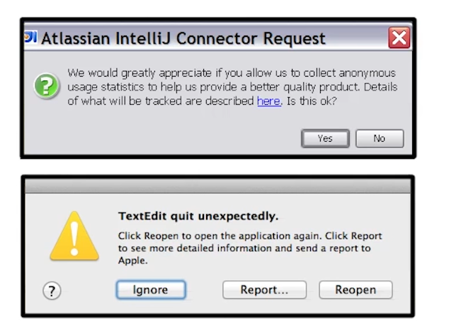
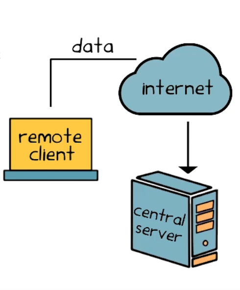
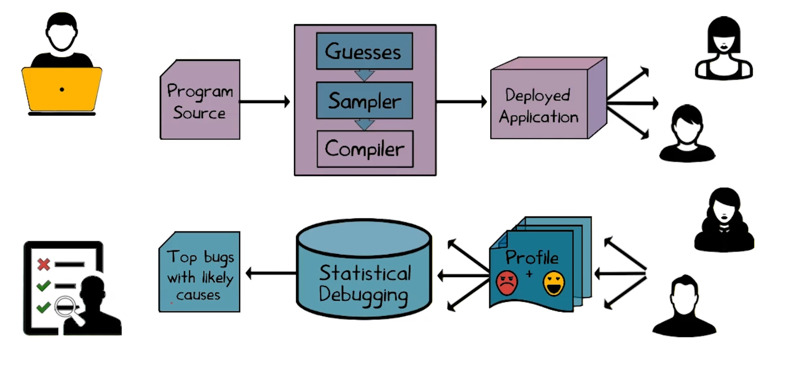
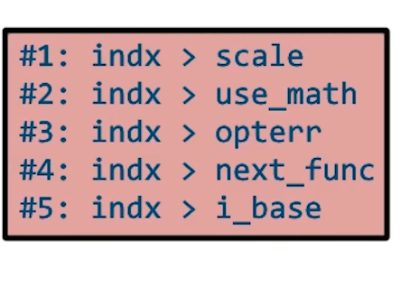
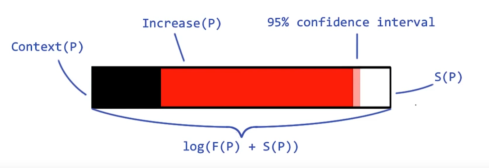
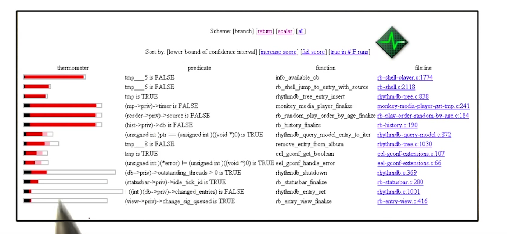
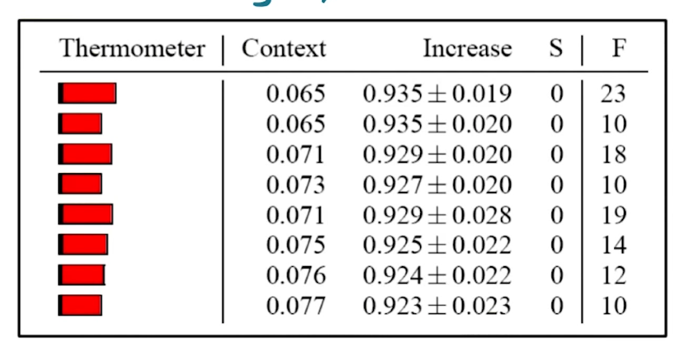
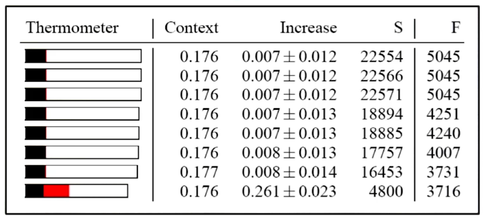
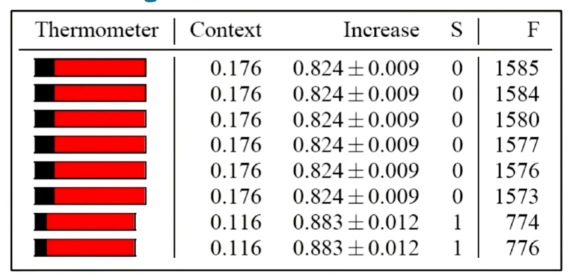
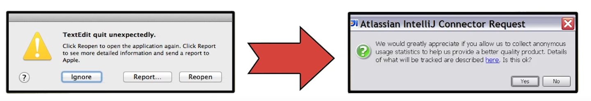

# L9 Statistical Debugging
## Motivation
- Bugs will escape in-house testing and analysis tools
    - Dynamic analysis (i.e. testing) is unsound
    - Static analysis is incomplete
    - Limited resources (time, money, people)
- Software ships with unknown (and even known) bugs

## An Idea: Statistical Debugging

- Online: collection information from user runs
- Offline: Analyze information to find bugs

- Effectively a "black box" for software

## Benefits of Statistical Debugging
Actual runs are a vast resource!
- Crowdsource-based Testing
    - Number of real runs >> number of testing runs
- Reality-directed Debugging
    - Real-world runs are the ones that matter most


## Two Key Questions
- How do we get the data?
- What do we do with it?


## Practical Challenges

1. Complex systems
- Millions of lines of code
- Mix of controlled and uncontrolled code

2. Remote monitoring constraints
- Limited disk space, network bandwidth, power, etc.

3. Incomplete information
- Limited performance overhead
- Privacy and security

## The Approach
- Guess behaviors that one "potentially interesting"
    - Compile-time instrumentation of program
- Collect sparse, fair subset of these behavior
    - Generic sampling framework
    - Feedback profile + outcome label (success vs. failure) for each run
- Analyze behavioral changes in successful vs. failing runs to find bugs
    - Statistical debugging

## Overall Architecture


## Model Behavior
- Assume any interesting behavior is expressible as a predicate `P` on a program state at a particular program point.
    - Observation of behavior = observing P
- Instrument the program to observe each predicate
- Which predicates should we observe?

## Branches Are Interesting
``` java
++branch_17[p!=0];//<= count p is false
if (p) .... // program point 17
else ...
```

Track predicates:
<br>|branch_17:
--|--
p == 0 | 63 
p != 0 | 0

## Return Values Are Interesting
- a return value is 0 may be used to indicate a successful the operation
- a non-zero return value may be used to indicate a failure of the operation

## Branches Are Interesting
``` java
n = fopen(...);
++call_41[(n==0)+(n>=0)];
```

Track predicates:
<br>|call_41:
--|--
n < 0 | 23
n > 0 | 0
n == 0 | 90

## What Other Behaviors Are Interesting?
- Depends on the problem you wish to solve!
- Examples:
    - Number of times each loop runs
    - Scalar relationships between variables (e.g. i < j, i > 42)
    - Pointer relationships (e.g. p == q, p != null)

## Quiz Identify the Predicates
List all predicates tracked for this program, assuming only branches are potentially interesting:
``` java
void main() {
    int z;
    for (int i = 0; i < 3; i++) { // <== predicate
            char c = getc();
            if (c == 'a') // <== predicate
                z = 0;
            else
                z = 1;
            assert(z == 1);
    }
}
```

## Summarization and Reporting 1
When a run finishes, we combines the predicates

<br>|branch_17:
--|--
p == 0 | 63 
p != 0 | 0

<br>|call_41:
--|--
n < 0 | 23
n > 0 | 0
n == 0 | 90

combined the predicates with outcome label:
<br>|combined:
--|--
p == 0 | 63 
p != 0 | 0
n < 0 | 23
n > 0 | 0
n == 0 | 90
outcome | S/F

- Feedback report per run is
    - Vector of predicate states:
        - `-` the predicate was never observed
        - `0` the predicate was observed at least once to be false, and never observed to be true
        - `1` the predicate was observed at least once to be true, and never observed to be false
        - `*` the predicate was observed at least once to be true, and at least once to be false
    - Success/Failure outcome label
    - No time dimension, for good or ill

<br>|combined:
--|--
p == 0 | 1 
p != 0 | 0
n < 0 | *
n > 0 | 0
n == 0 | *
outcome | S/F

## The Need for Sampling
- Tracking all predicates is expensive
- Decide to examine or ignore each instrumented site
    - Randomly
    - Independently
    - Dynamically
- Why
    - Fairness
    - We need an accurate picture of rare events

## A Naive Sampling Approach
Toss a coin at each instrumentation site
``` java
if (rand(100) == 0) 
    ++count_42[ p!= NULL];
p = p -> next;
if (rand(100) == 0) 
    ++count_43[i < max];
total += sizes[i]
```

Problem: Too Slow!


## Some Other Problematic Approaches
- Sample every kth site
    - Violates independence
    - Might miss predicates "out of phase"
- Periodic hardware time or interrupt
    - Might miss rare events

## Amortized Coin Tossing
- Observation: Samples are rare(e.g. 1/100)
- Idea: Amortize sampling cost by predicting time until next sample
- Implement as countdown values selected fro geometric distribution
- Models how many tails (before) next head (1) for biased coin toss
- Example with sampling rate 1/5:


## An Efficient Approach
``` java
if (rand(100) == 0) 
    ++count_42[ p!= NULL];
p = p -> next;
if (rand(100) == 0) 
    ++count_43[i < max];
total += sizes[i]
```
become to
``` java
if (countdown >= 2) {
    countdown -= 2;
    p = p -> next;
    total += sizes[i]
} else {
    if (countdown-- == 0) {
        ++count_42[ p!= NULL];
        countdown = next();
    }
    p = p->next;
    if (countdown-- == 0) {
        ++count_43[i < max];
        countdown = next();
    }    
    total += sizes[i];
}
```

## Feedback Reports with Sampling
- Feedback report per run is:
    - Vector of sampled predicates states (-, 0, 1, *)
    - Success/failure outcome label
- Certian of what we did observe
    - But may miss some events
- Given enough runs, sample ≈ reality
    - Common events seen most often
    - Rare events seen at proportionate rae

## Uncertainty Due to Sampling
Check all possible states that a predicate P might take due to sampling. The first column shows the actual state of P (without sampling).

P|-|0|1|*
---|--|--|--|--
-|X|||
0|X|X||
1|X||X|
*|X|X|X|X

## Finding Causes of Bugs 
- We gather information about many predicates
    - ≈ 300 for bc ("bench calculator" program on Unix)
- Most of these are not predictive of anything
- How do we find the few useful predicates?
----
How likely is failure when predicate P is observed to be true?
- `F(P)` = # failing runs where P is observed to be true
- `S(P)` = # successful runs where P is observed to be true
$$ \text{ Failure (P)}=\frac{F(P)}{F(P)+S(P)}$$

Example: F(P) = 20, S(P) = 30 => Failure(P) = 20/50 = 0.4

##### Fracking Failure is Not Enough
``` java
if (f==NULL) {
    x = foo();
    *f;
}

int foo() {
    return 0;
}
```
- `Failure(f == NULL) = 1.0` and `Failure(x == 0) = 1.0`
- Predicate x == 0 is an innocent bystander
- Program is already doomed

## Tracking Context
What is the background chance of failure, regardless of P's value?
- `F(P observed)` = # failing runs observing `P`
- `F=S(P observed)` = # successful runs observing `P`

$$ \text{ Context (P)}=\frac{F(P observed)}{F(P observed)+S(P observed)}$$
Example: F(P observed) = 40, S(P observed) = 30 => Context(P) = 40/120 = 0.3333

## A Useful Measure: Increase()
Does P being true increase chance of failure over the background rate?
$$ \text{ Increase (P)}=\text{Failure(P)} - \text{Context(P)}$$
A form of likelihood ratio testing
- Increase(P) ≈ 1 => High correlation with failing runs
- Increase(P) ≈ -1 => High correlation with successful runs

## Increase() Works
``` java
if (f==NULL) {
    x = foo();
    *f;
}

int foo() {
    return 0;
}
```
with 
- 1 failing run: f == NULL
- 2 successful run: f != NULL

We can conclude:
- Failure(f == NULL) = 1.00
- Context(f == NULL) = 0.33
- Increase(f == NULL) = 0.67 

when f is null, high chance of run failure

----
- Failure(x == 0) = 1.00
- Context(x == 0) = 0.33
- Increase(x == 0) = 0.67


when x is zero, there's little change in the probability of run failure
x == 0 is not balmed for causing this program t fail


## Computing Increase QUIZ
``` java
void main() {
    int z;
    for (int i = 0; i < 3; i++) { // <== predicate
            char c = getc();
            if (c == 'a') // <== predicate
                z = 0;
            else
                z = 1;
            assert(z == 1);
    }
}
```

<br> | "bba" | "bbb" | Failure| Context| Increase
--|--|--|--|--|--
`c == 'a'`|*|1|1.0|0.5|0.5
`c != 'a'`|*|0|0.5|0.5|0.0
`i < 3`|1|*|0.5|0.5|0.0
`i >= 3`|0|*|0.0|0.5|-0.5
Outcome Label(S/F)|F|S|


## Isolating the Bug 1
--| Increase
--|--
`c == 'a'`|0.5
`c != 'a'`|0.0
`i < 3`|0.0
`i >= 3`|-0.5

This example suggests an algorithm for automatically identifying predicates that are the best indicators of the failure such as `c == 'a'`


## A First Algorithm
1. Discard predicates having Increase(P) <= 0
    - e.g. bystander predicates, predicates correlated with success
    - Exact value is sensitive to few observations
    - Use lower bound of 95% confident interval
2. Sort remaining predicates by Increase(P)
    - Again, use 95% lower bound
    - Likely causes with determinacy metrics


## Isolating a Single Bug in bc
一个例子
``` c
void more_arrays()
{
    ...
    /* Copy the old arrays. */
    for (indx = 1; indx < old_count; indx++)
        arrays[indx] = old_ary[indx];
    /* Initialize the new elements. */
    for (indx = 1; indx < v_count; indx++)
        arrays[indx] = NULL;
}
```

可以看到indx变大的时候，系统然后报错

实际情况：
- `v_count`太小
- 正确的值应该是`a_count`而不是`v_count`,典型的copy-paste error


## It Works
- At least for programs with a single bug
- Real programs typically have multiple, unknown bugs
- Redundancy in the predicate list is a major problem

## Using the Information
- Multiple useful metrics: Increase(P), Failure(P), F(P), S(P)
- Organize all metrics in compact visual (bug thermometer)


## Sample Report


## Multiple Bugs: 
##### The Goal
- Find the best predictor for each bug
- without prior knowledge of number of the bug
- sorted by the importance of the bugs
##### Some Issues:
- A bug may have redundant Predictors
    - Only need one
    - But would like to know correlated Predictors
- Bugs occur on vastly different scales
    - Predictors for common bugs may dominidate, hiding predictors of less common problems


## Another Idea
- Simulate the way humans fix bugs
- Find the first(most important) bug
- Fix it and repeat

## Revised Algorithm
``` shell
Repeat:
    1. Compute Increase(), F(), etc. for all predicates
    2. Rank the predicates
    3. Add the top-ranked predicate P to the result list
    4. Remove P and discard all runs where P is true
        - Simulates fixing the bug corresponding to P
        - Discard reduces rank of correlated predicates
Until no runs are left
```

## Ranking by Increase(P)

Problem: High Increase() scores but few failing runs!
Sub-bug Predictors: covering special cases of more general bugs

## Ranking by F(P)

Problem: Many failing runs but low Increase() score!
Super-bug Predictors: covering several different bugs together

## A Helpful Analogy
- In the language of information retrieval
    - `Precision` = fraction of retrieved instances that are relevant
    - `Recall` = fraction of relevant instances that are retrieved
- In our setting:
    - `Retrieved instance` ~ predicates reported as bug predictors
    - `Relevant instance` ~ predicates that are actual bug predictors
- Trivial to achieve only high precision or only high recall
- Need both high precision and high recall

## Combining Precision and Recall
- Increase(P) has high precision, low recall
- F(P) has a high recall, low precision
- Standard solution: take the harmonic man of both
    $$=\frac{2}{1 / \text { Increase }(P)+1 / F(P)}$$
- Rewards high scores in both dimensions


## Sorting by the Harmonic Mean


## What Have We Learned?
- Monitoring deployed code to find bugs
- Observing predicates as mode of program behavior
- Sampling instrumentation framework
- Metrics to rank predicates by importance: 
    - Failure(P)
    - Context(P)
    - Increase(P)
- Statistical debugging algorithm to isolate bugs

More information on statistical debugging can be found at https://research.cs.wisc.edu/cbi/


## Key Takeaway
- A lot can be learned from actual executions
    - Users are executing them anyway
    - We should capture some of that information
- Crash reporting is a step in the right direction
    - But stack is useful for only about 50% of bugs
    - Doesn't characterize successful runs
        - But this is changing ...
