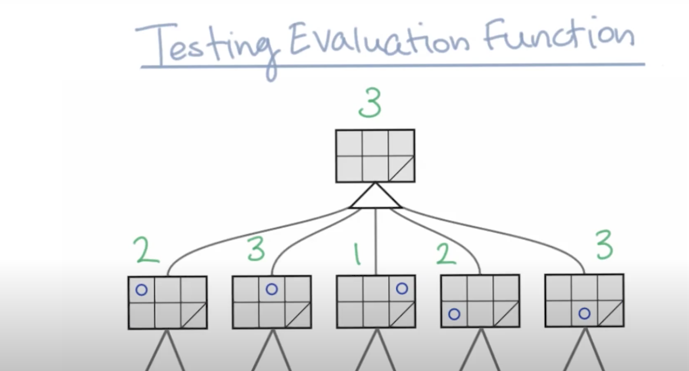

## 1. Course Introduction
1. Game Playing
1. Search
1. Simulated Annealing
1. Constraint Satisfaction
1. Probability
1. Bayes Nets
1. Machine Learning
1. Pattern Recognition through Time
1. Logic and Planning
1. Planning under Uncertainty

## 3. Overview
Main Topics:
1. Adverstail search
2. Minimax Algorithm
3. Alpha-Beta Pruning
4. Evaluation Functions
5. Isolation Game Player
6. Multi-Player, Probabilistic Games

## 4. Isolation

## 5-8. Building a Game Tree
https://s3.amazonaws.com/content.udacity-data.com/courses/ud954/images/isolation-L6_leafValues.svg
- -1 for computer gamer lose the game
- +1 for computer gamer win the game

## 9. How Do We Tell the Computer Not to Lose?
discover bad moves automatic
    - min-max algorithm

## 10. MIN and MAX Levels
- computer gamer try to maximize the score (triangle pointing up)
- x gamer try to minimize the score (triangle pointing down)

## 11-12. Propagating Values Up the Tree

called min-max algorithm

## 13.Choosing the Best Branch
https://s3.amazonaws.com/content.udacity-data.com/courses/ud954/images/isolation-L6_minMax_complete.png

## 14-15. Aside: Reading the Book
Artificial Intelligence - A Modern Approach (AIMA): Chapter 5.1-5.2

## 16. Max Number of Nodes Visited
- $25*24*23*...*1 = 25! \approx 10^{25}$
- computer run $10^9$ operation/second
- 10^16 sec
- 317 million year

## 17. Max Moves

16 place to move

## 18. The Branching Factor
- 随着游戏进行，走法会越来越少，我们算23之后的每一步有12个可能
    - branching factor：12
    - $25*24*12^{23} > 10^{27}$
- 最后几步是1，2，3。。。
    - $25*24*12^{11}*12！* > 3*(10)^23$

## 19. Quiz Number of Nodes in a Game Tree
How many nodes do you think MINMAX will need to visit?
Here `b` is the average branching factor and `d` is the depth of the game tree.

- [ ] $bd$
- [ ] $d^b$
- [ ] $d^2$
- [x] $b^d$

## 20. The Branching Factor (Contd.)
- 写个随机算法来测试平均average branching factor

## 21. Max Number of Nodes
$8^{25} \cong 10^{22} = 1.2 million years$

## 22. Depth-Limited Search
- 假设 1 second 可以搜索10^9 node
- 假设player只能等2 seconds
- $10^9nodes * 2 sec = 2 * 10^9nodes$
- $8^x < 2 * 10^9$ => $x < 10.3$
- 为了安全起见，我们查9层

Depth-Limited Search
- 只搜索到我们认为安全的深度

## 23. Evaluation Function Intro
Evaluation function
- takes each game board generated level nine of our min-max game tree
- return a number that we can compare that node for all the other nodes at that level.

比如最大化可行步数 #my_moves

## 24. Quiz Testing the Evaluation Function

## 26. Testing Evaluation Functions

## 27. Testing the Evaluation Function Part 3

## 28. Quiescent Search
