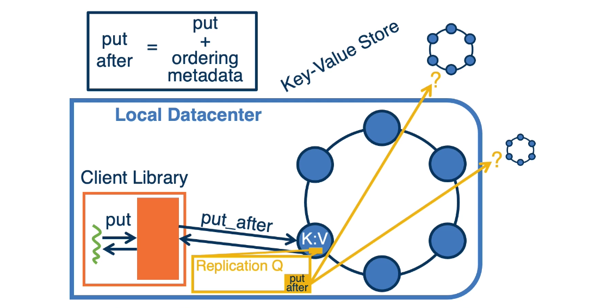

# Lesson 10 Consistency in Distributed Data Stores

## 10.1 Introduction

- Practical consideration for consistency
- Districuted data (key-value) stores
  - Memcached at Facebook
- Different consistency models
  - Causal + from COPS: Don't settle for Eventual Consistency

## 10.2 Why is Consistency Important and Hard?

- Distributed state
- Replication for availability and fault tolerance
- Caching for performance
- Failures

### Too Hard? Change the Model?

## 10.3 Key-Value Store

Key-Value Store Data Model

- Put(set) and Get
- Scan, range query
- More complex data models and types of operations

## 10.4 Memcached

- Simple Key-value store **originally at Facebook**
- Nishtala et al, **Scaling Memcache at Facebook, NSDI' 13**
- Replaced with **Tao, ATC' 13**

### Memcached

## 10.5 Look-Aside Cache Design

#### Look-Aside Cache Design

- **Workload is**
  - very read intensive
  - large data capacity
  - "hot data", temporal locality
- **Original strore in SQL DBs**

#### Design

- => **simple in-memory KV object cache**
- Look-aside & demand-filled
  - 
- Db updates => cache deletions(先删 cache，再删 db)
- Discard based on LRU
- MC: clean, read-only data
- Non-authoritative
- Look-aside design makes some optimizations possible
- 

## 10.6 Mechanisms in Memcached

- **Problem with look-aside cache:**
  
- **Solution: Lease**
  - Issued on cache miss
  - Detect concurrent writes
    - => oredering of writes maintained
  - Other examples:
    - Thundering heards
    - Serving stale values

#### Client-Side Request Routing

- **Scale cache with more MC**
  - finite memory
- **More MC instances**
  - data sharded
- **Routing in clients**
  - mcrouter
- **Multiple clusters**
  - Scaling beyond a single cluster
  - separate failure domains
- **Multiple MC caches**
  - DB-drives invalidations in commit order
    

#### Geo Distributed Replication

- **Cannot use same consistency mechanisms** for multiple clusters
- **Combine with replication** at the storage layer
  
  marker 可以锁住之后的操作，保证一致性

## 10.7 Causal+ Consistency

- **Causal dependencies not visible**
  - Embedded in application semantics
  - (Geo)replication, caching, ..., all reads/writes are not visible in a single location
- => **COPS to the rescue**
  - Don's settle for eventual: Scalable Causal Consistency for Wide-Area Storage with COPS", - Wyatt Lloyd, et. all, SOSP'11

**GET**

**PUT**

**Causal+Replication**

## 10.8 Summary

- Consistency: models, tradeoffs, techniques
- Memcache architecture and design decisions
- Casual + Consistency with COPS
