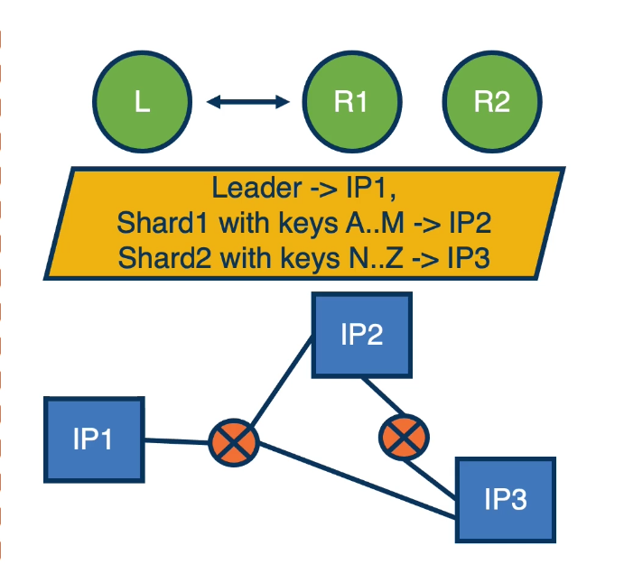
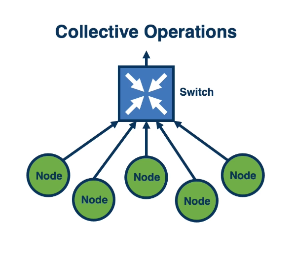
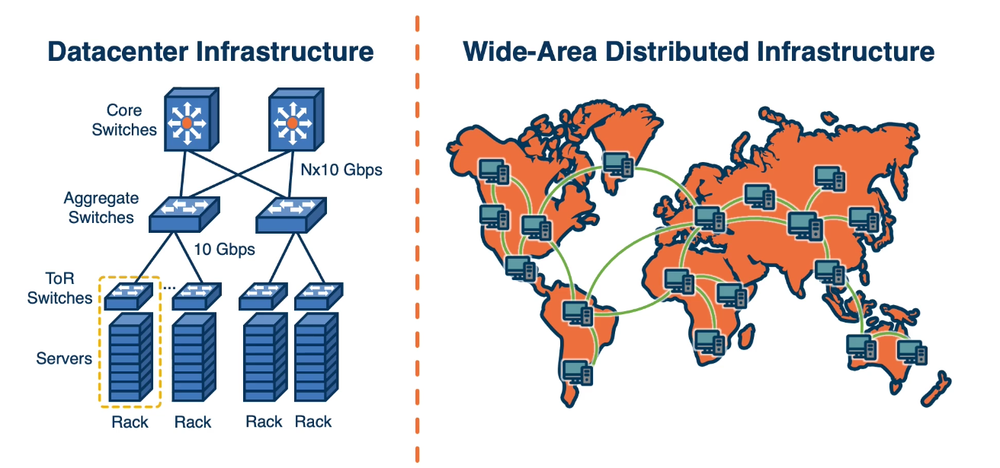
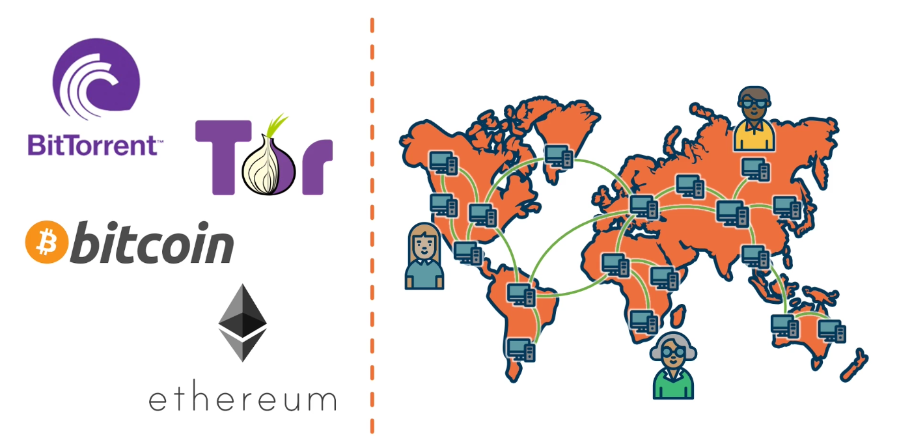
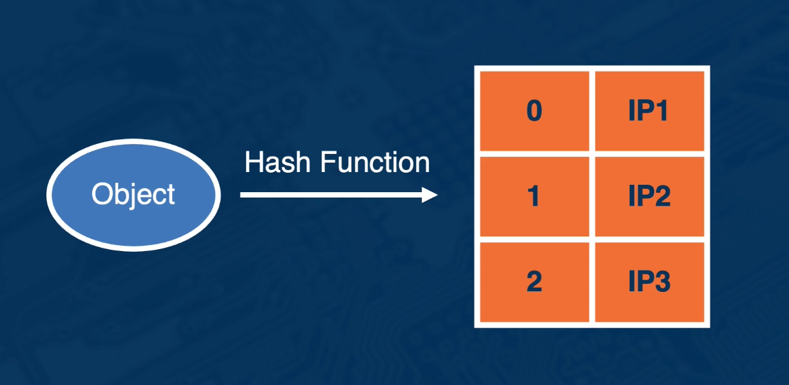
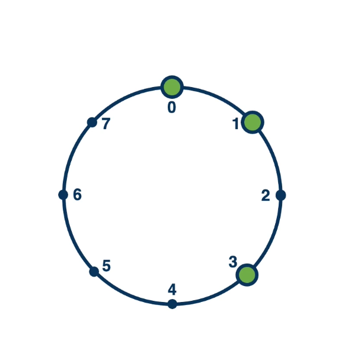
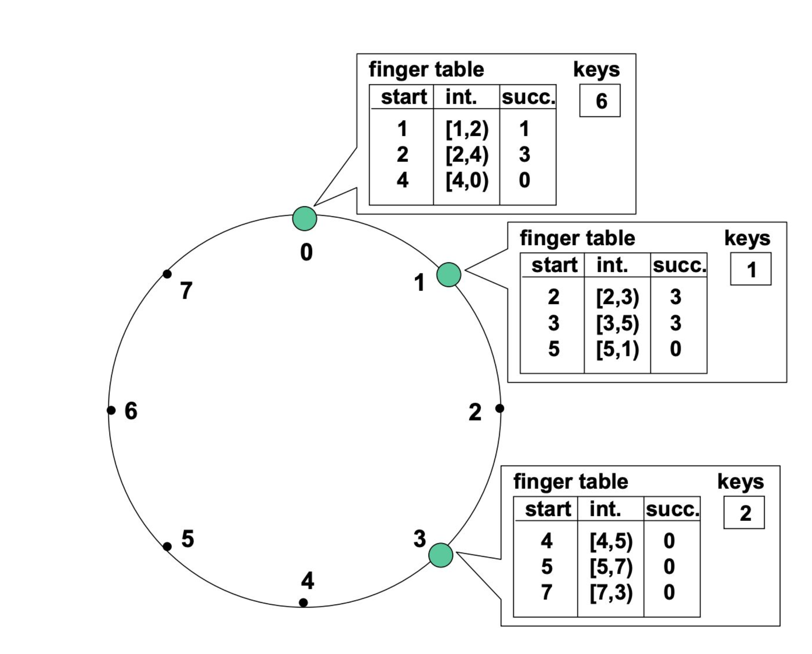
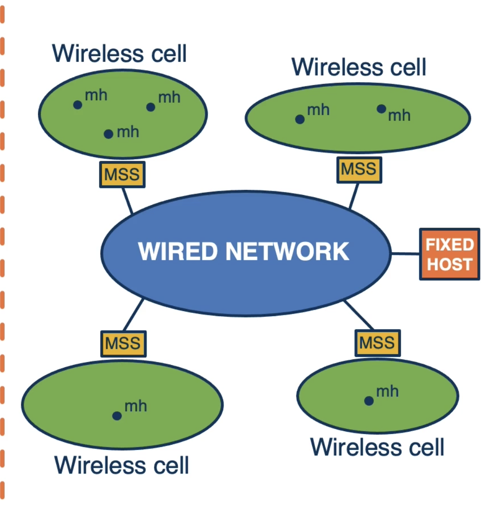

# Lesson 11 Peer-to-peer, Mobility

## 11.1 Introducation

- **Communication system** for building distributed applications
- **Peer-to-Peer**
  - The Chord P2P system
- **Hierarchical**
  - Overlay networks for dealing with mobility

## 11.2 Communication Support Assumed So Far

#### How Did We Abstract the Network?

- **Application/service-level namespace**
  - Process names
  - File names
  - Objects keys
  - ...
- **Network level**
  - IP addresses
  - Network paths through switches and routers
    
- **Metadata service**
- Determines **Overlay Network**
- Created and maintained as part of control plane operation
- Needs to be **updated on change**
  - Scale
  - Geo-distribution
  - Failures
  - Multiple administrative domains

## 11.3 Interconnect Support

Too Hard? Change the Model?

- Boardcast, multicast
- Gather/all-reduce
- Barrier
- Atomics(e.g., CAS)
- Timing
- Remote(Direct) Memory Access(RDMA)
- Direct cache injection(DDIO)

Reply on hardware support for scalable implementations

- Separate dedicated networks
- Combining tree algorithms in 6210

## 11.4 Peer to Peer Systems

## 11.5 Connectivity in P2P

#### How to Find the Right Peer?

Centralized Registry:

- Pro: Single RTT to find peer IP
- Con: Centralized trusted authority

Example: Napster

#### How to Find the Right Peer?

- Pro: Remove centralized coordinator
- Con: No bound-on lookup time

Example: Gnutella and Bitcoin

#### How to Find the Right Peer?

Provide "Structured" Routing Trees: **Distributed Hash Table(DHT)**:
Pros:

- Decentrailized index
- Structure bounds (probabilistically) lookup time

**Example**: Chord, Kademlia, and Amazon DynamoDB

## 11.6 Distributed Hash Table (DHT)

**Hash Function:**

- object, sequence of bytes, string, -> unique number within a range
- **e.g.,** from namespace of keys (file names, song names, ...) to namespace of numbers

**Each client in distributed system uses same hash function => produce same mapping**

## 11.7 Chord

#### Chord DHT Ring

- Keys: SHA(key)
- IDs: SHA(IP)
- Ring of 0 - N-1
  

#### Insert Data

- SHA(key) = value
- if node exists at value: update
- Else go to successor of value and update

#### Lookup

- Immediate node
- Find its successor
- Can we do better than O(N)？

#### Finger Table

- Node ID for progressively longer ranges
- **Finger table**:
  - At each node n, i-th finger entry starts at: [n + 2i]
  - for range of 2i elements
- **Lookup -> O(log(N))**
  

#### Managing the Chord Ring

- Node joining, departing...
- Redistributed data
- Update finger tables
- Improve performance with additional metadata
- **=> probabilistic guarantees about system performance**

## 11.8 Hierarchical Systems

#### Which Design?

- **Cost of communication vs. cost of maintaining the overlay**
- **Nodes with different properties**
  - Point-to-point communication
  - Stability, failure probability, mobility
  - Number of typ eof nodes
  - Communication patterns, locality
  - ...
- **Consider hybrid approaches and hierarchical designs**
  - Large-scale datacenters
  - Wide area
  - Mobile networks

## 11.9 Heterogeneous Systems:A Mobile Network Example

#### Mobile Network Model

- **Two types of nodes**
- **MSS: Mobile Support Stations**
  - Stationary
  - High-speed wired network
  - Power availability not a concern
- **MH: Mobile Hosts**
  - Belong to a cell associated with an MSS
  - Mobile
  - Low(er)-speed mobile network
  - Battery considerations

**Goal**

- **Fast lookup of MH**
- **Low overheads update of overlay state**
  - Communication overheads
  - Battery/energy or compute overheads
    **Heterogeneous nodes => different concerns**
- 

## 11.10 Alternative Algorithms

**Metrics**

- SEARCH (lookup) cost
- INSERT (add/remove/node) costs
- Impact of update required to support mobility

**Analysis Considers**

- $C_{wireless}$ >> $C_{fixed}$
- $N_{mh}$ >> $N_{mss}$

#### Cost of communication

$C_{comm} = 2 * C_{wireless} + C_{search}$
**Alg 1**:

- Logical ring of all MHs
- $C_search $\sim$ O(Nmh, C_wireless)$

---

**Alg 2**:

- Two-tier hierarchical design
  - MSSes in logical ring
  - Each MSS knows about MHs in its cell
- $C_search $\sim$ O(Nmss, C_fixed)$

#### Supporting Mobility

**Alg 1**:

- Original MSS searches for new MSS on demand
- No update on move, only when MH needs to reached
- $C_update $\sim$ O(C_fixed_search)$

---

**Alg 2**:

- New MSS informs original MSS each time a new MH joins
- Update needed each time MH moves
- $C_update $\sim$ O(#move \* C_fixed)$

- Two-tier hierarchical design
  - MSSes in logical ring
  - Each MSS knows about MHs in its cell
- $C_search $\sim$ O(Nmss, C_fixed)$

## 11.11 Lesson 11 Summary

- **Maintaining network overlays to properly route nessages** in a distributed system.
- **Peer-to-peer systems** and **Chord**
- Consideration for **hierarchical design, heterogeneous systems** and **mobility**
-
