# Lesson 12 Distributed Data Analytics

## 12.1 Introducation

- Programming and runtime **systems for scalable data processing** in distributed systems
- **Poster child: MapReduce**
  - Google, OSDI'04
  - Hadoop MapReduce
- **Spark**
  - RDD, NSDI'12

## 12.2 Data Processing at Scale

#### Common Techniques

- **Data Parallel** (Divide & Conquer):

  - Divide data, assign to nodes for processing
  - Load balancing, decomposition?
  - Data dependencies via explici message(and collectives)
  - Depends on application
  - 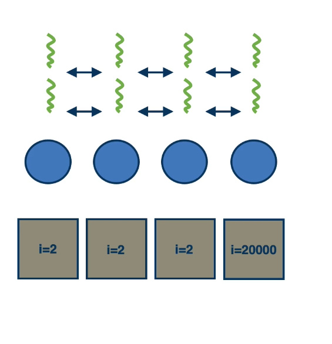

- **Pipelining**
  - Divide work into smaller tasks:
    - each nodes does one/some tasks,
    - but does them well/faster
  - Stream data in chunks through the task pipeline
  - Increase throughput
  - 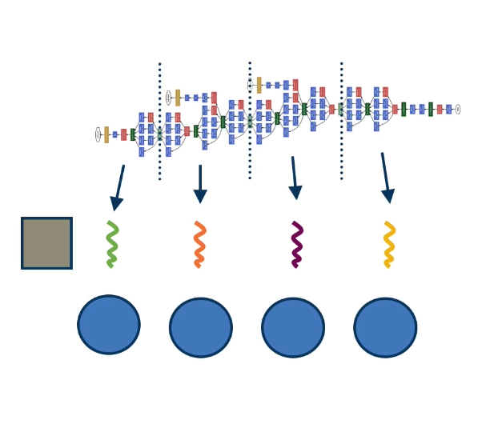
- **Model Parallelism**:
  - Dive the state of applicaitons across nodes
  - Each node has process based on its subset of state
  - Input passed to all nodes; output combined from all nodes
  - Dependencies must be handled
    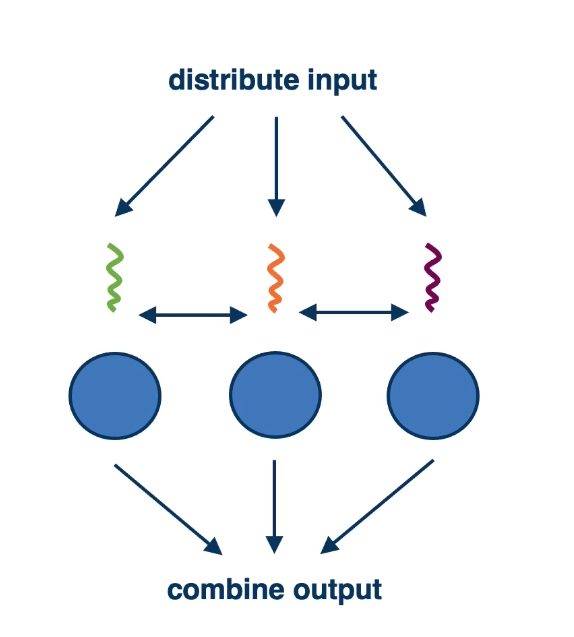

## 12.3 MapReduce Brief

MapReduce: Simplified Data Processing on Large Cluster, Jeff Dean and Sanjay Gheawat, OSDI'04

- Yahoo! Hadoop MapReduce
- AWS infrastructure

#### MapReduce in a Nutshell

**Input**:

- A as a set of records identified by key-value pair
  **Map function**:
- Input: a unique key-value pair
- Output: an intermediate new key-value pair
  **Reduce function**:
- Input: Intermediate output from the map function
- Output: final result
  **Master Orchestrates**:
- Worker management, input/output, failure management, ...
  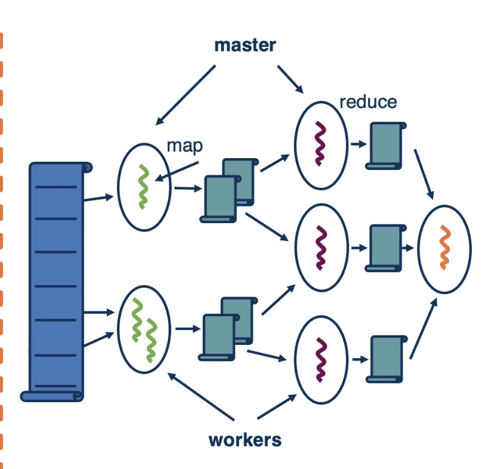

#### Example:

**Wordcount example**:

- Input: a collection of files
  **Map function**:
- Input: a file with key=filename, content=value
- Output: an intermediate file with key=word, value=list of counts
  **Reduce function**:
- Input: intermediate output from the map function
- Output: list of words with total counts
  **Other examples**:
- URL access frequency, reverse web link graph(for page ranking), inverted word index(useful for document search)....

#### Combination of techniques:

- Chunks to mappers => data parallel
- Mapper then Reducer => pipelining
- Reducers processes part of the keyspace, then combine => model parallelism
- **Dataflow model => flow of data determines execution**

## 12.4 Design Decisions MapReduce

- Master data structure:
  - For tracking progress
- Locality:
  - Scheduling, placement of intermediate data
- Task granularity
  - Finer granularity -> more flexibility, impact on execution time of management operations
  - Higher granularity -> lower management overheads
- Fault tolerance:
  - Master: standby replication
  - Worker: detect failures or stragglers and re-execute(intermediate files a plus)
- Semantics in the presence of failures:
  - Importance of consistency and complete results?
- Backup tasks:
  - Failure inevitable => speculative backup tasks
    **Paper describes decisions and optimization** relevant to Google's MapReduce implementation.

## 12.5 Limitations of MapReduce

#### Requirement for Persistent I/O

- **Failure inevitable**, cannot re-execute entire operation
- FT mechanism **assumes intermediate data is available**
  - Serialization to/from persistent storage
  - Remote access and data movement
- **Data amplification**
  - Intermediate data may be >> input
  - Executions are iterative
  - Replication at the storage level
- **Scale of systems**
  - cannot assume best-in-class persistent devices acceptable cost

## 12.6 Spark

- Research project, led by **Matei Zaharia** while at UC Berkeley
  - **RDD paper at NSDI'12**
- **Faster analytics** (10x > Hadoop) for different
  - **Workloads** (graph, streaming, SQL, ML, ...)
  - **Languages**(Java, Python, Scala,....)
  - **Platforms** (AWS, Kubernetes,....)
- Today **Apache project** with great adoption
  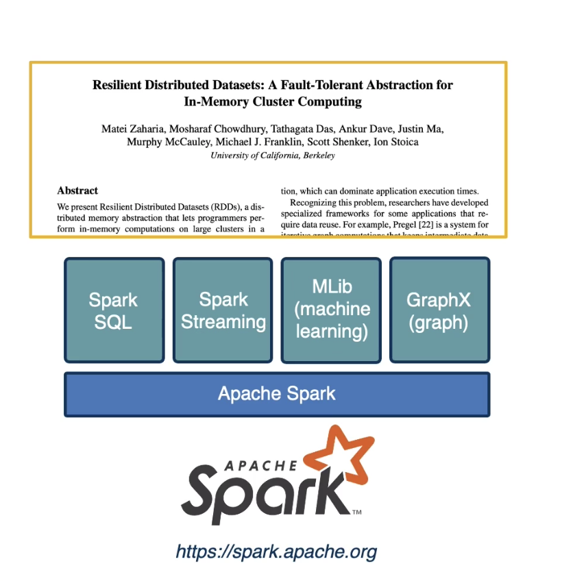
- Allow **in-memory data sharing**
  - fast DRAM instead of slow HDD
  - avoid serialization
- But also **achieve Fault Tolerance**
  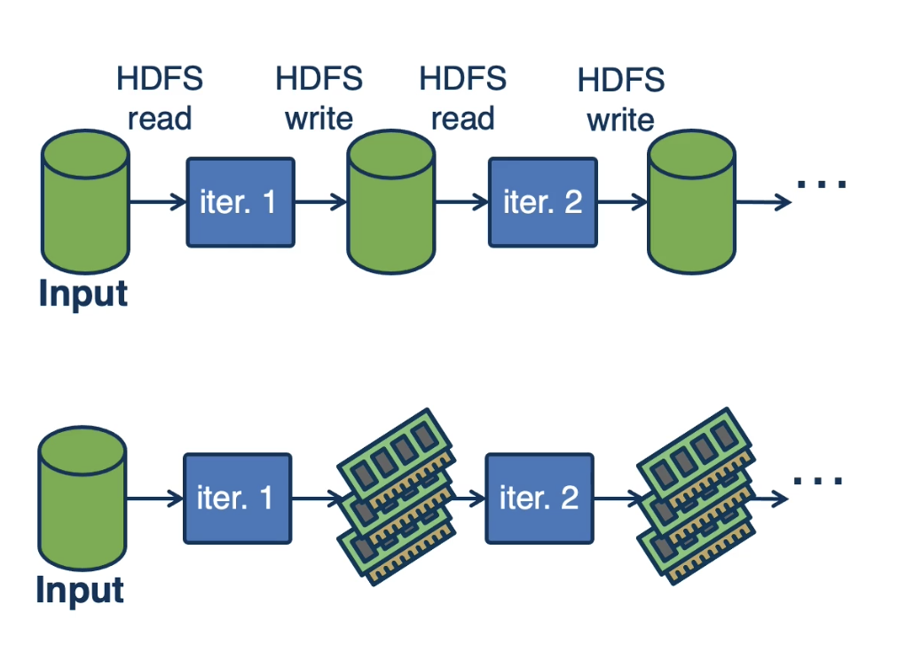

## 12.7 Resilient Distributed Datasets (RDDs)

- **Read-only (immutable)**, partitioned collection of records
  - Created only via **"transformations"**
  - deterministic "lazy" operations on data in stable storage or other RDDs(map, join, and filter)
- Used via **"actions"**
  - (count, collection and save)
- RDDs are aware of their **lineage** -> able to compute its partitions from data in stable storage
- Also provide the ability for users to control **persistence** and **partitioning**
  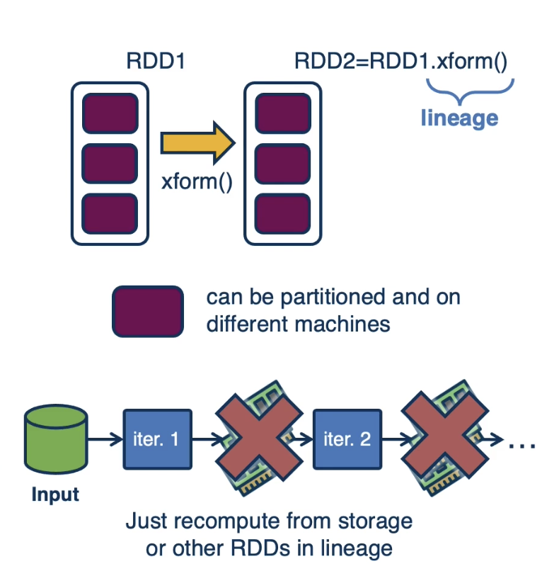

## 12.8 RDDs through Example

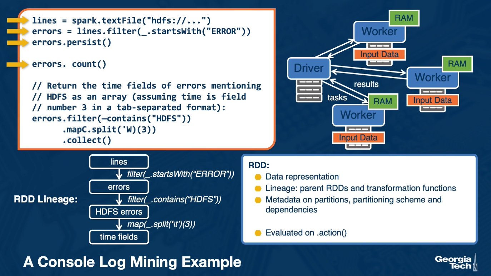

**RDD**:

- Data representation
- Lineage: parent RDDs and transformation functions
- Metadata on partitions, partitioning scheme and dependencies
- Evaluted on .action()

## 12.9 RDD Transformations

#### Transformation and Actions in Spark

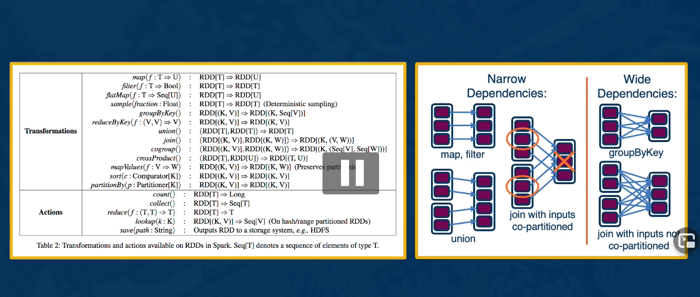

#### Scheduling Action Execution

- Program **determines dependencies**
- Actions are executed as a **DAG of stage**
  - each with as many narrow dependencies as possible
  - achieve parallelism, limit I/O contention
- Tasks are assigned to machines **based on data locality**

## 12.10 Did Spark Achieve its Goal?

#### In-memory Data Sharing with Fault Tolerance

**Once data brought in memory**:

- Distributed share memory-like runtime, just track data updates
  => LOG!.
  **persist the lineage!**
- But log coarse grain operations applied to all items in RDD elements
- Pros
  - less data to persist in execution critical path
  - read data as low as once, less slow storage I/O
  - more control on locality
- Cons
  - recovery time
    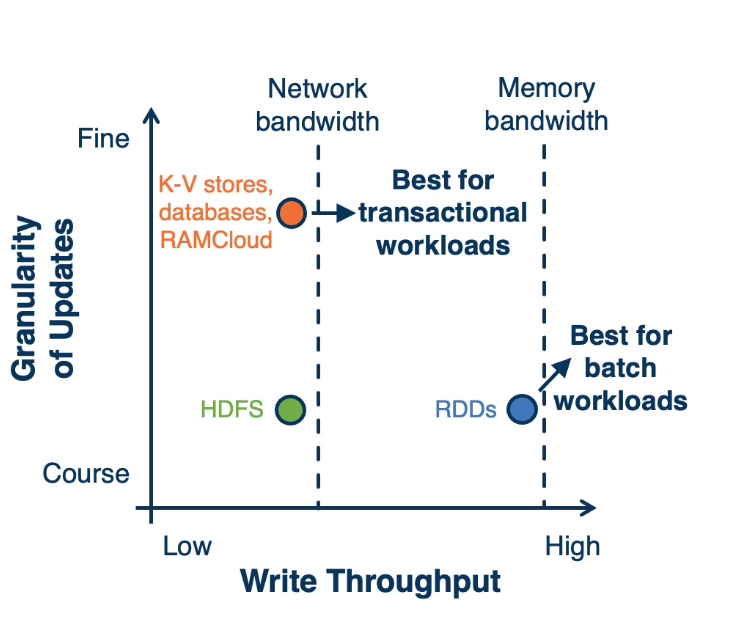

#### Experimental Evaluation Highlights

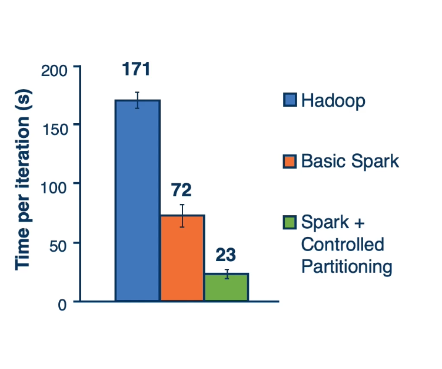

- Up to **20x better** than Hadoop in **iterative machine learning** and **graph application**
- Sped up an **analytics report running** in Hadoop by **40x**
- **Quick recovery** from failures
- Used to query a 1TB dataset with **latencies of 5-7s**

## 12.11 Lesson 12 Summary

## 12.11 Lesson 12 Summary

- Approaches to **data processing at scale**
- **MapReduce** and **limitations**
- **Spark** and **RDDs**
