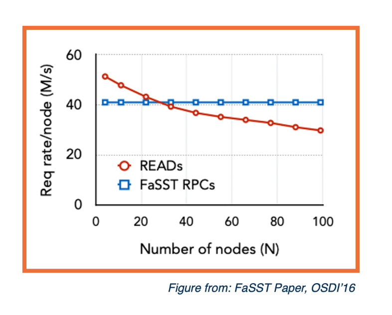
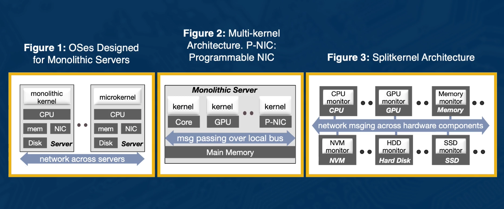
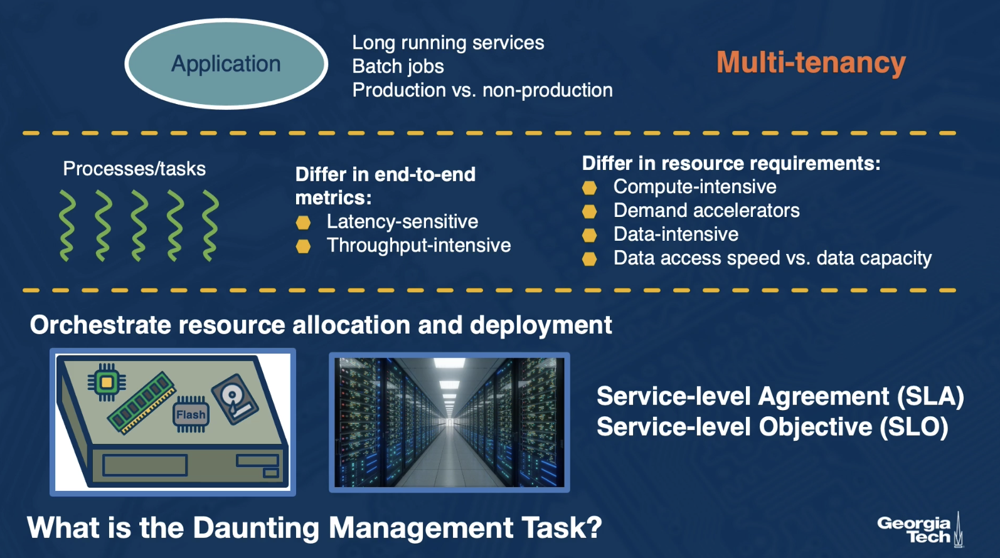

# Lesson 13 Datacenter

## 13.1 Introducation

- Datacenter **trends** and **services**
- **High-speed** RDMA networks
- Resource **heterogeneity**
  - Compute heterogeneity (GPUs, TPUs, FPGAs, ...) and
    - Memory/storage heterogeneity (persistent memories)
- Resource **disaggregation**
- Resource **management** and ochestration

## 13.2 Datacenter Trends

#### Achieving Performance and Efficiency at Scale

**Moore's Law**:
Pros:

- economy of scale
  => achieve performance and scale with commodity componenets

**Specification and heterogeneity:**

- GPUs, TPUs,....
- new memory and storage classes

**Disaggregation**

- Independently scaled tiers of different resources

#### Achieving Performance and Efficiency at Scale

Limitation of (X86+DRAM+Ethernet) + scale and requirements of emerging workloads:

- High-speed interconnects, RDMA => Shared memory across nodes
- Programmable interconnects => move common tasks, Paxos?, in network
- Programmable memories => in-memory persistenet store, redesign fault tolerance
- Specialized accelerator => resource management, load balancing, affinity, ....
- Disaggregation, Network-Attached-X
- From VMs to Containers and uServices
  

## 13.3 What is RDMA?

- **Remote DMA**
- **Bypass CPU involvement** in data access/communication via **interconnect support**
- Pros
  - Higher bandwidth and lower latency than commodity Ethernet networks
- Cons
  - Traditional cost, cost per port.
- Idea from **research systems in 90s**
- **Virtual Interconnect Architecture (VIA)** early 2000s
- Mellanox leader in **InfiniBand interconnect**
- Now **~1/2 top500 machines, major datacenters, ...**
- **RoCE**(RDMA over Converged Ethernet), **iWARP**(internet Wide Area RDMA Protocol), **Portals, Cray’s interconnects...**

#### Two-Sided RDMA

#### One-Sided RDMA

可以放 data 到 host 的 LLC = Last Level Cache

## 13.4 RDMA-Specialized RPC

**One-sided**

- Low CPU utilization, multiple RTTs(Round-Trip time)
- Redesign to match new API
  **Two-sided**
- Single RTT, simple integration in existing stack

#### Leverage RDMA features:

- Connection vs. connection-less protocol
- Shared Receive Queues
- Datagram communcation for small RPCs
- ...
  

## 13.5 What if Memory is Persistent?

intel OPTANE memory

## RPC+Persistent Memory

- Persistent data operation **require flush** to persistent memory
- Must complete **before client is acknowledged**
- **Removes advantage of RDMA** over send/rev RPC

## 13.6 Disaggregation

- **Server configurations**
  - Different memory components
  - Different compute elements
  - Storage
  - ...
- **How much of which component**
  - Depends on the workloads
- **But... workloads evolve**
- **Monolithic server configurations**
  - are inflexible, cannot elastically scale individual resource components
  - imbalances and resource inefficiency
    

#### Resource Disaggregation:

- Pools of different resource types
- Network attached
- Independently scaled
  

#### Why now?

- Fast networks
- Integration of compute with devices
- E.g., smartNICs

## 13.7 Systems Software in Disaggregated Systems?

#### What Does the OS Look Like?

## 13.8 LegoOS Approach

- LegoOS: A Disseminated Distributed OS for Hardware Resource Disaggregation
  - Best paper at OSDI' 18

#### LegoOS approach

#### The Splitkernel Architecture

- Split OS functions into **monitors**
- Run each monitor at **hardware device**
- Network messaging **across non-coherent component**
- Distributed **resource management** and **failure handling**

## 13.9 Disaggregating CPU and Memory with LegoOS

- Disaggregating DRAM
- Separate and move **hardware units** to memory component
- Separate and move **virtual memory system** to memory component
- Processor components only see virtual memory addresses
- All levels of cache are **virtual cache**
  

#### Challenge: Remote Memory Accesses

- Network is **still slower** than local memory bus
  - **Bandwith**: 2x-4x slower, improving fast
  - **Latency**: ~12x slower, and improving slowly

#### Add Extended Cache at Processor

- Add small DRAM/HBM at processor
- Ust it as **Extended Cache**, or **ExCache**
  - Software and hardware co-managed
  - Inclusive
  - Virtual cache

## 13.9 LegoOS Select Experimental Result

#### Implementation and Emulation

**Prototype based on emulation**:

- Monolithic servers, but all but some resources 'ignored'
- Controllers/monitors implemented using Linux kerne modules
- Connected via RDMA network, communicated via fast RPC over RDMA

**Actual system designs**

- HPT "The Machine"
- Interconnects for Fabric-attached Memory (OpenFAM)
  - E.g. Gen-Z
- Berkeley Firebox system

**Status**

- 206K SLOC, runs on x86-64, 113 common Linux syscalls

**Processor**

- Reserve DRAM as ExCache(4KB page as cache line)
- h/w only on hit path, s/w managed miss path
  **Memory**
- Limit number of cores, kernel-space only
  **Storage/Global Resource Monitor**
- Implemented as kernel modules on Linux
  **Network**
- RDMA RPC stack based on LITE

#### Performance Evaluation

Only 1.3x to 1.7x slowdown when disaggregating devices with LegoOS
to gain better resource packing, elasticity, and fault tolerance!

## 13.10 Management Stack in Datacenters

- Thousands of componets
- General purpose serve componets
- Specialized configuration for certain workloads
- Order of magnitude larger at **hyperscalers size**

#### What is the Daunting Management Task?

## 13.11 Datacenter Management at Scale

#### Google Borg -> Kubernetes

- Verma,et al. Large-scale Cluster Management at Google with Borg, at Eurosys' 15
- From Omege(Eurosys' 13) -> Borg -> Kubernetes

#### Borg Terminology: Cell

- **Cell** is a collection of machines
  - It is the unit of management in Borg
- The **machines** in a cell belong to a single belong to a single cluster
  - Connected by the high performance datacenter-scale nwtwork fabric
- A **cluster** lives inside a single datacenter building
- A **site** consists of multiple buildings
  

#### Application Job and Task states

## 13.12 Overview of Borg Operations

#### Borg Architecture

- **Borgmaster** is the brain of the Borg system

  - One Borgmaster per cell
  - Handles client request for executing/checking status of jobs via RPC
  - Maintains state of the entire cell in memory
  - Writes jobs to the **pending queue**
    - If job exceeds its quota of resource it is not admitted
    - Quota assignment outside of Borg
  - Assigns **tasks** to machines
  - Monitors the state of all the machines in the cell
  - 

- **Task Scheduler** reads tasks from **pending queue**

  - Scans tasks from how to low priority
  - Run **feasibility check** to determine the set of machines on which a task can be run
  - **Scores** the feasible machines based on best fit for the task
  - Submits machine assignment for Borgmaster
  - **Borgmaster can preempt** lower priority tasks to make room for a higher priority task
    - The preempted tasks are put back on the pending queue
    - Production priority tasks are never preempted
  - 

- **Borglet is a local Borg agent that is present on every machine:**
  - Starts/stops tasks
  - Restarts tasks upon failures
  - Manages local resources
  - **Reports machine state to Borgmaster**
  - Borgmaster polls the Borglet for machine info and updates cell state
    - If Borglet does not respond, Borgmaster marks the machine as down and reassign tasks to other machines
  - 

## 13.13 Achieving Scalability

#### Borgmaster Reliability

- Borgmaster is **replicated** 5 times
- **Elected master** acquires a Chubby lock so that other replicas can find the leader
- Only **master mutates the state** of the cell
- Elected master also serves as the leader for writing to the Paxos store
- Each **replica** also **saves the state of a cell** to a Paxos based store
- Failover ~10 seconds

#### Borgmaster Availabilly

- Automatically **reschedules** evicted tasks
- Reduces correlated failures by **spreading tasks of a job across failure domains** such as machines, racks, and power domains
- **Limits the allowed rate of task disruptions** and the number of tasks from a job that can be simultaneously down
- Aviods repeating task/maching pairings that cause task or machine crashes

#### How does Borg Scale?

- **Decoupling** task assignment from scheduling
  - Asynchronously update/read from pending queue
  - Allows it integrate different schedulers (e.g., Tetrisched)
- Make **communication** efficient
  - Borgmaster use **separate threads** for read-only RPC's and talking to Borglets
  - Use link shards to **summarize information** collected form Borglets
- **Optimize scoring** of machine/task pairs
- Efficiently **utilize resource**
  - Spreading tasks of a job across machines
  - **Avoid segregation** of procution/non-production workloads

#### Scheduler Optimization

- **Score Caching**
  - Scores for task assignments are cached until machine/task properties changes
  - Small changes in resource quantities on machines ignored
- Equivalence classes:
  - Equivalence class-group of tasks with idential requirements
  - Scores computed once per quivalence class
- Relaxed Randomization:
  - Scheduler examines machines in a random order until it has found "enough" feasible machines to score
  - Reduces the amount of scoring and cache invalidations needed when tasks enter/leave the system
  - Speeds up assignment of tasks to machines

#### Performance Isolation

- Tasks run insider **containers**
- Borglet manipuldate container properties
- Borg task have an **application class**
  - Latency-sensitive(LS) application classes: priority treatment
  - Batch application class: can tolerate low quality of service
- **Compressible resources**
  - e.g., CPU cycles, disk I/O bandwidth that rate-based
  - Can be **reclaimed** from a task by **decresing its quality of service** without killing it
- **Non-Compressible resources**
  - e.g., memory, disk space
  - **Cannot be reclaimed without killing it**

## 13.14 Experimental Results

#### Benefits from Pooling Resources

- Is **pooling resources** a good idea
- Does it **save resource** over "segregated" configurations?
- Pooling **needs fewer machines**
- **Reclamation** makes this possible
- 

See paper for more experiments. Remember, **even small gains have huge $$ impact at this scale**

## 13.15 Summary

- **Different topics in datacenter as distributed systems**
  - Adaption of new hardware technologies => redesign of basic mechanisms for RPC, consensus, replication
  - Heterogeneity and scale => explore new design trends such as disaggregation
- **Adoption of distributed computing mechanisms** in resource management frameworks for large-scale systems
  - E.g. Google's Borg
