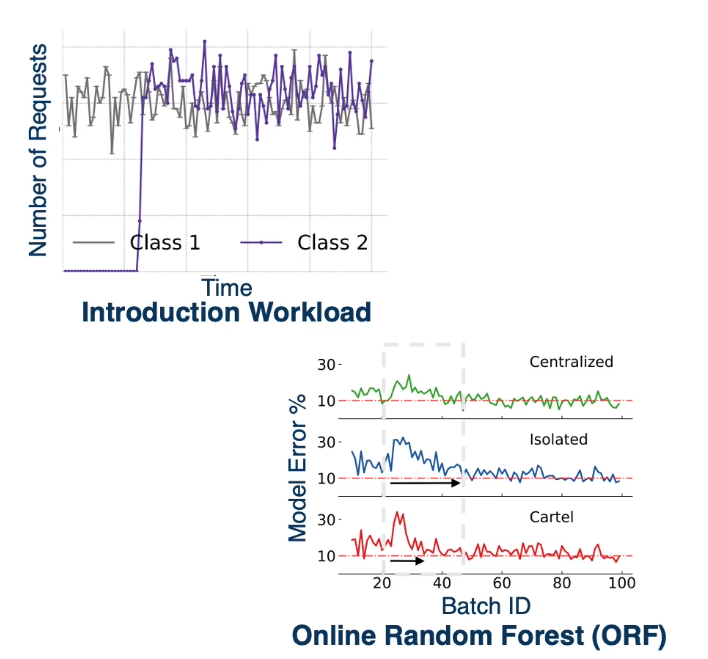

# Lesson 14 Distributed Machine Learning

## 14.1 Introduction

- **Distributed Machine Learning**
- **Approximation-based** techniques
- **Decentralized, peer-to-peer** learning
- Mostly **training**, brief mention of **interface**

## 14.2 Distributed Machine Learning

## 14.3 Distributed Machine Learning Approaches

#### Centralized Models

- **Approach:**
  - Aggregate all data to a central location
  - Train
  - Distribute model to all location
- **Downside:**
  - Data movement costs(53X)
  - Data sovereignty

#### Federate Models

- **Approach:**
  - Evaluate data locally
  - Periodically aggregate model/parameters centrally
  - Disseminate updates
- **Examples:**
  - Gaia[ATC'17], based on Parameter Server [OSDI'14]
  - Federated Learning, by Google

#### Parameter

- **Data** distributed across **workers**
- **Model parameters** distributed across **servers**
- **Iterate**:
  - Workers get working set of parameters
  - Compute gradients
  - Update parameters to server
  - Servers synchronize and update model
  - Until Model converges

## 14.4 Geo-Distributed ML

速度很慢

## 14.5 Leverage Approximation

- Decouple the synchronization of the model **within** the data center from the synchronization of the model **among** data centers.
  
- How to **synchronize** among datacenter(what, when, ...)?
  
  Communicated across

## 14.6 Gaia: An Approximate Synchronous Parallel System

- Significance filter
- ASP selective barrier
- Mirror clock
  

#### Gaia Design

#### Performance Benefits

- **Significant reduction** in learning performance over simply running a system designed for a datacenter across WAN
- ASP allows Gaia to achieve **performance close to the LAN-speed** system
- 

## 14.7 Tradeoffs of Using Global Model

#### Do We Always Need a Global Model?

**Why a Global Model is not always needed**

- Locality and personalization
- Tailored models == smaller, more efficient
- Complexity of training and potential for overfitting with large models
- Data transer costs big (and not justified)

#### Alternative to using Global Model

Isolate Learning

- Each node builds **custom model** in isolation
- **Loss of accuracy**
  - Insufficient data
- **Loss of efficiency**
  - No sharing of data
  - No sharing of computation
  - Especially during concpet

## 14.7 Collaborative Learning with Cartel

#### Cartel: A System for Collaborative Transfer Learning at the Edge

Cartel Summary

- Maintain small customized models at each location/node/context
- However, when there is change in the environment or variations in workload patterns, find a node(peer) in the distributed system where similar patterns have been observed adn transfer knowledge(perform mode update)
- Cartel provides a jump start to adapt to these changes by making it possible to react quickly, find the right peer nodes, and to selectively update the model

#### Collaborative Learning in Cartel

- Localized trends at the **edge**
- **Metadata service** (e.g., centralized registry or DHT)
  - Keeps meta data to serve queries about logic neighbors
- **Basic operation**

  - On drift detection
  - Determine logical neighbor
  - Performance selective knowledge transfer

- 

#### Experimental Evaluation

Benefits of collaborative approach include:

- **Adapts quickly to changes in workload**
  - up to 8x faster compared to an isolated system
- **Reduces total data transfer costs significantly**
  - up to 1500X down size compared to a centrailzed system
- **Enables use of smaller models**
  - 3x down at an edge node leading to faster training 5.7X faster when compared to a centralized system
    

## 14.8 Beyond Geo-Distributed Training

## Current ML Ecosystem

Ray 整合在一起

“Ray: A Distributed Framework for Emerging AI Applications”, Philipp Moritz et al, OSDI 2018

## 14.9 Summary

- **Challenges** and **techniques** for distributed Machine Learning
- **Geo-distributed** ML and **Gaia** and its **ASP synchronization model** that considers **approximation**
- Very **decentralized, collaborative peer-to-peer** learning with **Cartel** and its **benefits**
- Brief mention of **importance of distributed systems for other phases** of ML
