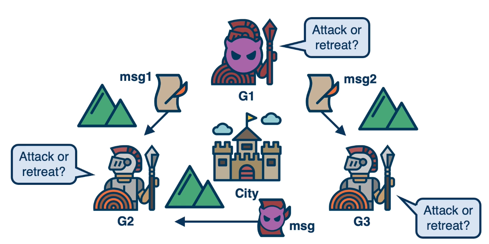
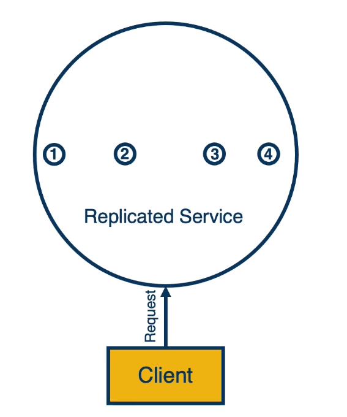
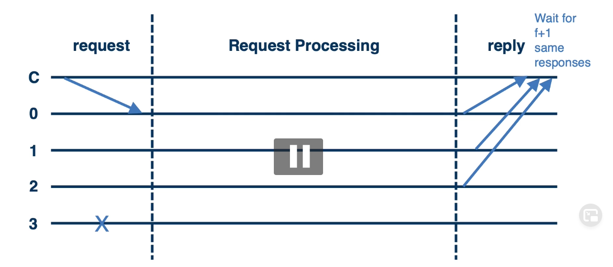
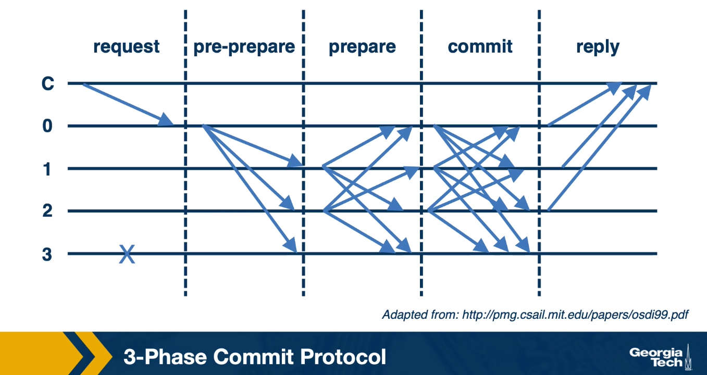
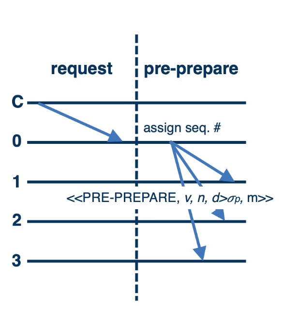
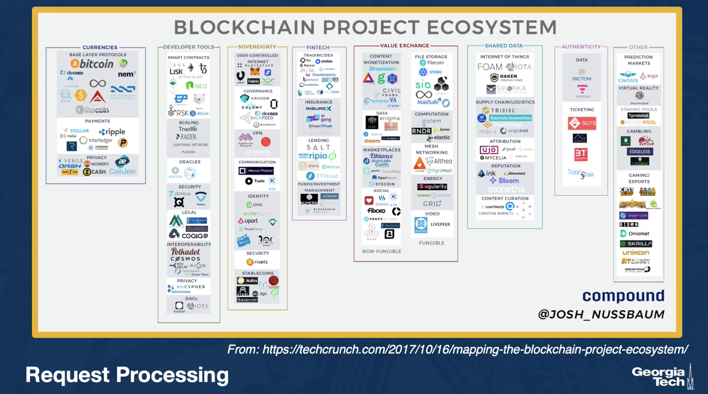
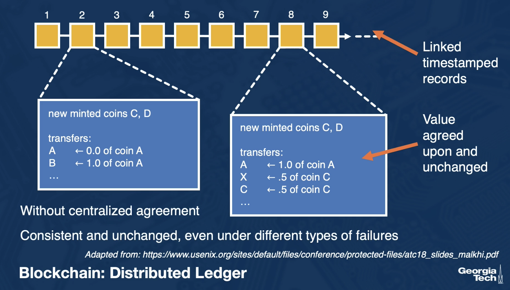
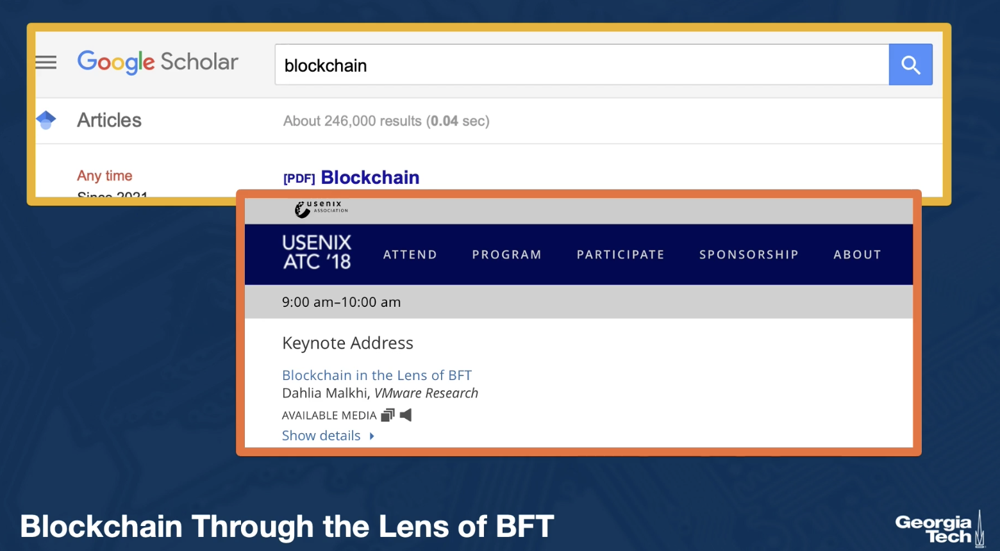

# Lesson 15: Byzantine Fault Tolerance & Blockchain

## 15.1 Lesson 15 Introduction

- **Consensus** and **Byzantine failure**
- **Practical Byzantine Fault Tolerance** (pBFT)
- Relationship to **Blockchine technologies**

## 15.2 Byzantine Failure and Byzantine Generals

- On failure **nodes continue participating** in the distributed system
- **Exhibit incorrect behavior**, sending incorrect messages
- **Malicious** or **arbitrary** reasons
- **The Byzantine Generals Problems**
  - Leslie Lamport, Robert Shostak, Marshall Pease, **ACM Transaction on Programming Languages and System** | July 1982, pp. 382-401
  - https://www.microsoft.com/en-us/research/uploads/prod/2016/12/The-Byzantine-Generals-Problem.pdf

#### Byzantine Generals Problem

general or message can be corrupted

Is consensus possible

## 15.3 Byzantine Fault Tolerance

#### The Goal

- Reach **consensus**
  - Safety, liveness, validity
- Tolerate **f failures**
- **Asynchronous** network
- In the presence of **Byzantine behavior**

#### The Main

- **Corrupt message?**
  - Cryptographic methods
- **Corrupt participants?**
  - Increase the number
  - For f faults -> n = 3f + 1 nodes
- **Corrupt leader?**
  - Additional checks among participants
- For liveness, **bounded delay** (eventual synchrony)

## 15.4 Practical Byzantine Fault Tolerance: pBFT

- **Practical Byzantine Fault Tolerance**, Miguel Castro and Barbara Liskov, OSDI’99
- **"High-performance" solution** to tolerate f faults with 3f+1

#### System Model

- System is **replicated service**
  - If there are f faulty nodes then n=3f+1 replicated servers
  - Primary (leader) and backups
- All operations happens in a **"view" determined by current primary**
- Each **replica maintains** the service state
  - Must be consistent
  - State include: Service State, Message log, Current view.
- **Communication integrity** guranteed cryptographically:
  - Digest, publis keys, ....

#### Why 3f+1?

- N nodes total
- Must tolerate f faults
- Must decide via quorum among (N-f)
- f Byzantine nodes may be among (N-f)
  - 收到(N-f)消息后做决定，但是 f 或许在这其中
- Must ensure there are more non-faulty responses: (N-f) - f > f
  - => N > 3f, or at least 3f+1

## 15.5 pBFT Algorithm

#### Request Processing

#### 3phase Commit Protocol

#### 3phase Commit Protocol

#### Pre-prepare Phase

- The primary multicasts **pre-prepare request** piggybacked with message to backups.
- It **stores with message** in log
- **Backups accept pre-prepare request if**
  - Signature $\sigma$ and digest $d$ check
  - View v is correct
  - Sequence number n is new
  - n lies between two watermarks h and H

#### Prepare Phase

- A replica multicases a **prepare message** if it accepts the pre-prepare
- **Adds both messages** to log
- **Then waits for predicate**
  - `prepared(m,v,n,i)` to be true
  - i.e., the log has a pre-prepare and 2f matching prepares which have the same v and n and digest d.

#### Commit Phase

- A replica multicases a **commit message** once the prepare stage is done
- Then **waits for predicate to be true**
  - `commit-local(m,v,n,i)`
- **Predicates is true if**
  - `prepared(m,v,n,i)` to be true
  - 2f + 1 matching commits have been seen(including its own)
- Once committed, sends out a reply to client

#### More Detail in the Paper:

- Log **garbage collection**
- View **change**
- **Liveness**
- Performance **optimization**
- Sample **Byzantine-fault tolerant file service** (BFS)

## 15.6 Byzantine Consensus vs. Blockchain?

#### Can We just Use pBFT?

- Pros
  - Decentralized consensus
  - Byzantine failures
  - Unreliable network
- Cons
  - Tolerate f faults in N=3f+1 nodes!?
  - Communication costs $O(n^3)$

#### Decentralized Ledger Main Ideas

- **Byzantine consensus for timestamped chain of ledge blocks**
  - not explicitly in Nakamoto's Consensus
- **Not everyone is able to participate in maintaining the ledge**
  - miners, Proof-of-Work(PoW)
  - (cryptography)
- Incentivize good behavior
  - Cryptocurrency
  - (economics)

## 15.7 How to Learn More

https://scholar.harvard.edu/files/mickens/files/thesaddestmoment.pdf

## 15.8 Lesson 15 Summary

- Byzantine failures
- **pBFT algorithm for consensus** with Byzantine failures
- Relationship to **modern blockchain technologies**
