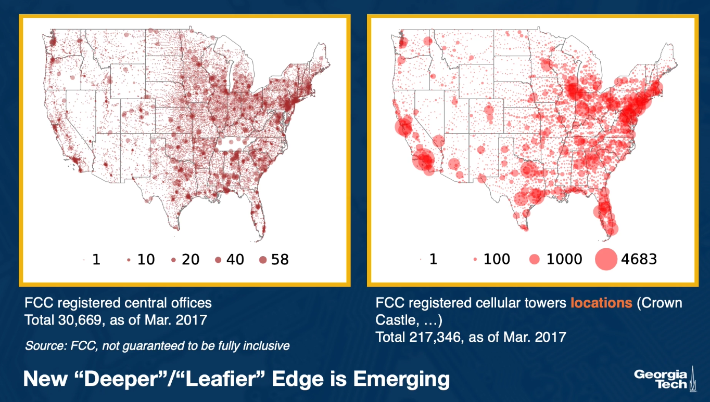
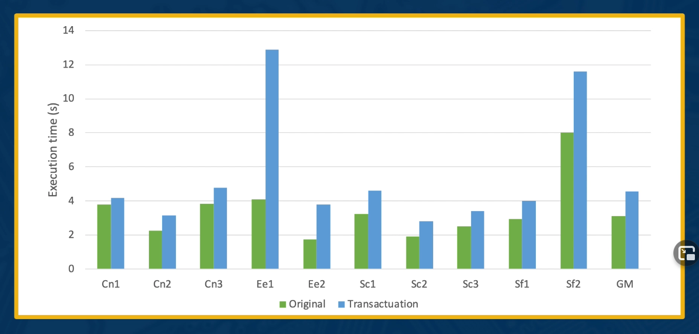

# Lesson 16 Edge Computing & IoT (Internet of Things)

## 16.1 Introduction

**New tiers** in distributed computing infrastructure

- **Edge computing**
- **IoT**
- **Impact on design tradeoffs** from characteristics of new tiers

## 16.2 Tiers in Computing

## 16.3 Why Edge Computing?

## 16.4 Closing the Latency/Bandwidth Gap

- Use compute at the network edge to deliver latency, bandwith, privacy, ....
- Edge Computing, Mobile/Multi-access Edge Computing(MEC)

## 16.5 Is Edge Computing New?

## 16.6 Edge Computing Drivers

#### Fundamental Driver

- Speed of light
- Energy (growth of data)
- Regulatory, data sovereignty

##### "Killer" Apps:

- 5G
- New Video
- AR/VR/XR
- IoT and automation
- Cognitive tasks
- Enterprise/private LTE
- ...

#### Bandwith as a Driver

- Backhaul connectivity
- Asymmetric upload/download speeds

## 16.7 Distributed Edge Computing

#### Edge != Cloud

- Scale, geo-distribution
- "Chatty" protocols not appropriate
- The edge is not elastic
- Mobility, device churn, reliability
- Variability/heterogeneity
- Localization, contextualization
- Decentralization
- Lack of physical security

## 16.8 IoT and Distributed Transactions

#### IoT Based Edge Services

- Cloud + edge/gateways + smart devices
- Sensing and actuation
  

#### Intrusion Detection Application

#### Failure Example

#### Dependencies

## 16.9 Transactuations

- **High-level programming abstraction and model**
  - `perform(applicationLogic, [sensorList, timeWindow, sensingPolicy],[actuatingPolicy]`
- `onSuccess()` and `onFailure()` methods
- **Atoic durability** of actuation
- Avoid **concurrency bugs**

#### Transactuations Invariants

- **Sensing Invariant**
  - Transactuation **executes only when staleness of its sensor reads is bounded**, as per specified sensing policy
- **Sensing Policy**
  - How much staleness is acceptable?
  - How many failed sensors is acceptable?
- **Sensing Example**

  - At least one co2 sensor can be read within last 5 mins

- **Actuation Invariant**
  - When a transactuation commits its app states, enough actuation have succeeded as per specified actuation policy
- **Actuation Policy**
  - How many failed actuation is acceptable?
- **Actuation Example**
  - At least one alarm should successfully turn on

#### Execution Model

## 16.10 Evaluation of Transactuations

#### Evaluation: Impact on Programmability

#### Evaluation: Impact on Failure-Free Execution

## 16.11 Lesson 16 Summary

- **New Infrastructure tiers** in distributed computing => **impact on rethinking design** of distributed systems and concepts
- **Edge computing**
- **Transactuations:** Distributed Transactions for **IoT** and **the Edge**
