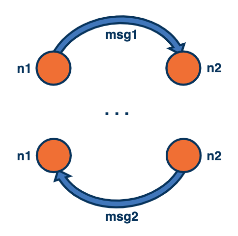
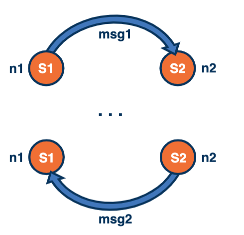
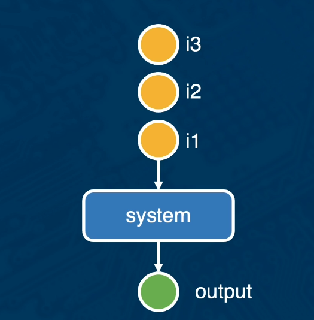
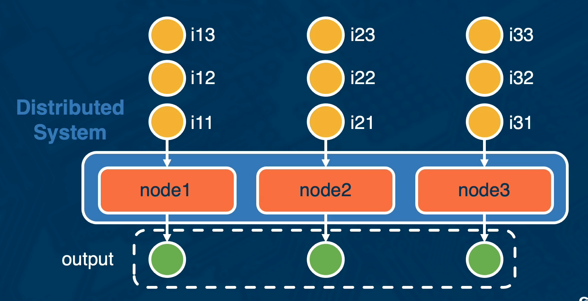

L1 Introduction to Distributed System

## Introduction

- What are **distributed systems**?
- What is **unique** and what is hard about distributed system?
- What are the **role models** and **ckear assumptions** in the distributed system?

### References of Note:

- What Good are Models and What Models are Good
- Fallacies of Distributed Computing
- CAP Theorem

## Examples of Distributed System?

- GT OMSCS
- Online Activity
- Cloud System
- Telecommunications
- Emerging Applications
- Massive Multi-cores

## What is a Distributed System?

Leslie Lampot

> A distributed system is one in which the failure of a computer you didn't even know existed can render your own computer unusable

A **collection of computing units** that interact by exchanging messages via an interconnection network and appear to external users as a single coherent computing facility

## A Simple Model of a Distributed System

- Two or more **nodes**
- Connected via **communication channels**
- Send and receive **messages**
  

### The right level of abstraction:

- **Nodes** receive a message from a channel , take some time to act on it, send a message to (one or more) channels
- **Messages** spend some time in the channel and are then delivered (zero or more times, ideally exactly once)

## A Slightly More Complex Model of a Distributed System

- Two or more **nodes**
- Connected via **communication channels**
- Send and receive **messages**
- Each node contributes to the overall system state S
  

## The right level of abstraction:

- **Nodes** receive a message from a channel , take some time to act on it, send a message to (one or more) channels
- The **receipt of a message**, i.e., the action executed on receipt of a message, may change the **state of node from S1 to S1'**.
- **Messages** spend some time in the channel and are then delivered (zero or more times, ideally exactly once)

## Importance of a Model

### What Models are Good and What Good are Models?

Type of research/contributions in distributed system:

- Theoretical (models + analysis)
- Practical (deployment + experimental evaluation)

### Model includes

- Elements and rules
  - Examples:
    - a system is modeled as a collection of nodes, channels, etc.
    - sending a message adds it to the messages currently in the channel, ...
- Model invariants = assumptions
  - ## Example:
    - every message is delivered after some time -> lossless communication/the network will not fail

### Picking a Model

#### Is a model good enough?

- Accurate: Is it possible to learn some truths about the real system using the model?
- Tractable: Are analysis of a certain problem using the model even possible?

#### When defining or pocking a model, important to understand:

- What **type of problems** does it let us investigate?
- will it allow us to **build and analyze solutions** for these problems?

#### The benefits of simple models (KISS)

- **Build basic algorithms considering simple "application" and their actions**
  - : e.g., boolean, binary, ... e.g., ensure all nodes receive all messages vs. ensure all nodes receive all messages with the same information about the node's state.
- **All messages will be delivered, ... eventually**
  - possible, retransmit
- **No messages will be reordered**
  - possible, use TCP
- ** No malicious actors**
  - a node may crash but will not intentionally start sending incorrect messages
  - design a solution that works without malicious nodes, then add cryptography to differentiate other failures

### What Models are Good and What Good are Models?

- Not quite a paper, textbook chapter
- Two roles:
  - Understand the role and necessary considerations of/when using models
  - Summary of technical challenges in distributed systems.

## What is Hard about Distributed Systems?

- Asynchrony
  - Instant vs. bounded vs. unpredictable vs. infinite latency
  - Implication on system design
- Failures
  - From "failstop" to transient to Byzantine/can't tell
  - Server/process vs. network
- Consistency = single up-to-date copy (or agreement thereof)
  - Concurrency, ordering,
  - Replication, caching

### The 8 Fallacies

- Working around the **8 fallacies**
  1. The network is reliable
  2. Latency is zero
  3. Bandwith is infinite
  4. The network is secure
  5. Toplogy doesn't change
  6. There is one administrator
  7. Transport cost is zero
  8. the network is homogeneous
- Given this, how to make systems work **reliably, efficiently, at large/arbitrary scales, at high availability...**
- **All papers discussed in class** in some way deal with one or more of these fallacies

## Properties of a Distributed System

#### What do we want from a Distributed System?

The system

- gives correct answer
  - Consistency
- Always
  - High availability
- Regardless of failures or delay of a node or the network
  - Tolerance to partitions

### Desirable Properties

- **Fault-Tolerant**: It can recover from componenet failures without performing incorrect actions.
- **Highly Available**: It can restore operations, permitting it to resume providing services even when some components have failed
- **Recoverable**: Failed components can restart themselves and rejoin the system, after the cause of failure has been repaired.
- **Consistent**: The system can coodinate actions by multiple components often in the presence of concurrency and failure. This underlies the ability of a distributed system to act like a non-distributed system.
- **Scalable**: I can operate correctly even as some aspect of the system is scaled to larger size. For example, we might increase the size of the network on which the system is running. This increases the frequency of the network outages and could degrade a "non-scalable" system. Similarly, we might increase the number of users or servers, or overall load on the system. In a scalable system, this should not have a significant effect.
- **Predictable Performance**: The ability of provide desired responsiveness in a timely manner.
- \*_Secure_: The system authenticates access to data and services.

## Correctness

希望结果和单机一样

Consistency:

- Strict <= impossible
- Linearizability
- Serializability

## The CAP "Theorem"

You cannot have all three properties:

- if a network partition occurs(P), to guarantee conconsistency(C) may need to return errors/timeouts(lose A)
  - Cassandra
  - DynamoDB
- if a network partition occurs(P), the system can continue providing responses(A), but some may return stale values (lose C)
  - Megastore
  - MySQL Cluster

Brewer's CAP Theorem

- Slow response == No response
- Low latency == No availability
- Availability vs. Consistency == Latency vs. Consistenc

What's the appropriate tradeoff among L and C?
**PACELC**: If there is a Partition(P), how does the system trade off availability and consistency (A and C); else (E)m when the system is running normally in the absence of partitions, how does the system trad off latency(L) and consistency(C)?

http://www.cs.umd.edu/~abadi/papers/abadi-pacelc.pdf

## Lesson 1 Summary

- **Characteristics of distributed system**: definition and properties
- **Role of models** in distributed systems.
- **Leslie Lamport, Brewer's CAP Theorem, ...**
