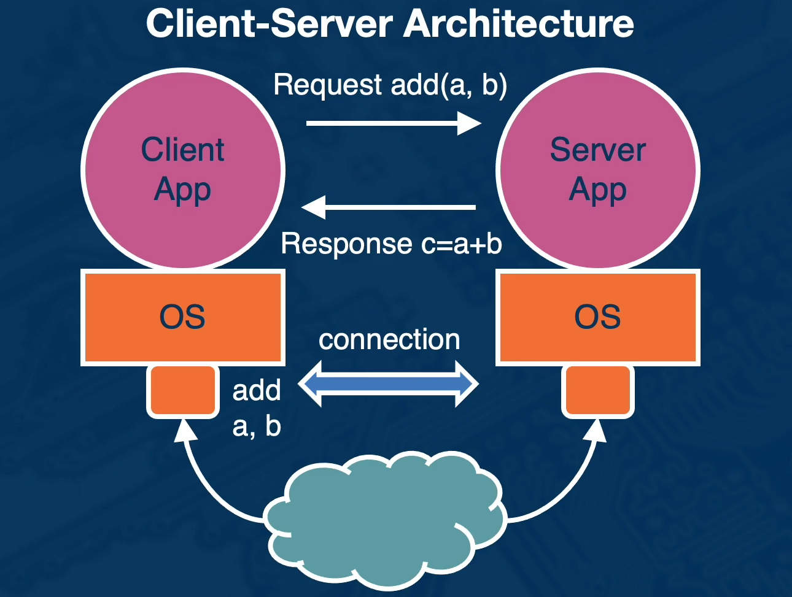
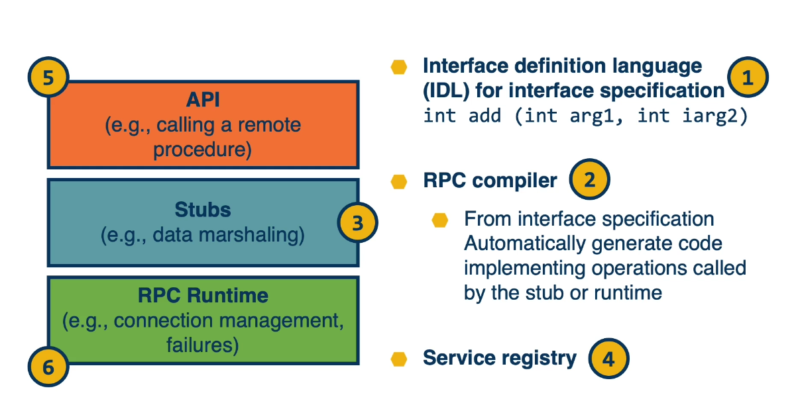
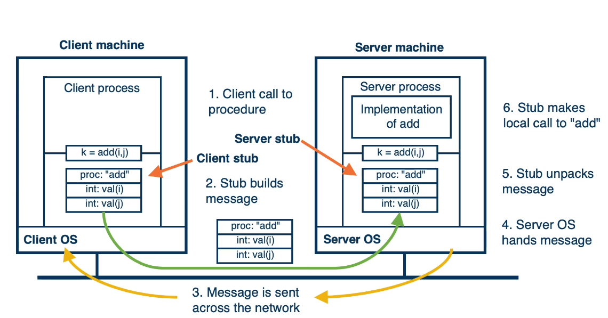
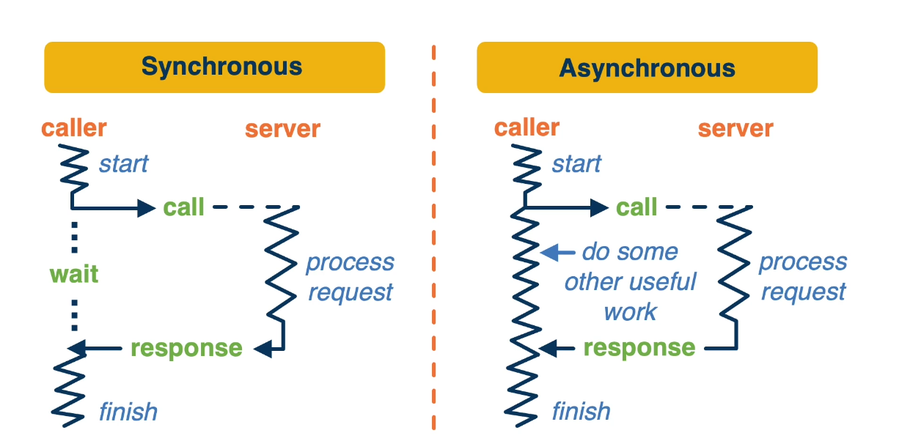
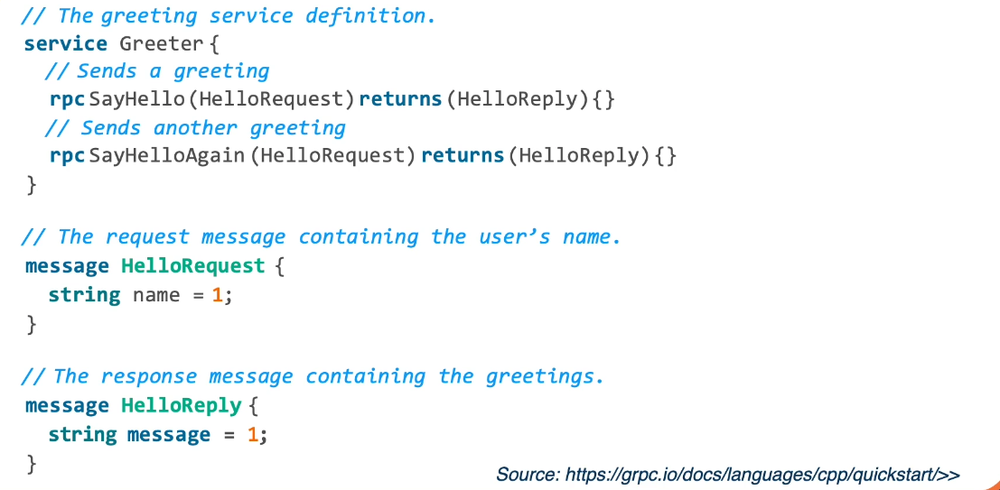
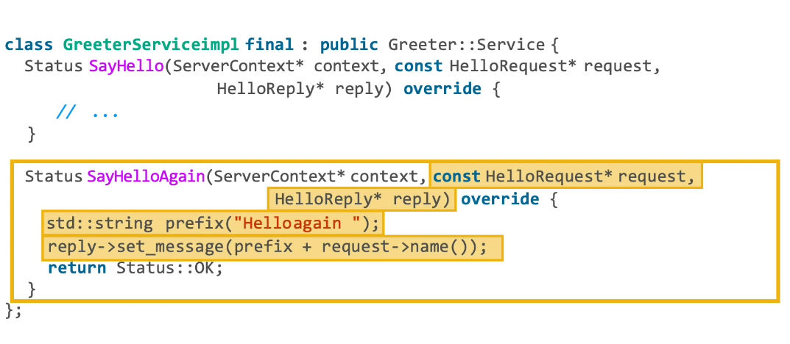
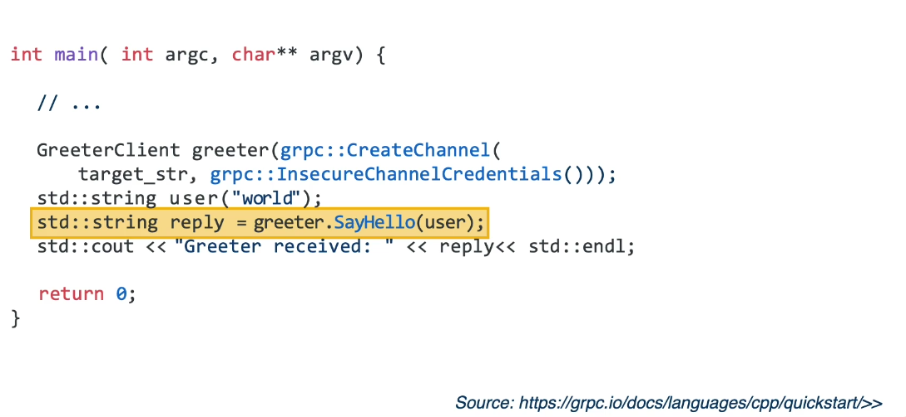
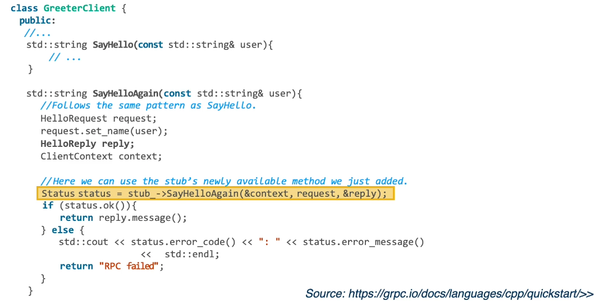

# Lesson 2: Primer on Remote Procedure Call

## Introduction

- What is client-server architecture?
- What is RPC?
- What are the **main mechanisms** enabled by RPC?

## Client-Server Architecture

## Challenges in Client-Server

#### What is hard in Client-Server Systems?

- Discovery and binding
- Identifying the interface and parameter types
- Agreeing on the data representation
- Explicit data management
- Unpredictable delays
- Unknown cause of failures
- Must be explicitly handled

## Role of RPC

#### Goals of an RPC System

- Hide complexity of distributed programming from application and developers
- Make distributed programming appear similar to local node programming

#### RPC must provides

- Service registration mechanism
- Connection management
- Interface specification
- Type System
- Data management
  - Serialization (marshaling) and deserialization(unmarshalling)
  - Serialized byte stream, combines service descriptors(metadata) + arguments or results(data)
- Dealing with failures
  - Timeout and retry for transient
  - Timeout and return appropriate error message, otherwise

## Architecture of an RPC System

- API (e.g., Calling a remote procedure)
- Stubs (e.g., data marshaling)
- RPC Runtime (e.g., connection management, failures)
- Interface definition language(IDL) for interface specification
- RPC compiler
  - From interface specification Automatically generate code implementing operations called by the stub or runtime
- Service registry

  

1,2,3,4 server
5,6, client

## Anatomy of an RPC Call

## Invocation Semantics of RPC Operations 1

- Synchronous
- Asynchronous
  

## Invocation Semantics of RPC Operations 2

Guarantee of the delivery

- Local PC:
  - No response = deadlock or full process failure
  - Has to restart and redo everything
- RPC:
  - No response = ??
    - Request lost
    - Response lost
    - Server failure

#### semantics

- Exactly one
  - Timeout and restransmit
  - Eliminate duplicates
  - On persistent failure of server/connection:
    - Blocks/fails
- At most once
  - Client knows call may not be executed and can be programmed for that.
- At least once
  - Timeout and restransmit
  - No guarantees duplicates will be eliminated
- Others
  - for example all replicas or some proportion of the replicas

## Examples of RPC Systems

- Sun RPC
- SOAP
- CORBRA
- gRPC
- Apache Thrift

Implementations **specialized** for certain contexts. Such as:

- high-speed reliable network
- low resource footprint

## Examples of RPC Systems: gRPC

gRPC Overview

- Protocol Buffers
- Interface specification .proto
- Compiler protoc
- API
- See [https://grpc.io/](https://grpc.io/)

proto

Server

Client

Client sub

## Summary

- Brief **overview** of RPC
- Role of RPC in **client-server systems**
- Some **example** of RPC systems
