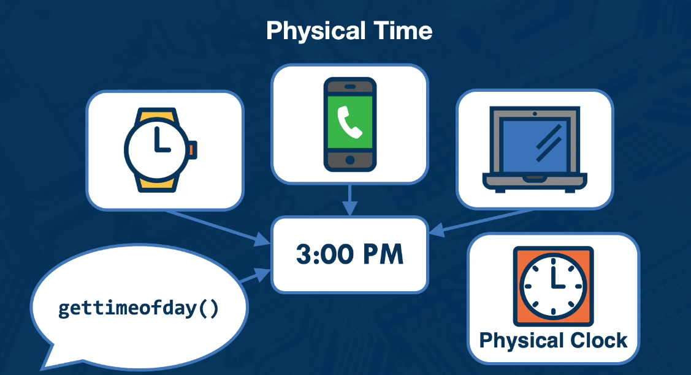
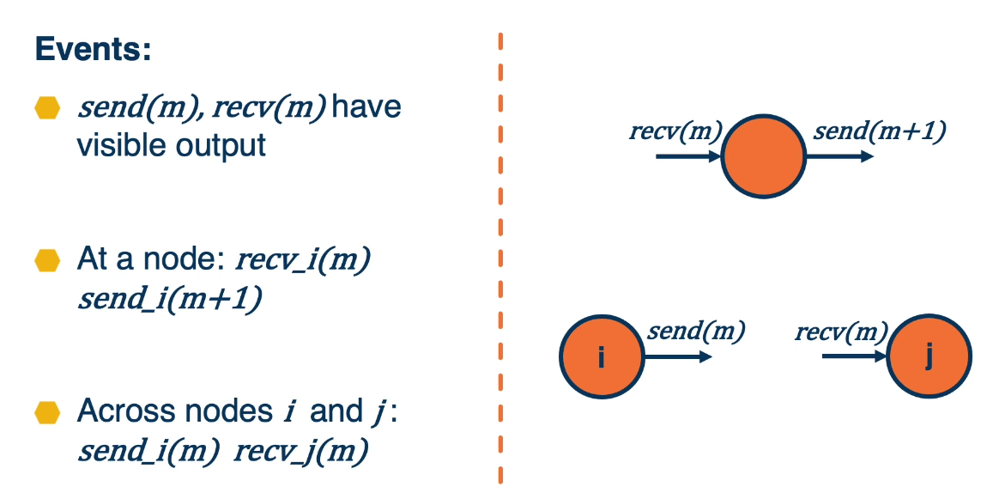
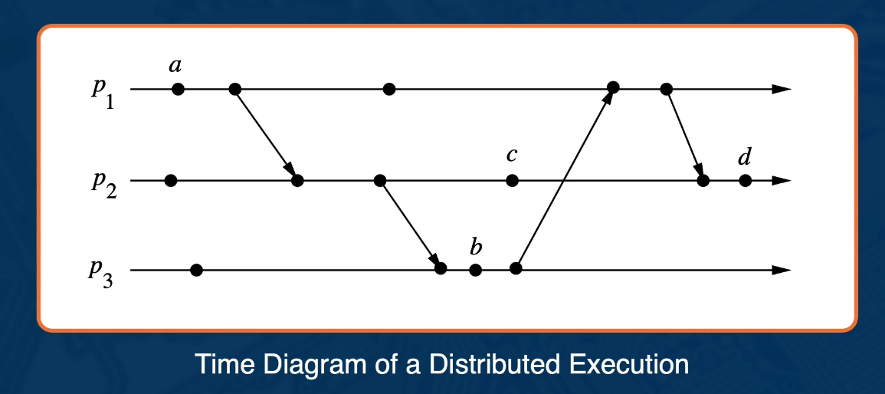
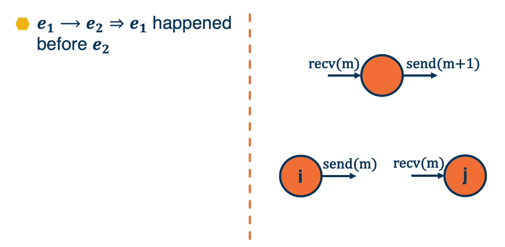
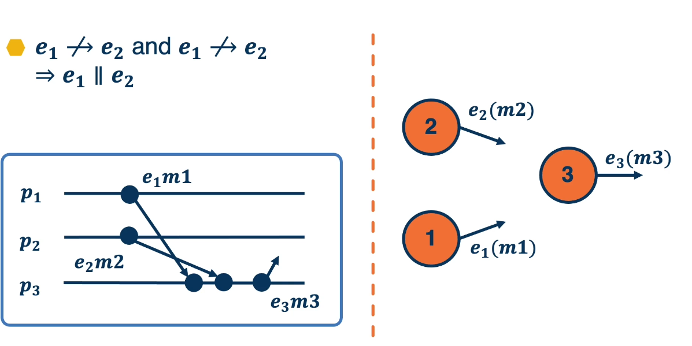
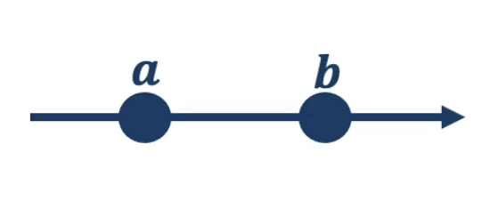
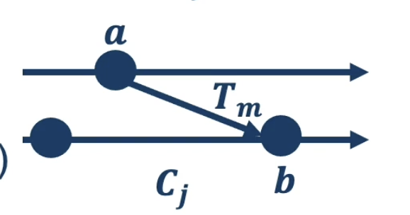
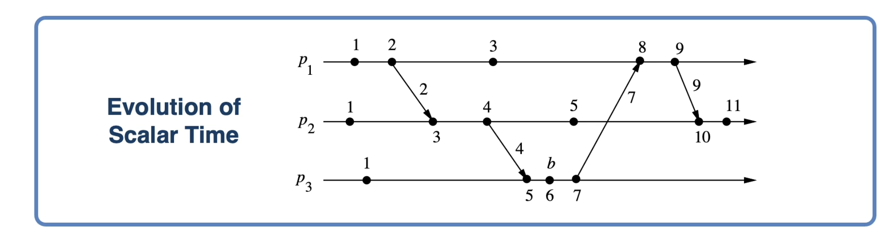
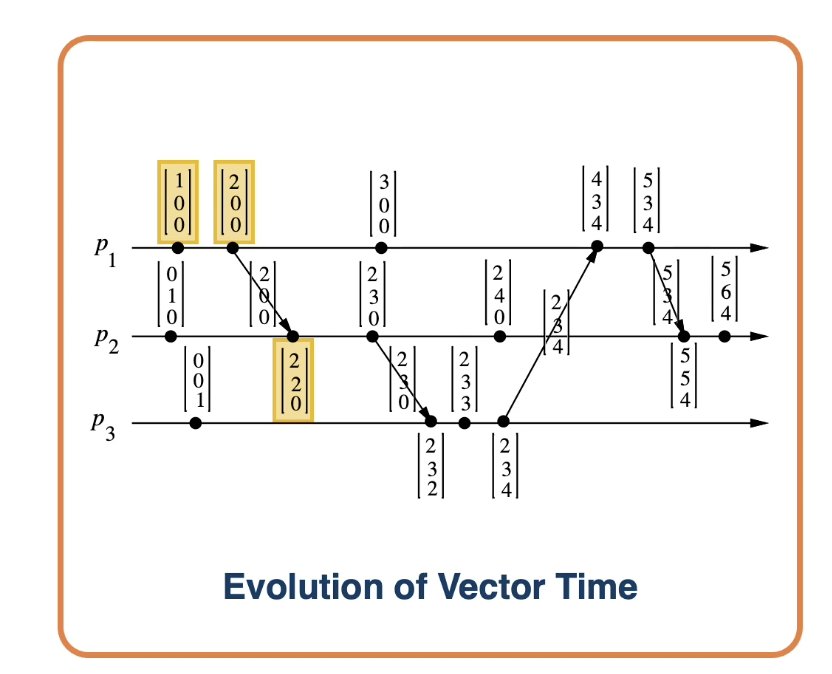

# Lesson 3: Time in Distributed Systems

- Physical Time
  

## 3.1 Lesson Introduction

- **Physical vs. Logical Time**
- **Lamport's Clocks** from CS6210
  - **Logical Time**: A way to Capture Causality in Distributed System
  - **Other types** of logical clocks

## 3.2 Why Do We Need Time?

- Ordering of each operation
- Causality
  - Correctness: debugging, dependence analysis, consistency...
  - happens before critical relationship in distributed algorithms
- Scheduling
  - Fairness
  - Service Level Objectives(SLOs)...
- Progress Measure(garbage collection)

## 3.3 Why Is Measuring Time Hard in DS?

#### Can we just Rely on the Observer?

- Use **clock at the receiver**
- Message **mi** sent from nodes **Ni**
- When messages received, order established **based on time at receiver**
- **However**:
  - Network delays
  - Lost messages
- **=> Not a solution**

#### Can we Use Nodes' Local Clocks?

- Use **clocks available on each node**
- Message **mi** timestamped with **ti** based on local clock
- When message received, **compare timestamp**
- **However**
  - Clocks not guaranteed to be synchronized

#### Why is Time Hard in DS?

- Do all nodes **need to agree** on what the global time is?
- Are message propagation times **fixed for all messages/connections?**
- Are **delays constant?**
- Are there **failures**? Of a node? Of a network connection?
- Are there any **malicious nodes?**

## 3.4 Logical Time

- **Real Time** measured with real clocks is hard to work with
  - Introduce **virtual time** measured with **virtual clocks**
- **Logical clocks and logical time**
  - Generate timestamps
  - Advance in some manner
  - Can be used to order events

##### Typers of Logical Time

- Paper: [Raynal and M. Singhal. Logical Time: A Way to Capture Causality in Distributed Systems](http://citeseerx.ist.psu.edu/viewdoc/download?doi=10.1.1.35.6474&rep=rep1&type=pdf)
- Types:
  - Scalar (Lamport's) clocks
  - Vector clocks
  - Matrix clocks

## 3.5 Common Notations

#### Some Notations Used in (This) Paper

$p_{i}$ generates events $e_{i}^{0}, e_{i}^{1}, e_{i}^{2}, \ldots, e_{i}^{k}, e_{i}^{k+1}, \ldots, e_{i}^{n}$

Each $e_{i}^{k} \rightarrow e_{i}^{k+1}$

- $\rightarrow$ " happens before" relationship
- $e_{i}^{k} \rightarrow$ any $e_{i}^{k+j}, j \geq 1$

History $\boldsymbol{H}_{\boldsymbol{i}}$ - ordered sequence of events in $\boldsymbol{p}_{\boldsymbol{i}}$

#### Events:

#### Time Diagram

## 3.6 Concurrent Events

Same node or same message

Not happens-before relationship

## 3.7 Logical Clock (Formally)

For **each event** $e_{1}$, **Logical Clock** $C$ produces timestamps $C\left(e_{1}\right)$
**Clock consistency condition:**

- If $e_{1} \rightarrow e_{2} \Rightarrow C\left(e_{1}\right)<C\left(e_{2}\right)$
  - monotonicity property
- $e*{1} \| e*{2}$ ?? $ C\left(e*{1}\right) $ ?? $C\left(e*{2}\right)$
  **Strong clock consistency**:
$e*{1} \rightarrow e*{2} \Leftrightarrow C\left(e*{1}\right)<C\left(e*{2}\right)$

For any event in the distributed system, **logical clock C(e) produces a value in T**

- the timestamp, a data structure

**Map event history to partially ordered time domain T**

- since events may be concurrent

**A clock function C**

- a set of rules to advance timestamps(to increment the clock)

## 3.8 Lamport’s Scalar Clock

**Logical clock $C_i$** associated with **$p_i$**; **timestamp value** of $C_i$ is a **scalar**

- if a and b are events in same process
  - Condition 1: a -> b, => $C_i(a) < C_i(b)$
  - Rule 1:
    - $p_i$ increments $C_i$ between successive events -
- if a and b message send and receive events from $p_i$ to $p_j$

  - Condition 2: $a -> b, => C_i(a) < C_j(b)$
  - Rule 2:

    - $T_m = C_i(a) = C_i$ (timestamp associated with message)
    - $C_j(b) = MAX(T_{m++}, C_j)$
    - 

### Illustration

- $2@p_1$ > $1@p_1$
- $3@p_1$ || $3@p_2$
- $4@p_2$ || $3@p_1$

---

- Lamport clock is **only consistent**, it is **not strongly consistent**
  - Is consisten:
    - $e_1 \rightarrow e_2 \Rightarrow C\left(e_{1}\right)<C\left(e_{2}\right)$
    - sufficient for correctness
  - Is not strongly consistent:
    - $C\left(e_{1}\right)<C\left(e_{2}\right) ! \Rightarrow e_{1} \rightarrow e_{2}$
    - some loss of efficiency
- Can be used to **establish(partial) ordering**, but **not causality**
- Use **Rule 3 tiebreaker** to establish total ordering
  - E.g., process ID => 3@$p_1$ < 3@$p_2$
- **Bonus feature**: ~counting, estimate events
  - If increment is **always by 1 => local clock = minimum number of preceding events** in the distributed system

## 3.9 Vector Clock

### Vector Clock

- Clock is a vector
- $p_i's$ clock is $vt_i$
- Each process **maintains its own view of time** at other nodes
- $vt_i[i]$ => $p_i's$ Lamport Clock $C_i$
- $vt_i[j]$ => $p_i's$ knowledge about $p_j$'s Lamport Clock $C_j$

### Rule

- R1: Before executing an event, it updates its local logical time as follows:
  - $vt_i[i] := vt_i[i]+d$ (d > 0)
- R2: Each message m is piggybacked with the vector clock vt of the sender process at sending time. On the receipt of such a message (m, vt), process $p_i$ executes the following sequence of actions:
  - Update its logical global time as follows:
    - $1 \leq k \leq n: v t_{i}[k]:=\max \left(v t_{i}[k], v t[k]\right)$
  - Exectue R1
  - Deliver the message m.

### Example

### Vector Comparisoms:

- $v t_{1} \leq v t_{2} \Leftrightarrow v t_{1}[i] \leq v t_{2}[i]$, for each i
- $v t_{1} \lt v t_{2} \Leftrightarrow v t_{1}[i] \leq v t_{2}[i]$, and $\boldsymbol{v t}_{1}[\boldsymbol{k}]<\boldsymbol{v t}_{2}[\boldsymbol{k}]$ for each least 1 k
- $v t_{1} \| v t_{2} \Leftrightarrow !\left(v t_{1}<v t_{2}\right)$ and $!\left(v t_{2}<v t_{1}\right)$

### Properties:

- Consistent:
  - if $\boldsymbol{a} \rightarrow \boldsymbol{b} \Rightarrow \boldsymbol{V}_{\boldsymbol{t}}(\boldsymbol{a})<\boldsymbol{V}_{\boldsymbol{t}}(\boldsymbol{b})$
- Strongly consistent:
  - if $\boldsymbol{V}_{\boldsymbol{t}}(\boldsymbol{a})\left\|\boldsymbol{V}_{\boldsymbol{t}}(\boldsymbol{b}) \Rightarrow \boldsymbol{a}\right\| \boldsymbol{b}$

### Comparison

- Lamport/Scalar
  - **Correctness**(Clock consistency)
  - **No Efficiency** (Strong clock consistentency)
  - **Clock size** O(1)
- Vector
  - **Correctness**(Clock consistency)
  - **Efficiency** (Strong clock consistentency)
  - **Clock size** O(N)
    - Per each event, with each message
    - Compression possible

## 3.10 Matrix Clock

- ## Time is represented as a matrix:
  - $\boldsymbol{m t}_{i}[\boldsymbol{i}, \boldsymbol{i}]$ = logic clock of $p_i$, tracks progess of $p_i$ (its **scalar clock**)
  - $\boldsymbol{m t}_{i}=\boldsymbol{p}_{i}$'s local view of logical global time (its **vector** clock)
  - $\boldsymbol{m t}_{\boldsymbol{i}}[\boldsymbol{k}, \boldsymbol{l}]=\boldsymbol{p}_{\boldsymbol{i}}$'s knowledge about = $p_k$'s knowledge about = $p_l$'s process
- Each process **maintains its view about every other process's view** of the global time.
- Benifits:
  - **Gabage Collection**
  - if $\min \left(m t_{i}[k, j]\right)>t$, every process knows about everything about happened prior to time t.

## 3.11 Summary

- Explained **challenges** associated with **reasoning about time** in distributed system
- Introduced the **notion of logical time and logical clock**
- Descrived several **models of logical clocks**: scalar, vector and matrix
