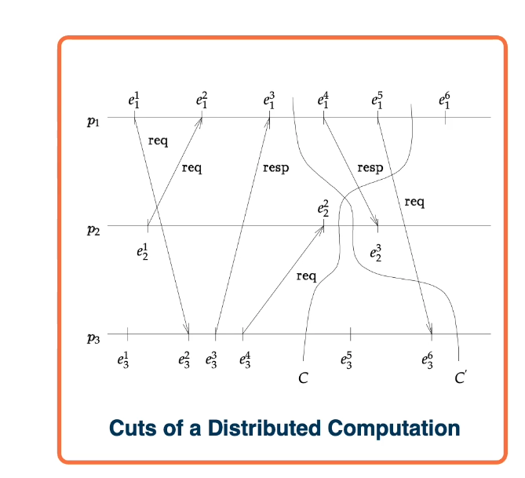
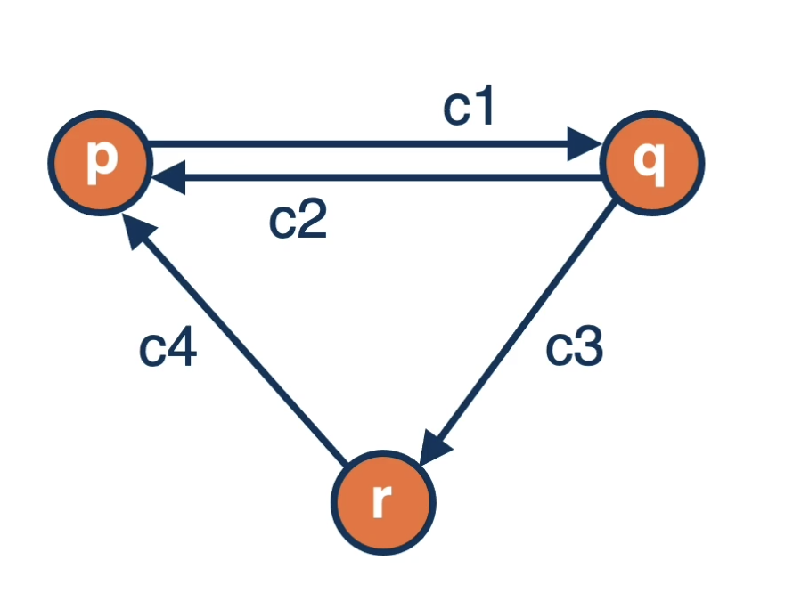
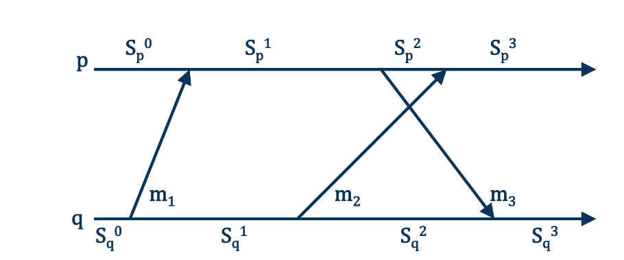
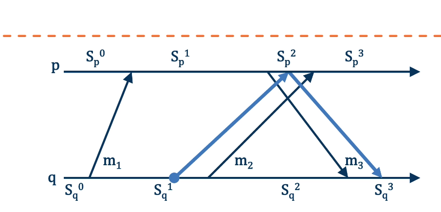
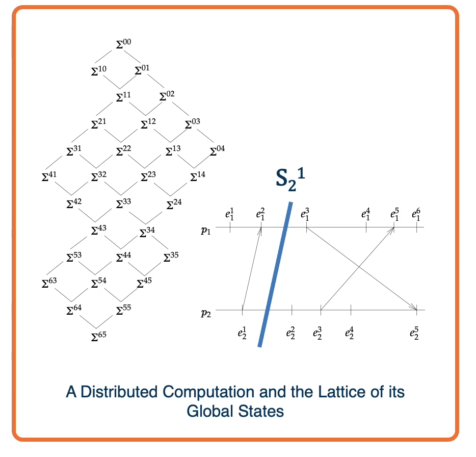
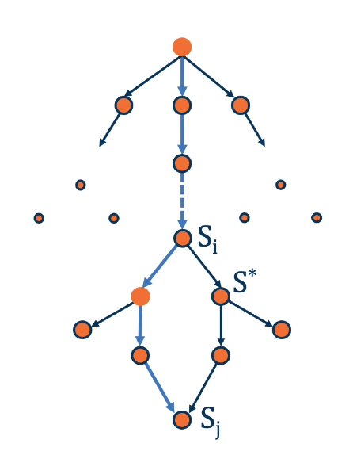

# Lesson 4 Readings and Additional Resources

- Distributed System **Difficulties and Motivation**
- **Chandy and Lamport Algorithm** Description and Example
- **Recorded Global State**
- **Stable Properties**

## 4.1 Global State, Snapshots, and Other Terminology

### Terminology

- Global State
  - Processes and Channels
  - Process state defined by most recent event
  - Channel state defined by inflight messages
- State transitions
  - Each event changes the state of at least one of the entities, therefore changes the state of the distributed system
- Run
  - e.g., $e_{1}^{1}, e_{2}^{1}, e_{1}^{2}, \ldots$
  - e.g., $e_{1}^{1}, e_{2}^{1}, e_{3}^{1},e_{1}^{2}, \ldots$
  - **Actual** and **observed**
    
- Cut
- Consistent Cut
- Snapshot
- Prerecording event
- Postrecoding event

## 4.2 Challenges about State in Distributed Systems

### Difficulties and Motivation

- Instantaneous recording not possible:
  - No Global Clock:
    - Distributed recording of local states cannot be synchronized based on time
  - Random Network Delays:
    - No centralized process can initial the detection
- Due to non-determinism
  - Deterministic computation:
    - At any point in the computation there is at most one event that can happen next.
  - Non-Deterministic Computation:
    - At any point in the computation there can be more than one event that can happen next.

## 4.3 System Model

- Processes
- Channels :
  - directed
  - FIFO (TCP/IP)
  - error-free (TCP/IP)
    

## 4.4 Finding a Consistent Cut: Algorithm in Action

### Algorithm in Action

- Goal

  - Capture snapshot of **all distributed components:** - **Process** (P,Q) and **channels** (PQ, QP)
  - Find a **consistent cut**
    
    

- q records state as $S_q^1$, sends marker to p
- p records state as $S_p^2$, channel state as empty
- q records channel state as $m_3$
- Recorded Global State = $((S_p^2, S_q^1),(m_3, 0))$

## 4.5 SnapShot Algorithm

#### Algorithm(Generalized)

- Initiator:
  - Save its local state
  - Send marker tokens on all outgoing edges
- All other processes:
  - On receiving the first marker on any incoming edge,
    - Save state and propagate markers on all outing edges
    - Resume execution, but also save incoming messages until a marker arrives through the channel
- Guarantees a consistent globe state

#### Assumptions of the Algorithm

- There are no failures and all messages arrive intact and only once
  - current technology TCP/IP allow this assumption to be true
- The communication channels are unidirectional and FIFO ordered
- The snapshort algorithm does not interfere with the normal execution of the process
- Each process in the system records its local state and the state of its incoming channels

#### A Brief Sketch

- If initiator: p sends a marker message along all its outgoing channels after it records its state and before it sends any other messages.
- On receipt of a marker message from channel c:

```c
if p has not recorded its state
  record the state
  state(c) = EMPTY
else
  state(c) = messagers received on c since it had recorded its state excluding the marker.
```

## 4.6 Global State

#### Chandy and Lamport Algorithm

Feature:

- **Does not promise** to give us exactly what is there
- But gives us **consistent state**

#### Properties and the Recorded Global State

- The recorded Global **State does not necessarily correspond to any "real" global state** of the system (i.e., one that has ever happend at any global time)
- However, it **does correspond to a possible global state** that is consistent with the ordering imposed by message sends and receives.
- The Observed Global State is usually **a permutation of other possible Global State**

#### Permutation of a Run

Possible permutations:

- State sequence S10, S11, S21 for run e11, e21, e12...
- State sequence S01, S11, S21 for run e21, e11, e12...
- both end in global state S21
  As long as **not breaking** causal relationships, **permutations ok**
  

## 4.7 Properties of a Global State

If the state recorded is $S^*$, the sequence of distributed computations done by the system is seq, and the "true" initial and final states of the system are $S_i$ and $S_j$, then:

- $S^*$ is reachable from $S_i$ and $S_j$ is reachable from $S^*$;
- There exists a computation $seq*$ which is a permutation of seq,
- Either $S^* = S_i$ or $S_i$ occurs before $S^*$ in $seq*$
- Either $S_j = S^*$ or $S^*$ occurs before $S_j$ in $seq*$

#### Theorem

The recorded state is reachable from the state in which the algorithm was initiated. The state in which the algorithm terminated is reachable from the recorded state.

## 4.8 Benefits of Global State: Evaluate Stable Properties

#### Still What Good is it?

- **Stable Properties Detection**
  - A property is called a stable property iff it becomes true in a state S, it remains true for all states S' reachable from S
  - **For example**: Deadlock, Termination, Token loss
- **Challenge**:
  - Evaluate a property without knowing/beiing sure of system state.

---



- $S^*$ is reachable from $S_i$
- $S_j$ is reachable from $S^*$

Q: What does this tell us if we know stable property is **true** in $S^*$?
A: It is **also true** in $S_j$
Q: What does this tell us if we know stable property is **false** in $S^*$?
A: It is **also false** in $S_i$

## 4.9 Definite vs. Possible State

Definite vs. Possible State

- What about **unstable properties** ?
  - Temporary buffer overflow, load spike, race condition...
- State $S*$ may **not have occurred**
- Are distributed snapshots still **useful**?

---

- For **stable** property y, if y(S\*) = true ->**definitely is true** at the end of execution
- For **unstable** property y, if y(S\*) = true ->**possibly could be true** under some conditions

## 4.10 Summary

Lesson Summary

- **Global State detection is difficult** in Distributed systems.
- **Algorithms for caputring distributed snapshots** corresponding to a possible Global State
- Snapshot algorithm **may not given an actual state** but is **very helpful in detecting Stable Properties**
