# Lesson 6 Paxos and Friends

## 6.1 Introduction

Different consensus algorithms

- PAXOS
  - PAXOS made simple
- Raft
  - In Search of an understanable consensus algorithm
    '

## 6.2 Goal of Consensus Protocol

- Processes propose values, choose values, and learn values chosen
  - Types of roles or participants:
    - proposers
    - acceptors
    - learners
  - In principle each node may have all roles
- Safety
  - Only a value that has been proposed is chosen
  - Only a single value is chosen and only a chosen value is learnt
- Liveness
  - Some proposed value is chosen
  - Any chosen value is learnt
- FLP impossibility
- Cannot not have both safety and liveness

## 6.3 2PC and 3PC

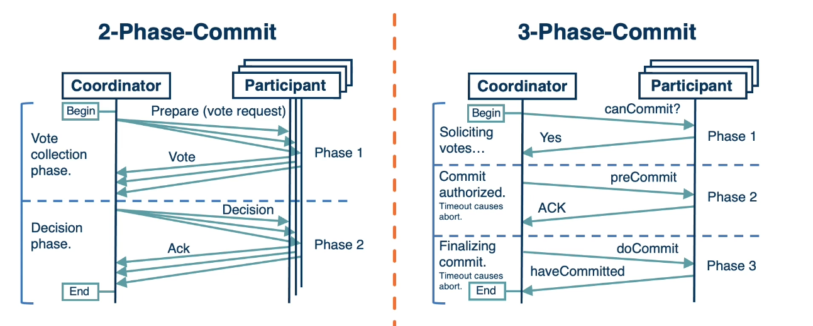

- 2PC
  - Blocking, no liveness
- 3PC
  - Assume fail-stop, safety issues on fail-restart

## 6.4 Paxos History

### Paxos and the Part-time Greek Parliament

- Original paper written in 1990 by **Leslie Lamport**
- **Published** 8 years later in **1998**
  - http://lamport.azurewebsites.net/pubs/lamport-paxos.pdf (Links to an external site.)
- **Algorithm for reaching consensus** for the parliament on the fictional island Paxos

- Parliamentarians pass decrees, but
  - work only part-time
  - communicate (propose ballots, vote, ...) by messages
  - messages may be delayed, a parliamentartian may chose not to vote, ...
  - no-one is malicious
- Rules for agreeing on a single decree, and on passing multiple decrees(multi-decree-Paxos or multi-Paxos)
  - algorithm specifies a state machine of rules/state transitions
  - provides proof that the parliament will function properly

### Paxos Made Simple, 2001

- https://www.microsoft.com/en-us/research/publication/paxos-made-simple/?from=http%3A%2F%2Fresearch.microsoft.com%2Fen-us%2Fum%2Fpeople%2Flamport%2Fpubs%2Fpaxos-simple.pdf (Links to an external site.)
- No Greek parliament any more, no olive tree price agreements, no synods, ...

## 6.5 Paxos Made Simple

**Assumptions (System Model)**
Asynchronous, non-Byzantine model:

- Agents operate at arbitrary speed, may fail by stopping, and may restart. Agents have source of persistent memory to remember information after restarting

### Underpinning Ideas

- **State Machine Replication**:
  - Each node is a replica of the same state machine (algorithm) following the same rules
- **Majority Quorum**
  - Each decsion is based on majority quorum, two quorums are guaranteed to have intersecting members, so consensus decsion can be disseminated
  - Needed so it can tolerate fail-restart failures
- **Ordering**
  - Everything is timestamped(so it can be ordered)
  - Needed so it can tolerate arbitrary message delays

## 6.6 Paxos Made Simple: Phases

- 3 phases:
  - **Prepare**: Node proposes an agreement round
  - **Accept**: Gather votes whether an agreement is possible and value has been agreed-upon
  - **Learn**: Agreed upon value can be learned by all
- - Possible to learn in **2 message** rounds
- **Proposal number** part of messages
  - Solves fail-restart and delayed messages
    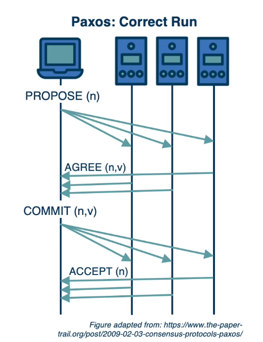

## 6.7 Paxos: Prepare Phase

1. Driven by propose(Leader)
2. A proposer selects proposal number n and sends a **prepare request** with the number n to a majority of acceptors.
   - **Prepare[n]**
   - The number n is a member of a set that is totally ordered over all processes, i.e. no two processess use the same n and a process never uses n twice
3. If an acceptor receives a prepare request with n greater than that of any prepare request to which it has already responded, it responds with promise not to accept any more proposals numbered less than n and with the highest-numbered proposal(if any) that it has accepted.
   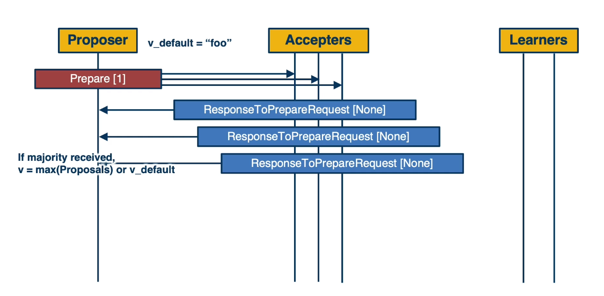

## 6.8 Paxos: Accept Phase

1. If a proposer hears back from a majority of acceptors, it sends an **accpet request** to each of those acceptors for proposal numbered n with value v. v is the value of the highest-numbered proposal among the responses. If there were no proposals, the propser can choose v.
   - **Agree[$n_v$, v]**
2. If an acceptor receives an accpet request for a proposal numbered n, it accepts the proposal unless it has already responded to a prepare request with a number greater than n.
   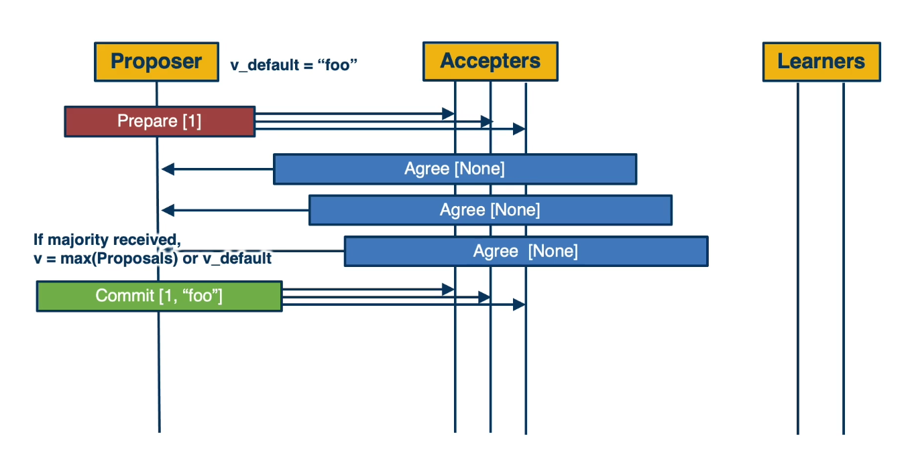

## 6.9 Paxos: Learn Phase

- **Accepted Value** becomes **Decided value** and is **communicated** to learners
  - **Decision[n, v]**
- **Inefficient** to have each acceptor notify each leaner whenever it accepts a proposal
- **Choose a distinguished learner** that receives accepted proposals form the acceptors
- Once distinguished learner **receives a proposal from a majority of accpetors**, it informs the other leaners
- Larger set of distinguished learners **provides greater reliability at the cost of greater communication complexity**
  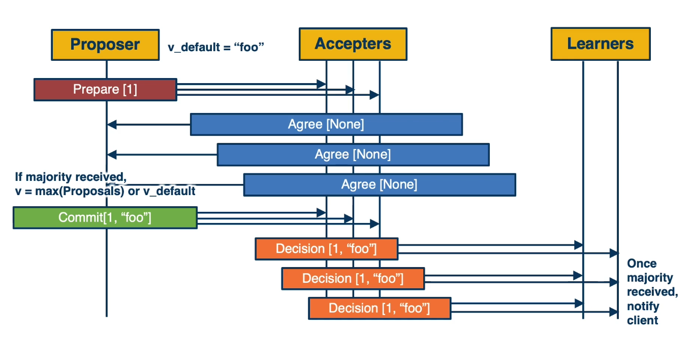

## 6.10 Corner Cases

#### Proposers with Different Values

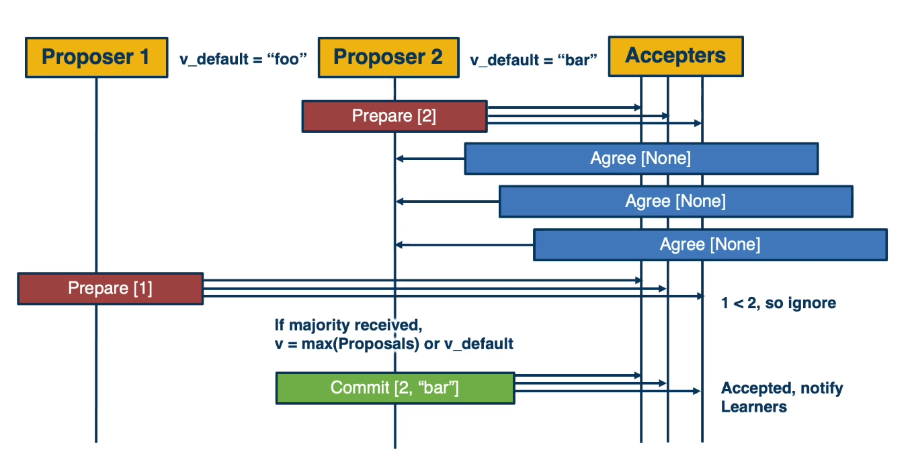
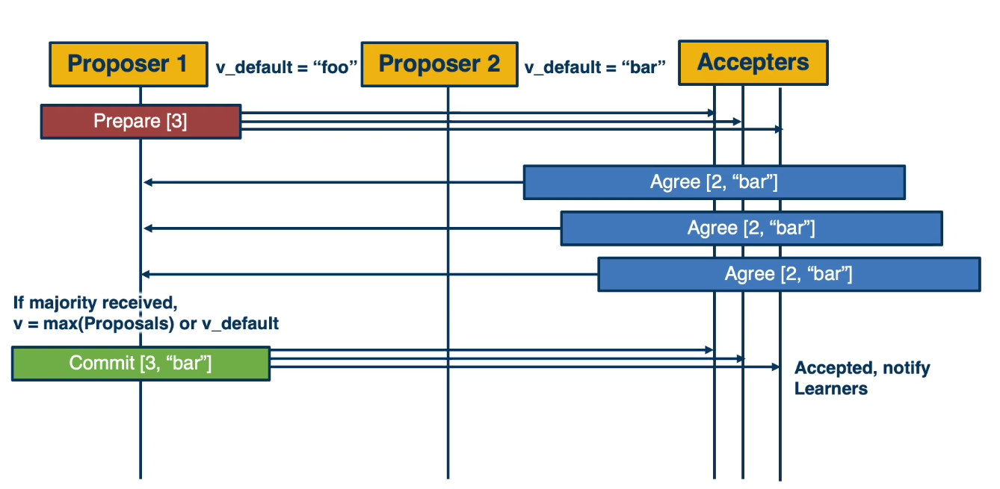

## 6.11 Paxos vs. FLP

#### Progress

**Paxos has possible liveness problem:**

- Two proposers keep issuing a sequence of proposals with increasing numbers
- Before the first value is "learned" from a majority, the next value is accepted as a proposal...
- There is no guarantee it will reach a decision

**Workaround**:

- Random delays in retrying a new value
- Designate a "distinguished proposer" - leader(and some timeouts to resolve leaser failure)
- Make it very unlikely that liveness will not reached
  - but not impossible => FLP holds.

## 6.12 Multi-Paxos

- Each "simple" single-decree Paxos for agreeing on an individual value
  - e.g., ID of the node which had a lock as in Google Chubby
- Multiple Paxos protocols executed for agreeing on the order and values of a sequence of operations
  - Multi-Paxos or Multi-decree Paxos
  - Was part of the original Part-time Parliament paper too
- **Multi-Paxos**: many inflight exchanges, voting, etc...
- **Optimization**:

  - Leader for a current "view" (of a currently active group)
  - Then all values in that view get accepted, learned, per Paxos
  - Make sure to detect and act upon "view" changes
  - Similar to Viewstamp Replication(VR)
    - **Original paper**: Viewstamp Replication, Oki &Liskov
    - **More popular reference**: Vistamp Replication Revisited, Lisov & Cowling

## 6.13 Paxos in Practice

### Practical Implementation of Paxos

- **Not proven to be equivalent,** some known to differ
- DEC SRC first known implementation
- More recent
  - Google Chubby
  - Zookeeper Atomic Broadcast (ZAB) in Zookeeper
- Many improvements, revisions, clarifications, optimizations, ...
  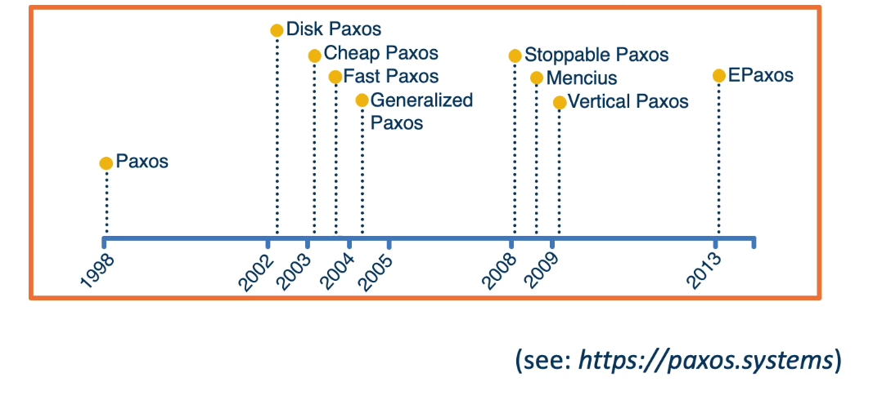
- **Many research papers**: Paxos Made Live, Paxos Made Secure, Paxos Made Moderately Complex, ...
- **Animation of "Paxos in Action"**:
  http://harry.me/blog/2014/12/27/neat-algorithms-paxos/ (Links to an external site.)

## 6.14 RAFT

### Why More Consensus Protocols?

- **Understandability**
- Especially with respect to **Multi-Paxos**
- **Implementation vs. Specification**

### Raft:

- In Search of an Understandable Consensus Algorithms, Ongaro and Ousterhout
  - Current broad commercial use
- Study with Stanford DS students:
  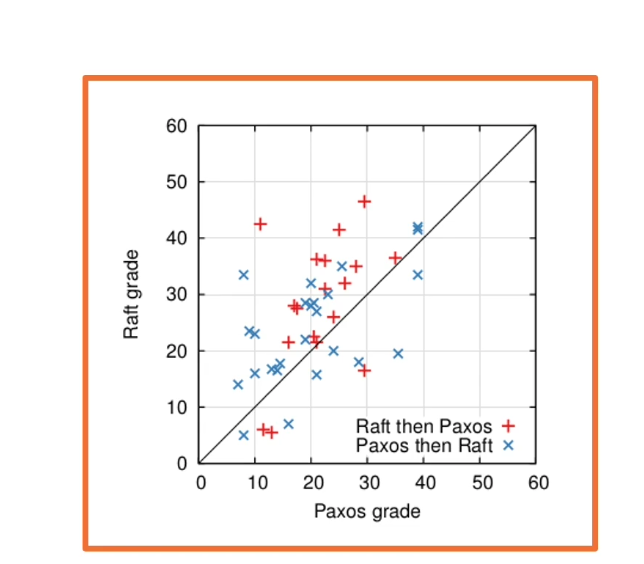

## 6.15 RAFT Overview

- **Leader election** phase:
  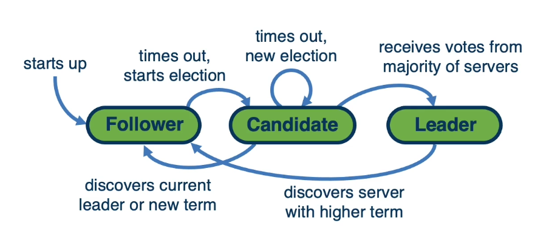

---

- Followed by normal operation... **Log Replication** phase:
  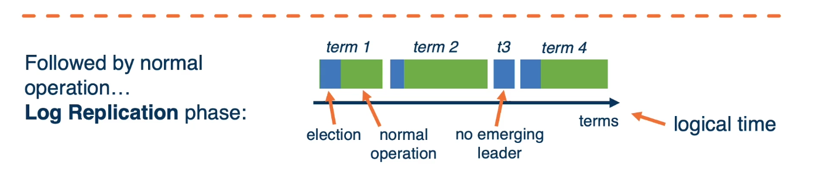

## 6.16 RAFT Leader Election

- Follow's timeout **triggers a leader election**
- **One or more** candidates
- Include **term number of log index** in "candidacy" request
- **All nodes vote**

Property

- property1 election safety: at most one leader in any term
  **Leader election rules:**
- **rule 1:** leader is elected by majority
  - new terms start, this candidate becomes new leader
- **rule 2:** prevent outdated leaders from being elected
  - servers only vote when the candidate has a newer log
  - new: high term number or same term number but longer log
  - "losing: candidate know it is outdated, keep following
- **rule 3:** tie in the election/split votes
  - no candidate get majority, or network partiton => issue new election later
  - random timeout for each server to avoid split votes

## 6.17 RAFT Log Replication

each log entry contains the operation and term number
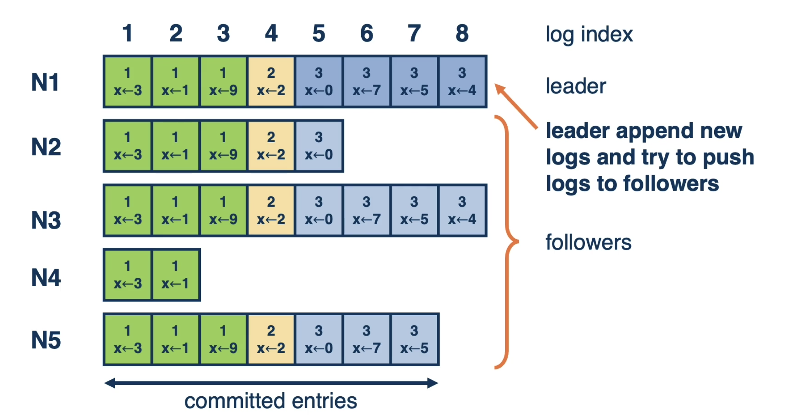

Steps

1. leader pushes new log entry along with its previous entry to followers during heartbeats
2. each follower check whether it has the previous log, and sends ack if yes
3. log entry gets committed at leader once leader get majority ack, leader then ack client

outdated followers catch up through heartbeat

---

- **property 2 leader apppend-only**
- **property 3 log matching**: if 2 entries in different logs share the same index and term number, this entry and all the previous entries are the same
- **inconsistency**: leader failure before commit some log entries, new leader is oblivious about the uncommitted log
- **fix**: new leader forces all other server to uses it log, the leader election strategy guarantees the new leader know all the committed logs
- **new leader commits uncommitted logs** in previous term after it commits some logs in new term

---

#### RAFT Garbage Collection

- **Issue**:
  - Duration of execution
  - Nodes failing behind
- **Garbage collection**:
  - snapshot + log truncation
- **Optimization during recovery**: leader can also send snapshot to outdated followers through heartbeat to help them quickly catch up

## 6.18 Raft safety

- **property 4 leader completeness**: once committed, log entry won't be overwritten
- **property 5 state machine safety**: once a log entry is applied in a node, no other node will apply a different log entry in the same slot(formal proof in the original paper)

## 6.19 Raft in action

- http://thesecretlivesofdata.com/raft/
- https://raft.github.io/

## 6.20 Summary

- Paxos and RAFT
- Mention of other consensus algorithms
