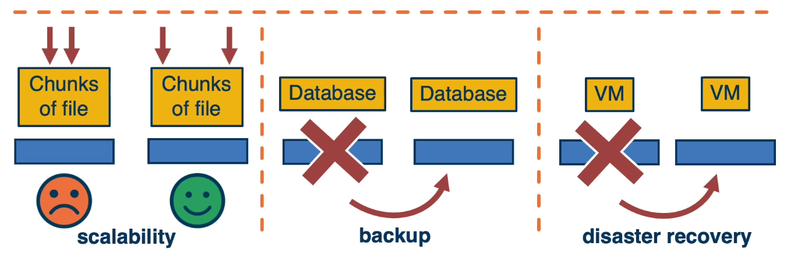
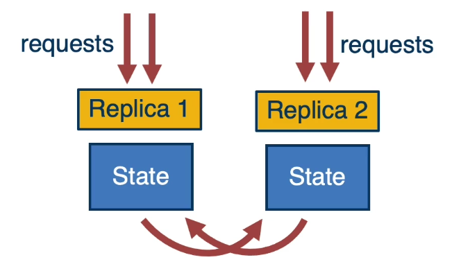
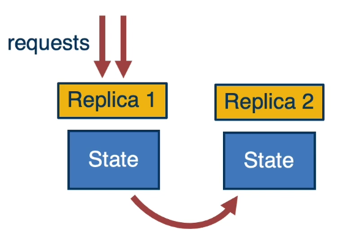
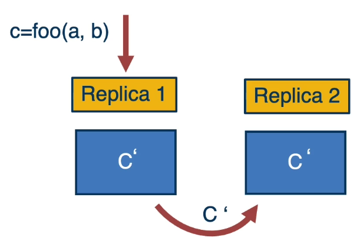
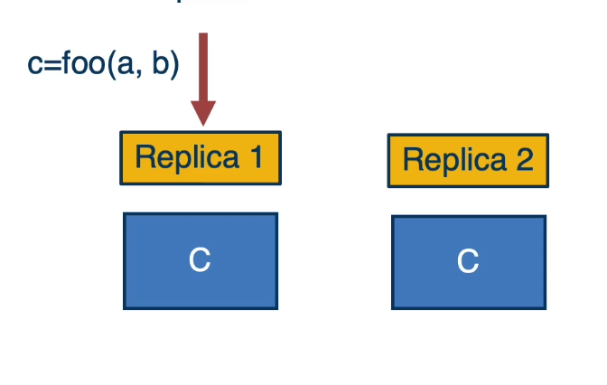
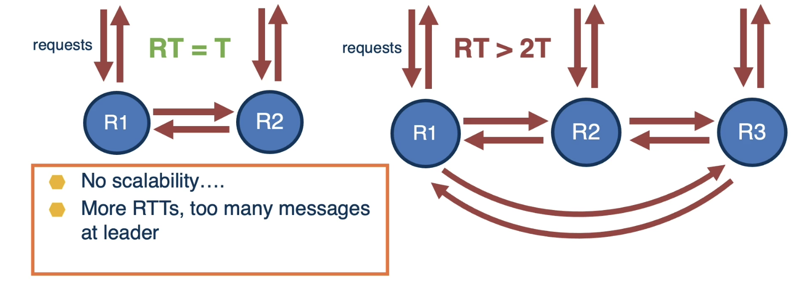
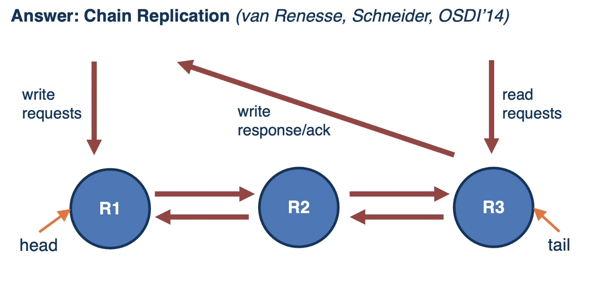
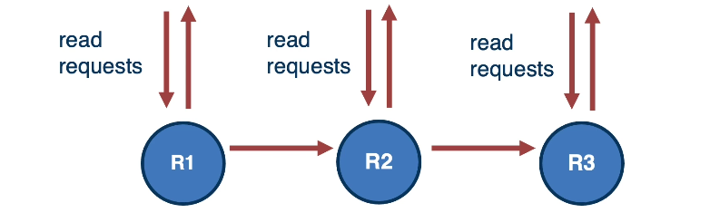
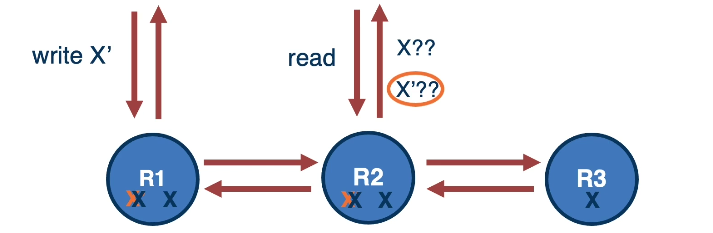

# Lesson 7 Replication

## 7.1 Lesson Introduction

- Replication
- Primary-backup
- Chain-replication
- CRAQ

## 7.2 Goal of Replication

- State available at more than one node
- Service can be provided from more than one node
- **Benefits of replication**: fault-tolerance, availability, scalability...
  

## 7.3 Replication Models

### Active Replication

- Each replica is active:

  - Can serve read requests
  - Can ensure replication of updates
  - 

- Each replica is active:
  - Can serve read requests
  - Can ensure replication of updates

### Stand-by (Primary-backup) Replication

Only one replica is active primary at any point in time:

- Others are kept consistent so fast failover can be achieved -

## 7.4 Replication Techniques

- **State Replication**

  - Execute updates on one replica, copy state changes to update other replicas
  - Pro
    - no need to re-execute multiple times
  - Cons
    - state may be large or hard to identify where all updates are
  - 

- **Replicated State Machine**
  - Copy each operation (log of operations) to each replica and execute to produce the same state update
  - Pro
    - no need to send large state, operation logs may be smaller
  - Cons
    - must re-execute and ensure deterministic exectution
  - 

Can be used for **active or primary-backup replication. Treadoff affects performance, efficiency, ...**

## 7.5 Replication and Consensus

- **Ensure consensus of updates to replicas**
  - For both state replication and replicated state machine
  - For primary-backup, primary is leader/coodinator
  - For active replication, each replica can be leader
- **Ordering and visibility of updates**
  - Depending on the consistency model(more in different lesson)
  - Enforced at granularity of individual updates or groups of updates(entire transactions)

## 7.6 Chain Replication

**cost of consensus is proportional to number of nodes**

- 2 rounds of messages among leader and participants even when no problems
- incresing number of replicas => O(N) slowdown in the replication

Answer: **Chain Replication**

- Benefits:
  - leader scalability:
    - fewer messages per replication at leader
  - high write throughput:
    - Pipelined, each write can be in the process of being updated by a differrent replica
  - strong consistency possible:
    - reads guaranteed to return successfully committed writes
- Limitations:
  - inefficiency
    - many workloads are read-heavy
    - intermediate nodes may be underutilized

## 7.7 CRAQ

- **CR**: reads limited to tail replica only
- **CRAQ**: \*\*Chain Replication with Apportioned Queries:
  - apportioned == divided among the chain replicas
  - queries == read operations
  - writes continue to be handled by head replica
  - 

---

#### Chain Replication with Read Scalability

- **Correctness?**
- Maintain **old and new versions** of data at each replica
- When both values present, **check with tail?** -

---

[Object Storage on CRAQ: High-Throughput Chain Replication for Read-Mostly Workloads](https://www.usenix.org/legacy/event/usenix09/tech/full_papers/terrace/terrace.pdf) by Jeff Terrace and Michael Freedman, was published at ATC’09.

## 7.8 CRAQ vs CR Scalability?

- **CR vs. CRAQ read throughput**
- **Experiment**
  - 3 or 7 replicas in chain
  - up to 100 writes/s at head
  - in CR reads at tail, in CRAQ reads distributed among all
- **Observations**
  - CRAQ (-3 or -7) can scale to higher read throughput vs. CR, even as the write load increases
  - CRAQ throughput scales with the increase of the number of replicas in the chain(CRAQ-7 vs. CRAQ-3)

## 7.9 Summary

Lesson Summary

- **Active and standby** (primary-backup) replication
- **State** replication, **state machine** replication
- **Chain** replication and **CRAQ**
- The **right choice** depends on:
  - **Workload**: reads, writes,...
  - **System configuration**: number of nodes, distribution, network properties
  - **Consistency requirements** failures and fault-tolerance
