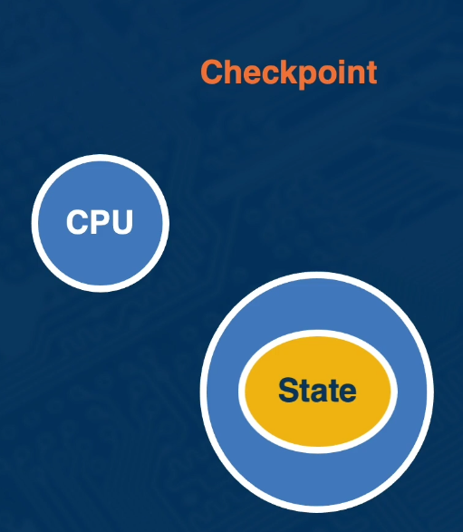
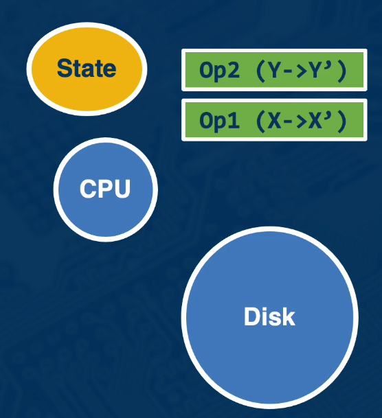

# Lesson 8 - Fault Tolerance

## 8.1 Introduction

Lesson Introduction:

- Techniques for fault tolerance and recovery
- Failure models
- Basic recovery techniques

## 8.2 Some Taxonomy

#### From Fault to Failure

**fault** --activate--> **error** -- propagate--> **failure**

#### Types of Failures

Three categories of faults

- Transient
- Intermittent
- Permanent

May lead to different types of failures:

- Fail-stop (fail-silent, crash)
- Timing
- Omission
- Byzantine

#### Managing Failure

- Avoidance
  - Consider all possible states and outcomes
  - Predictive ability
- Detection
  - Heartbeat signal
  - Error detection codes
- Removal
  - Rollback
  - may not be possible
- Recovery
  - Despite occurrence of failures ensure correct execution
    - detection -> remove -> resume correct execution
  - fault-tolerance

## 8.3 Rollback-Recovery Idea

- If a failure detected
- Rollback to system state before failure
  - Rollback any effects of exchanges messages
  - Rollback updates to process state
- Re-execute

1. Which previous state
   - consistent cut
   - 
2. How to capture this state
   - Try to find by progressively rolling back to earlier consistent cuts
   - Checkingpointing
   - Logging

---

#### Granularity at Operations

- Transparent (full-system)

  - Pros:
    - no application modification
  - Cons:
    - Very high overheads

- Transcation-based
  - Pros:
    - relies on use of transactional API
  - Cons:
    - overhead reduced to groups of related operations
  -
  ```c
  tx_begin(inputs of all ops)
    operation1
    operation2
    operation3
  tx_end....
  ```
- Application-specific
  - Pros:
    - applications know best what state is needed for recovery
  - Cons:
    - limited applicability

## 8.4 Basic Mechanisms

#### Checkpointing

- Save [system|application] state
- Flush checkpoint to durable storage
- Pros:
  - restart instantaneous
- Cons:
  - amount of I/O on checkpoint - improve via application-specific checkpoint, delta compression, etc.
    

---

#### Logging

- Log information and operations performed
  - record original value, (UNDO) or
  - Record new value (REDO)
- Keep the log on persistent
- Pros:
  - smaller amount of I/O to write to disk
- Cons:
  - recovery takes longer
  - regular operations may take longer (search in log)
    

---

#### Checkpoint & Logging

- **Checkpoint to move the recovery line** to a more recent consistent cut
- **Log from that point on**
  - earlier log values can be discarded
- Pros:
  - limit duration of recovery
  - limit space required to store full log
- Cons:
  - must detect stable consistent cut
    

Figure adapted from Figure 5 in the paper: http://courses.cs.vt.edu/~cs5204/fall02/Papers/RollbackRecovery.pdf

## 8.5 Checkpointing Approaches

When to "take" a checkpoint?

- Uncoordinated
- Coordinated
- Communication-induced

---

System Model

- Fixed number of processors
- Communication only through messages
- Processes interact with the outside world
- Network is non-partitionable but other assumptions vary per protocol:
  - FIFO?
  - Reliable communication channels?
- Number of tolerated failures vary per protocol

## 8.6 Uncoordinated Checkpointing

- Processes takes checkpoints independently
- This means we need to construct a consistent state upon failure
  - Need to calculate the recovery line and rollback to it
  - Need to store dependency information
    

#### Domino Effect

Danger that consistent cut will roll back the execution to the beginning


#### Summary of Issues with Uncoordinated Checkpoint

- Domino Effect
  - could lose all your work
- Useless Checkpoints
  - checkpoints that can never form a globally consistent state may be taken
- Multiple Checkpoints Per Process
  - may need more than the most recent snapshots
- Garbage Collection
  - needed to identify obsolete checkpoints

## 8.7 Coordinated Checkpointing

Processes coodinate their checkpoints so that they can get a consistent state

- Benefits:
  - Recovery no longer requires a dependency graph to calculate a recovery line
  - No domino effect
  - Single checkpoint per process
  - No garbage collection
    
- Challenges:
  - How to coordinates?
  - No synchronous clock guarantee
  - Message delivery reliable or in bounded time?
  - Are all checkpoints needed?
    

## 8.8 Communication-Induced Checkpoints

How do we coodinate a checkpoint?

- Blocking:
  - An initiator initiates 2PC. WHen a process gets the checkpoint request it blocks and stops all underlying application work
  - Other consensus algorithms can be used as well
- Non-blocking: Global snapshot algorithm
  - Instead of marker, piggyback info
    - No need for FIFO
  - Nodes can make independent decisions about local snapshot
    - Helps if no communication
  - In-between, checkpoint decisions forced based on piggybacked info
    - Snapshot is taken before message is received

## 8.9 Logging

#### Benefits of Logging

- Logging vs. Checkpointing = Compute vs. I/O
- Logs at each node **must allow consistent state** to rebuild

#### Approaches Logging

- **Pessimistic**:
  - log everything to persistent storage before event to propagate and commit
- **Optimistic**:
  - assume log will be persistent before failure, but make it possible to remove effects if abort needed
- **Causality-tracking**:
  - ensure causally related events are deterministically recorded

## 8.10 Which Method to Use?

- Depends on a number of factors:

1. Workload characteristics?
2. Failure characteristics?
3. System characteristics?
   - cost/overhead of communication?
   - cost/overhead of stable storage?
   - system scale?

- Do the assumptions of the paper still hold today?
  - Faster and more reliable networks
  - Non-volatile memory
    

## 8.11 Summary

- Recovery techniques in distributed systems
- Checkpointing and logging
