# Lesson 9 - Distributed Transactions

## 9.1 Introduction

- Distributed Transaction in Practice
- Google Spanner
- Breifly some other design points

## 9.2 What are Distributed Transactions?

#### What is a Transaction?

- Group of operations **applied together**
- Ideally with **ACID properties**
- Useful for **concurrency and fault tolerance**
- **Outcomes**: commit or abort

- 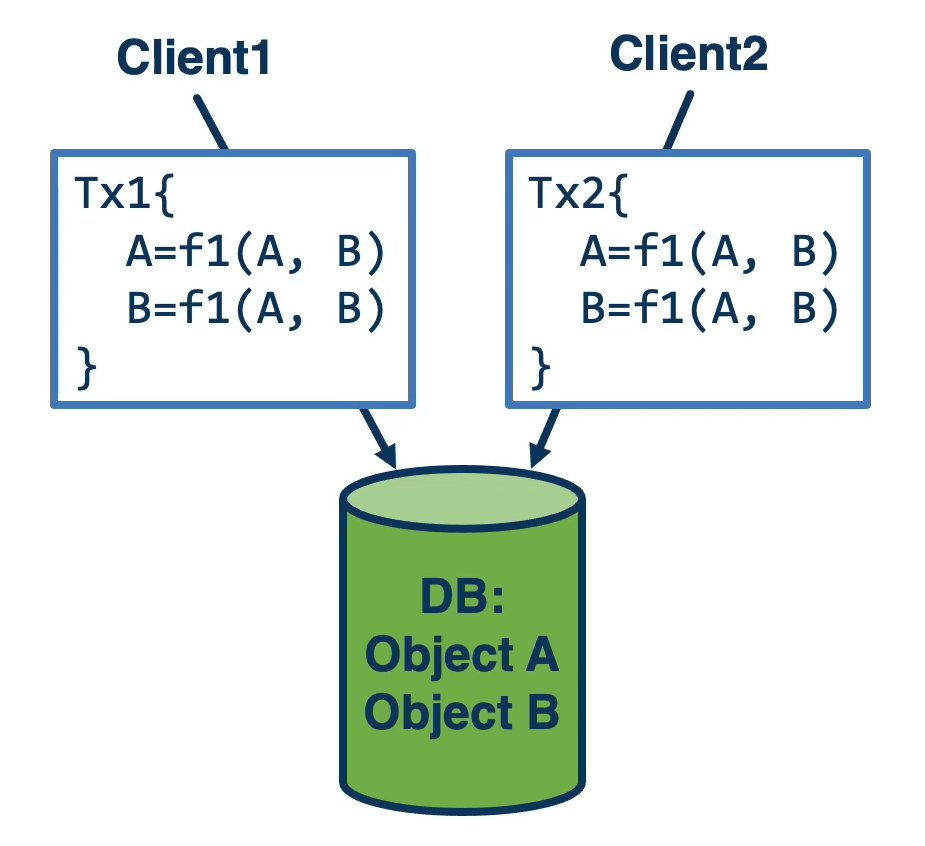

#### Distributed Transaction

- **Coordinator and multiple sites**
- Coordinator (leader) **ensures correctness** (2PC, consensus,...)
  - Across participants of a single distributed transaction
  - Across multiple distributed transactions
    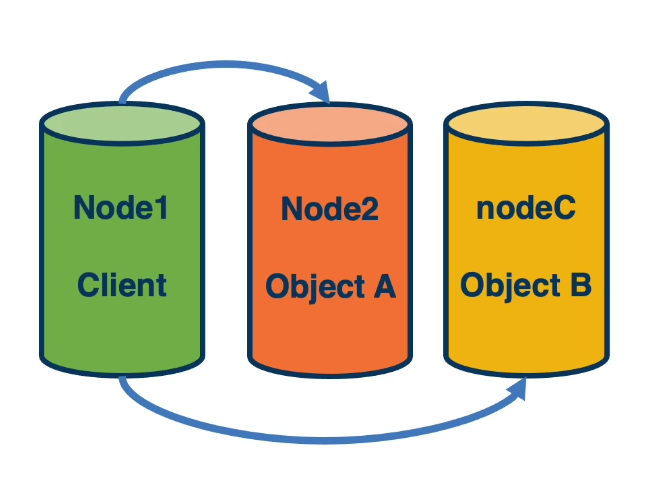

## 9.3 Spanner Brief

- Global data store
  - Geographically distributed
  - Shared
  - Replicated
- Google's relational DB service
  - Ads, Play, and other internal services
  - External Cloud DB service
  - i.e., Run SQL apps
    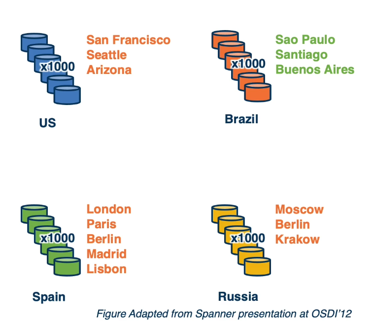

## 9.4 Spanner Stack

- Distributed persistent storage
  - Distributed file system, GFS, Colossus
- Data model
  - versioned (timestamped) key-value store (based on BigTable)
  - tablet, directory - group of related objects
  - relation database, Megastore
- Replicated state machine with Paxos, per tablet
  - Sufficient for transactions within a set of replicas
- 2 phase locking for concurrency control (even 单机也需要)
- 2 phase commit for cross-replica set transactions (跨 replica set)
  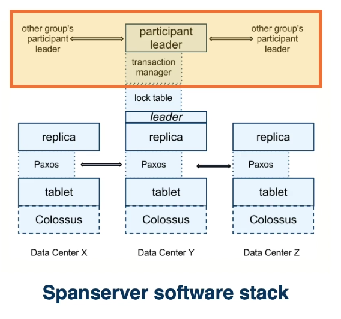

## 9.5 Consistency Requirements

#### Single machine

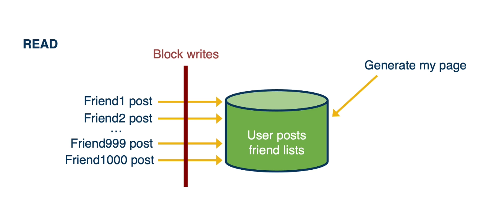
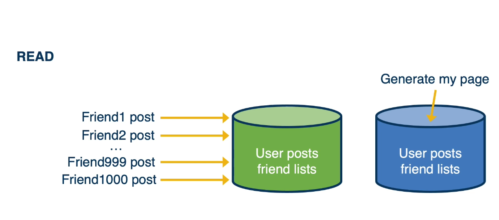

#### Multiple Machines and Datacenters

give up consistency?

#### Does it Matter?

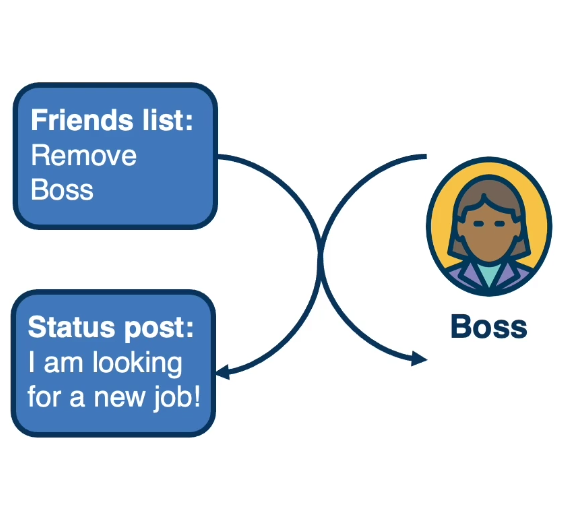

- Consistency matters
  - External consistency matters!
  - Order of events in the systems == order in which events appeared in real world/global wall clock
  - If Tx1 completed before Tx2 started, Tx2 must be guaranteed to see Tx1's writes
  - **How to get this strict serializability?**

## 9.6 True Time

- True Time != absolute real time
- True time == uncertainty interval around real time
  
- "Known unknown ..."
- Implement using **periodic probing of master clock servers** in datacenters
  - GPS and atomic
  - 2 $epsilon$
    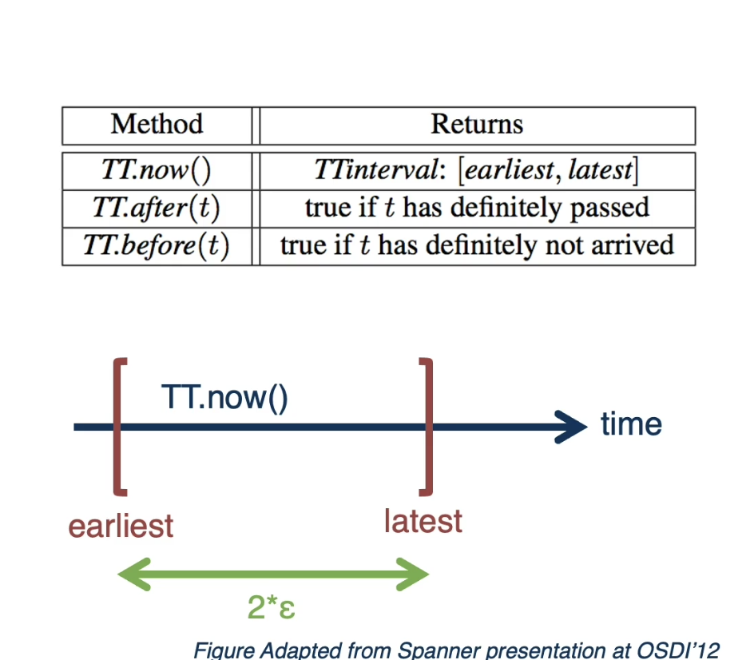
    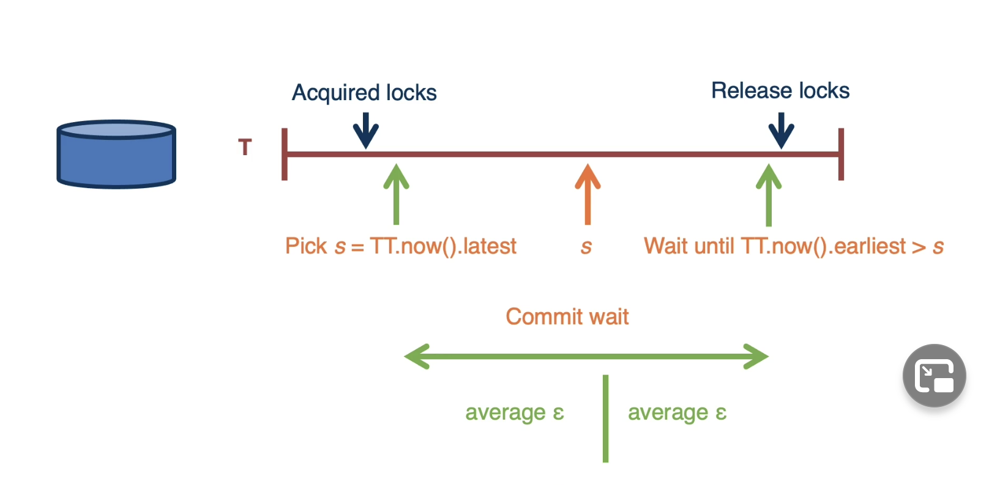

## 9.7 Ordering Write Transactions with TT Timestamps

#### Commit Wait and Replication

Pessimistic locking

- Acquire all locks up front, prevents later conflicts
- In **optimistic locking** aborts may be necessary, and more likely with long transaction
  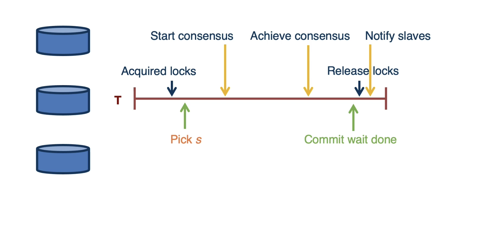

#### Commit Wait and 2-Phase Commit (多个 replica set 的 transaction)

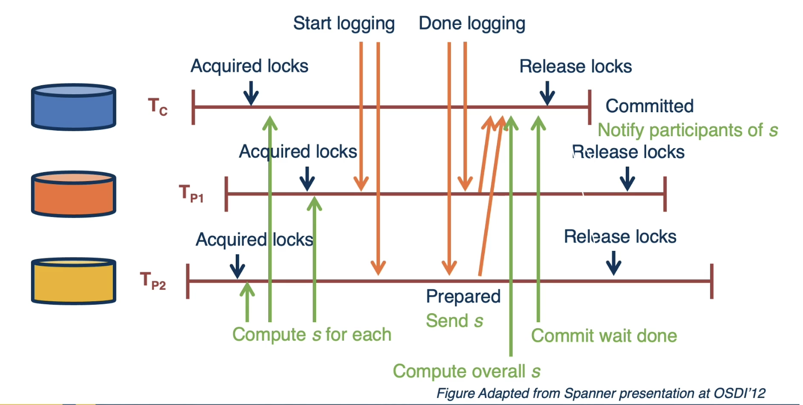

#### Example

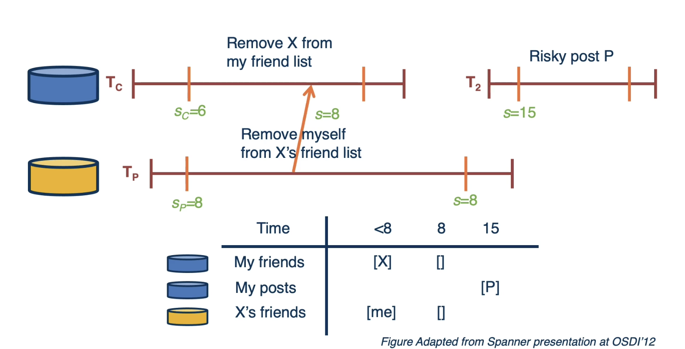

## 9.8 Read Transactions

#### Read Now Transactions

- Still needs to **externally ordered**
- **Use Leader info to determine a "safe" timestamp**
  - For single replica set, just Paxos leader
  - For multi-replica, consider all at Tx mgr
- **Potentially delay** until it's safe time is reached
- **Prepared but not committed transactions delay reads**

#### Read at specific timestamp

- **Read at specific timestamp** may be sufficient
- **No need to run distributed cut**, just read values with appropriate timestamp
  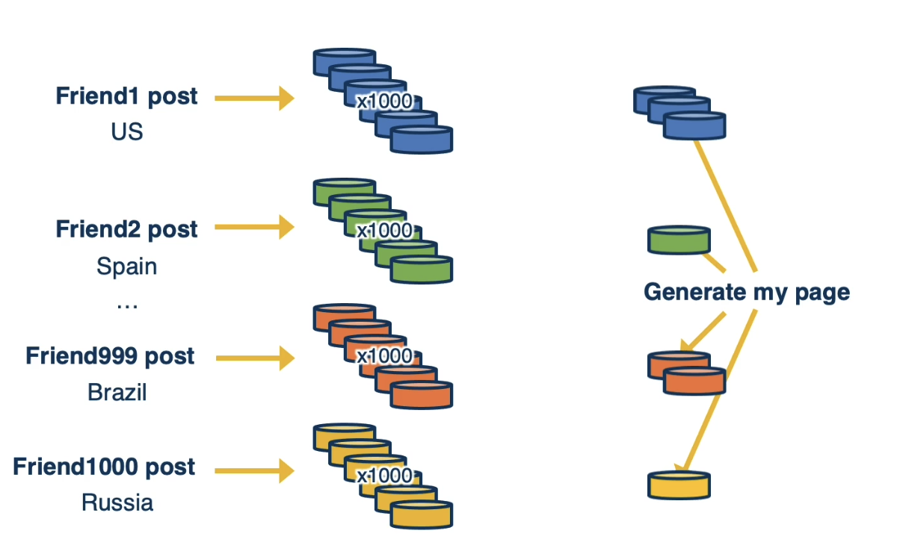

## 9.9 No TrueTime?

#### What happens without Supprot for True Time?

- **GPS + atomic clock => few ms uncertainty**
  - 5,7 ms reported
  - just wait it out, delay responding
- **NTP => ~100ms uncertainty**
  - Wait?
  - Lose external consistency? Make it visible when/of external consistency is needed
- **Example**: CockroachDB, explicit option for linearizability
  - **Fun fact**: design goal "survivability" => cockroach

#### Snapshot Isolation

- Allow transactions to be interleaved even when operating on same data
  - Optimistic Concurrency Control (OCC)
  - Still requires Atomicity (from ACID)
  - Still requires Isolation (from ACID)
- Use snapshot isolation (SI) or multi-version concurrency control (MVCC)
- To guarantee correctness:
  - Transactions read from a snapshot/version of distributed state
  - The sequence of snapshots is serialiable (there is no cycle)

## 9.10 Another DDB Example: AWS Aurora

#### AWS Aurora Brief

- Aurora, SIGMOD'15
- Primary(RW) and (Replicas) (RO)

  - Replication across 3 zones, on 2 nodes per zone
  - Using voting quorum to read/write consistently
  - 只需要在 primary 写 （没有 distributed transaction 了）

- potential problem:Total of 6 replicas => I/O amplification
  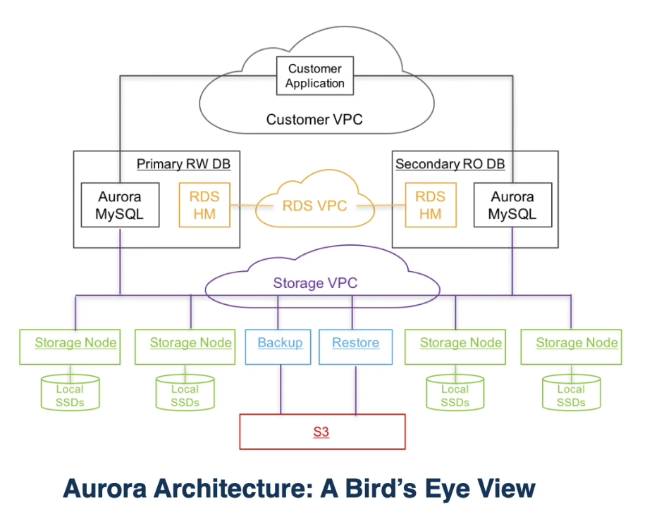
  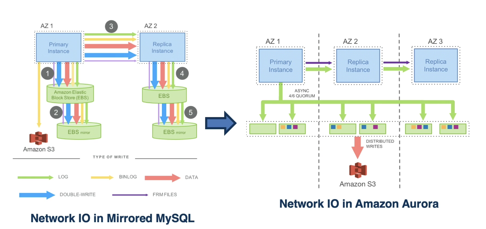
- 只有 log 被传输

## 9.11 Summary

- **Several techniques for support** for Distributed Transactions
- **Google's Spanner**
  - Paxos, 2PC, 2PL, ...
  - - TrueTime
- **Techniques used in other system**
  - OCC, MVCC, SI, log-replication
