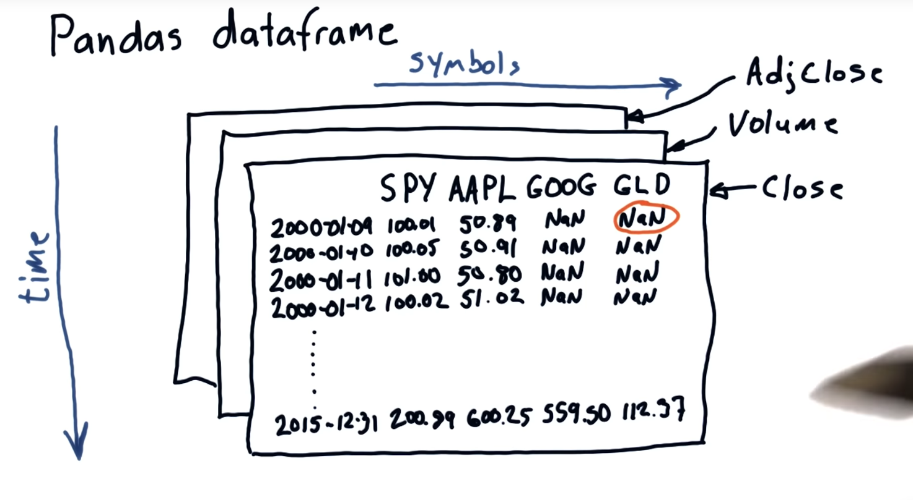

# 1.1 Reading and plotting stock data
## Python Features:
1. Strong scientific libraries
2. Strongly maintained 
3. Fast

## Lesson outline:
In this lesson you will learn how to read data, select subsets of it and generate useful plots, using pandas and matplotlib. 

The documentation links below are for your reference.

- Read stock data from CSV files:
    - [pandas.DataFrame](https://pandas.pydata.org/pandas-docs/stable/reference/api/pandas.DataFrame.html)
    - [pandas.read_csv](https://pandas.pydata.org/pandas-docs/stable/reference/api/pandas.read_csv.html)
- Select desired rows and columns:
    - [Indexing and Slicing Data](https://pandas.pydata.org/pandas-docs/stable/user_guide/indexing.html)
    - Gotchas: [Label-based slicing conventions](https://pandas.pydata.org/pandas-docs/stable/user_guide/gotchas.html)
- Visualize data by generating plots:
    - [Plotting](https://pandas.pydata.org/pandas-docs/stable/user_guide/visualization.html)
    - [pandas.DataFrame.plot](https://pandas.pydata.org/pandas-docs/stable/reference/api/pandas.DataFrame.plot.html)
    - [matplotlib.pyplot.plot](https://matplotlib.org/api/pyplot_api.html#matplotlib.pyplot.plot)


## Pandas dataframe


## Read CSV
``` python
import pandas as pd 

def test_run() 
    df = pd.read_csv("data/AAPL.csv")
    print df #print entire dataframe
    print df.tail(5)

    if __name__ == "__main__":
        test_run()
```
## Select rows
``` python
df.tail
df.head
df[10:21] #rows between index 10 and 20
```

## Compute max closing price


``` python
import pandas as pd 

def get_max_close(symbol):
    """"Return the maximum closing value for stock indicated by symbol
    Note: Data for a stock is stored in file: data/<symbol>.cs
    """
    df = pd.read_csv("data/{}.csv".format(symbol)) # read in data
    return df['Close'].max() # compute and return max
    ## return df['Close'].max() # compute and return mean

def test_run() 
    """Function called by Test RUn. """
    for symbol in ['AAPL', 'IBM']
        print "Max close"
        print symbol, get_max_close(symbol)
```

## Plotting stock price data
``` python
import pandas as pd 
import matplotlib.pyplot as plt

def test_run():
    df = pd.read_csv("data/AAPL.csv")
    print df['Adj Close']
    df['Adj Close'].plot()
    plt.show() # must be called to show plots

if __name__ == "__main__":
    test_run()    
```

## Plot High prices for IBM
``` python
"""Plot High prices for IBM"""

import pandas as pd
import matplotlib.pyplot as plt

def test_run():
    df = pd.read_csv("data/IBM.csv")
    print df['High']
    df['High'].plot()
    plt.show()  # must be called to show plots


if __name__ == "__main__":
    test_run()

```

## Plot two columns
``` python
import pandas as pd
import matplotlib.pyplot as plt

def test_run():
    df = pd.read_csv("data/AAPL.csv")
    df[['Close', 'Adj Close']].plot()
    plt.show()  # must be called to show plots


if __name__ == "__main__":
    test_run()

```