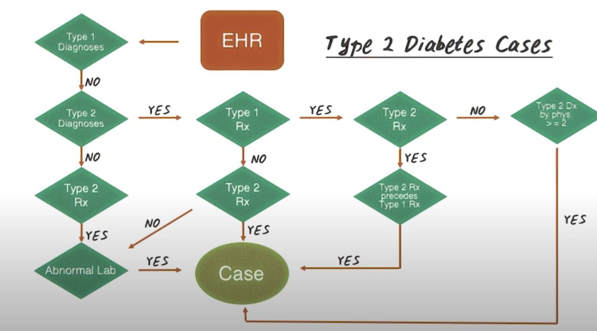

# Big Data Course Overview
## 1. Introduction to Course Overview
- some healthcare applications for big data
- some algorithms we will use in those applications
- some software systems that we will use to implement those algorithms and to support those applications

## 2. Big Data Big Picture

## 3. Healthcare Applications
- Predictive modeling
- Computationsal phenotyping
- Patient Similarity

## 4. Predictive Modeling Quiz
Let's try to estimate what percentage of people with Epilepsy in the U.S responded to treatment...
- With in the first 2 years of treatment    32%
- Between 2-5 years of treatment    24%
- Continue to suffer after 5 years 44%

## 5. Predictive Modeling Challenges
- so much data!
- so many models!

## 6. Computational Phenotyping
input: raw Data

## 7. Computational Phenotyping Quiz
In order to extract phenotypes from raw data, what are some of the "waste products" we should deal with?
- Missing data
- Duplicates
- Irrelevant
- Redundant

## 8. Phenotyping Algorithm

## 9. Patient Similarity Quiz
Which of the following types of reasoning do doctor engage most often?
- [ ] Flowchat reasoning
- [ ] Instinct and intuition
- [ ] Comparison to past individual patient

## 10. Patient Similarity

## 11. Algorithms
- Classification
- Clustering
- Dimensionality reduction
- Graph Analysis

## 12. Systems
- Hadoop
    - Distributed disk-based big data system
- Spark
    - Distributed in-memory big data system

## 13. Summary

