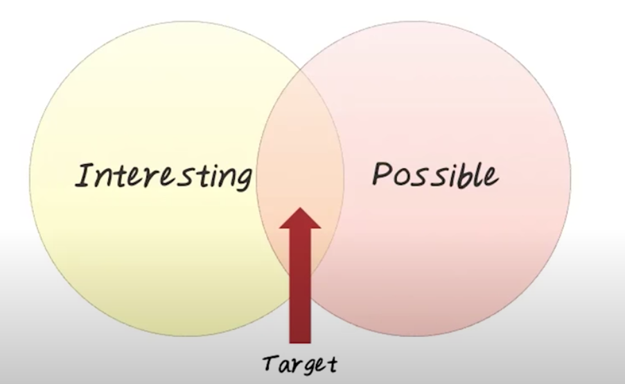
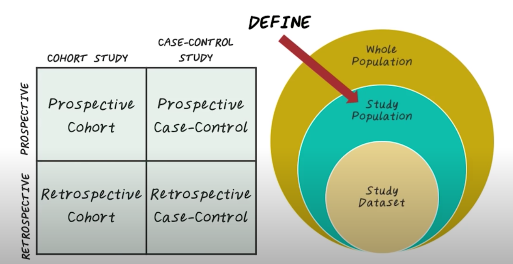

# Predictive Modeling
## 2. Predictive Modeling vs EHR
EHR = Electronic health records (EHR)

## 3. Predictive Modeling Pipeline

## 4. Predictive Modeling vs EHR

For this lessons, let's focus on predicting the onset of heart failure

## 5. Heart Failure Quiz
How many new cases of hear failure occur each in the US?
550,000

## 6. Motivations for Early Detection
- hear failure is a complex disease.
- reduces cost and hospitalization
- early intervention can slow down disease progression
- Improves existing clinical guidelines of HF prevention.

## 7. Cohort Construction

## 8. Prospective vs Retrospective
- Prospective
    - Identify the study population P
    - Then start to collect data on P
- Retrospective
    - Identify the study population P
    - Track back the historical data of P

## 9. Prospective vs Retrospective Quiz
Property | Prospective | Retrospective
---|---|--
More noise in the data| | X
More expensive|X|
Takes a longer time|X|
Common on large dataset| | X

## 10. Cohort Study
- Select a group of patients who are exposed to the risk
- Target: Heart Failure Readmission
    - Cohort: all Heart failure patients discharged from hospital
    - Key: define the right inclusion/exclusion criteria

## 11. Case Control Study

CASES： patient with positive outcome (have the disease)
CONTROLS: patients with negative outcome (healthy) but otherwise similar
KEY: matching criteria between cases and controls

##### Example of case-control study
- Goal: predict heart failure cases against control patients
- Population
    - 50625 patients:
        - Case Patients: 4644
        - Controls: 45981 (matched on age, gender, and clinic)

## 12. Feature Construction

## 13。 Feature Construction Quiz 1
which one of timeline is the easiest for modeling?

- Large observation window
- Small prediction window

## 14. Feature Construction Quiz 2
which one of these timeline is the most useful model?

## 15. Prediction Performance on Different Prediction Windows

## 16. Prediction Window Quiz

## 17. Prediction Performance on Different Observation Windows

## 18. Observation Window Quiz
What is the optimal observation window?

## 19. Feature Selection

Feature Types:
- Demographics
- Diagnosis
- Lab result
- Symptoms
- Medications
- Vitals
选出relevant features

## 20. Predictive Model
$y=f(x)+e$
- y -- target
- x -- features
- e -- errors

## depend of the value of target
- Regression
    - target is continuouse
    - popular methods
        - liner regression
        - generalized additive models
- Classification
    - target is continuouse
    - popular methods
        - logistic regression
        - support vector machine (SVM)
        - decision tree
        - random forest

## 21. Performance Evaluation
Evaluation
- Training error is not very useful
- Testing error is the key metric
- Approach:
    - Cross-validation (CV)

## 22. Cross Validation
- leave-1-out CV
- K-fold CV
- Randomized CV

##### leave-1-out CV

##### k-fold cv

##### Randomized CV

- Pros
    - the proportion of the training and validation set is not depend on the number of fold
- Cons
    - some observation may never be selected into the validation set
    - some other samples may be selected more than once into the validation set