# MapReduce
## 1.Introduction to MapReduce
- What is MapReduce
- How MapReduce takes care of fault tolerant
- analytics can be performed by map reduce and the limitations

## 2. What is MapReduce
- Programming model?
- Execution environment?
- Software package?

Hadoop
- Distributed storage
- Distributed computation
- Fault tolerance

## 3. What is MapReduce

## 4. Learning Via Aggregation Statistics
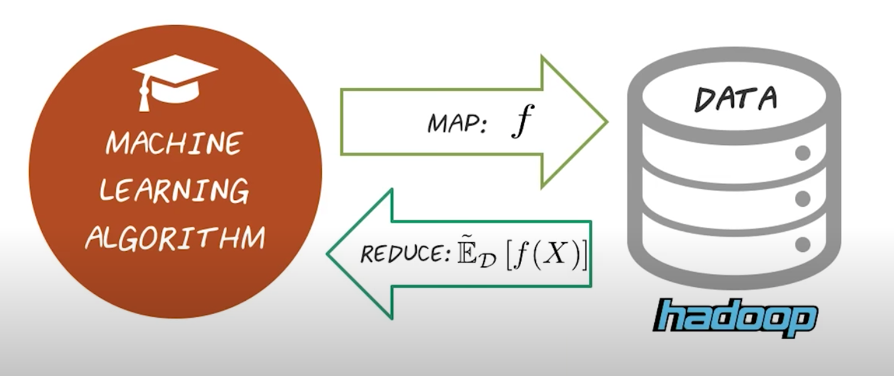

## 5. MapReduce Abstraction
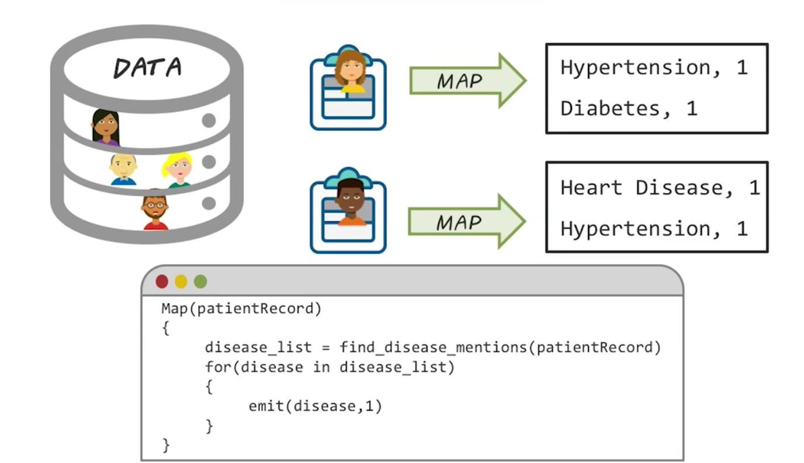
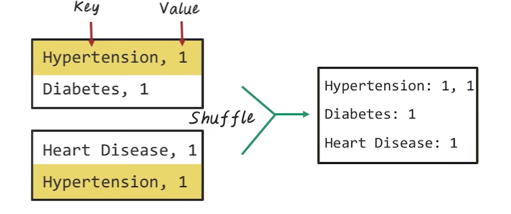
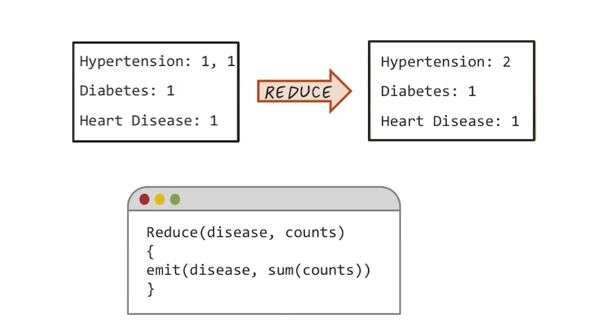

## 6. MapReduce System
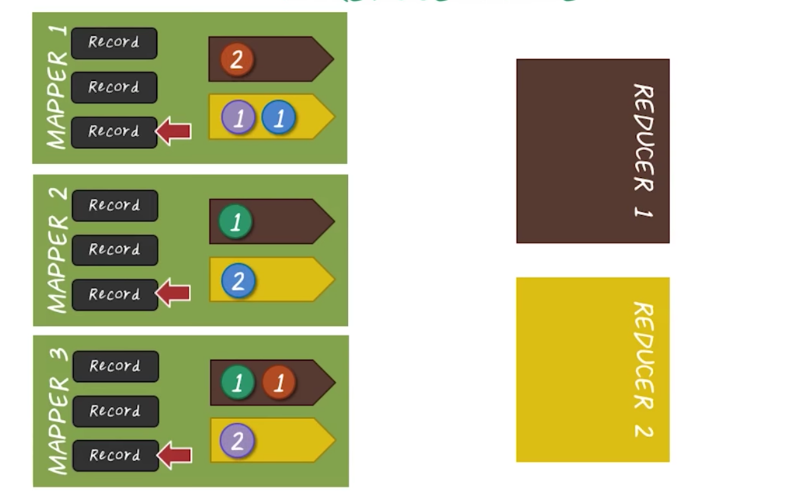
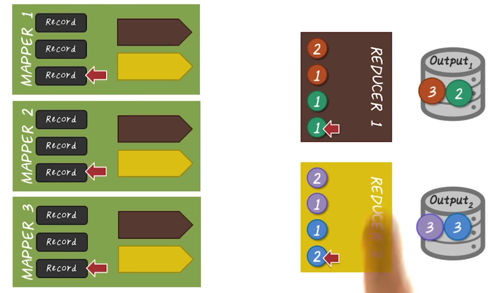
Three stages
- Map Stage
- Shuffle Stage
- Reduce Stage

## 7. MapReduce Fault Recovery
recompute

## 8. Distributed File Systems
HDFS

## 9. MapReduce Design Choice
- What functionality can we remove?
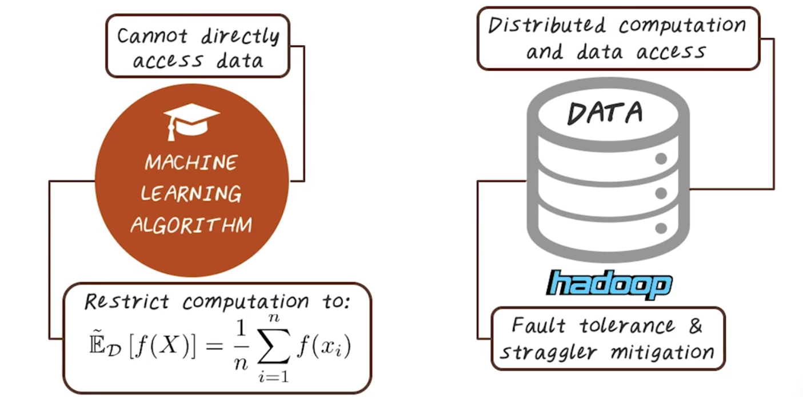

## 10. Analytics with MapReduce
- classification/ KNN
- Regression

## 11. MapReduce KNN
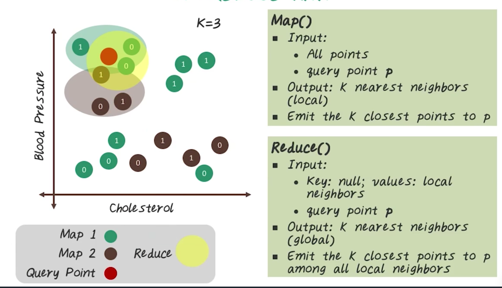

## 12. Linear Regression
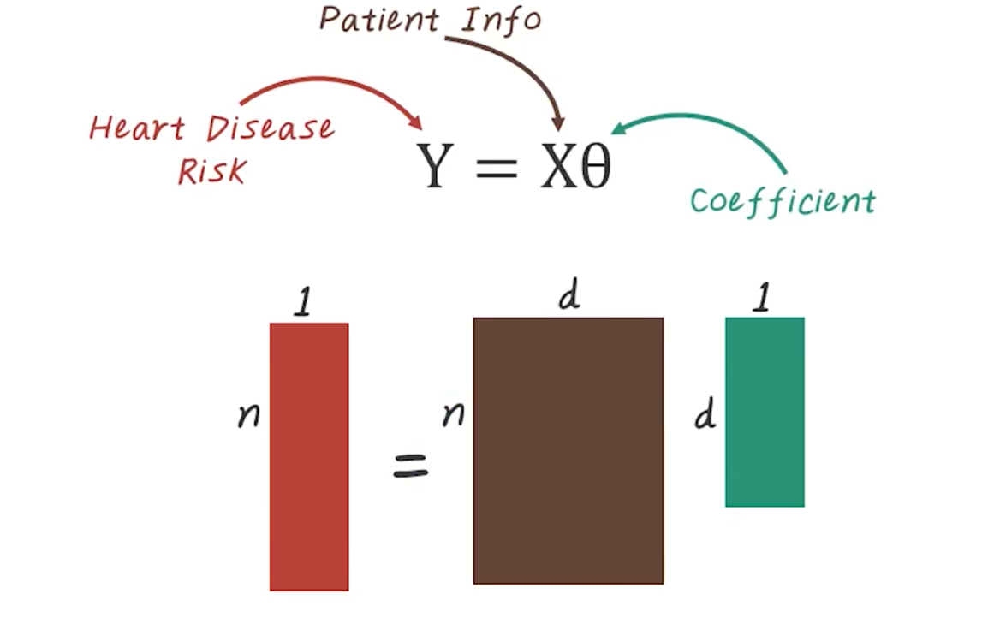
n - is the number of patients
d - number of feature,

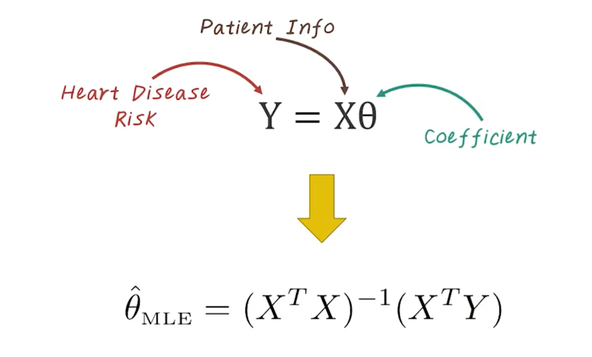
- This can be easily done in small dataset
- will not work on big data
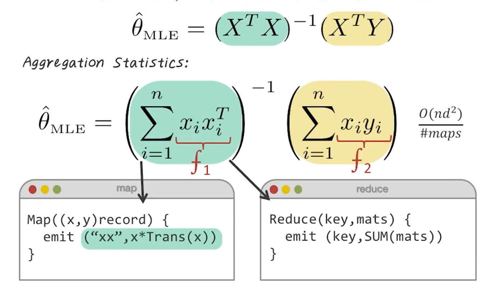

## 13. MapReduce for Linear Regression Quiz

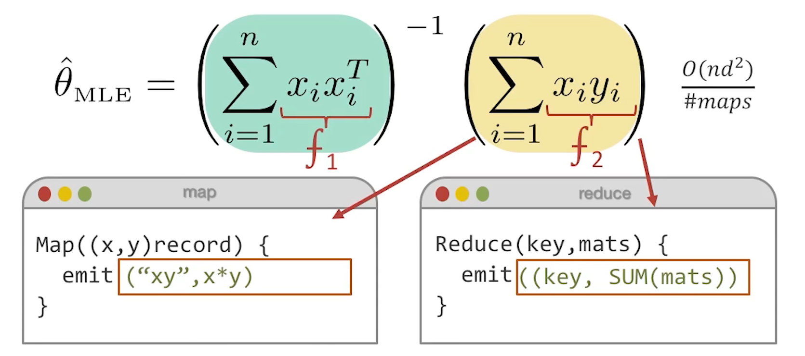

## 14. Limitations of MapReduce
##### Why not logistic regression
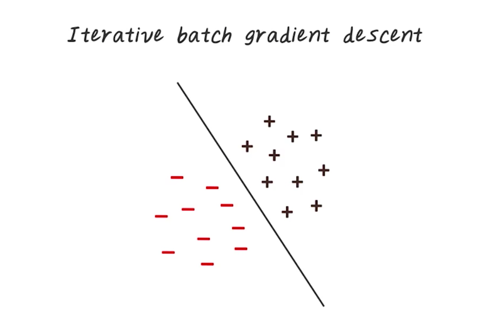
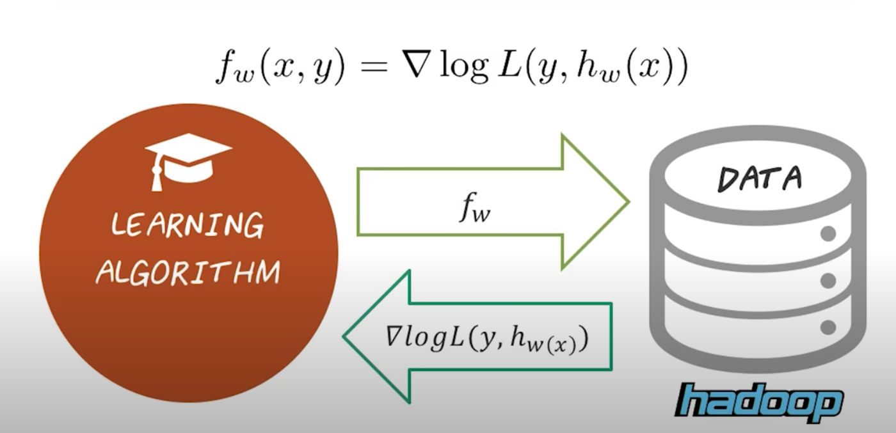
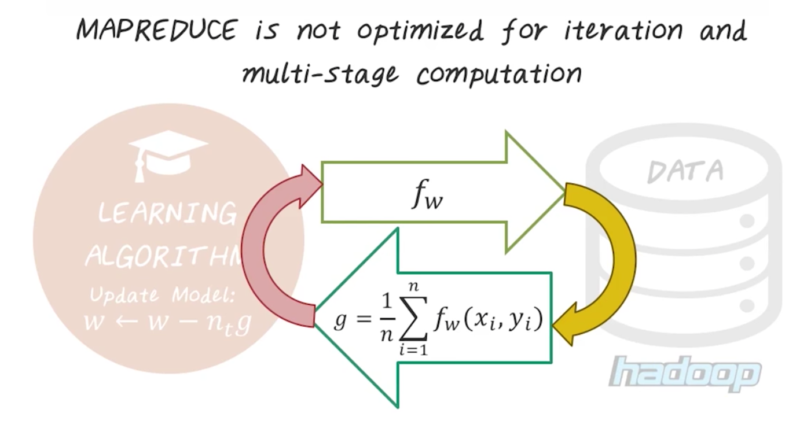

## 15. MapReduce Summary Quiz
- [X] single Pass
- [ ] Multiple pass
---------
- [ ] Skewed distribution of keys
- [X] Uniformly-distribution of keys
---------
- [X] No synchronization needed
- [ ] A lot of synchronization needed