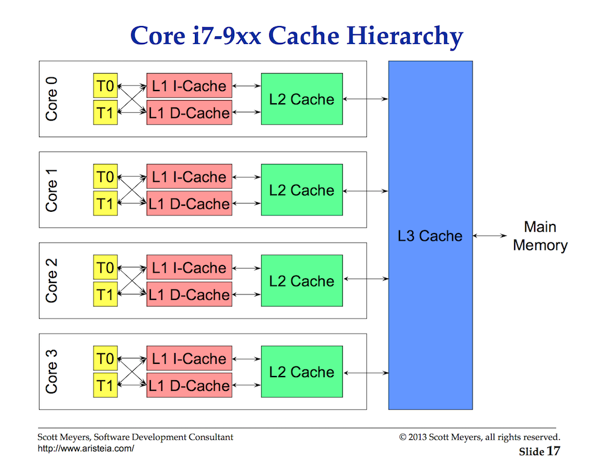
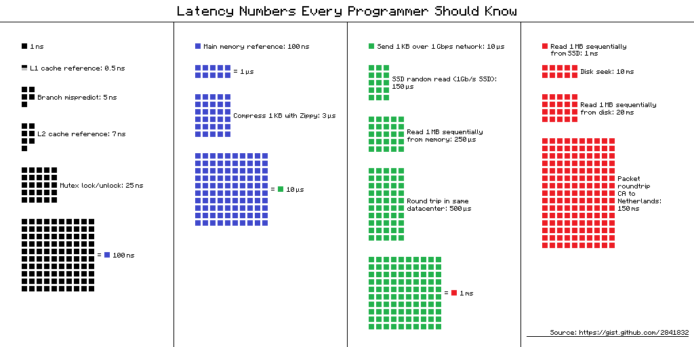
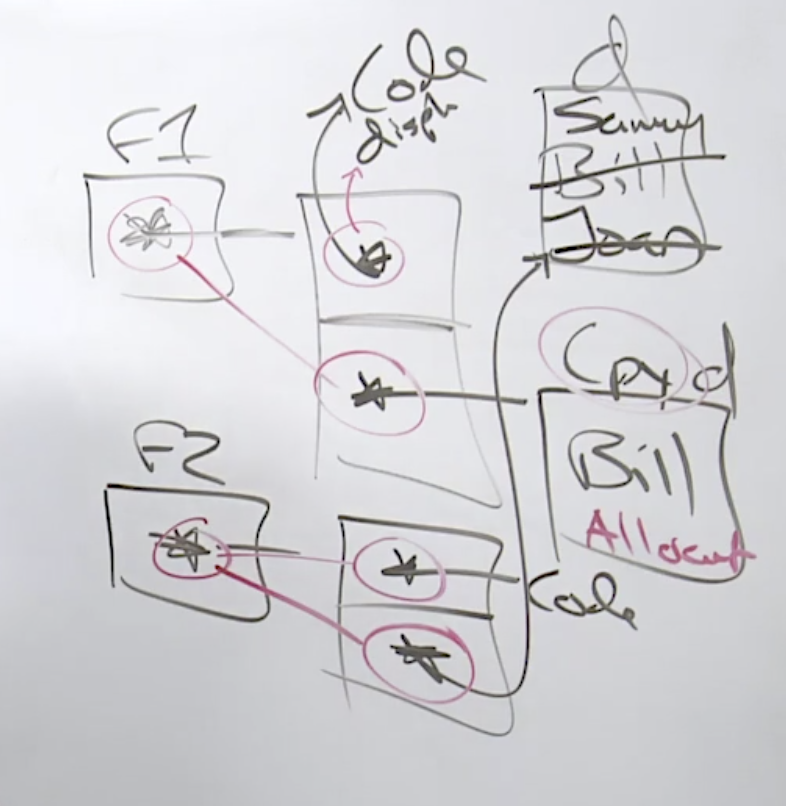
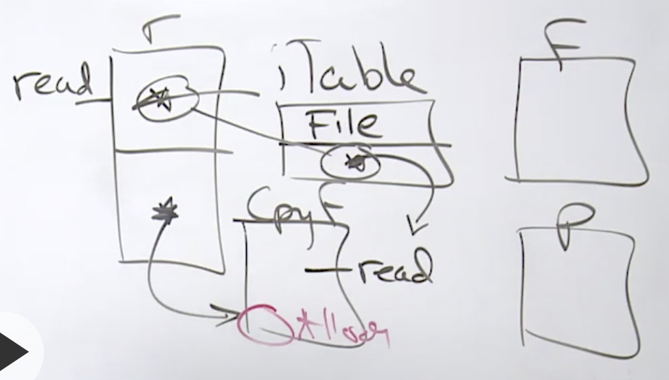
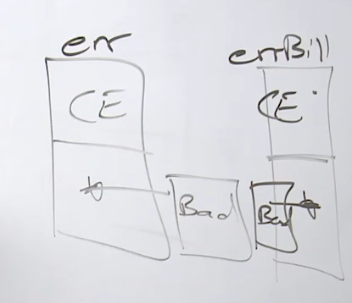
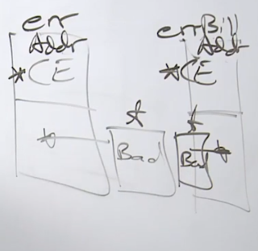

## 2. Language Syntax
### 2.1 Variable
- Type 指明长度和操作
- 一般使用int，一个长度基于computer-arch
- 赋值
    - var 用于zero value赋值 
    - := 用于具体值赋值 
- String的实现：2个word，一个存储指针，一个存size
- word的大小
    - x86 一个word 2 byte
    - x64 一个word 8 byte
- no type casting only conversion `T(v)`

### 2.2 Struct Type 
``` go
type example struct {
    flag bool
    counter int16
    pi float32
}
```
- 内存
    - example占用8个byte
    - padding
        - 根据类型的size，内存地址只能从size的倍数开始（alignment）
        - 整个struct的大小，需要是最大member size的倍数
    - 根据size从大到小排列member fields，可以节省padding，
        - 但是不要这样做，除非memory profiler告诉我们有必要这样做
            - first optimize for correctness, not for performance
            - integrity > readability > performance

- anonymous type
    ```  go
    var e1 struct {
        flag bool
        counter int16
    } {
        flag: true
        couter: 1
    }
    ```
    - 一般用于http解析json
- 有名字struct不能implicit conversion
    - 可以explicit conversion， `b = t2(a)`
    - anonymous可以implicit conversion
        - 一般用于pass高级函数

### 2.3 Pointer
- memory的组成
    - data segment (全部变量，read only data)
    - stack 
        - os level 一般是1M
        - go routine level 是2k
    - heap
- Stack
    - frame 概念
        - 一个函数调用创建一个frame
        - go routine只能做一个frame，称做active frame
        - 当我们要跨越boundary的时候，传parameter 
        - parameter是pass by value
            - Value semantics 或者 Pointer semantics
        - Active frame以下memory是invalid memory
            - 当make新的function call的时候，新的frame被设置成zero value
- Semantics
    - Value semantics
        - Pros: 
            - Integrity  (function programming language只有这个)
                - reduce side effect
        - Cons：
            - Performance
                - 每次都需要复制一遍data
    - Pointer semantics
        - 当我们需要share data
        - Pros: 
            - Performance
        - Cons：
            - Integrity
- Escape analysis
    - compiler静态分析代码，需要时，把变量allocate到heap
        - closures
        - 跨goroutine的stack内存引用,详见Stack Growth
    - heap的clean由gc负责
    - `go build -gcflags "-m -m"`
- Don't mix semantics
    - bad example
    ``` go
    func createUserV2() *user {
        u := &user{ 
            name: "Bill",
            email: "bill@xxx.com"
        }
        return u 
    }
    ``` 

- Stack Growth
    - start with 2k
    - if run out of space => copy to a 25% larger stack
    - memory address on the stack can change
    - cannot have pointer to another stack

        
- Heap allocation
    - any value to shared across goroutine boundary
    - any value cannot stay on frame
    - any value we don't know the size in the compiler time
        - collections

### 2.3 Garbage Collection
- Garbage Collection
    - non-generational concurrent tri-color mark and sweep collector
    - Not a Compacting garbage collector
        - memory address on the heap cannot change
    - stop-the-world latency
- GC Target 
    1. maintain smallest heap size
        ``` sh
        ------------------------------ top heap 4M
        ↓↑ gc工作
        ------------------------------ live heap 2M
        常驻内存，比如cache什么的
        ------------------------------
        ```
        - configuration option `gogc `
            - default is 100,当超过top heap的时候，把heap增加100%
    2. stop-the-world latency is never more than 100ms per round
        - total gc time can be longer
    3. allow to take up to 25% CPU capacity
        - 4核中的一个核
- STW: stop the world
    - Write Barrier
        - stop every go routine
            - through a function call

### 2.4 Constant
- Constant only exist at compiler time
- Untyped Constant (kind)
    - `const ui = 12345`
    - kind promotion
    - 很高的精度
- Typed Constant
    - `const ui int = 12345`
- Untyped Constant可以implicit conversion，但是Typed Constant不行
- iota
```  go
const (
    A = iota //start with 0
    B = iota
    C = iota
)

const (
    A = iota + 1 // start with 1
    B = iota
    C = iota
)
```

## 3 Data Structures
### 3.1 Data-Oriented Design 
- understand the data, write the code and algorithm needed
- decoupling the concrete type to deal with the data change

### 3.2 Arrays
- go only has array, slice, and map, 因为这些数据结构是continuous memory, 所以有space Locality
- Performance
    - 访问内存很慢,访问cache很快
    - Cache lines一般是64bytes
- TLB cache misses炒鸡慢
    - Memory page linux 默认是4kB
    - 对于数据库这样的系统，2M page size可以节省很多TLB miss

#### Intel i7 CPU Latencies From Video


```  sh
3GHz(3 clock cycles/ns) * 4 instructions per cycle = 12 instructions per ns!

1 ns ............. 1 ns .............. 12 instructions  (one) 
1 µs .......... 1000 ns .......... 12,000 instructions  (thousand)
1 ms ..... 1,000,000 ns ...... 12,000,000 instructions  (million)
1 s .. 1,000,000,000 ns .. 12,000,000,000 instructions  (billion)

L1 - 64KB Cache (Per Core)
	4 cycles of latency at 1.3 ns
	Stalls for 16 instructions

L2 - 256KB Cache (Per Core)
	12 cycles of latency at 4 ns
	Stalls for 48 instructions

L3 - 8MB Cache
	40 cycles of latency at 13.3 ns
	Stalls for 160 instructions

Main Memory
	100 cycle of latency at 33.3 ns
	Stalled for 400 instructions
```

#### Industry Defined Latencies

``` sh
L1 cache reference ......................... 0.5 ns ...................  6 ins
Branch mispredict ............................ 5 ns ................... 60 ins
L2 cache reference ........................... 7 ns ................... 84 ins
Mutex lock/unlock ........................... 25 ns .................. 300 ins
Main memory reference ...................... 100 ns ................. 1200 ins           
Compress 1K bytes with Zippy ............. 3,000 ns (3 µs) ........... 36k ins
Send 2K bytes over 1 Gbps network ....... 20,000 ns (20 µs) ........  240k ins
SSD random read ........................ 150,000 ns (150 µs) ........ 1.8M ins
Read 1 MB sequentially from memory ..... 250,000 ns (250 µs) .......... 3M ins
Round trip within same datacenter ...... 500,000 ns (0.5 ms) .......... 6M ins
Read 1 MB sequentially from SSD* ..... 1,000,000 ns (1 ms) ........... 12M ins
Disk seek ........................... 10,000,000 ns (10 ms) ......... 120M ins
Read 1 MB sequentially from disk .... 20,000,000 ns (20 ms) ......... 240M ins
Send packet CA->Netherlands->CA .... 150,000,000 ns (150 ms) ........ 1.8B ins
```

总结
- 尽量使用continuous memory的数据结构, 然后按顺序访问数据结构
- 但是当其他数据结构更make sense的时候，请继续使用这些数据结构，integrity > readability > performance


### for range
- for range 复制一遍array，然后iterate

``` go

func main() {

	// Using the pointer semantic form of the for range.
	friends := [5]string{"Annie", "Betty", "Charley", "Doug", "Edward"}
	fmt.Printf("Bfr[%s] : ", friends[1])

	for i := range friends {
		friends[1] = "Jack"

		if i == 1 {
			fmt.Printf("Aft[%s]\n", friends[1])
		}
	}

	// Using the value semantic form of the for range.
	friends = [5]string{"Annie", "Betty", "Charley", "Doug", "Edward"}
	fmt.Printf("Bfr[%s] : ", friends[1])

	for i, v := range friends {
		friends[1] = "Jack"

		if i == 1 {
			fmt.Printf("v[%s]\n", v)
		}
	}

	// Using the value semantic form of the for range but with pointer semantic access. DON'T DO THIS.
	friends = [5]string{"Annie", "Betty", "Charley", "Doug", "Edward"}
	fmt.Printf("Bfr[%s] : ", friends[1])

	for i, v := range &friends {
		friends[1] = "Jack"

		if i == 1 {
			fmt.Printf("v[%s]\n", v)
		}
	}
}
```
- 不同长度的array是不同类型
```go
// All material is licensed under the Apache License Version 2.0, January 2004
// http://www.apache.org/licenses/LICENSE-2.0

// Sample program to show how arrays of different sizes are
// not of the same type.
package main

import "fmt"

func main() {

	// Declare an array of 5 integers that is initialized
	// to its zero value.
	var five [5]int

	// Declare an array of 4 integers that is initialized
	// with some values.
	four := [4]int{10, 20, 30, 40}

	// Assign one array to the other
	five = four

	// ./example2.go:21: cannot use four (type [4]int) as type [5]int in assignment

	fmt.Println(four)
	fmt.Println(five)
}
```

### 3.3 Slices
#### 3.3.1 Declare and Length and Reference Types
- Reference type
    - types
        - slice
        - map
        - channel
        - interface value
        - function
    - string, array是value type
    - zero values = nil
- slice是最重要的数据结构
    - 3 words数据类型
        - pointer to array
        - length `len(slice)` 
        - capacity `cap(slice)`
    - value semantic, 每次只复制3个word
    - make不一定把slice创建在heap上，只有需要的时候才会
``` go
fruits := make([]string, 5)
fruits[0] = "Apple"
fruits[1] = "Orange"

fruits[5] = "Runtime error" //  <= Panic
```
#### 3.3.2 Appending Slices
- empty slice vs nil slice
    - zero value slice = nil slice
        - pointer is nil
        - length = 0
        - capacity = 0 
    - empty slice != nil
        - pointer is  not nil, point to a empty struct
            - `var es struct{}` <= zero allocate 
        - length = 0
        - capacity = 0 
    ``` go
    var data []string //nil slice
    data := []string //empty slice
    ```

- append
    - `data = append(data,value)`
    - value semantic mutation api
    - capacity不够的时候，1024之前每次翻倍，之后每次增加25%
    - 可以在创建的时候设置capacity `data ：= make([]string, 0, 1e5)
- access
    - `data[record] - value`


- What is memory leak in GO
    - you have a reference to heap, but that reference never goes away
    - gc trace
    - classic cases
        - create go routine in every path execution but not terminated
        - map, forget to delete entry
        -  `data2 = append(data1,value)` <= danger, 没有释放老的reference
        - foreget close to resource

#### 3.3.3 Taking Slices of Slices
- `slice2 := slice1[2:4]`
    - 左闭右开
    - 也可以写成`slice2 := slice1[a:a+Len]`
    - 创建新的slice，
        - 新的slice,3 word
            - 指针指向原array+offset
            - length = len
            - capacity = 原来的长度 - len
        - 复用底层的array， 因为复用，改一个会影响另一个
            - append也会影响原来的slice
- `slice2 := slice1[2:4:2]`
    - 没有额外的space，所以append的时候，就copy on write了
- 
    ``` go
    slice3 := make([]string, len(slice1))
    copy(slice3,slice1)
    ```

#### 3.3.4 Slices and References
- code review的时候仔细观察append
    - append复制了新的slice，但是其他reference可能还在引用老的slice
    - [example](https://play.golang.org/p/D88zzGYanvX)
#### 3.3.5 Strings and Slices
- string of go is utf-8.
- source of code is utf-8
- utf 8, 3 layer
    - bytes
    - code point (1-4 bytes)
    - characters (1-n code point)
- range string
    - by code point
    - [example](https://play.golang.org/p/1RntHk6UPA5)
        - buf is in the code is an array
        - array is slice waiting to happen
            - `buf[:]` 基于array创建slice

#### 3.3.6 Range Mechanics
https://play.golang.org/p/d1wToBg6oUu
``` go
func main() {

	// Using the value semantic form of the for range.
	friends := []string{"Annie", "Betty", "Charley", "Doug", "Edward"}
	for _, v := range friends {
		friends = friends[:2]
		fmt.Printf("v[%s]\n", v)
	}

	// Using the pointer semantic form of the for range.
	friends = []string{"Annie", "Betty", "Charley", "Doug", "Edward"}
	for i := range friends {
		friends = friends[:2]
		fmt.Printf("v[%s]\n", friends[i]) // <=== 会爆
	}
}

```
### 3.4 Range Mechanics
``` go
users = make(map[string]user)

user["Roy"] = user{"Rob", "Roy"}
```
- [Declare, write, read, and delete](https://play.golang.org/p/3w6zgywPD3w)
    - for range map顺序是随机的
        - [Sorting maps by key ](https://play.golang.org/p/XADXCQqn2pJ)
    - [Absent keys ](https://play.golang.org/p/5KHMfmL2SyA)
- key的限制
    - 一般key要可以放在if语句中的
    - [Map key restrictions ](https://play.golang.org/p/lfl967ocaKv)

## 4. Decoupling
### 4.1 Method
- method gives a piece of data behavior
#### 4.1.1 Declare & Receiver Behavior
- Data -> Concrete -|--> Decoupleing -> Behavior
- use function first, unless it is necessary then use method
- method has a special parameter, called receiver
    - choose value or pointer semantics for receiver
        - but keep consistent with semantics
    - make receiver name short
    - Go compiler only cares the data, not pointer or value
- Both values and pointers of type can be used to call methods declared with both value and pointer receivers. [Declare and receiver behavior](https://play.golang.org/p/-rK206XfGaV)

#### 4.1.2 Value & Pointer Semantics
- semantics的选择
    - Data Type 觉得了sematics
    - built-in type with value semantics
        - exception: like if you need nil value
    - reference type with value semantics
        - exception: for slice or map, when you decoding or un-marshaling
    - struct type, you need to choose
        - immutable data choose value semantic
        - mutable data choose pointer
        - if you are not sure, choose pointer 
- factory function choose the semantic

#### 4.1.3 Function/ Method Variables
- [Function/Method variables ](https://play.golang.org/p/iRkiczvcHiH)
    - go的method是语法糖, 实际上还是在调用函数
    - `displayName`是 value semantice, 所以复制一份在heap
    - `setAge`是pointer semantice
    - 
    - escape analysis不能分析double indirection，f的调用会产生allocation

### 4.2 Interface
#### 4.2.1 Polymorphism
- polymorphism means a piece of code changes its behavior depending on the concreate data
- When should a piece of data have behavior
    - reason 1: polymorphism
    - reason 2: stateful api (talk later)
- interface describe behavior
    - second word is used to store the value
- interface是reference type
    - 2个word
        - iTable， 记录function
        - 指针指向receiver


#### 4.2.2 Method Sets and Address of Value
Type | Pointer Receiver | Value Receiver
---|---|--
T | No| Yes
T* | Yes | Yes
- [Method Sets](https://play.golang.org/p/N50ocjUekf3)
- reason : Integrity
    - minor: small value does not have address
    - major: 如果你是pointer semantic，又只能share，不能make copy

#### 4.2.3 Storage by Value


### 4.3 Embedding
- [Embedding types](https://play.golang.org/p/avo8I21N-qq)
- [Embedded types and interfaces](https://play.golang.org/p/pdwB9dxD1MR)
    - 有点像mixin，mix属性和方法
- [Outer and inner type interface implementations](https://play.golang.org/p/soB4QujV4Sj) outer会覆盖inner
- 当有两个以上inner type，有一样的方法或者属性的时候，并且你在runtime使用他们，就会有问题

### 4.4 Exporting
- import的路径是相对的，从gopath开始
- 大写的变量会被export，对于package-level是这样，对于type-level也是这样

## 5. Compostion
### 5.1 Grouping Types
- group by what we do, not who we are  <= use interface
- don't alias or abstract what the data actually is
### 5.2 Decoupling
- 如何定义done
    - 70-80% test coverage
    - decoupled the change we expect to change
- Layered approach
    - Primitive Layer
    - Lower LLevel
    - High Level 
### 5.3 Conversion and Assertions
- [Interface Conversions]("https://play.golang.org/p/sNP3bMR1kc-")
- [Runtime Type Assertions]
    - `b := m.(bike)`
    - `	b, error := m.(bike)`
        - 往往用于overwrite默认的behavior
            - 比如覆盖默认的(t *T) String() string

### 5.4 Interface Pollution
[Interface pollution](https://play.golang.org/p/DCqTbY14loz)

Use an interface
- When user of the API need to provide implementation detail
- When API's have multiple implementations needes to be maintained
- When parts of the API that can be change have been identified and require decouple

Question an interface 
- When its only purpose is for writing testable API's 
- When it's not providing support of API to reduce from change.
- When it's not clear how the interface makes the code better.

#### 5.5 Mocking 
[Client](https://play.golang.org/p/-_laMS2yxZB)
client可以自己mock

## 6. Error Handling
### 6.1 Default Error Values
- Error handling vs Exception handling
    - Exception handling hide context 
- From API design point, error handling give the uses enough context and information to be able to either rover or shutdown
    - 2 ways to shutdown the application
        - `os.exit(1)`
        - generate a panic
            - which will have stack trace

``` go
http://golang.org/pkg/builtin/#error
type error interface {
    Error() string
}

http://golang.org/src/pkg/errors/errors.go
type errorString struct {
    s string
}

http://golang.org/src/pkg/errors/errors.go
func (e *errorString) Error() String {
    return e.s
}

http://golang.org/src/pkg/errors/errors.go
func New(text string) error {
    return &errorString{text} x
}

```
- normall  factory function returns a concreate type, but this one is a excpetion
``` go
if err := webCall(); err != nil {
    fmt.Println(err)
    return
}
```
### 6.2 Error Variable
定义error variable

``` go
//error variable 定义放在文件的顶部
var {
    ErrBadRequest = errors.New("Bad Request")
    ErrPageMoved = errors.New("Page Moved")
}

func webCall (b bool) error {
    if b {
        return ErrBadRequest
    }
    return ErrPageMoved
}

func main() {
    if err := webCall(true); err != nil {
        switch err {
            case ErrBadRequest:
                return
            case ErrPageMoved
                return
            default:
                return
        }
    }

}
```

### 6.3 Type as Context
custom error type
``` go
// An UnmarshallTypeError describes a JSON value that was 
// not appropriate for a value of a specific Go type.
type UnmarshallTypeError struct {
    Value string        // description of JSON value
    Type reflect.Type   // type of Go value it could not be assigned to
}

// Error implements the error interface.
func (e *UnmarshalTypeError) Error() string {
    return "json: cannot unmarshall " + e.Value + " into Go value of type " + e.Type.String()
}

// An InvalidUnmarshallError describes an invalid argument pass to Unmarshal. 
// (The argument to Unmarshal must be a non-nil pointer.)
type InvalidUnmashalError struct {
    Type reflect.Type
}

// Error implements the error interface.
func (e *InvalidUnmashalError) Error() string {
    if e.Type == nil {
        return "json: Unmarshal(nil)"
    }

    if e.Type.Kind() != reflect.Ptr {
        return "json: Unmarshal(non-point " + e.Type.String() + ")"
    }
    return "json: Unmarshal(nil " + e.Type.String() + ")"
}
```
Don't use empty interface to write generic APIs 
``` go
// Unmarshal simulates an unmarshal call that always fails.
func Unmarshal (data[] byte, v interface{}) error {
    rv := reflect.ValueOf(v)
    if rv.Kind() != reflect.Ptr || rv.IsNil() {
        return &InvalidUnmashalError{reflect.TypeOf(v)}
    }
    
    return &UnmarshalTypeError{"string", reflect.TypeOf(v)}
}

func main() {
    var u user
    err := Unmarshal([]byte(`{"name": "bill"}`), u)
    if err != nil {
        switch e := err.(type)
        case *UnmarshalTypeError:
            fmt.Printf("UnmarshalTypeError: Value[%s],Type[%v]\n", e.Value, e.Type)
        case *InvalidUnmashalError:
            fmt.Printf("InvalidUnmarshalError: Type[%v]\n", e.Type)
        default:
            fmt.Printf(err)                        
    }
}

```

### 6.4 Behavior as Context
- customized Error 命名以Error结尾，比如OpError
https://golang.org/src/net/net.go
``` go
type temporary interface {
        Temporary bool()
}

func (c *client) BehaviorAsContext() {
	for {
		line, err := c.reader.ReadString('\n')
		if err != nil {
			switch e := err.(type) {
			case temporary:
				if !e.Temporary() {
					log.Println("Temporary: Client leaving chat")
					return
				}

			default:
				if err == io.EOF {
					log.Println("EOF: Client leaving chat")
					return
				}

				log.Println("read-routine", err)
			}
		}

		fmt.Println(line)
	}
}
```
- if you custom error type have any one of these 4 method, then you custom type better implemented as unexported with unexported field
    - Temporary()
    - Timeout()
    - NotFound()
    - NotAuthorized()

### 6.5 Find the Bug
``` go
type customError struct{}

func (c *customError) Error () string {
    return "Find the bug."
}

func fail() ([]bytes, *customError) {
    return nil, nil
}

func main() {
    var err error
    if _, err = fail(); err != nil {
        log.Fatal("Why did this fail?")
    }
    log.Println("No Error")
}

```
- an interface value that holds a nil concrete value is itself non-nil
    - err有类型，但值是nil
    - `fail() ([]bytes, error)`这时候err的类型也是nil
    https://tour.golang.org/methods/12


##### 另一个case
``` go
func New(text string) error {
    return &errorString{text}
}

var errBill = New("Bad Request")

func main() {
    if err := webCall(); err == errBill {
        fmt.Println(err, "SAME")
        return
    }
}

func webCall() error {
    return New("Bad Request")
}
```
如果把error换成value semantics, 这时候，`err == errBill`将是true
```go
type errorString struct {
    s string
}

func (e errorString) Error() String {
    return e.s
}
```
-  value semantic
-  pointer semantic

### 6.6 Wrapping Errors
- Logging
    - balance the signal with noise
    - Dave Cheney's error package
[Wrapping Errors](https://play.golang.org/p/Zt1Z5k4HbDG)

## 7. Packaging 
### 7.1 Language Mechanics
#### History
*"Can you tell us the worst feature of C, from your point of view"*

Brian's Kernighan: 

*"I think that the real problem with C is that it doesn't give your enough mechanisms for structuring really big problems, for createing "firewalls" within programs so you can keep the various pieces apart. It's not that you can't do all of these things, that you can't simulate object-oriented programming or other methodology you want in C. You can simulate it, but the complier, the language itself isn't giving you any help"*

#### Language Mechanics
- You can think of packaging as applying the idea of microservices on a source tree.
- each package is like static library
- Two packages can’t cross-import each other. Imports are a one way street.

### 7.2 Design Guidelines
#### Design Philosophy
- purposeful : 
    - To be purposeful, packages must provide(`net`, `fmt`, `http`, `os`), not contain(not like `util`, `helper`, `common`, `model`)
- usable:
    - To be usable, packages must be designed with the user as their focus.
- portable:
    - To be portable, packages must be designed with reusability in mind


### 7.3 Package-Oriented Design 
``` go
Kit                     Application

├── CONTRIBUTORS        ├── cmd/
├── LICENSE             ├── internal/
├── README.md           │   └── platform/
├── cfg/                └── vendor/
├── examples/
├── log/
├── pool/
├── tcp/
├── timezone/
├── udp/
└── web/
```
- do let web tcp or cfg depend on log
    - standard package and function library should not log

#### Validation

<u>**Validate the location of a package.**</u>
* `Kit`
    * Packages that provide foundational support for the different `Application` projects that exist.
    * logging, configuration or web functionality.
* `cmd/`
    * Packages that provide support for a specific program that is being built.
    * startup, shutdown and configuration.
* `internal/`
    * Packages that provide support for the different programs the project owns.
    * CRUD, services or business logic.
* `internal/platform/`
    * Packages that provide internal foundational support for the project..
    * database, authentication or marshaling.
    
<u>**Validate the dependency choices.**</u>
* `All`
    * Validate the cost/benefit of each dependency.
    * Question imports for the sake of sharing existing types.
    * Question imports to others packages at the same level.
    * If a package wants to import another package at the same level:
        * Question the current design choices of these packages.
        * If reasonable, move the package inside the source tree for the package that wants to import it.
        * Use the source tree to show the dependency relationships.
* `internal/`
    * Packages from these locations CAN’T be imported:
        * `cmd/`
* `internal/platform/`
    * Packages from these locations CAN’T be imported:
        * `cmd/`
        * `internal/`
        
<u>**Validate the policies being imposed.**</u>
* `Kit`, `internal/platform/`
    * NOT allowed to set policy about any application concerns.
    * NOT allowed to log, but access to trace information must be decoupled.
    * Configuration and runtime changes must be decoupled.
    * Retrieving metric and telemetry values must be decoupled.
* `cmd/`, `internal/`
    * Allowed to set policy about any application concerns.
    * Allowed to log and handle configuration natively.
    
<u>**Validate how data is accepted/returned.**</u>
* `All`
    * Validate the consistent use of value/pointer semantics for a given type.
    * When using an interface type to accept a value, the focus must be on the behavior that is required and not the value itself.
    * If behavior is not required, use a concrete type.
    * When reasonable, use an existing type before declaring a new one.
    * Question types from dependencies that leak into the exported API.
        * An existing type may no longer be reasonable to use.
        
<u>**Validate how errors are handled.**</u>
* `All`
    * Handling an error means:
        * The error has been logged.
        * The application is back to 100% integrity.
        * The current error is not reported any longer.
* `Kit`
    * NOT allowed to panic an application.
    * NOT allowed to wrap errors.
    * Return only root cause error values.
* `cmd/`
    * Allowed to panic an application.
    * Wrap errors with context if not being handled.
    * Majority of handling errors happen here.
* `internal/`
    * NOT allowed to panic an application.
    * Wrap errors with context if not being handled.
    * Minority of handling errors happen here.
* `internal/platform/`
    * NOT allowed to panic an application.
    * NOT allowed to wrap errors.
    * Return only root cause error values.

<u>**Validate testing.**</u>
* `cmd/`
    * Allowed to use 3rd party testing packages.
    * Can have a `test` folder for tests.
    * Focus more on integration than unit testing.
* `kit/`, `internal/`, `internal/platform/`
    * Stick to the testing package in go.
    * Test files belong inside the package.
    * Focus more on unit than integration testing.

<u>**Validate recovering panics.**</u>
* `cmd/`
    * Can recover any panic.
    * Only if system can be returned to 100% integrity.
* `kit/`, `internal/`, `internal/platform/`
    * Can not recover from panics unless:
        * Goroutine is owned by the package.
        * Can provide an event to the app about the panic.