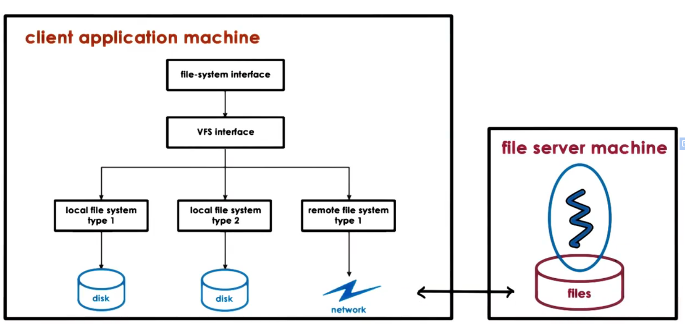
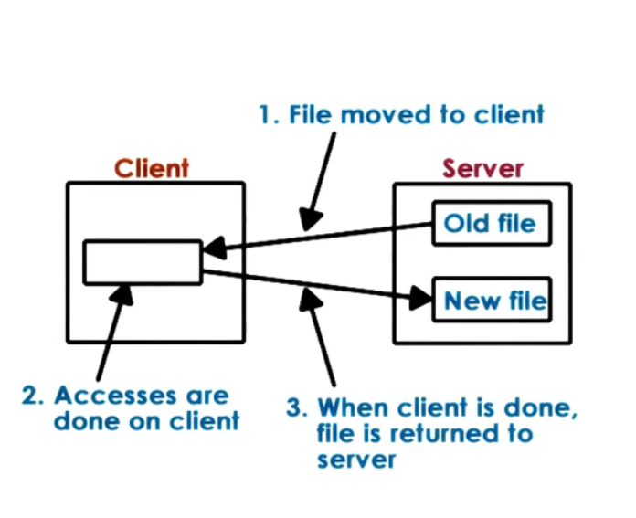
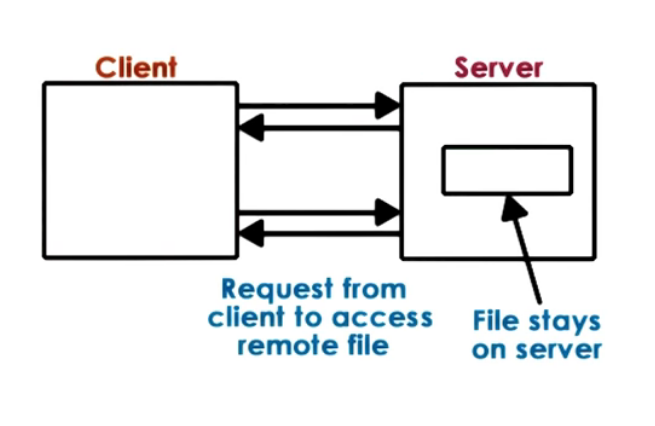

# P4L2: Distributed File Systems
## 1. Lesson Preview
Distributed File System
- DFS design and implementation
- Networked File System (NFS)
- "Caching in the Sprite Network File System" by Nelson et al.

[Caching in the Sprite Network File System](https://s3.amazonaws.com/content.udacity-data.com/courses/ud923/references/ud923-nelson-paper.pdf)

## 2. Visual Metaphor
Distributed file systems are like distributed storage facilities

Toy Shop
- Accessed via well-defined interface
  - boss looks at storage reports
- Focus on consistent state
  - correctly determine inventory
- Mixed distribution models possible
  - storage-only, storage and processing, toy-specific

Distributed File System
- Accessed via well-defined interface
  - access via VFS
- Focus on consistent state
  - tracking state, file updates, cache coherence ...
- Mixed distribution models possible
  - replicated vs partitioned, peer-like system ...

## 3. Distributed File System

## 4. DFS Models
- client/server on different machines <== this chapter focus
- file server distributed on multiple machines
  - replicated (each server: all files)
  - partitioned (each server: part of files)
  - both (files partitioned, each partition replicated)
- files stored on and served from all machines(peers) 
  - blurred distinction between clients and servers

## 5. Remote File Service: Extremes
- Extreme 1 : Upload/Download
  - like FTP, SVN
  - 
  - Pros:
    - local reads/writes at client
  - Cons: 
    - entire file download/upload even for small access
    - server gives up control (makes some operations related to sharing filing difficult)
- Extreme 2: True Remote File Access
  - 
  - every access to remote file, nothing done locally
  - Pros:
    - file accesses centralized, easy to reason about consistency
  - Cons: 
    - every file operation pays network cost
    - limits server scalability

## 6. Remote File Service A Compromise
A more Practical Remote File Access (with Caching)
1. Allow clients to store parts of files locally (blocks)
   - Pros
     - low latency on file operations 
     - server load reduced => is more scalable
2. Force clients to interact with server(frequently)
   - Pros
     - server has insights into what clients are doing
     - server has control into which accesses can be permitted => easier to maintain consistency
    - Cons
    - server more complex, requires different file sharing semantics

## 7. Stateless vs. Stateful File Server
Stateless == keeps no state
OK with extreme models; but cannot support 'practical' model
- Cons:
  - cannot support caching and consistency management